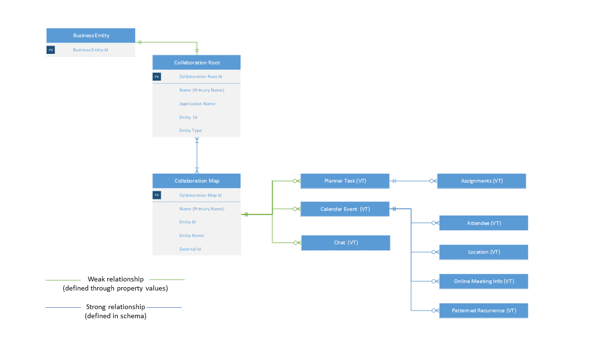
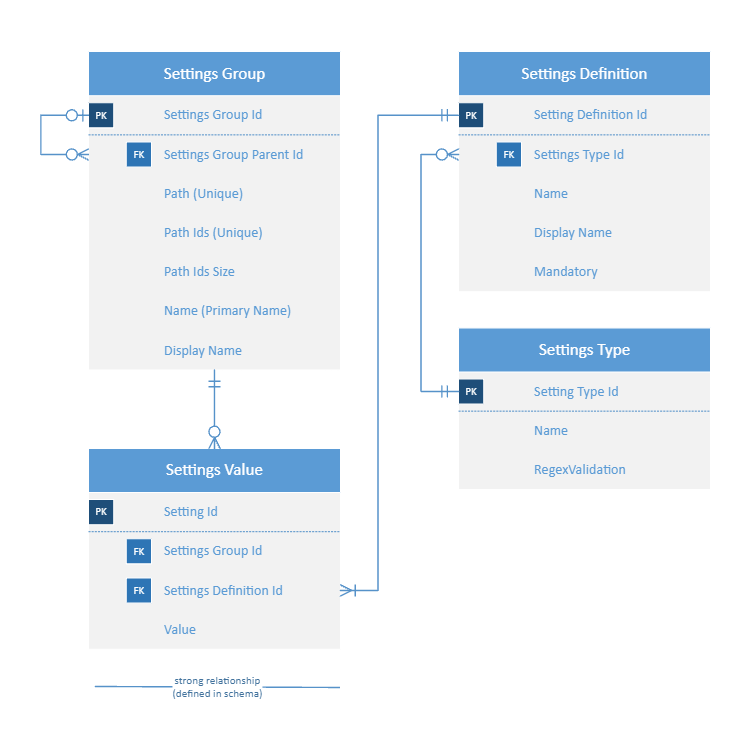

In this exercise, you'll learn about the core Collaboration Toolkit data tables which power the Collaboration Manager for Loans.

## Task 1: Navigate Collaboration Toolkit tables and relationships

In this task, you'll explore the main tables that power the Collaboration Toolkit and how it augments business entities like Loan Applications.

### Collaboration Toolkit definitions

- **Collaboration Root** - The parent record that maintains the linkage between all the collaboration activities and a Business Entity.
- **Collaboration Map** - A many-to-many table that relates a Microsoft 365 collaborative activity to a Collaboration Root. Currently, the Collaboration Map entity merely holds pointers to records in Microsoft Graph.
- **Business Entity** (for example, Loan Application) - The core business entity that is being collaborated on. For Collaboration Manager for Loans, this business entity is the Loan Application.

### Collaboration Toolkit relationship diagram

> [!div class="mx-imgBorder"]
> 

## Task 2: Navigate Collaboration Toolkit settings and relationships

In this task, you'll explore the main tables related to Collaboration Toolkit settings. The settings tables allow you to define how Microsoft 365 services (such as Planner, Outlook, Bookings, and so on) map to business entities within Dataverse. All of the settings tables are solution-aware objects, so they can be packaged within a solution and participate in solution import and export.

### Collaboration Toolkit settings definitions

- **Settings Group** - The parent record that maintains the logical grouping of settings values that pertain to a specific business entity. For example, there's a single Settings Group record that represents all the settings for the group.
- **Settings Value** - The value of a settings definition. These values can be exported across environments to ensure that all environments use the same configuration.
- **Settings Definition** - Defines the types of settings that a maker can populate. The toolkit comes with two settings out of the box.
  - **Group ID** - The ID of the Azure Active directory security group that is used to create new Planner boards.
  - **Bookings Business ID** - The alias of the Bookings Business calendar. This is used to allow users to create new bookings with customers.
- **Settings Type** - A table that defines regex validation for Settings Values.

### Collaboration Toolkit settings relationship diagram

> [!div class="mx-imgBorder"]
> 
