In this exercise, you'll set up the Collaboration Manager for Loans settings so that it works correctly with Microsoft 365 services such as Teams, Bookings, and Planner. In this case, you'll examine how to bind Collaboration Manager to a new team in Microsoft Teams and a Microsoft Bookings business for a bank branch that wants to use the product.

The objective of this exercise is for you to learn how to embed a model-driven app, like Collaboration Manager for Loans, in Teams as a Teams tab and as a personal app.

## Task 1: Create a new team in Microsoft Teams

Follow these steps to create a new team in Microsoft Teams:

1. Open **Microsoft Teams** and select **Teams** in the left navigation bar.

1. Select **Join or create a team** so that you can create a new branch that will use Collaboration Manager for Loans.

    > [!div class="mx-imgBorder"]
    > [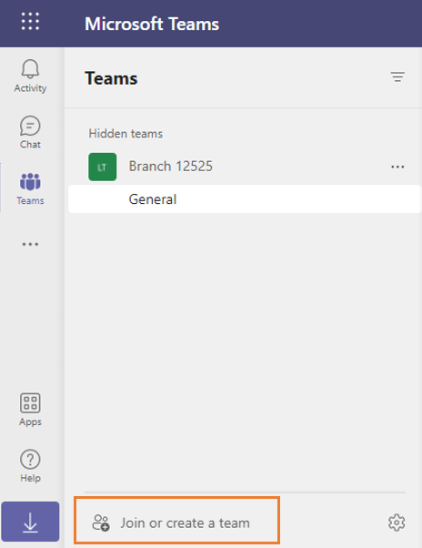](../media/join.png#lightbox)

1. Select **Create team** to create a new team.

    > [!div class="mx-imgBorder"]
    > [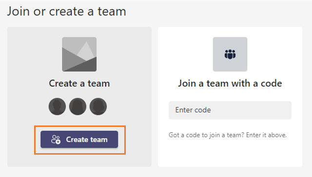](../media/create.png#lightbox)

1. Select **From scratch** to create a new team.

    > [!div class="mx-imgBorder"]
    > [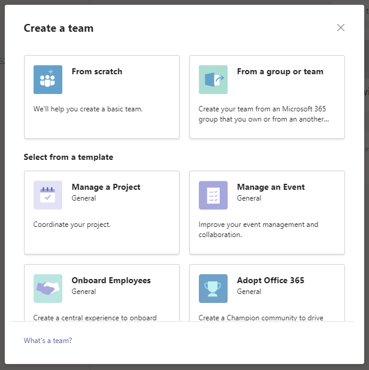](../media/scratch.png#lightbox)

1. Because this team will only be accessible to users who belong to this branch, make the new team **Private**.

    > [!div class="mx-imgBorder"]
    > [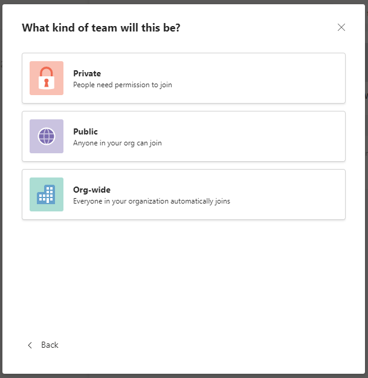](../media/private.png#lightbox)

1. Provide the name and description of your new branch before selecting **Create**.

    > [!div class="mx-imgBorder"]
    > 

## Task 2: Retrieve the internal ID of the new team

Now that you have created a new team in Microsoft Teams, you'll need to record its ID so that you can use it later. 

1. To get the ID, find your new team in your list of teams.

1. Select the ellipsis (**...**) button next to your new team.

1. Select **Get link to team**.

    > [!div class="mx-imgBorder"]
    > [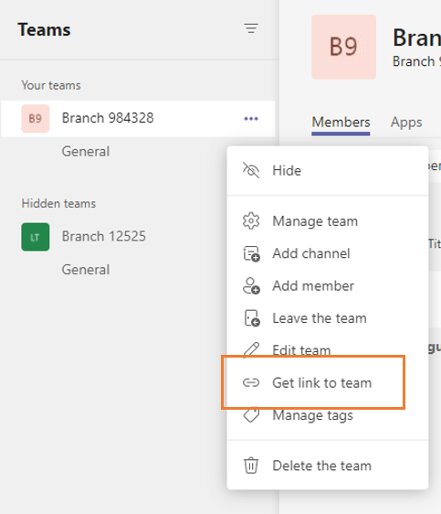](../media/get-link.png#lightbox)

1. Record the value of **groupId** from within the URL somewhere safe. You'll use this value in a future step while defining the settings of your solution.

    `https://teams.microsoft.com/l/team/19%3akk_TuKhjXu92yJvg4TZ10S6rouLSCgvHIb5NOOTfRjg1%40thread.tacv2/conversations?groupId=`**4310f270-1aa5-4089-99f3-47eb3b4d69ad**`&tenantId=b699419b-e0df-47e3-9909-24076fdcf68b`

## Task 3: Create a new Bookings business for the branch

To use the virtual visit features within Collaboration Manager for Loans, you must also provide a Microsoft Bookings business. 

1. To create a new Bookings business, start by going to [https://office.com/apps](https://office.com/apps/?azure-portal=true).

1. Select **Bookings** within the list of apps.

    > [!div class="mx-imgBorder"]
    > [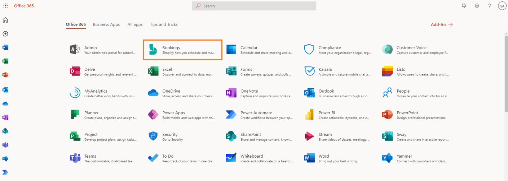](../media/bookings.png#lightbox)

1. If this is your first time using Bookings, you might be prompted with a **Get it now** button. Select that button to continue. If you already have a Bookings business and need to create another one, select the arrow next to your currently active Bookings business and then select **New**.

    > [!div class="mx-imgBorder"]
    > [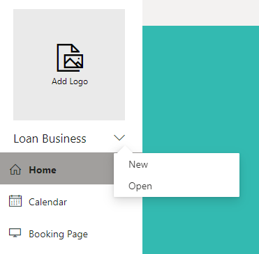](../media/new-booking.png#lightbox)

1. Provide the name and type for your business before selecting **Continue**.

    > [!div class="mx-imgBorder"]
    > [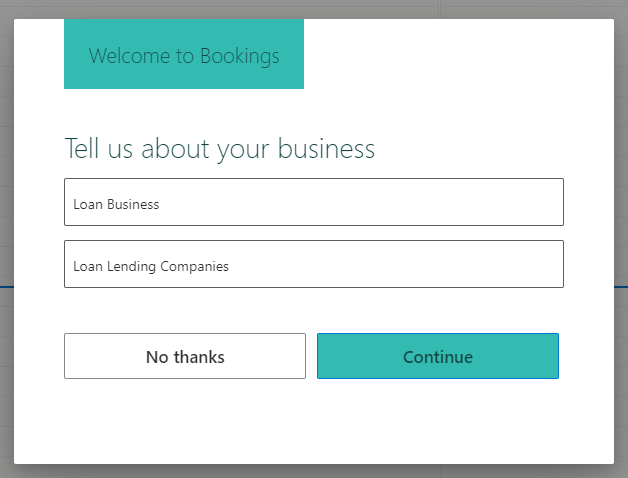](../media/welcome.png#lightbox)

1. Provide more details for your Bookings business by setting up the **Booking Page**, **Staff**, **Services**, and **Business Information** pages by selecting them in the left navigation pane.

## Task 4: Retrieve the alias of the new Bookings business

To retrieve the alias of your new Bookings business, reopen the current Bookings business so that you can retrieve the value from the URL.

1. Select the arrow next to your Bookings business and then select **Open**.

    > [!div class="mx-imgBorder"]
    > [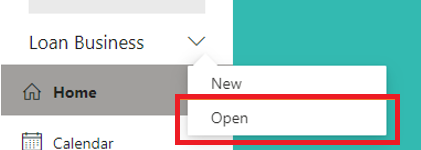](../media/open.png#lightbox)

1. When the dialog appears, select your Bookings business.

    > [!div class="mx-imgBorder"]
    > [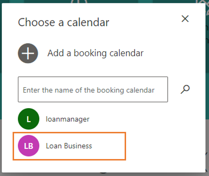](../media/calendar.png#lightbox)

1. The Bookings business will reopen and will cause the URL of the page to change. Copy the value of the calendar parameter in the URL. It should resemble an email address. Record this value somewhere safe so that you can use it in a future step.

    > [!div class="mx-imgBorder"]
    > [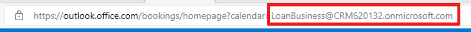](../media/parameter.png#lightbox)

## Task 5: Provide the settings to Collaboration Manager for Loans

Now that you have the Group ID and the Bookings business ID, you can set them as values within the Collaboration Toolkit settings. 

1. Open [https://make.powerapps.com/](https://make.powerapps.com/?azure-portal=true).

1. Ensure that you're in the correct environment by using the environment picker in the upper-right corner.

1. Go to the **Solutions** page in the left navigation pane.

1. Select **New solution** so that you can provide a place for your settings values.

    > [!div class="mx-imgBorder"]
    > 

1. Provide the name and publisher of your new solution. Because this solution is merely holding the values of Collaboration Manager, you can name it **Collaboration Manager Settings**.

    > [!div class="mx-imgBorder"]
    > [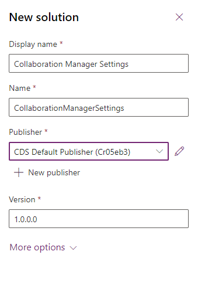](../media/solution-filled.png#lightbox)

1. After you've created your solution, find and select it in the list of solutions.

    > [!div class="mx-imgBorder"]
    > [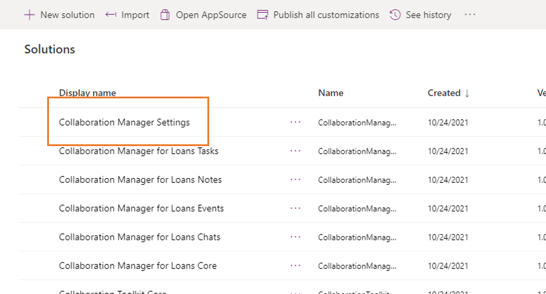](../media/solutions.png#lightbox)

1. Provide the first settings value by selecting **New > More > Other > Settings Value** from within the solution explorer.

    > [!div class="mx-imgBorder"]
    > [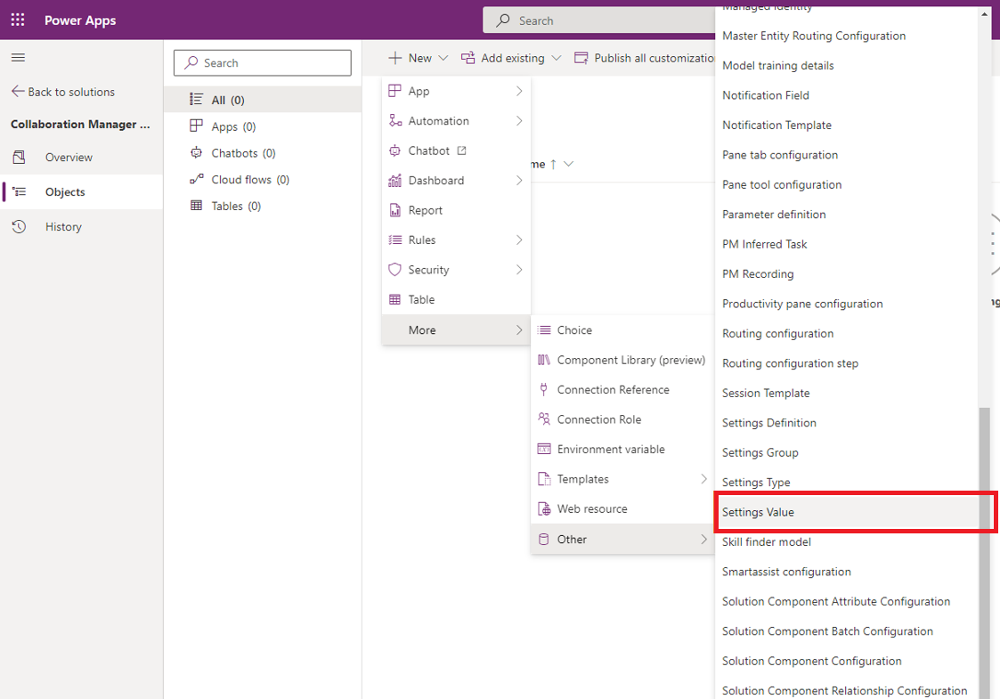](../media/settings-value.png#lightbox)

1. For your first settings value, provide the value of your teams group. Paste the value that you previously retrieved in the **Value** field. Set **Settings Group ID** to **Collaboration Manager for Loans** and set **Settings Definition ID** to **Group ID**.

    > [!div class="mx-imgBorder"]
    > [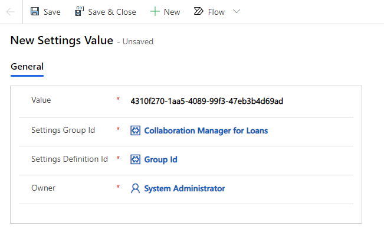](../media/new-settings-value.png#lightbox)

1. Select **Save & Close** once you're finished.

1. Repeat step 25 to create a new settings value.

1. Now populate the new settings value with the Bookings business ID you retrieved on step 11. Set **Settings Group ID** to "Collaboration Manager for Loans" and **Settings Definition ID** to "Bookings Business ID".

    > [!div class="mx-imgBorder"]
    > [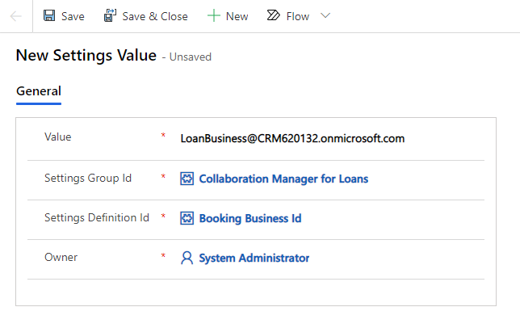](../media/new-settings-value-2.png#lightbox)

1. Select **Save & Close** when you're finished. 

You've successfully defined the settings for Collaboration Manager for Loans.

## Task 6: Add the app to the Microsoft Teams channel

Now that the settings are defined, you can add the app to Microsoft Teams. 

1. Go to [teams.microsoft.com](https://teams.microsoft.com/?azure-portal=true) and use your lab credentials.

1. Find the team that you created in Task 1.

1. In the **General** channel for the team, select the plus (**+**) icon and note the **Add a tab** dialog that appears.

    > [!div class="mx-imgBorder"]
    > [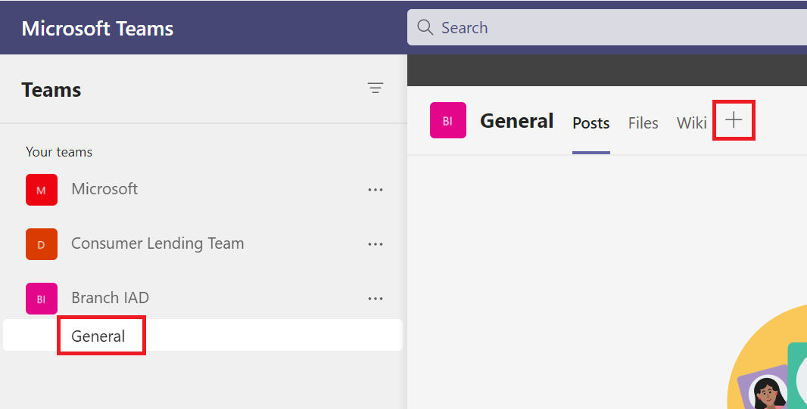](../media/add-tab.png#lightbox)

1. In the **Add a tab** dialog, search for **Power Apps** and select the **Power Apps** icon that appears in the search results.

    > [!div class="mx-imgBorder"]
    > [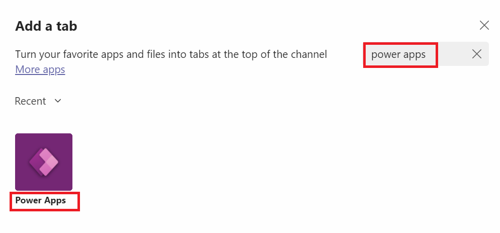](../media/power-apps.png#lightbox)

1. The **Power Apps** add-in will open. Select **Add** to open the app selection wizard.

    > [!div class="mx-imgBorder"]
    > [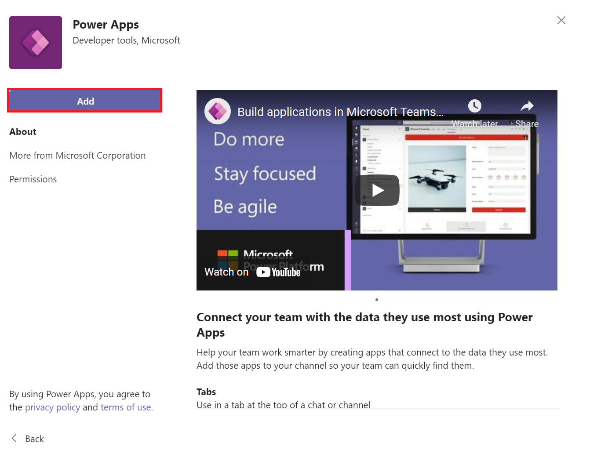](../media/add-in.png#lightbox)

1. In the app selection wizard, set the search option to **Model-driven apps**.

    > [!div class="mx-imgBorder"]
    > [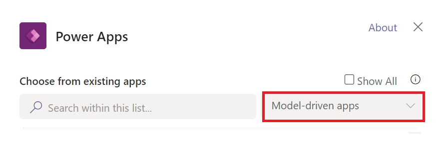](../media/model-driven.png#lightbox)

1. Search for **Collaboration Manager** and select the app that corresponds with your dedicated environment. For example, if you're working with environment 100, you would select the app with environment FSIInADay_100 against its name.

1. Select the **Collaboration Manager** app and select **Save**.

    > [!div class="mx-imgBorder"]
    > [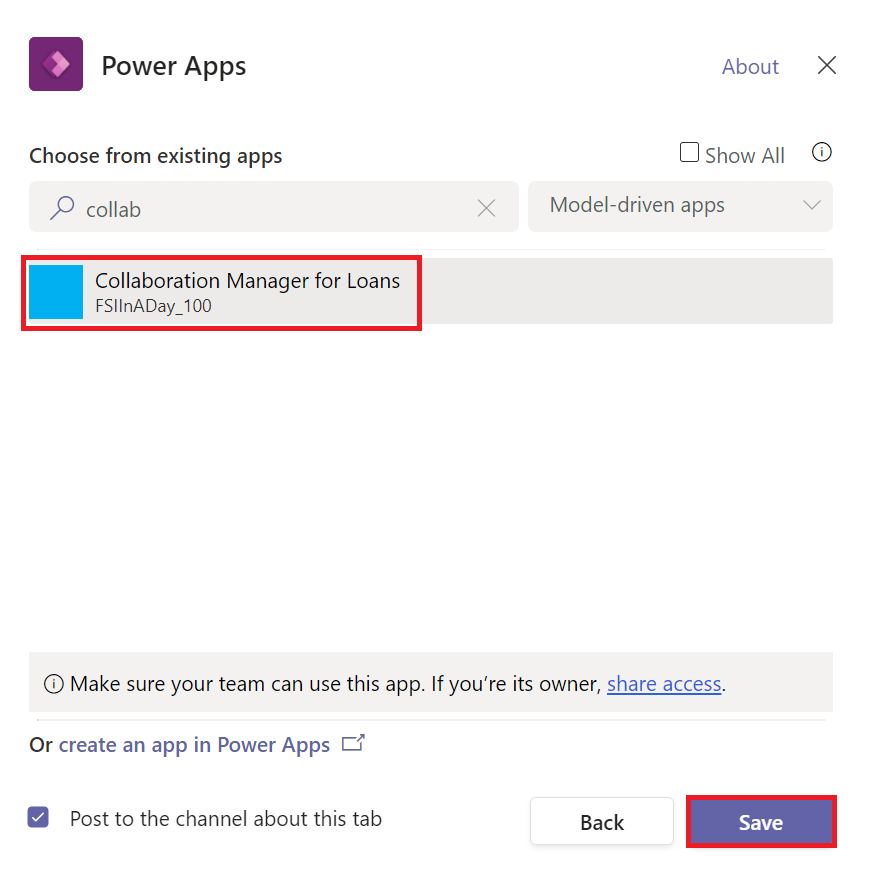](../media/collaboration.png#lightbox)

The app will appear as a pinned tab in your channel.

   > [!div class="mx-imgBorder"]
   > [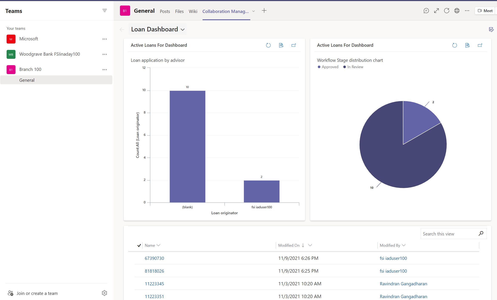](../media/tab.png#lightbox)
