In this exercise, you'll navigate Collaboration Manager for Loans and explore the collaborative features it provides. In this case, we'll examine the home loan for Hayden Reyes to see how a loan team could collaborate with each other to ensure completion of the loan.

1. To begin, open the Teams channel that you pinned your app to in the previous exercise. You should see a dashboard page where you can see graphs of the relevant data along with a list of loans that are currently active.
    > [!div class="mx-imgBorder"]
    > [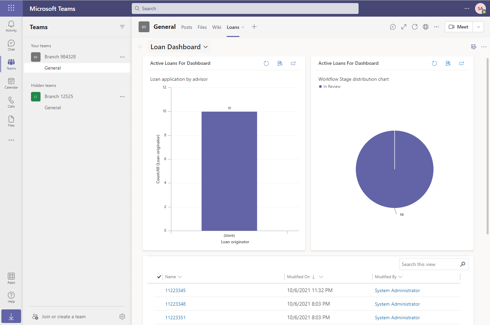](../media/loans.png#lightbox)

1. To see the status of one of the loans, select its name from the list of loans. Since we're interested in Hayden Reyes's loan, select **11223345**.

1. This will bring you to the Summary tab that provides a glimpse of the relevant information about the loan application.

    > [!div class="mx-imgBorder"]
    > [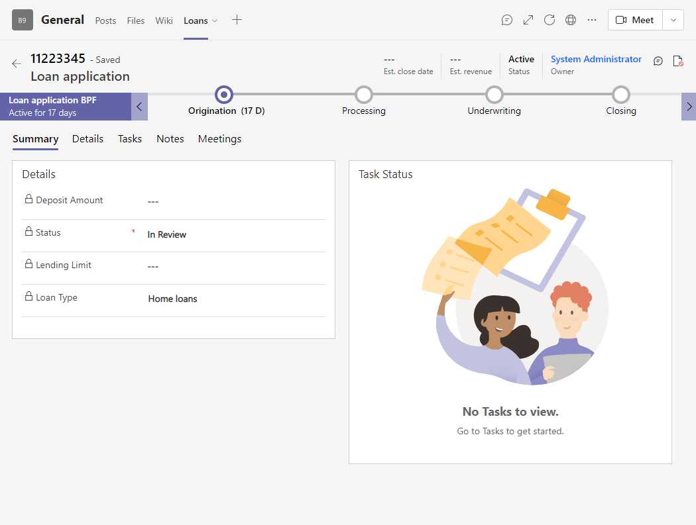](../media/summary.png#lightbox)

1. To see more information about the loan, you can select the **Details** tab.

    > [!NOTE]
    > As part of the fourth exercise, you'll learn how to bring in the rich controls from the Loan Tracker app into Collaboration Manager for Loans so that you can have a more holistic picture of the loan application.

## Task 1: Creating tasks in Collaboration Manager for Loans

1. The first tab that we'll explore that provides collaboration is the **Tasks** tab. Selecting it will reveal an empty page where users can add all the relevant tasks they need to complete.

    > [!div class="mx-imgBorder"]
    > [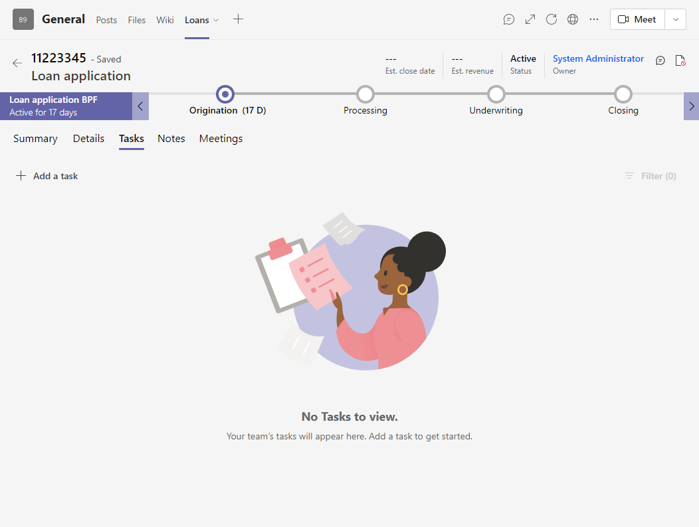](../media/no-tasks.png#lightbox)

1. To create a new task for the team, select **Add a task**.

1. On the resulting dialog, you can provide specifics about the task and assign it to the relevant people on the team. Once you're done, select **Save**.

    > [!div class="mx-imgBorder"]
    > [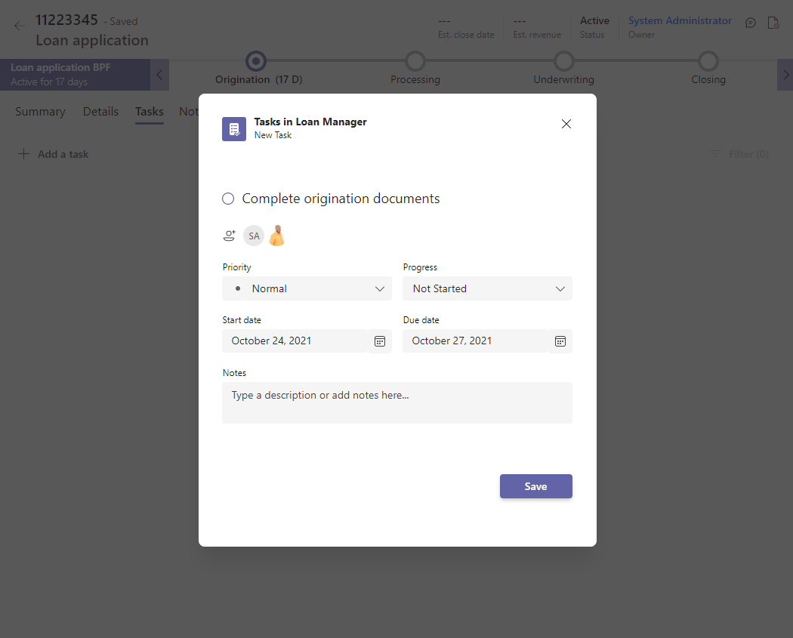](../media/new-task.png#lightbox)

1. The newly created task should now appear in the tasks list.

    > [!div class="mx-imgBorder"]
    > [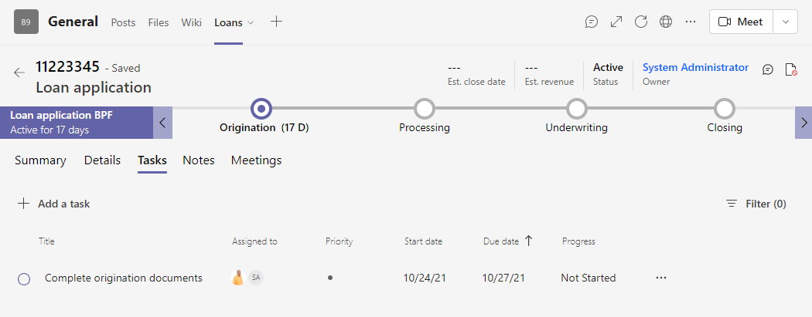](../media/tasks.png#lightbox)

1. Because all the tasks are backed by Microsoft Planner, as a user, you can use the Tasks app within Microsoft Teams to see all of the tasks that are assigned to you. To get started, select the **...** menu in the left app bar and search for and select **Tasks by Planner and To Do**.

    > [!div class="mx-imgBorder"]
    > [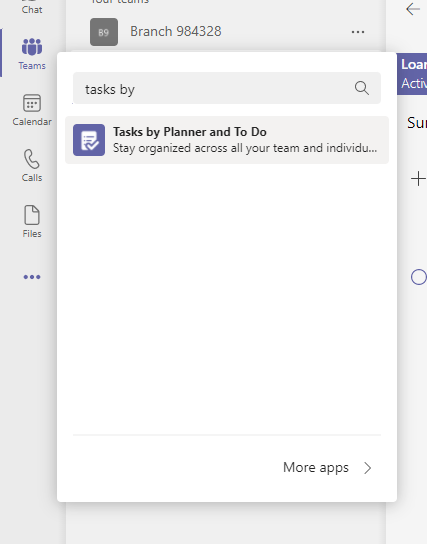](../media/planner.png#lightbox)

1. Once the **Tasks by Planner and To Do** app opens, you should see all the tasks that were created in Collaboration Manager for Loans within the **Assigned to me** section of the app.

    > [!div class="mx-imgBorder"]
    > [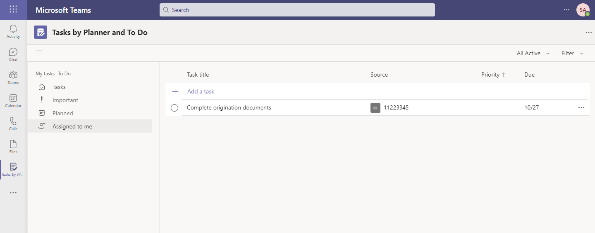](../media/assigned.png#lightbox)

1. From within the **Tasks by Planner and To Do** app, you can view the details of a task, add attachments, and mark them as complete.

    > [!NOTE]
    > With Power Automate, you can automatically create new tasks to ensure that loan teams always know what they need to do next.

## Task 2: Creating notes in Collaboration Manager for Loans

1. From within Collaboration Manager for Loans, select the **Notes** tab. This will bring you to an empty screen where you can provide any relevant information.

    > [!div class="mx-imgBorder"]
    > [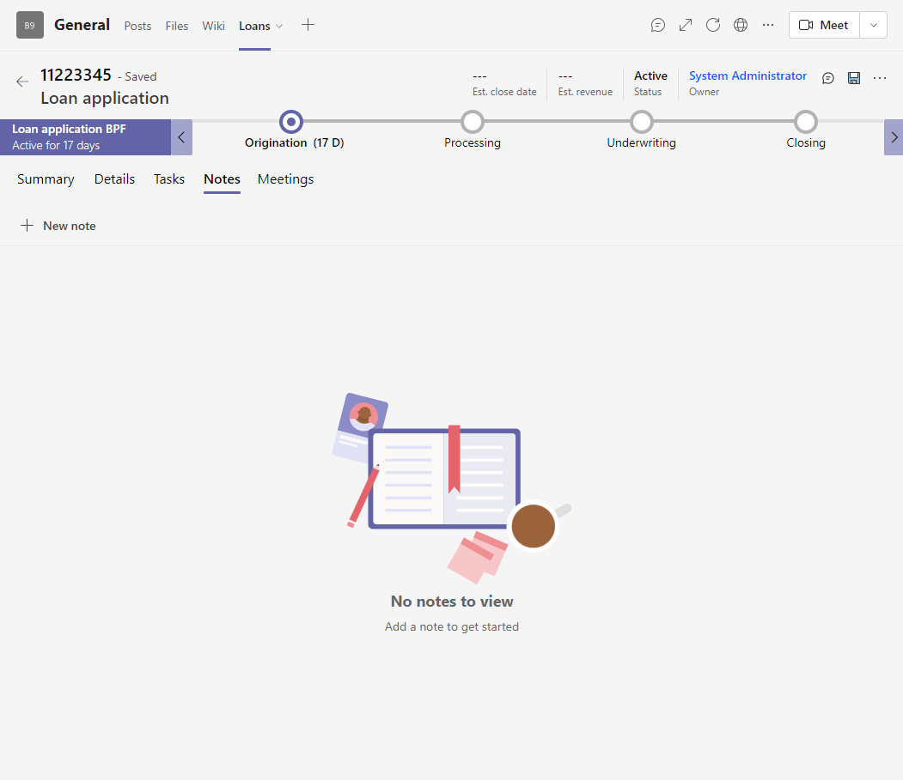](../media/no-notes.png#lightbox)

1. To add a new note, select **New note**.

1. You can then provide details about the loan. In the example below, we're providing notes about the last meeting we had with the customer.

    > [!div class="mx-imgBorder"]
    > [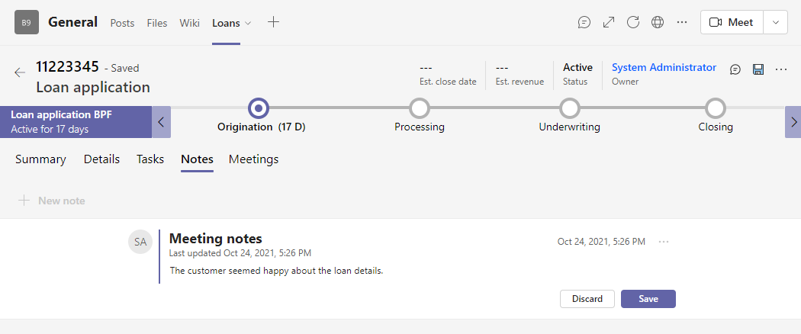](../media/notes.png#lightbox)

1. Once you're finished with typing the notes, select **Save**.

## Task 3: Creating meetings in Collaboration Manager for Loans

1. To schedule both internal and external meetings about the loan, start by selecting the **Meetings** tab for a loan record.

    > [!div class="mx-imgBorder"]
    > [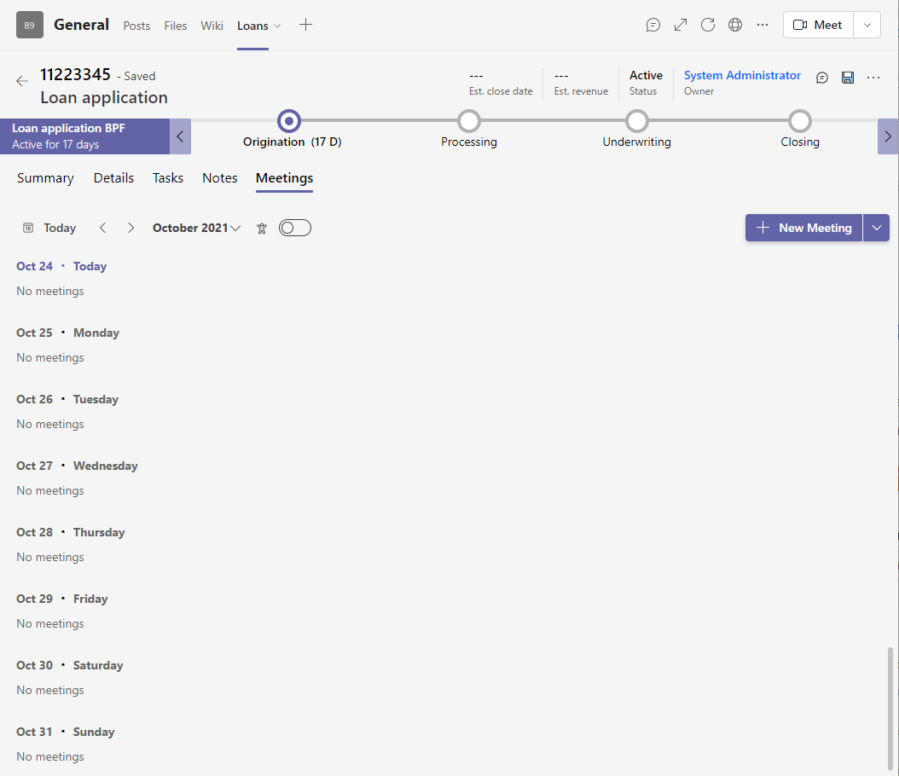](../media/no-meetings.png#lightbox)

1. To schedule an internal meeting with the rest of the loan team, start by selecting the chevron next to **New meeting**; then select **Internal meeting**.

    > [!div class="mx-imgBorder"]
    > 

1. Within the **New meeting** dialog, you can provide all the relevant information about the sync.

    > [!div class="mx-imgBorder"]
    > [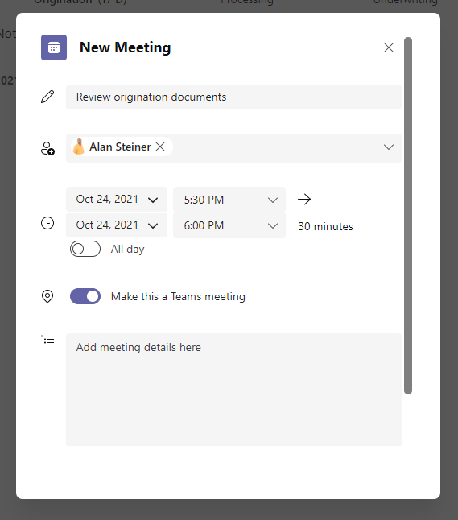](../media/meeting.png#lightbox)

1. Scroll to the bottom of the dialog and select **Save** once you're finished. The meeting will now appear in the list of meetings.

    > [!div class="mx-imgBorder"]
    > [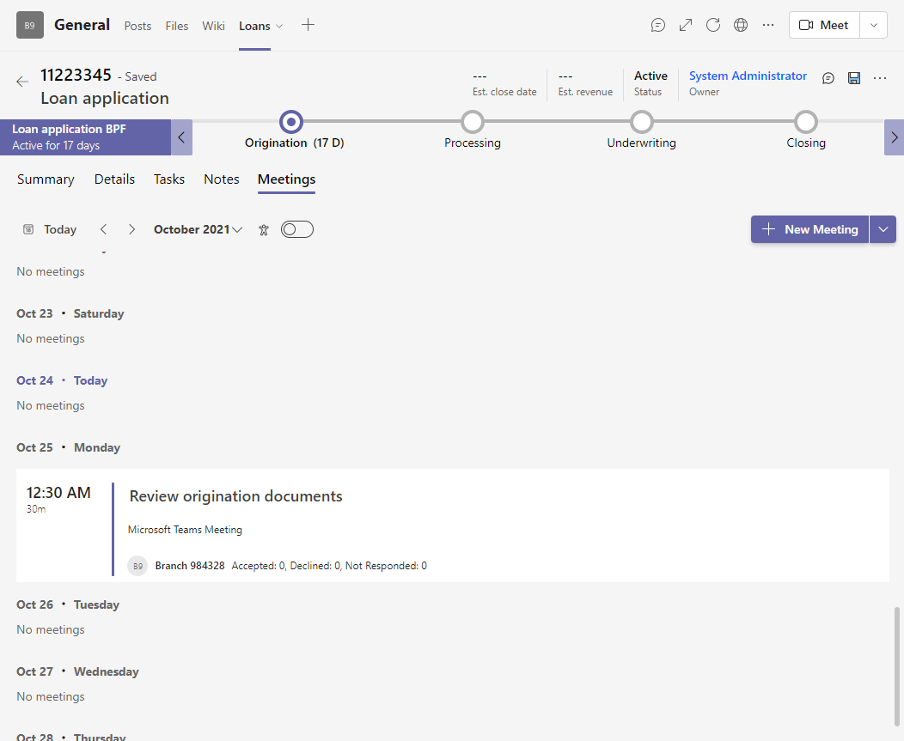](../media/meetings.png#lightbox)

1. To schedule an external meeting with the customer, select the chevron next to the **New meeting** button and select **Customer booking.**

1. In the **Customer booking** dialog, the relevant customer is already pre-populated using the information in the Loan Application. You can provide more information about the meeting before selecting **Save**. You can add more booking types by adding more services within your Bookings business.

    > [!div class="mx-imgBorder"]
    > [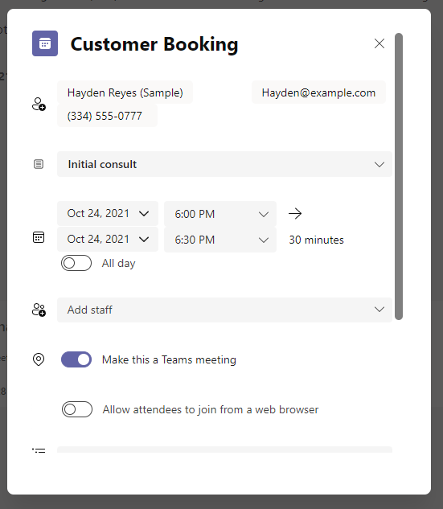](../media/booking.png#lightbox)

1. Once you're finished, you should see both meetings in your meeting list. Once the meeting has started, you can join it by selecting the **Join** button. This will open the meeting directly within Microsoft Teams.

    > [!div class="mx-imgBorder"]
    > [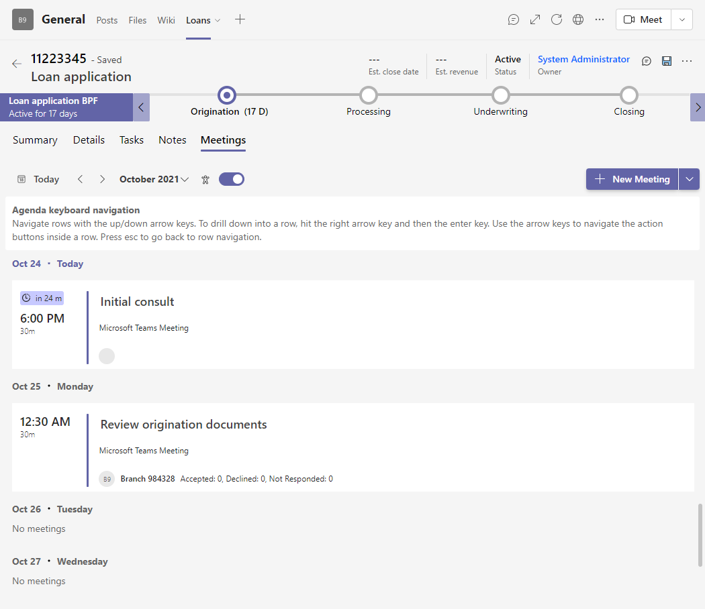](../media/meetings-added.png#lightbox)

1. Because all the meetings are backed by Outlook, you can navigate to either Bookings or your Outlook Calendar to see all the meetings a single calendar.

    > [!div class="mx-imgBorder"]
    > [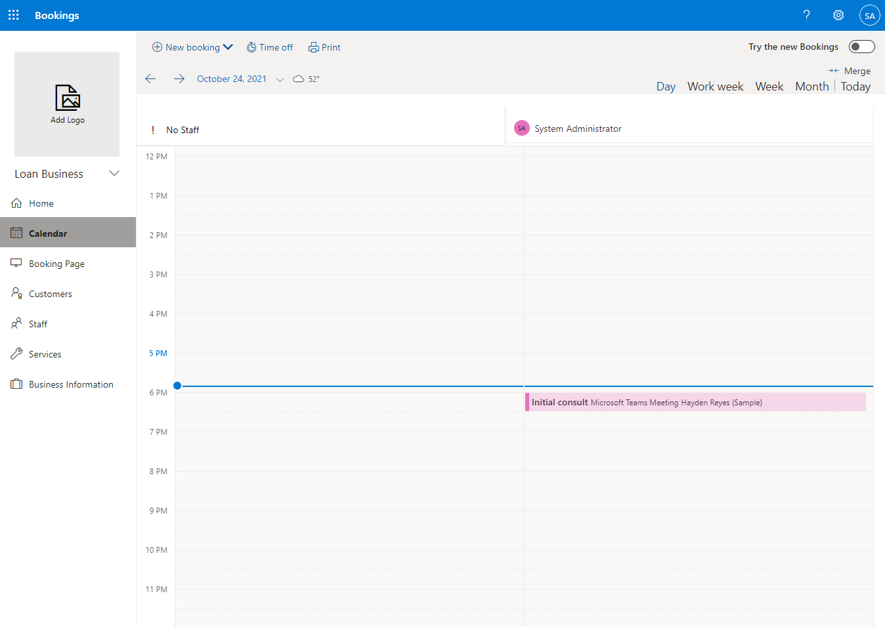](../media/outlook.png#lightbox)

## Task 4: Creating chats in Collaboration Manager for Loans

> [!NOTE]
> The following functionality only works from within a Teams channel.

1. To view the linked chats for a particular loan, select the chat icon in the header of the loan. This will open the **Channel Conversations** panel.

    > [!div class="mx-imgBorder"]
    > [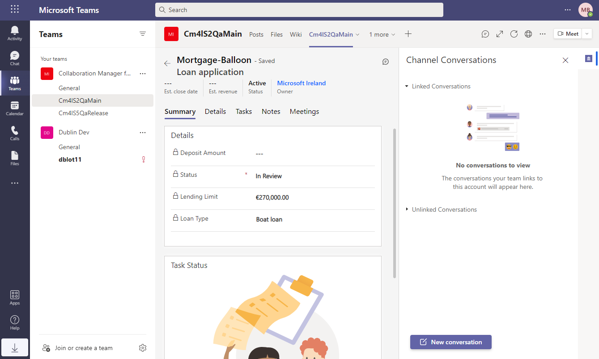](../media/chat.png#lightbox)

1. To create a new conversation in the channel, select **New conversation**.

1. Provide a name for the conversation and select the check icon.

    > [!div class="mx-imgBorder"]
    > [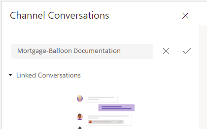](../media/conversation.png#lightbox)

1. Once the conversation has been created, you can provide replies by typing in the chat pane that appears on the right.

1. You can also see and reply to chats from within the **Posts** tab for the Teams channel.
