In this exercise, you'll embed the **Loan Application** form from the Loan Tracker app so that your users can have access to more information within Collaboration Manager for Loans. All apps in Microsoft Cloud for Financial Services use the same data model, which allows you to mix and match the experiences for the various apps.

## Task 1: Replace a default form within Collaboration Manager

Before creating your customizations, you first need to create a solution to contain the changes. 

1. Go to [https://make.powerapps.com](https://make.powerapps.com/?azure-portal=true) and select **Solutions** in the left navigation.

1. Select **New solution** to create a new solution.

1. Provide information for the required fields and then select **Save**.

    > [!div class="mx-imgBorder"]
    > [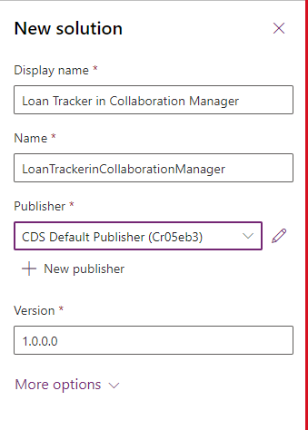](../media/solution.png#lightbox)

1. Open the solution that you created.

    > [!div class="mx-imgBorder"]
    > [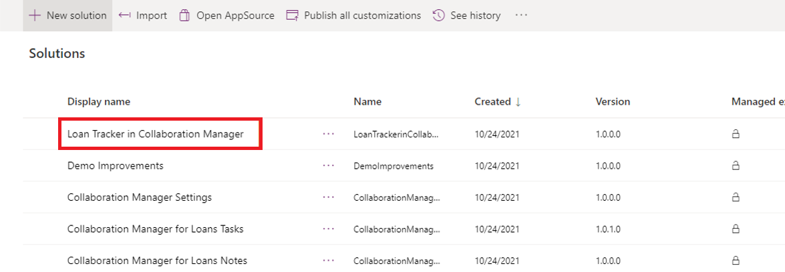](../media/solutions-list.png#lightbox)

1. Because you want to show the Loan Tracker form instead of the default Collaboration Manager form, update the app module so that it shows a different loan application form. Select **Add existing > App > Model-driven app** so that you can begin making those changes.

    > [!div class="mx-imgBorder"]
    > [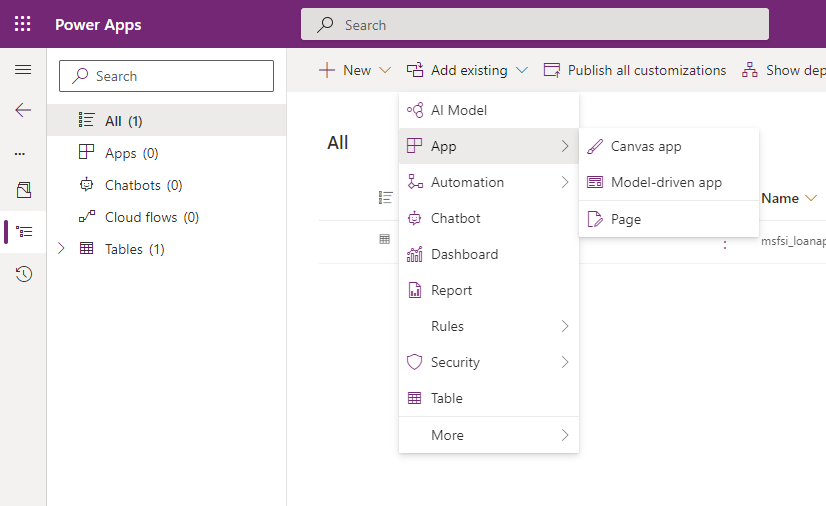](../media/app.png#lightbox)

1. Select **Collaboration Manager for Loans** and then select **Add** to bring the app into your solution.

    > [!div class="mx-imgBorder"]
    > [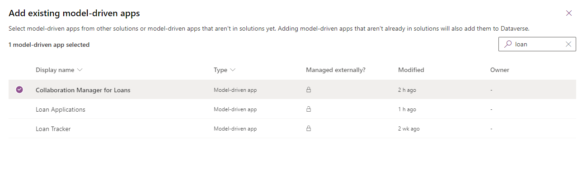](../media/add-model-driven.png#lightbox)

1. When the app shows in your solution, select it to open it in the classic app designer.

1. Select the **Form** card for the **Loan application** entity within the app designer.

1. In the **Properties** pane on the right, clear the **Information** checkbox and then select **Loan tracker information form** instead.

    > [!div class="mx-imgBorder"]
    > [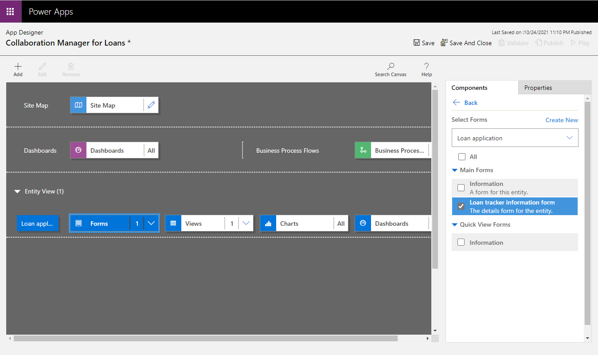](../media/form.png#lightbox)

1. Select **Save**.

1. Select **Publish**. If you played the app at this point within Microsoft Teams, the components from Loan Tracker will be present, but the collaborative features like tasks, meetings, and notes wouldn't be present.

## Task 2: Add Collaboration Toolkit experiences in the Loan Tracker form

Now, you will edit the **Loan tracker information form** so that it includes the **Tasks**, **Meetings**, and **Notes** tabs. 

1. Select the edit icon next to the **Loan tracker information form**.

   > [!div class="mx-imgBorder"]
   > [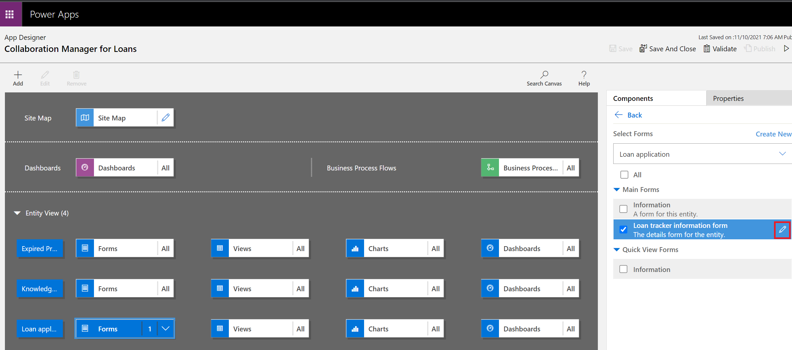](../media/edit.png#lightbox)

   The **Loan tracker information form** will open in the form designer.

1. In the form designer, drag a **1-column tab** layout component from the **Components** drawer and then drop it to the left of the **Activities** tab.

    > [!div class="mx-imgBorder"]
    > [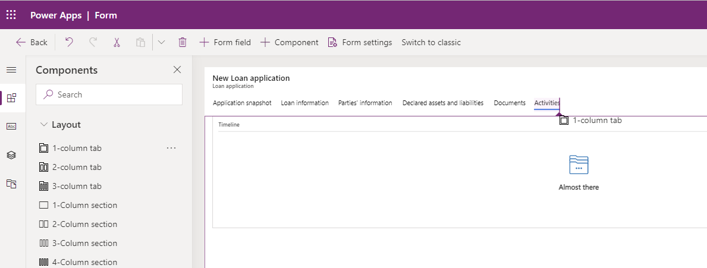](../media/1-column-tab.png#lightbox)

1. After dragging in the tab, rename it to **Tasks** in the **Properties** pane.

1. Select **Expand first component to full tab** in the **Properties** pane.

    > [!div class="mx-imgBorder"]
    > [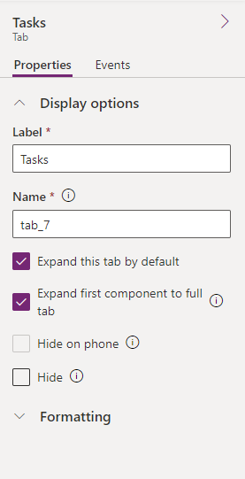](../media/expand.png#lightbox)

1. Select the section within your new tab so that you can select **Hide label** within the **Properties** pane.

    > [!div class="mx-imgBorder"]
    > [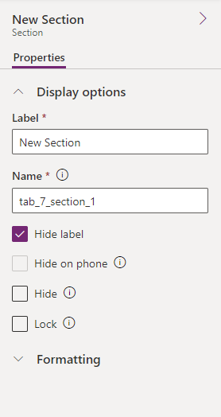](../media/hide.png#lightbox)

1. Drag a **Subgrid** control from the **Components** drawer and then drop it into your new section.

    > [!div class="mx-imgBorder"]
    > [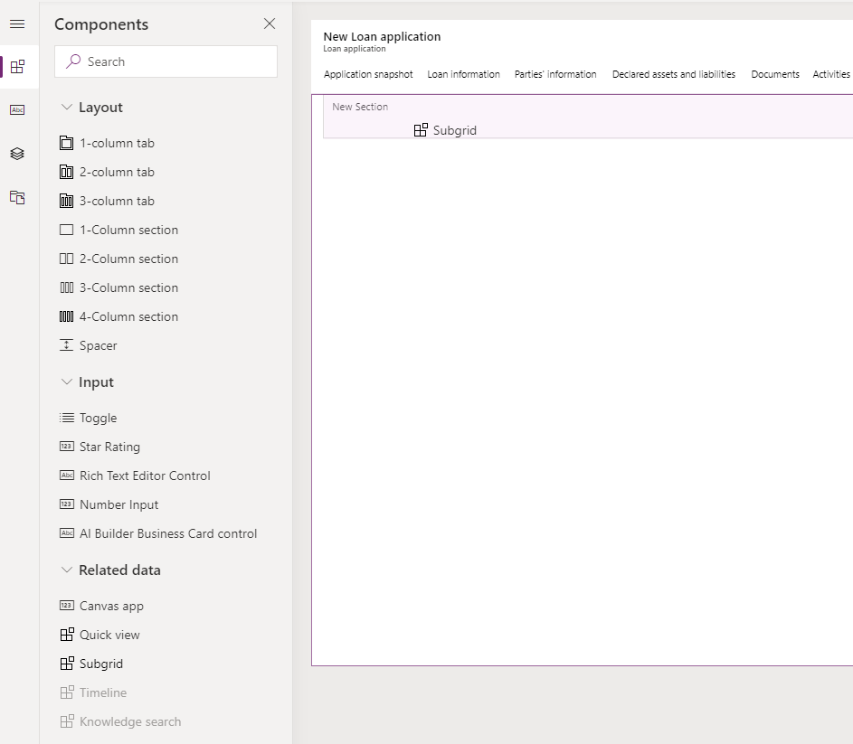](../media/components.png#lightbox)

1. For the **Tasks** tab, set the values to **All Tasks** from the **Tasks (Regarding)** table.

    > [!div class="mx-imgBorder"]
    > [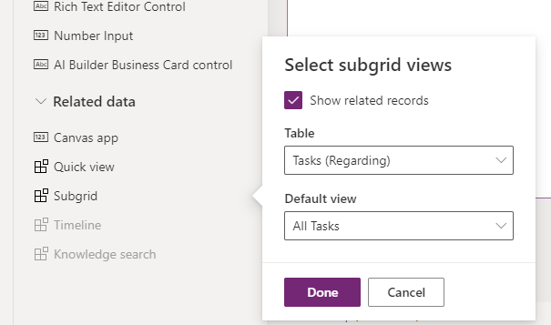](../media/subgrid.png#lightbox)

1. Repeat steps 1-7 for the **Meetings** and **Notes** tabs.

    > [!div class="mx-imgBorder"]
    > [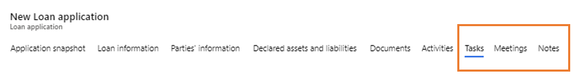](../media/meetings-notes.png#lightbox)

    For the **Meetings** tab, set the subgrid to **All Appointments** within the **Appointments (Regarding)** table.

    > [!div class="mx-imgBorder"]
    > [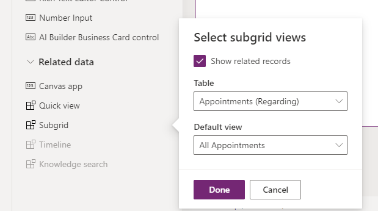](../media/appointments.png#lightbox)

    For the **Notes** tab, set the subgrid to **All Activities** within the **Activities (Regarding)** table.

    > [!div class="mx-imgBorder"]
    > [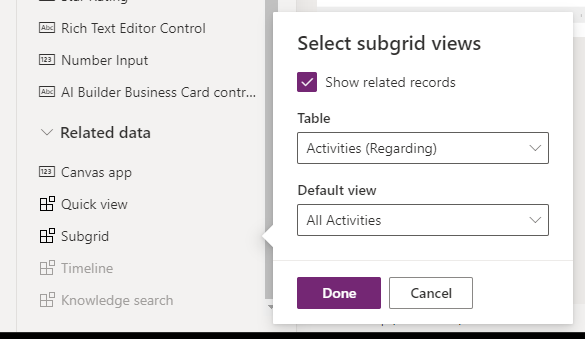](../media/activities.png#lightbox)

1. Set up the custom controls for your subgrids within the classic form designer. Select **Save** and then select **Switch to classic**.

    > [!div class="mx-imgBorder"]
    > [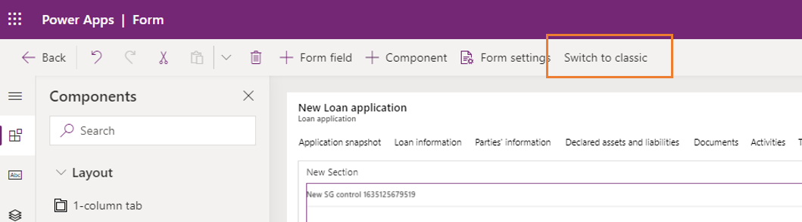](../media/classic.png#lightbox)

1. Scroll down in the classic form designer until you find the **Tasks** tab. Double-click the subgrid to open its **Properties** dialog.

    > [!div class="mx-imgBorder"]
    > [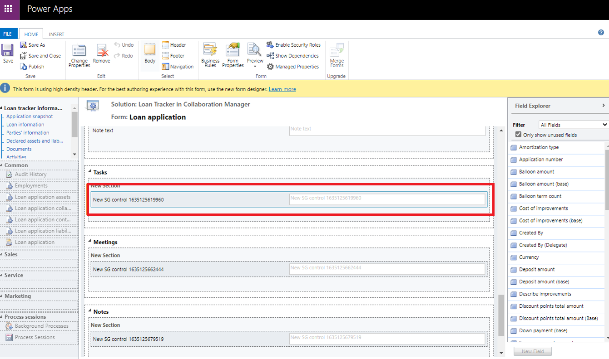](../media/subgrid-control.png#lightbox)

1. While in the **Properties** dialog, select the **Controls** tab to view all custom controls that are assigned to it.

    > [!div class="mx-imgBorder"]
    > [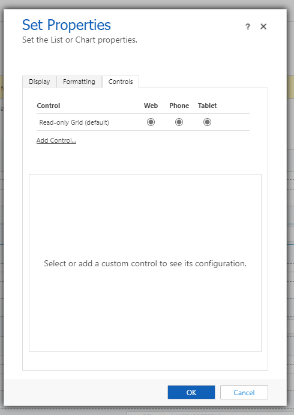](../media/controls.png#lightbox)

1. Select **Add Control...**

1. For the **Tasks** tab, select **TasksControl** and then **Add**.

    > [!div class="mx-imgBorder"]
    > [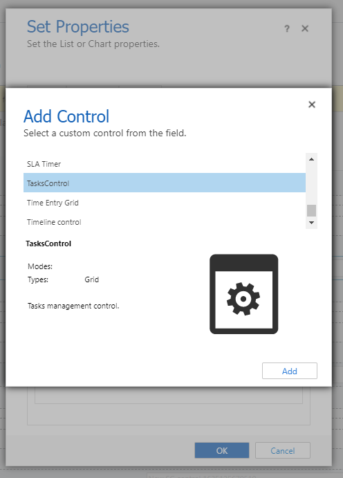](../media/add-control.png#lightbox)

1. Select the **Web**, **Phone**, and **Tablet** buttons for the **TasksControl** to ensure that it shows across all form factors.

    > [!div class="mx-imgBorder"]
    > [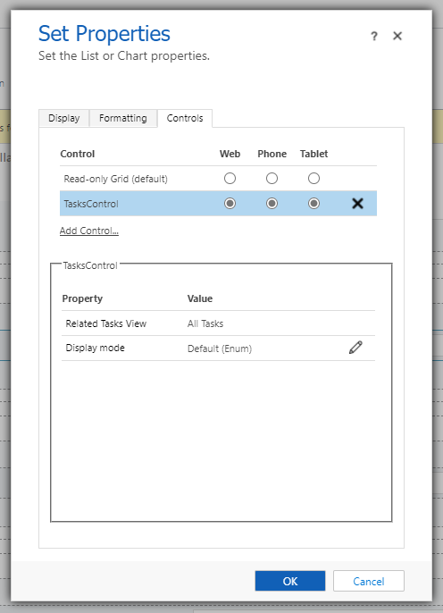](../media/tasks-control.png#lightbox)

1. Repeat steps 9-14 for the **Meetings** and **Notes** tabs. For the **Meetings** tab, use **EventsControl**, and for the **Notes** tab, use **NotesControl**.

1. Select **Save**.

1. Select **Publish**.

1. You can now open Collaboration Manager for Loans in the Teams environment. All tabs from Loan Tracker and the collaborative tabs from Collaboration Toolkit should now display.

    > [!div class="mx-imgBorder"]
    > [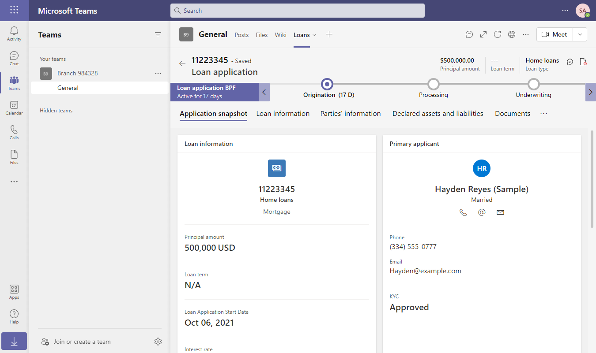](../media/all-tabs.png#lightbox)
