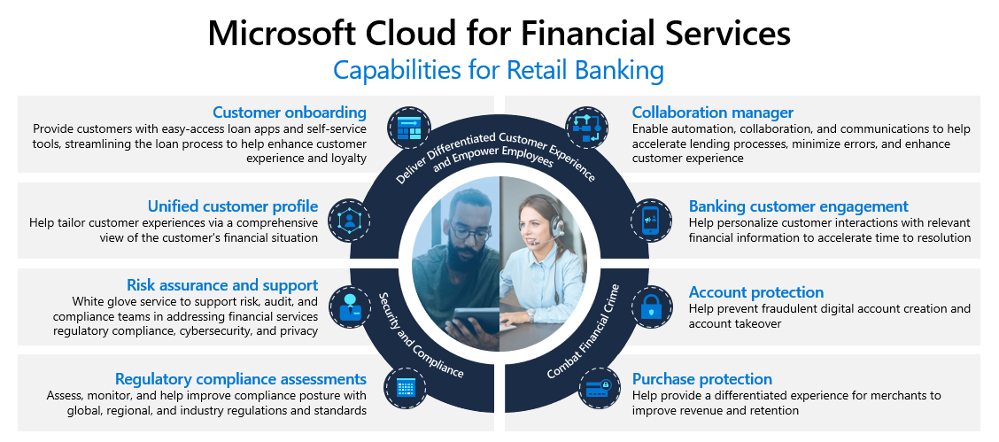

Customer intelligence unifies important, relevant, and accurate customer information across multiple sources through Microsoft Dynamics 365 Customer Insights. This solution empowers the agent to engage with customers based on relevant insights. Customer intelligence combines demographic information, financial measures, and attitudes to form financial segments and AI models. These insights help agents to quickly understand the customer.

Retail banking churn prediction is an AI-based model that helps predict the likelihood of a customer leaving the bank or becoming dormant. To create a new Retail banking churn prediction, after you fulfill the prerequisites, go to the **Intelligence > Predictions** page in the Dynamics 365 Customer Insights portal. Select **My predictions** to view other predictions that you've created.

## Prerequisites

Make sure that you meet the following prerequisites prior to starting this module:

- Microsoft Cloud for Financial Services components, which are available in Microsoft Cloud Solution Center. For more information, see [Deploy Microsoft Cloud for Financial Services solutions powered by Dynamics 365](/dynamics365/industry/financial-services/deploy/?azure-portal=true).

- At least Contributor permissions in Dynamics 365 Customer Insights. For more information, see [User permissions](/dynamics365/customer-insights/audience-insights/permissions/?azure-portal=true).

- An understanding of what churn means for your bank. A customer has churned if all their financial holdings are canceled or their usage of their financial holdings has dropped.

- For more prerequisite data, see [Retail banking churn prediction](/dynamics365/industry/financial-services/churn-prediction/?azure-portal=true).

## Industry prioritized scenarios

Customer intelligence focuses on the **Deliver Differentiated Customer Experience and Empower Employees** scenario of Microsoft Cloud for Financial Services by helping you personalize customer interactions with relevant financial information through banking customer engagement.

> [!div class="mx-imgBorder"]
> 
