In this exercise, you'll explore the Customer intelligence components of Microsoft Cloud for Financial Services. You'll also create a Customer Insights instance and deploy the Customer intelligence capability from Microsoft Solution Center.

[Dynamics 365 Customer Insights](https://dynamics.microsoft.com/ai/customer-insights/?azure-portal=true) is part of the customer data platform in Microsoft, which helps you deliver personalized customer experiences. The platform's capabilities provide insights into who your customers are and how they engage with your platform. Customer Insights helps you unify customer data across multiple sources to get a single view of customers.

[Audience insights](/dynamics365/customer-insights/audience-insights/overview/?azure-portal=true) helps you transform your business into a customer-centric organization. Marketing, sales, and service professionals have the insights that they need to personalize experiences. Audience insights helps you connect data from transactional, behavioral, and observational sources to create a 360-degree customer view. The customer data platform is designed to deliver insights that you can immediately act on, helping you achieve faster results.

[Engagement insights (preview)](/dynamics365/customer-insights/engagement-insights/?azure-portal=true) helps you interactively analyze how your customers are using your services and products, individually and holistically, on websites, mobile apps, and connected products. You can combine behavioral analytics with transactional, demographic, survey, and other data types from Microsoft Dynamics 365 Customer Insights. With Engagement insights, you can maintain full control over your customer data to ensure the highest level of data governance and compliance

## Task 1: Create a Dynamics 365 Customer Insights instance

In this task, you'll create a new Customer Insights sandbox environment. To set up **Customer intelligence** correctly, you need to first create a Customer Insights sandbox environment and then connect it to your Microsoft Dataverse environment with no data sources specified. After you're connected, you'll use [Microsoft Cloud Solution Center](https://solutions.microsoft.com/?azure-portal=true) to deploy **Customer intelligence** from **Unified customer profile**, specifying the Customer Insights environment that you will create in this task.

1. Use an In-Private or Incognito window and go to [Microsoft Power Apps](https://make.powerapps.com/?azure-portal=true).

1. Select the correct environment from the **Environment** dropdown menu in the upper-right corner.

    > [!div class="mx-imgBorder"]
    > 

1. Open a new tab in your internet browser and then go to [Customer Insights](https://home.ci.ai.dynamics.com/?azure-portal=true).

1. Select **Audience insights** as your focus and then select **Business accounts (B-to-B)** as your business.

    > [!div class="mx-imgBorder"]
    > [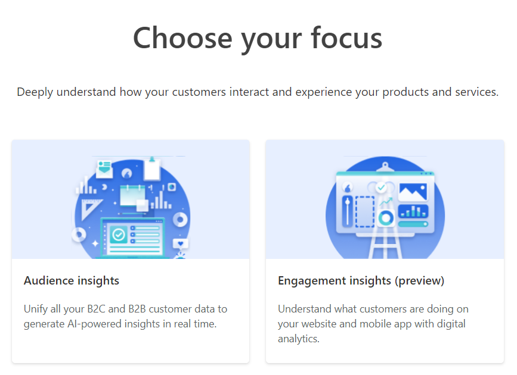](../media/audience.png#lightbox)

    > [!div class="mx-imgBorder"]
    > [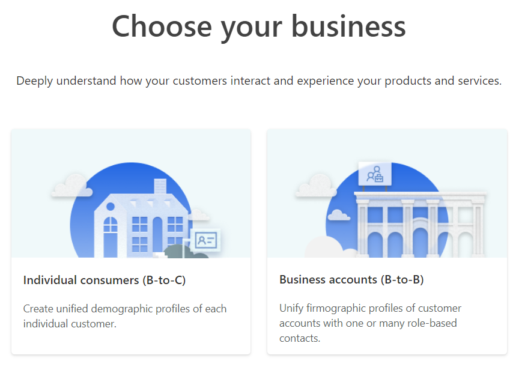](../media/business.png#lightbox)

    > [!div class="mx-imgBorder"]
    > [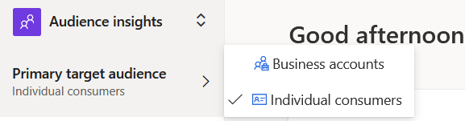](../media/audience-insights.png#lightbox)

1. Go to the environment picker and select **New**.

    > [!div class="mx-imgBorder"]
    > 

1. Fill out the following information and then select **Next**:

    1. **Name** - Customer Intelligence

    1. **Choose your business** - Individual consumers (B-to-C)

    1. **Type** - Sandbox

    1. **Region** - West US

    > [!NOTE]
    > Region selection will defer depending on the region where your instance was created.

    > [!div class="mx-imgBorder"]
    > 

1. Set the **Save output data to** dropdown menu to **Customer Insights storage**.

    > [!div class="mx-imgBorder"]
    > [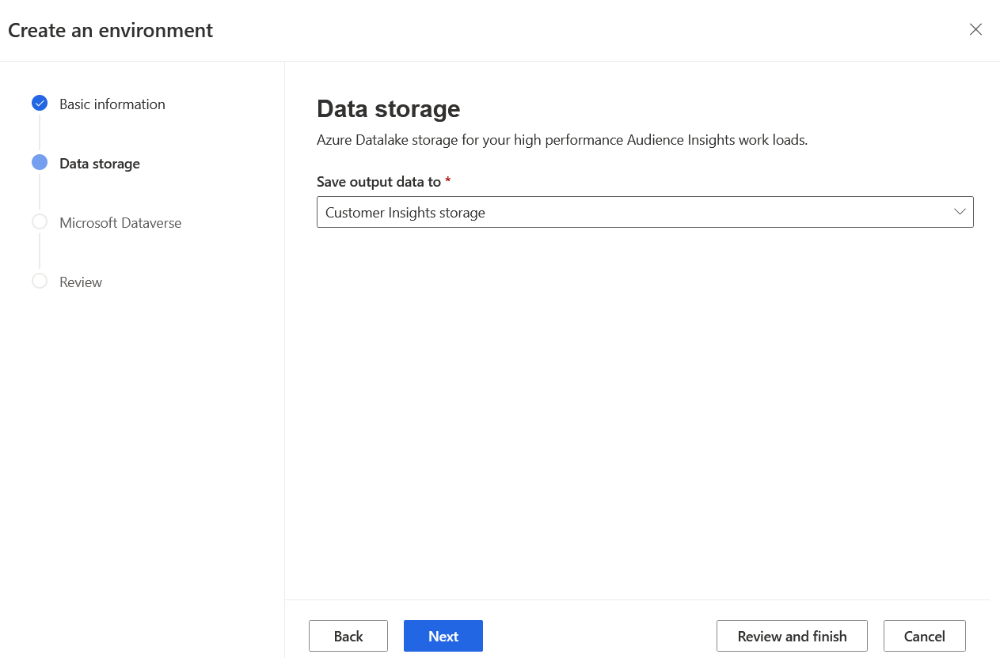](../media/storage.png#lightbox)

1. Enter the **URL** for your environment, select the **Configure Data sharing with Microsoft Dataverse** checkbox, and then select **Next**.

    > [!div class="mx-imgBorder"]
    > [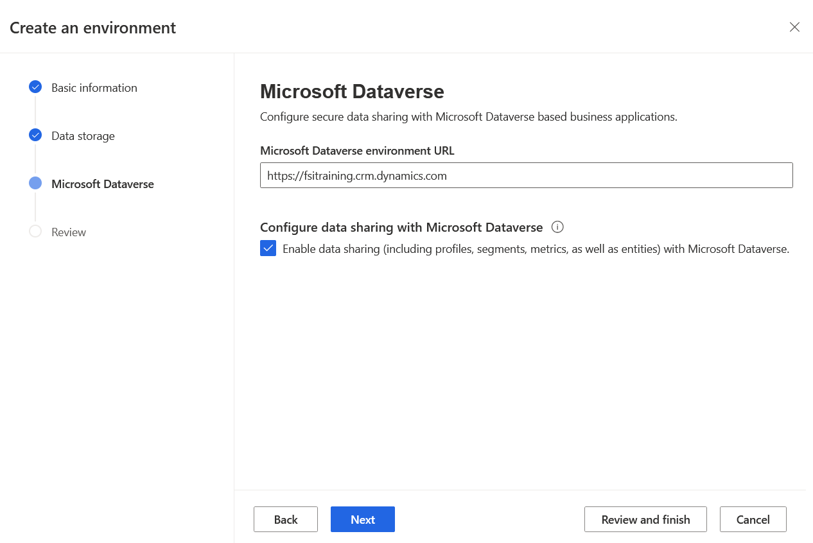](../media/dataverse.png#lightbox)

1. Review your selections and then select **Create**.

    > [!div class="mx-imgBorder"]
    > 

1. Open a new tab in your internet browser, go to Microsoft Cloud Solution Center, and then select **Microsoft Cloud for Financial Services**. Select **Unified customer profile**.

    > [!div class="mx-imgBorder"]
    > [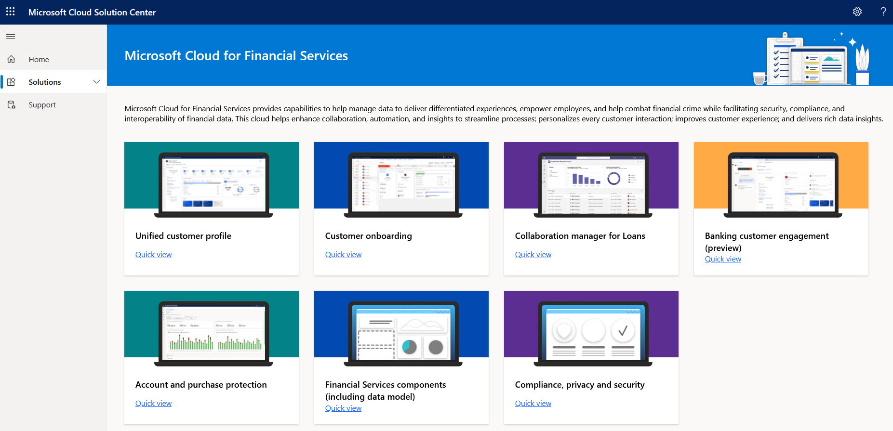](../media/solution.png#lightbox)

1. In **Unified customer profile**, select the **Add all Unified customer profile** checkbox and then select **Deploy**.

    > [!div class="mx-imgBorder"]
    > [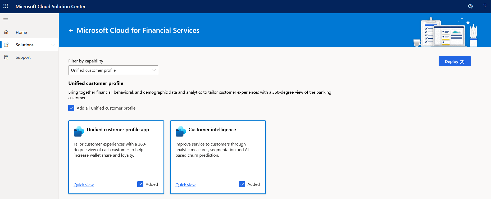](../media/add-all.png#lightbox)

1. Under **Additional components**, select **Sample data > Next**.

    > [!div class="mx-imgBorder"]
    > [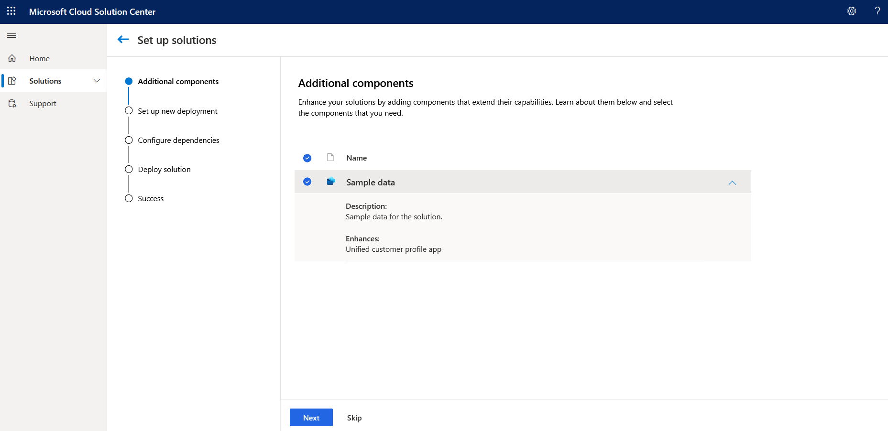](../media/sample.png#lightbox)

1. Find your Dataverse environment in the first dropdown list, and then select your Customer Insights deployment in the second dropdown list. Name your deployment, agree to the terms of service, and then select **Next**.

    > [!div class="mx-imgBorder"]
    > [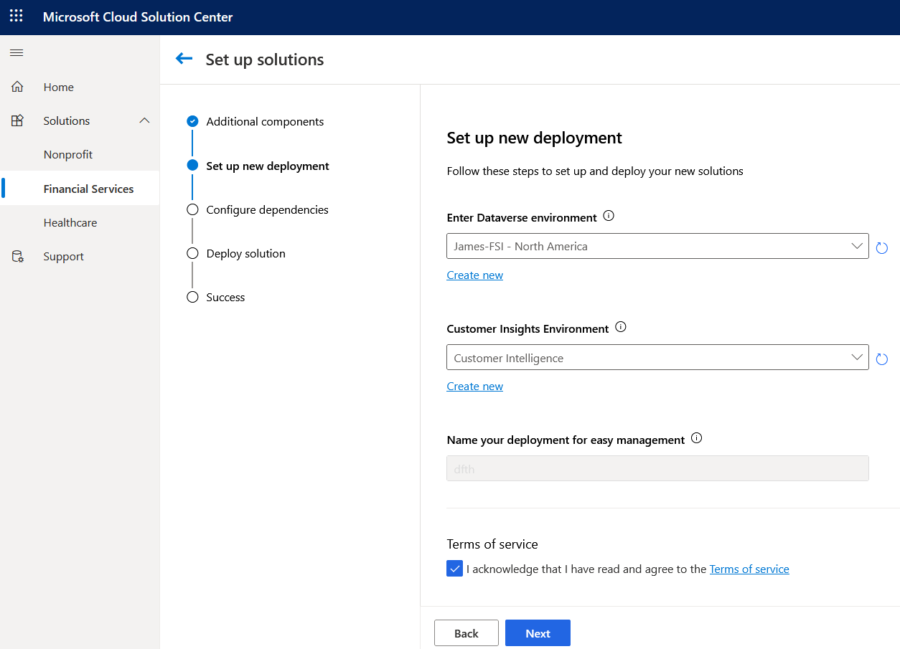](../media/deployment.png#lightbox)

1. Confirm that everything is correct and then select **Deploy**.

    > [!div class="mx-imgBorder"]
    > [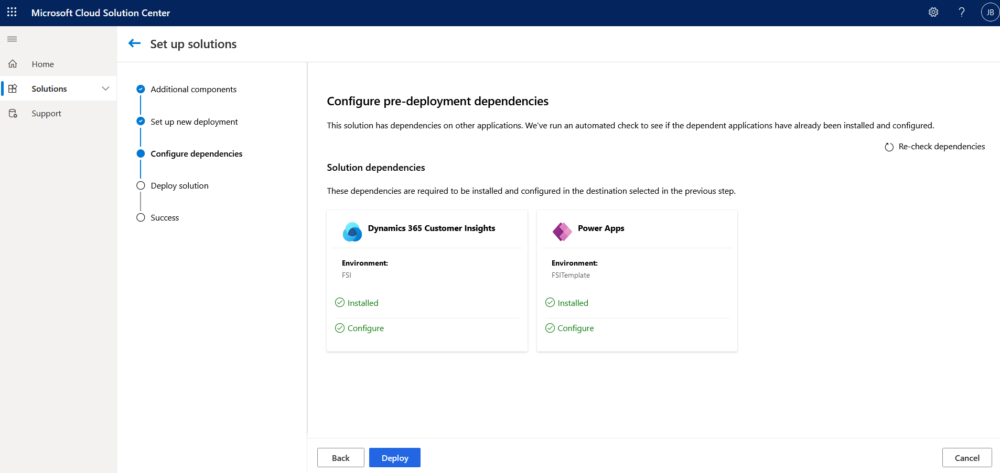](../media/deploy.png#lightbox)

1. Your deployment will now begin. When it completes, a confirmation message will display.

    > [!div class="mx-imgBorder"]
    > [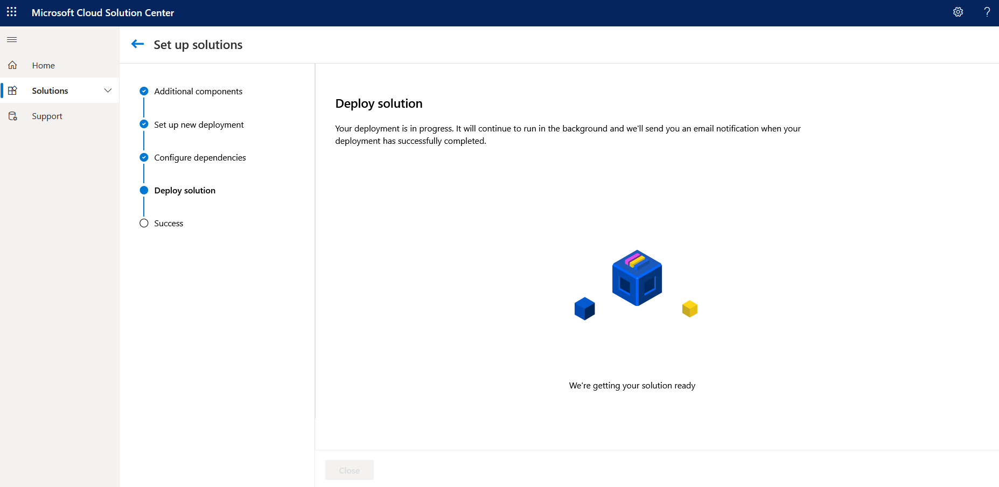](../media/deploying.png#lightbox)

    > [!div class="mx-imgBorder"]
    > [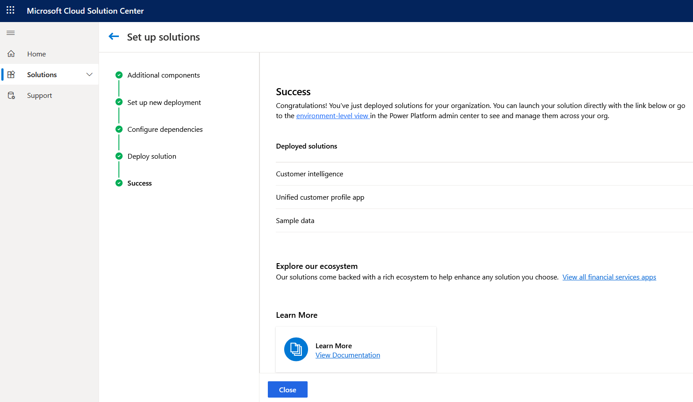](../media/success.png#lightbox)

Congratulations, you've deployed Dynamics 365 Customer Insights.
