In this exercise, you'll ingest the Dataverse sample data from your Azure Data Factory into Dynamics 365 Customer Insights. Then, you'll run the Retail banking churn model.

## Task 1: Set up a data source in Customer Insights

In this task, you'll set up the **operationaldata** data source for ingesting data into Dynamics 365 Customer Insights.

1. In Customer Insights, go to **Data Sources** and edit **operationaldata**.

    > [!div class="mx-imgBorder"]
    > 

1. Select **Azure subscription** and then select the appropriate **Subscription**, **Resource group**, and **Storage account** from the dropdown menus. For the **Container** field, type the name of your container. Select **Next**.

    > [!div class="mx-imgBorder"]
    > [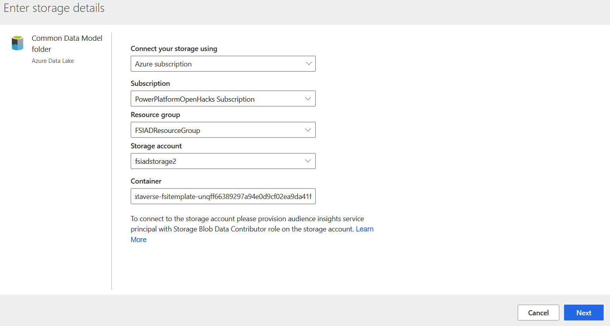](../media/storage-details.png#lightbox)

1. Scroll down and select the **msfsi.manifest.cdm.json** file. Select **Next**.

    > [!div class="mx-imgBorder"]
    > [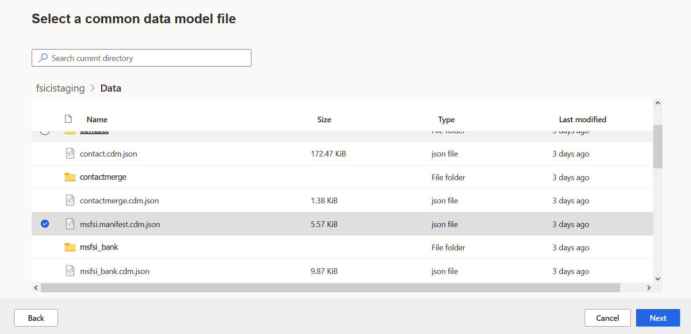](../media/select-file.png#lightbox)

1. Select all entities and then select **Next**.

    > [!div class="mx-imgBorder"]
    > [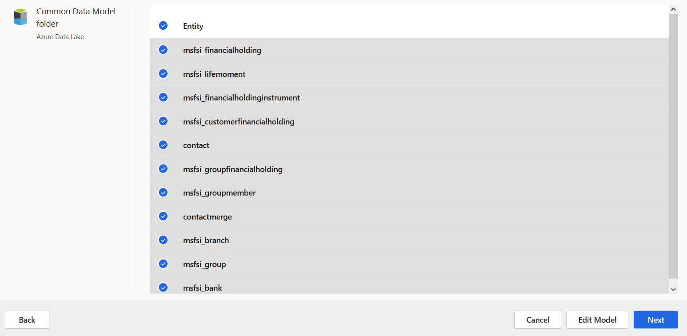](../media/entities.png#lightbox)

1. Select all entities for data profiling and then select **Save**.

    > [!div class="mx-imgBorder"]
    > [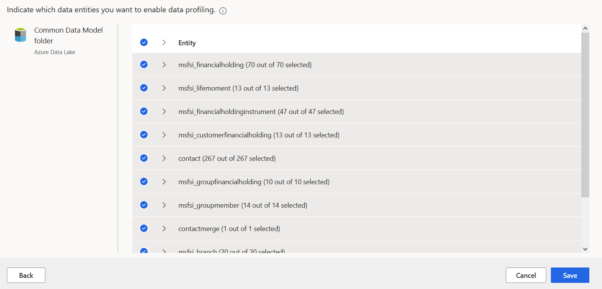](../media/profiling.png#lightbox)

1. Return to **Data sources** to view the status. The process should complete with some errors showing for the **Analysis preparation** category. This error is normal and won't affect future steps.

    > [!div class="mx-imgBorder"]
    > [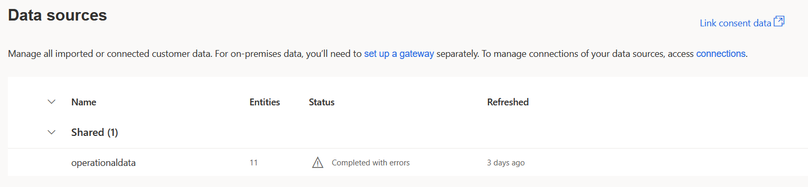](../media/errors.png#lightbox)

    > [!div class="mx-imgBorder"]
    > 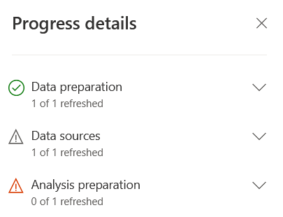

1. Now that the entities have been mapped, go to **Unify** on the site map to run the **Match** by selecting **Run**.

    > [!div class="mx-imgBorder"]
    > [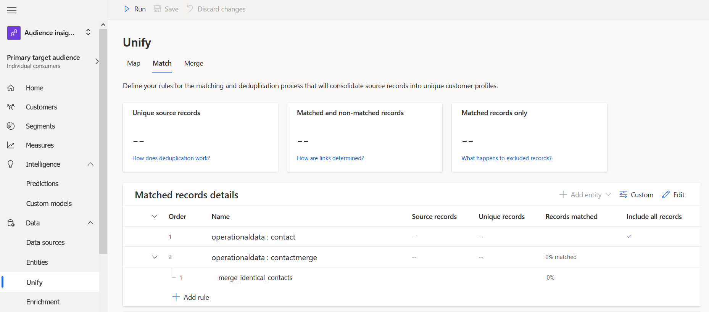](../media/run.png#lightbox)

1. When the match is complete, numbers for your matches will display, as shown in the following screenshot.

    > [!div class="mx-imgBorder"]
    > [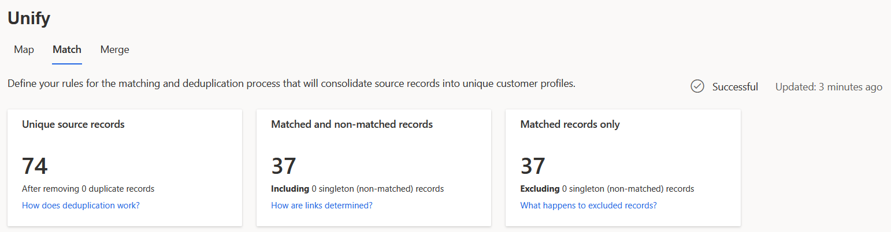](../media/unify.png#lightbox)

1. Before running the prediction model, you need to merge the records. On the **Merge** tab, select **Run** and then select **Run Merge and downstream processes**.

    > [!div class="mx-imgBorder"]
    > [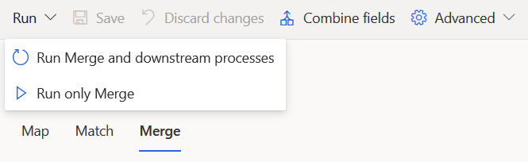](../media/run-merge.png#lightbox)

1. When the merge is complete, you will receive a success message, as shown in the following image.

    > [!div class="mx-imgBorder"]
    > [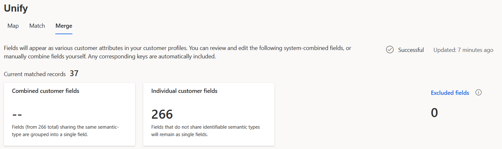](../media/unify-merge.png#lightbox)

1. Expand **Intelligence** on the site map and then go to **Predictions**. The Retail banking churn model should begin to refresh. This step might take several minutes to complete. If it doesn't complete after 10 to 15 minutes, try running the merge in step 9 again.

    > [!div class="mx-imgBorder"]
    > [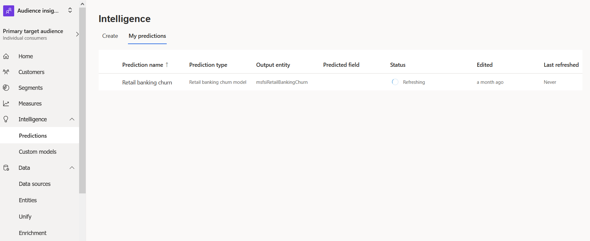](../media/refreshing.png#lightbox)

    > [!div class="mx-imgBorder"]
    > [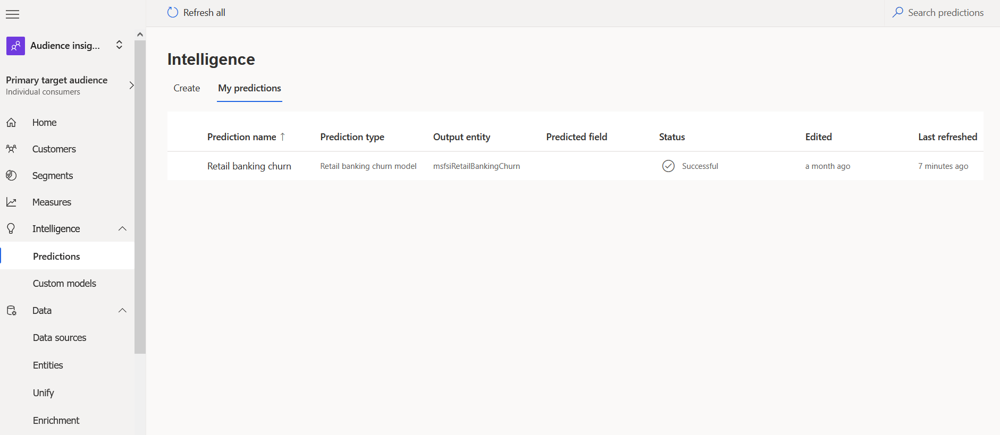](../media/successful.png#lightbox)

1. Open the prediction to view the contents of the training model. In this section, you'll find three main areas:

    - **Training model performance** - Displays a letter grade of how well the model has performed.

    - **Likelihood to churn (number of customers)** - Read as X customers are Y% likely to churn.

    - **Most influential factors** - Considered by the AI in predicting the model. These factors will vary depending on the data set.

    > [!div class="mx-imgBorder"]
    > [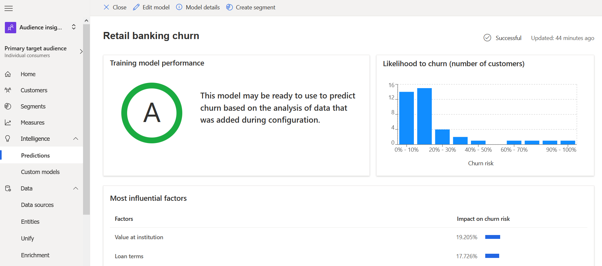](../media/churn.png#lightbox)

1. To view a customer's full profile in Dynamics 365 Customer Insights, go to **Customers** and open any sample record.

    > [!div class="mx-imgBorder"]
    > [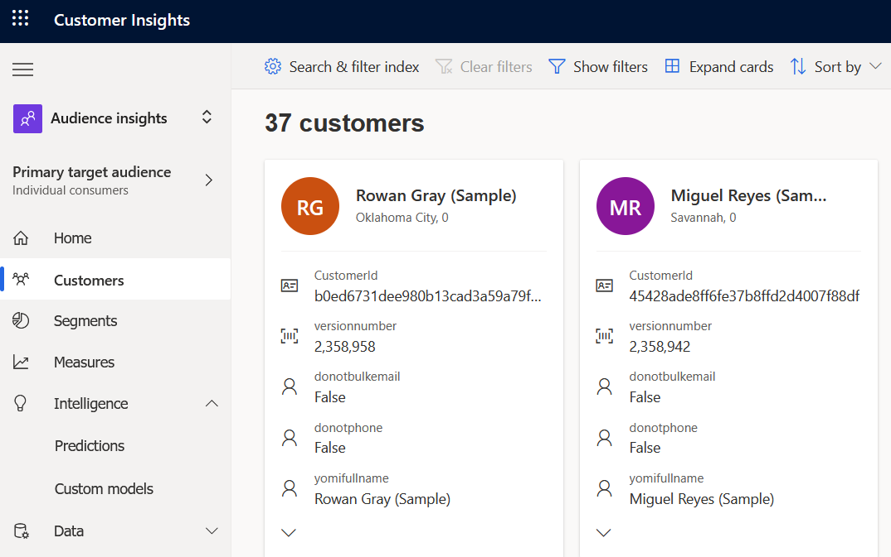](../media/customers.png#lightbox)

    > [!div class="mx-imgBorder"]
    > [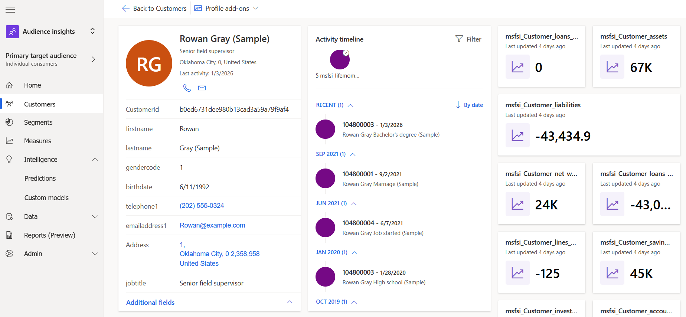](../media/customer-profile.png#lightbox)

1. To view the calculated churn scores, go to **Data**, and then under **Intelligence**, open the **msfsiRetailBankingChurn** entity that was created when you ran the churn model.

    > [!div class="mx-imgBorder"]
    > [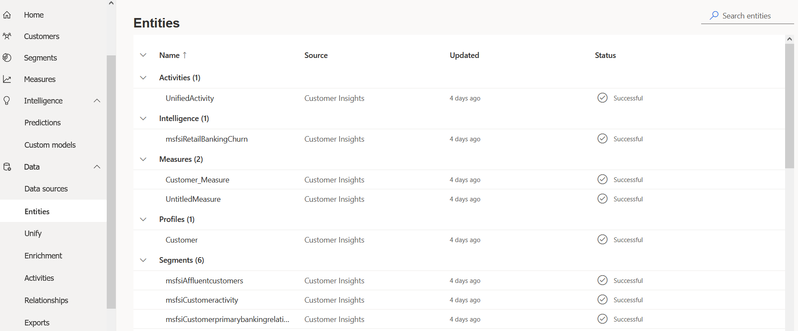](../media/entity.png#lightbox)

1. Select the **Data** tab to view the calculated churn score for each customer ID in the dataset.

    > [!div class="mx-imgBorder"]
    > [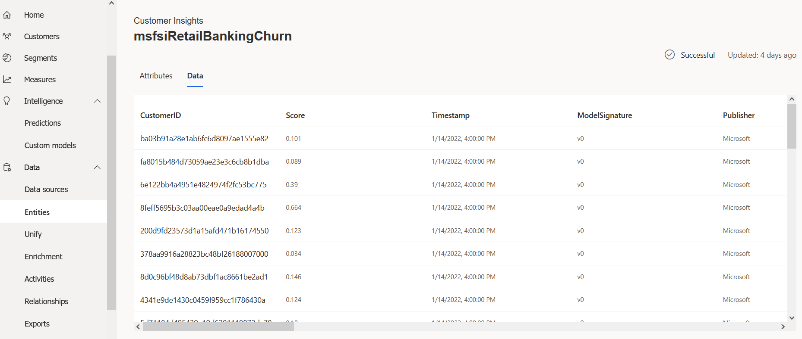](../media/score.png#lightbox)

1. To view the churn score in **Dataverse**, open a new tab in your internet browser and then go to your Dataverse environment in [Power Apps](https://make.powerapps.com/?azure-portal=true).

1. Go to **Apps** and then open **Unified Customer Profile**.

    > [!div class="mx-imgBorder"]
    > 

1. Open any of the 37 sample contact records.

    > [!div class="mx-imgBorder"]
    > [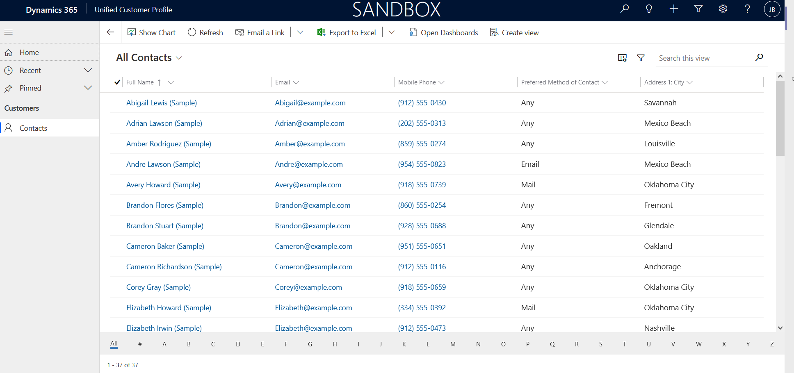](../media/sandbox.png#lightbox)

1. Scroll down to the bottom of the **Customer snapshot** section and select the information (**i**) icon to view the full details of the churn score.

    > [!div class="mx-imgBorder"]
    > [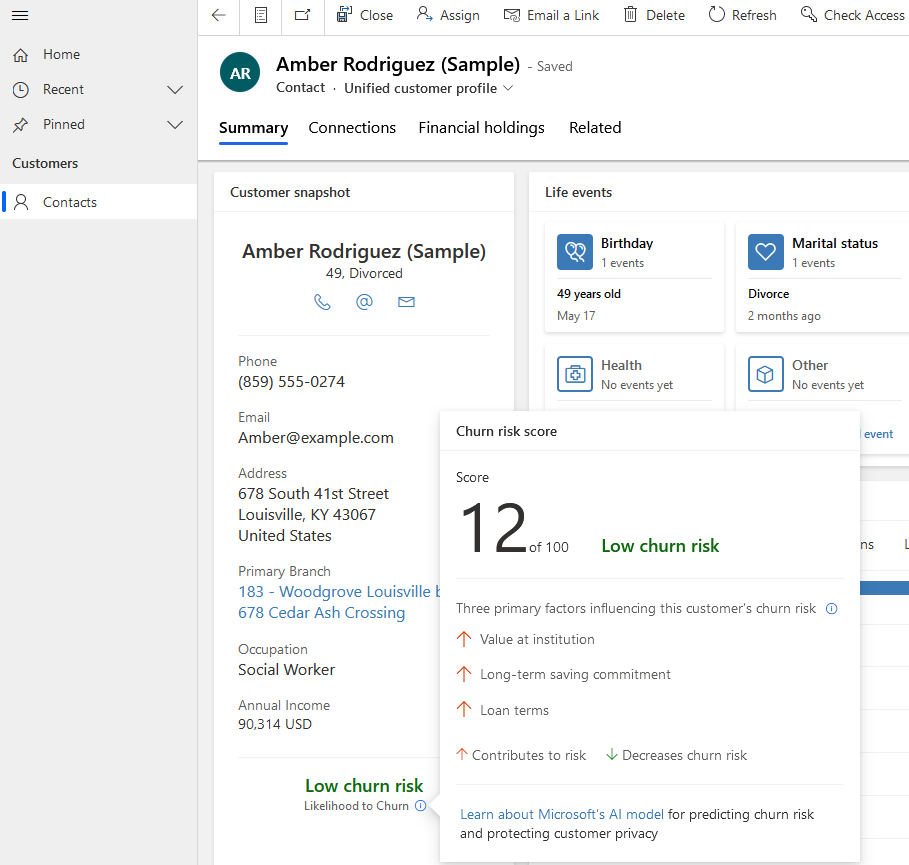](../media/churn-risk.png#lightbox)

Congratulations, you've successfully run the Retail banking churn model in Dynamics 365 Customer Insights.
