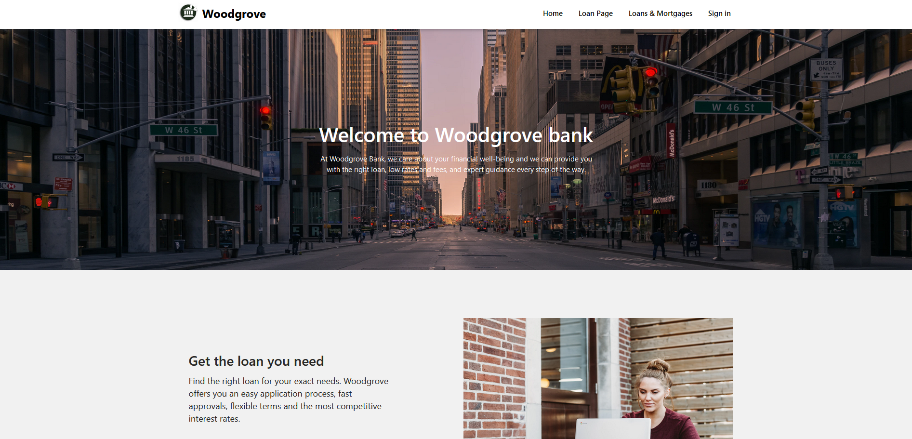
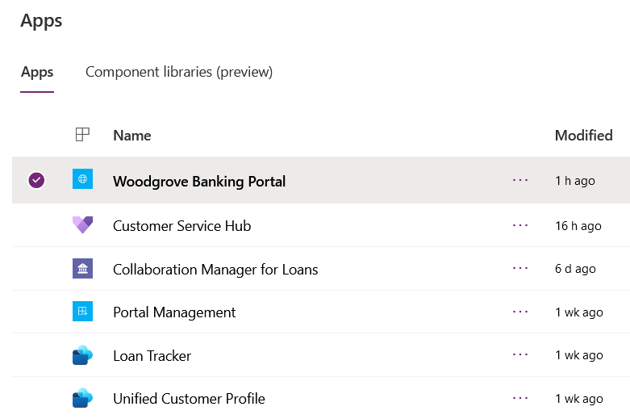
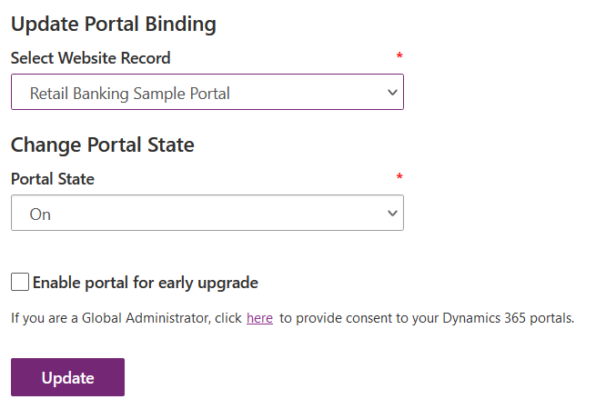
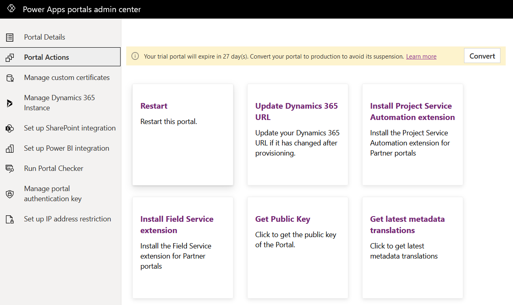
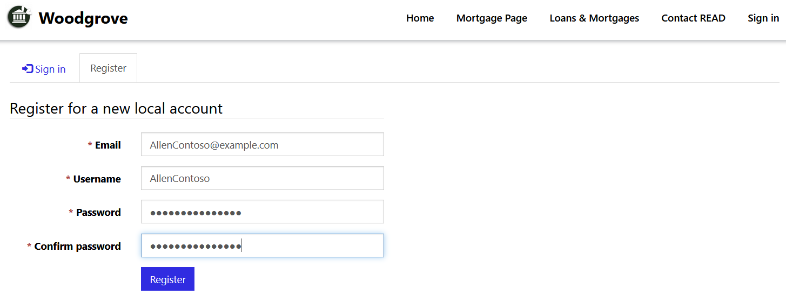
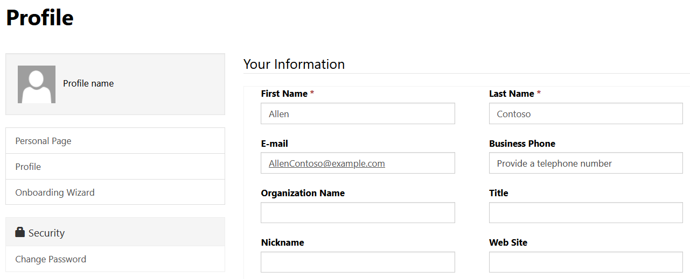
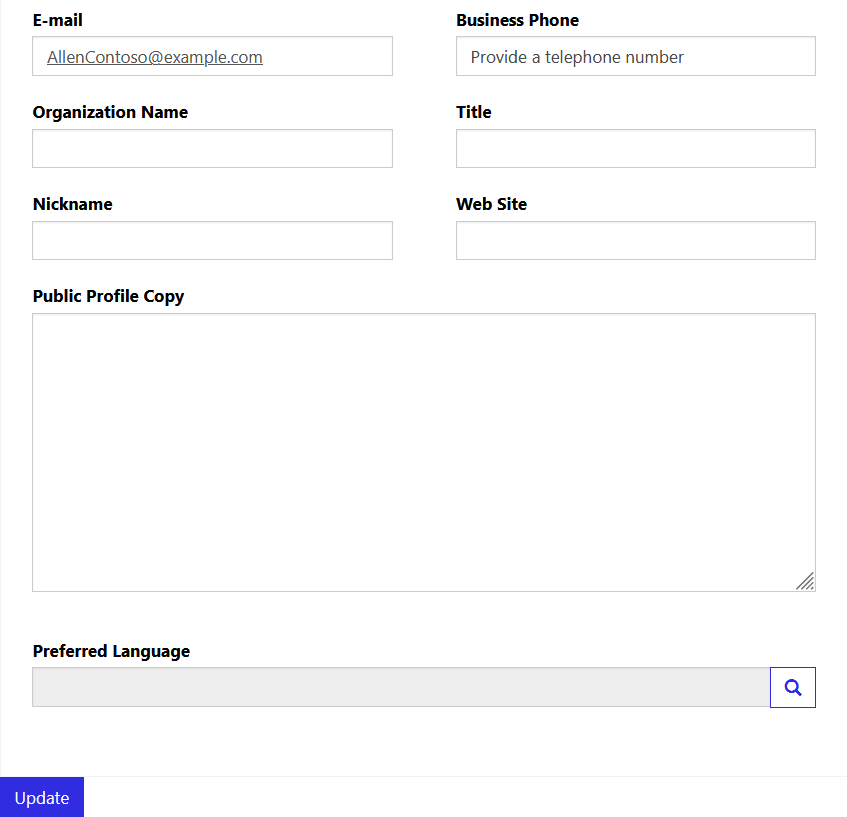

In this exercise, you will learn how to do the following:

- Configure an external website to the Retail Banking Portal template

- Create a registration code and invite a client to create an account for the website

- Sign in as a loan applicant to navigate the features of the retail banking website

The **Retail Banking Portal** is a template installed in your environment by the Customer onboarding module in Microsoft Cloud Solution Center when Microsoft Cloud for Financial Services was deployed.

A **Portal** is an external website that allows for communication between a company and its users. In this case, Woodgrove Bank wants an external website for their clients to access their loan history and communicate effectively with the institution. The Retail Banking Portal template tailors the website's user interface for a financial services company focusing on secure communication, information access, and an overall improved customer experience.

Here's what you should see after configuring and opening the Retail Banking Portal:

> [!div class="mx-imgBorder"]
> 

If you'd like to learn more about portals, check out Microsoft Docs: [What is Power Apps portals?](/powerapps/maker/portals/overview/?azure-portal=true)

## Task 1: Configure the Retail Banking Portal

Prior to deploying Microsoft Cloud for Financial Services, we created a portal in your environment using the **Customer Self-Service** template. This was a prerequisite to install the Retail Banking Portal as part of the Customer onboarding module.

Woodgrove Bank wants to associate the previously installed Customer Self-Service portal with the **Retail Banking Portal** template, so the correct website is displayed to the user. The following steps will guide you through how to bind your website to the proper template and restart the portal for changes to apply.

We will first open the Portal to show the Customer Self-Service template currently bound. After the configuration steps in this task, you will see the new Retail Banking Portal user interface.

1.  Using an In-Private or Incognito window, navigate to [Power Apps](https://make.powerapps.com/?azure-portal=true).

1.  Select the correct environment from the upper right **Environment** drop-down.

	> [!div class="mx-imgBorder"]
	> 

1.  Select **Apps** on the left navigation bar.

	> [!div class="mx-imgBorder"]
	> 

1.  Find the **Retail Banking Portal**, select **More Commands**, and then select **Settings**.

	> [!div class="mx-imgBorder"]
	> 

1.  Select **Administration**.

	> [!div class="mx-imgBorder"]
	> 

1.  Scroll down to **Update Portal Binding** and change the website record from Customer self-service to **Retail Banking Sample Portal**. Select **Update**.

	> [!div class="mx-imgBorder"]
	> 

1.  Go to **Portal Actions** on the left menu and select **Restart** to restart the portal.

	> [!div class="mx-imgBorder"]
	> 

1.  Go back to **Apps** and open the **Woodgrove Banking portal** to see the sample banking portal.

	> [!div class="mx-imgBorder"]
	> 

    **Congratulations!** You have configured the Retail Banking Sample Portal in Microsoft Cloud for Financial Services.

## Task 2: Create a new customer

Now that you have configured the Retail Banking Sample Portal, we will create an invitation for one of the Contacts in the system so that we can access the portal as a customer.

1.  Using an In-Private or Incognito window, navigate to [Power Apps](https://make.powerapps.com/?azure-portal=true).

1.  Select the correct environment from the upper right **Environment** drop-down.

	> [!div class="mx-imgBorder"]
	> 

1.  Select **Apps** on the left navigation bar.

	> [!div class="mx-imgBorder"]
	> 

1.  Open **Woodgrove Banking Portal**.

	> [!div class="mx-imgBorder"]
	> 

1.  Select Sign in on the top right.

	> [!div class="mx-imgBorder"]
	> 

1.  Select **Register** and then fill in the following information and then select **Register**:

	- **Email**: AllenContoso@example.com

	- **Username**: AllenContoso

	- **Password**: AllenContoso123

	- **Confirm Password**: AllenContoso123

	> [!div class="mx-imgBorder"]
	> 

1.  Fill in the following information and then scroll down and select Update:

	- **First Name**: Allen

	- **Last Name**: Contoso

	> [!div class="mx-imgBorder"]
	> 

	> [!div class="mx-imgBorder"]
	> 

**Congratulations!** You have successfully created a customer profile in the Retail Banking Sample Portal.