In this exercise, you will learn how to do the following:

- Create a new Power Apps solution

- Create a new Business Process Flow for tracking loans in Loan Tracker

- Publish the Business Process Flow to Loan Tracker

The **business process flow (BPF)** presents the current application stage. This feature allows the loan manager to see the application's current stage in the process. The bank can choose to set as many stages as needed.

When the Loan Tracker application is installed, the business process flow contains four stages:

-   Loan verification

-   Loan Processing

-   Underwriting

-   Closure

In this exercise, you will extend the business process flow for loans to include a new **Quality Check** stage.

> [!div class="mx-imgBorder"]
> [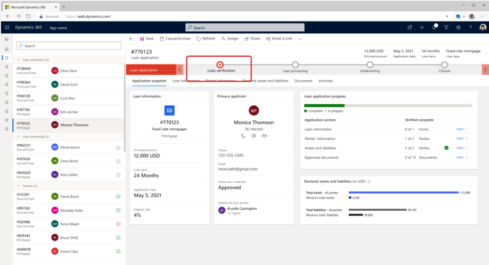](../media/loan-verification.png#lightbox)

## Task 1: Create a new Power Apps solution

1.  Using an In-Private or Incognito window, navigate to [Power Apps](https://make.powerapps.com/?azure-portal=true).

1.  Select the correct environment from the upper right **Environment** drop-down.

	> [!div class="mx-imgBorder"]
	> 

1.  Select **Solutions** on the left navigation bar.

	> [!div class="mx-imgBorder"]
	> [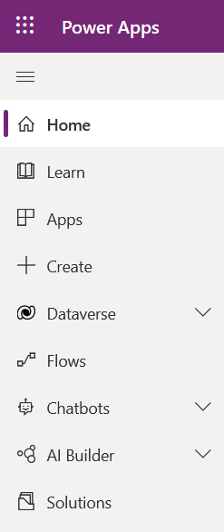](../media/solutions.png#lightbox)

1.  Select **+ New solution**.

	> [!div class="mx-imgBorder"]
	> 

1.  Name the new solution **Woodgrove Banking**, select the **CDS Default Publisher** and select **Create**.

	> [!div class="mx-imgBorder"]
	> [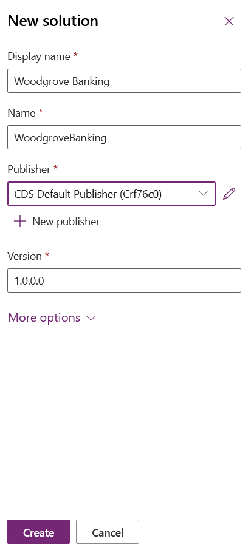](../media/solution-details.png#lightbox)

## Task 2: Extend the Loan Application Business Process Flow

1.  Select **Woodgrove Banking** to open the solution.

	> [!div class="mx-imgBorder"]
	> [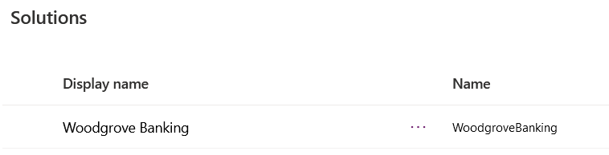](../media/woodgrove-banking.png#lightbox)

1.  Select **+ Add existing** and then choose **Process**.

	> [!div class="mx-imgBorder"]
	> [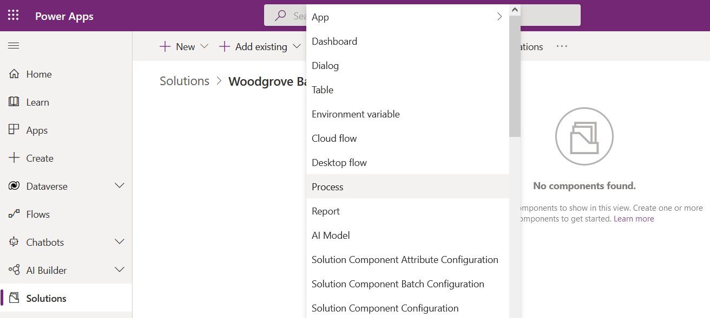](../media/add-process.png#lightbox)

1.  Search for "**BPF**" in search box, select **Loan application BPF**, and select **Add**.

	> [!div class="mx-imgBorder"]
	> [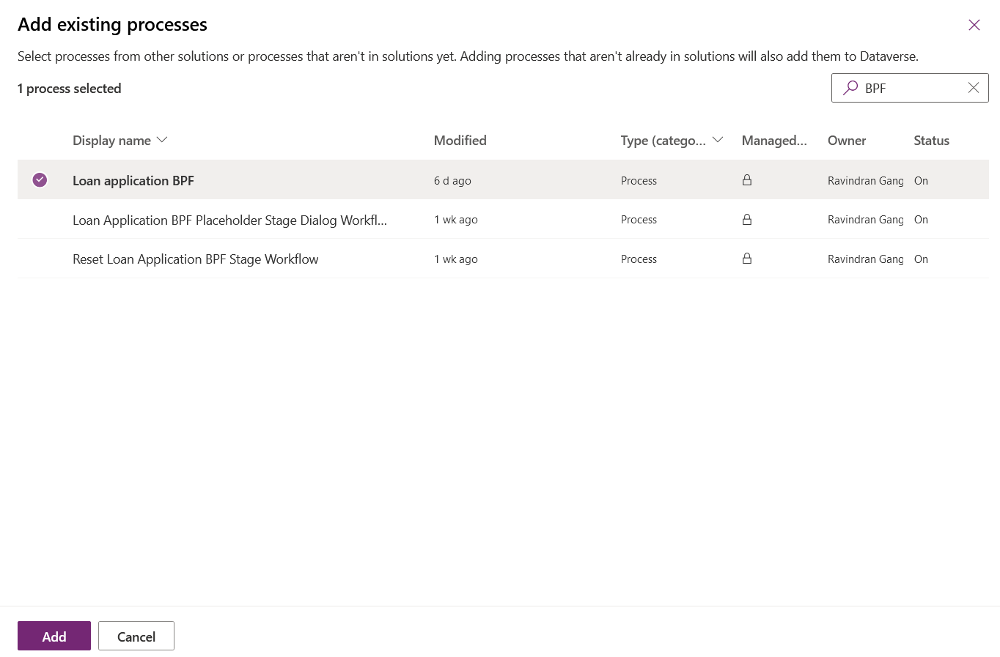](../media/loan-application.png#lightbox)

1.  Open the **Loan application BPF**.

	> [!div class="mx-imgBorder"]
	> [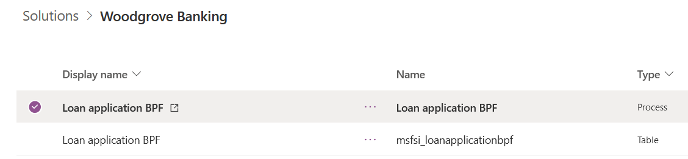](../media/loan-application-business-process-flow.png#lightbox)

1.  Deactivate the BPF.

	> [!div class="mx-imgBorder"]
	> [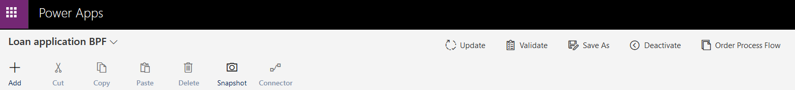](../media/deactivate.png#lightbox)

	> [!div class="mx-imgBorder"]
	> 

1.  Extend the BPF by selecting and dragging a Stage in between the Underwriting and Closure stages.

	> [!div class="mx-imgBorder"]
	> [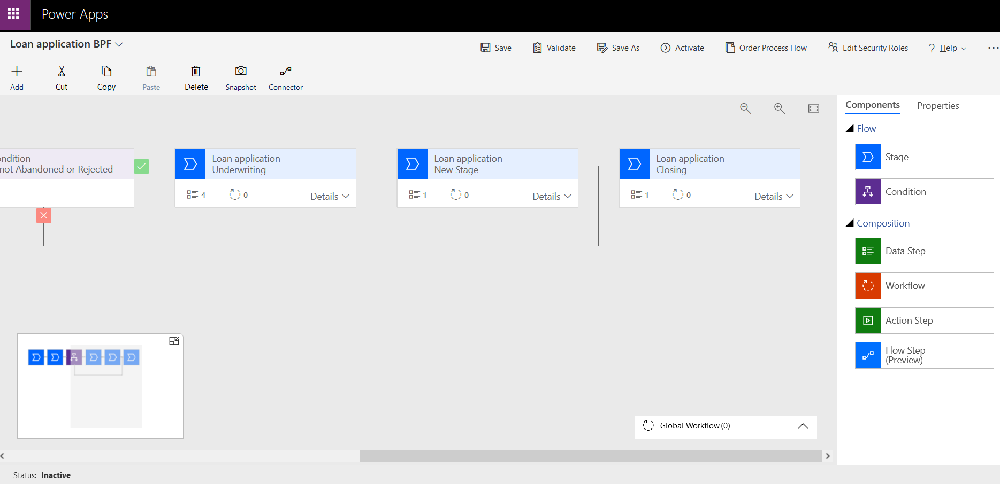](../media/extend.png#lightbox)

1.  Select the New Stage, give it a Display Name of Quality Check and select Apply.

	> [!div class="mx-imgBorder"]
	> [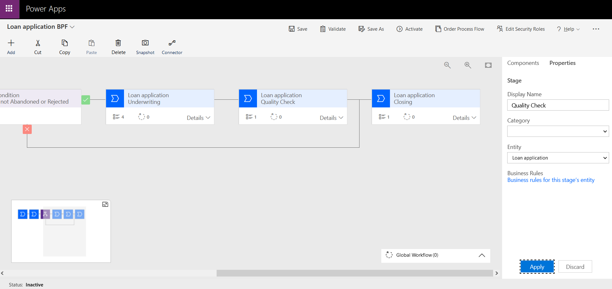](../media/quality-check.png#lightbox)

1.  Expand Steps under the new stage and select Data Step #1.

	> [!div class="mx-imgBorder"]
	> [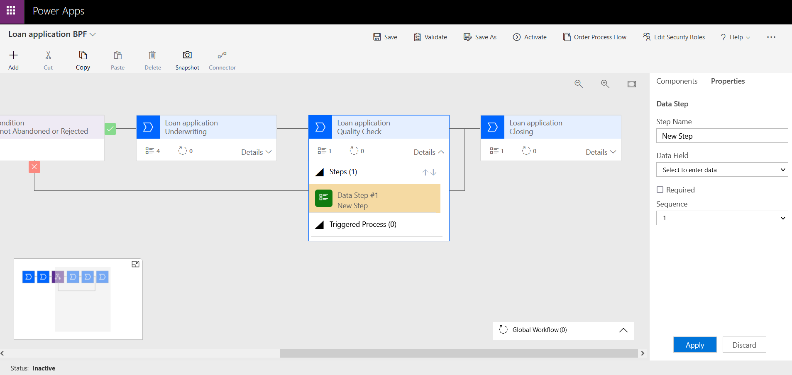](../media/data-step.png#lightbox)

1.  Enter the following information and select **Apply**:

	- **Step Name**: Confirmed By
	
	- **Data Field**: Text placeholder
	
	- **Required**: Yes

	> [!div class="mx-imgBorder"]
	> [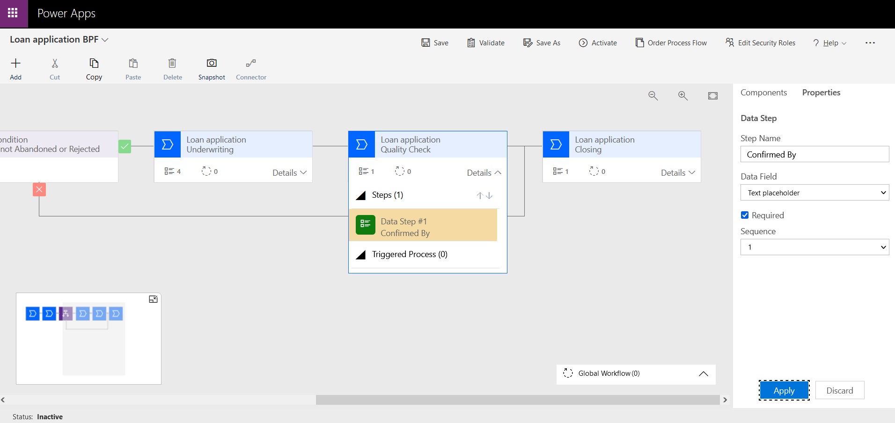](../media/data-step-details.png#lightbox)

1. Select **Save** to save your changes.

	> [!div class="mx-imgBorder"]
	> [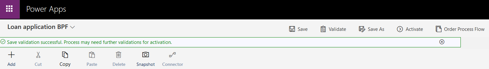](../media/save.png#lightbox)

1. Select Activate to activate the BPF

	> [!div class="mx-imgBorder"]
	> [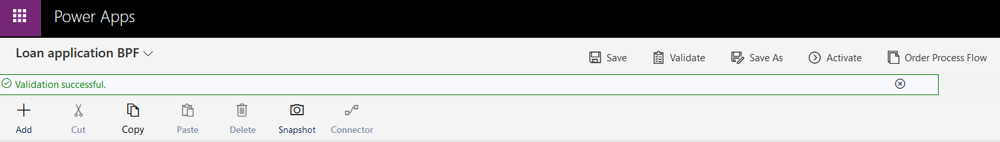](../media/activate.png#lightbox)

	> [!div class="mx-imgBorder"]
	> [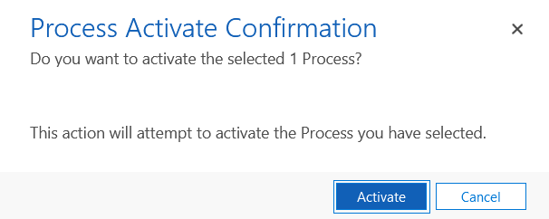](../media/activate-confirmation.png#lightbox)

**Congratulations!** You have extended the Loan application BPF by adding another stage for loan applications in Microsoft Cloud for Financial Services.