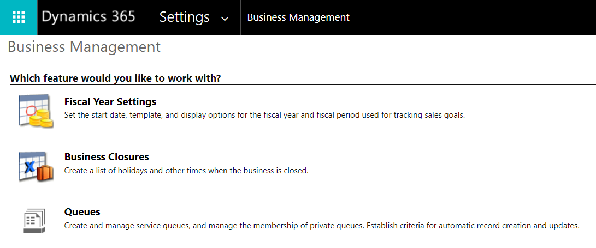
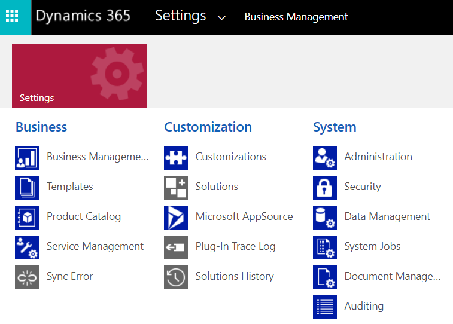
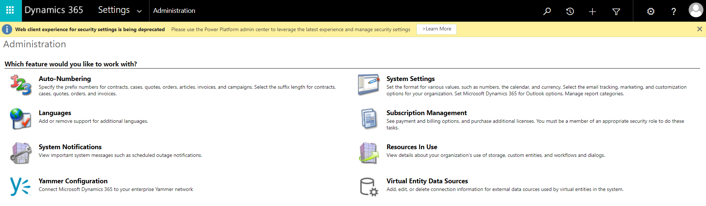
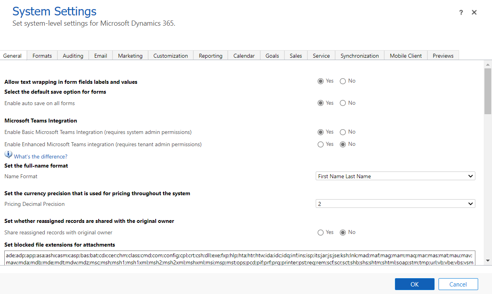
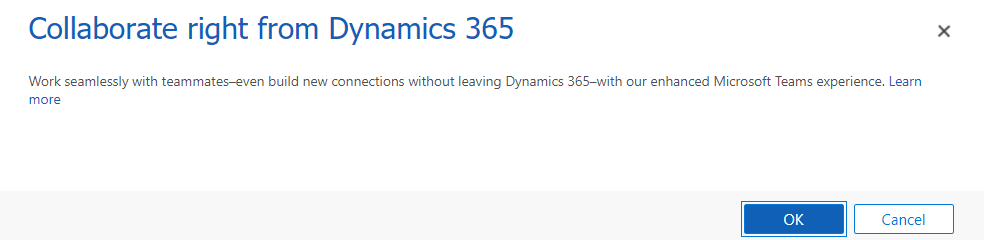
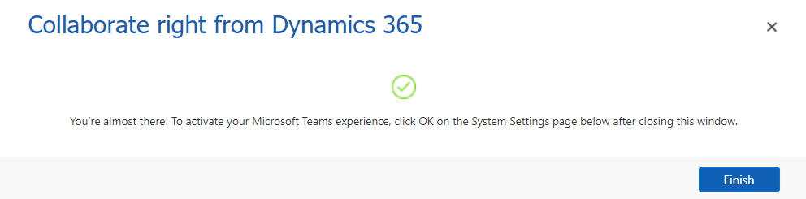
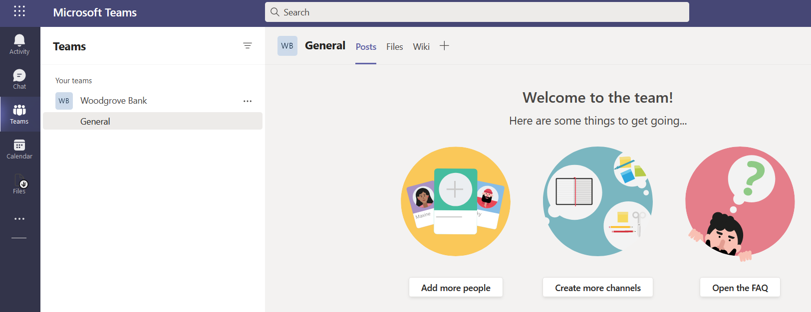
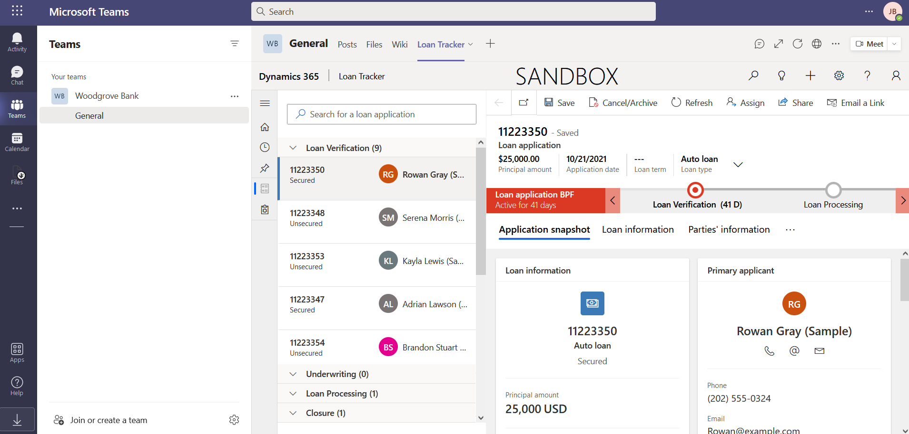

In this exercise, you will configure integration with Microsoft Teams for BANK. Microsoft Teams offers several features useful for banks and other financial institutions. By integrating Microsoft Cloud for Financial Services with Microsoft Teams, you can improve the collaboration between your staff and enhance customer service.

Additionally, your care team can use Microsoft Teams internally to do the following:

-   Chat, call, post messages, and communicate as a team.

-   Store and share files and documents to collaborate.

-   Use Shifts to create, manage, and share schedules among your staff.

## Task 1: Install and set up Microsoft Teams integration

By default, the Basic and Enhanced Microsoft Teams integration is disabled for customer engagement apps in Dynamics 365. In this Task, we will enable Microsoft Teams in Dynamics 365.

1.  Go to [make.powerapps.com](https://make.powerapps.com/?azure-portal=true).

1.  Select the **gear** in the upper right-hand corner and then select **Advanced Settings**.

	> [!div class="mx-imgBorder"]
	> 

1.  You will be landed in Dynamics 365 Business Management section.

	> [!div class="mx-imgBorder"]
	> 

1.  Go to **Settings > System > Administration**.

	> [!div class="mx-imgBorder"]
	> 

1.  Select **System Settings**.

	> [!div class="mx-imgBorder"]
	> 

1.  Under **Microsoft Teams Integration**, switch Enable **Basic** Microsoft Teams Integration over to **Yes**.

	> [!div class="mx-imgBorder"]
	> 

1.  When the pop-up opens, select **OK**. This will take several minutes to configure. 

	> [!div class="mx-imgBorder"]
	> 

1.  When it is completed, select **Finish**.

	> [!div class="mx-imgBorder"]
	> 

1.  Once back on System Settings, switch Enable **Enhanced** Microsoft Teams integration to **Yes**.

	> [!div class="mx-imgBorder"]
	> 

1. When the pop-up opens, select **OK**.

	> [!div class="mx-imgBorder"]
	> 

1. Another pop-up window will open. Select the user that you are signed in as currently.

	> [!div class="mx-imgBorder"]
	> 

1. Select **Accept**.

	> [!div class="mx-imgBorder"]
	> 

1. Select **Finish**.

	> [!div class="mx-imgBorder"]
	> 

1. You will now see that both Microsoft Teams Integration settings are set to Yes. Select **OK**.

	> [!div class="mx-imgBorder"]
	> 

**Congratulations!** You have enabled Microsoft Teams integration for Dynamics 365.

## Task 2: Embed Loan Tracker app in Microsoft Teams

In this task, you will customize the Microsoft Teams experience for a practitioner by embedding the Loan Tracker app to the Teams channel in your environment.

We will be utilizing the Microsoft Teams web experience for this task.

1.  While logged in to your Microsoft 365 tenant, open a new tab and go to [Microsoft Teams](https://teams.microsoft.com/?azure-portal=true).

1.  Select **Next** through the prompts, and then select **Let's Go**.

	> [!div class="mx-imgBorder"]
	> 

1.  Select Teams on the left navigation bar and then select **Create Team**.

	> [!div class="mx-imgBorder"]
	> 

1.  Select **From scratch**.

	> [!div class="mx-imgBorder"]
	> 

1.  Select Public.

	> [!div class="mx-imgBorder"]
	> 

1.  Call the Team "**Woodgrove Bank**" and select Create.

	> [!div class="mx-imgBorder"]
	> 

1.  Once the Team is created and the **General channel** selected, select the **+** button to add a tab.

	> [!div class="mx-imgBorder"]
	> 

1.  Search for "Power Apps" and select **Power Apps**.

	> [!div class="mx-imgBorder"]
	> 

1.  Select **Add**.

	> [!div class="mx-imgBorder"]
	> 

1. Select **Model-driven apps** from the dropdown menu, then search for and select **Loan Tracker** and select **Save**.

	> [!div class="mx-imgBorder"]
	> 

1. You will now see the Loan Tracker app embedded in Microsoft Teams.

	> [!div class="mx-imgBorder"]
	> 

**Congratulations!** You have embedded the Loan Tracker app in Microsoft Teams.
