In this exercise, you'll configure integration with Microsoft Teams for BANK. Microsoft Teams offers several features useful for banks and other financial institutions. By integrating Microsoft Cloud for Financial Services with Microsoft Teams, you can improve the collaboration between your staff and enhance customer service.

Additionally, your care team can use Microsoft Teams internally to do the following:

-   Chat, call, post messages, and communicate as a team.

-   Store and share files and documents to collaborate.

-   Use Shifts to create, manage, and share schedules among your staff.

## Task 1: Install and set up Microsoft Teams integration

By default, the Basic and Enhanced Microsoft Teams integration is disabled for customer engagement apps in Dynamics 365. In this Task, we'll enable Microsoft Teams in Dynamics 365.

1.  Go to [make.powerapps.com](https://make.powerapps.com/?azure-portal=true).

1.  Select your Microsoft Cloud for Healthcare environment from the list.

	> [!div class="mx-imgBorder"]
	> [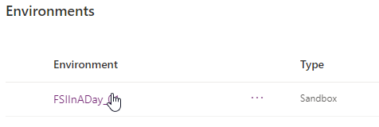](../media/environments.png#lightbox)

1.  You'll land on your environments detail page.

	> [!div class="mx-imgBorder"]
	> [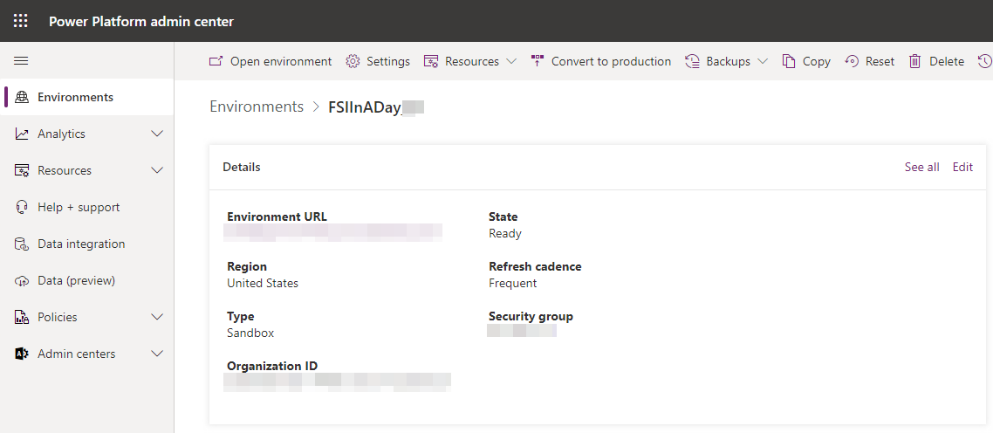](../media/environments-detail.png#lightbox)

1.  Select the **Settings** button on the top command bar.

	> [!div class="mx-imgBorder"]
	> [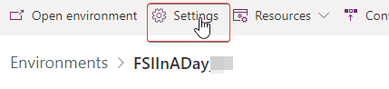](../media/settings.png#lightbox)

1.  Expand **Integration** and select **Teams integration settings**.

	> [!div class="mx-imgBorder"]
	> [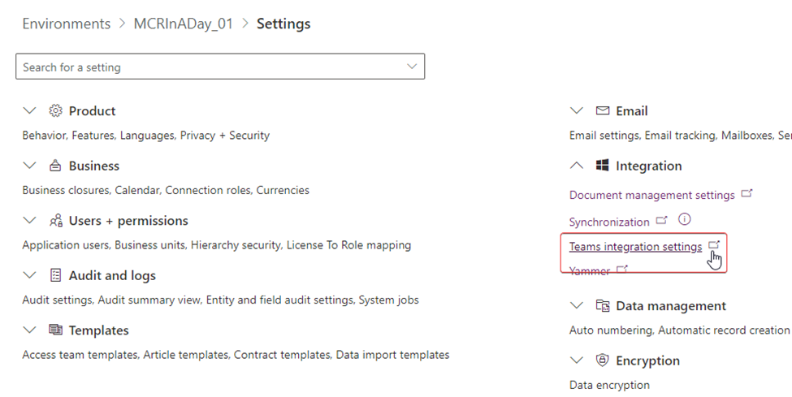](../media/integration-settings.png#lightbox)

1.  On the **Microsoft Teams collaboration and chat** page, switch **Turn on the linking of Dynamics 365 records to Microsoft Teams channels** to **Yes**.

	> [!div class="mx-imgBorder"]
	> [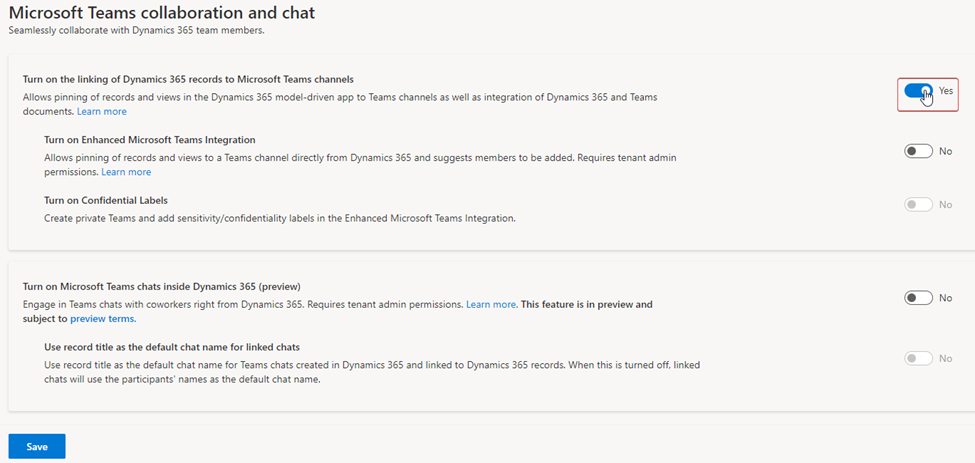](../media/link.png#lightbox)

1.  Select the **Save** button at the bottom left. 

	> [!div class="mx-imgBorder"]
	> [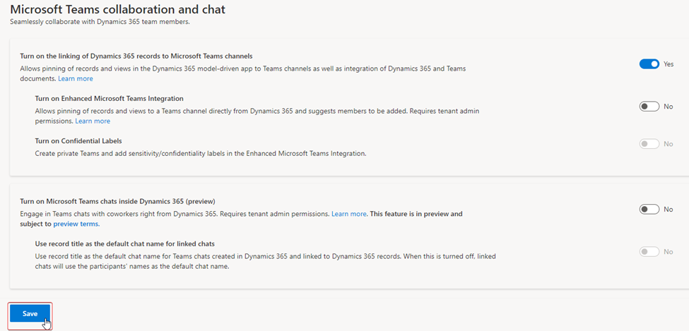](../media/link-save.png#lightbox)

1.  After the page finishes saving, switch **Turn on Enhanced Microsoft Teams Integration** to **Yes**.

	> [!div class="mx-imgBorder"]
	> [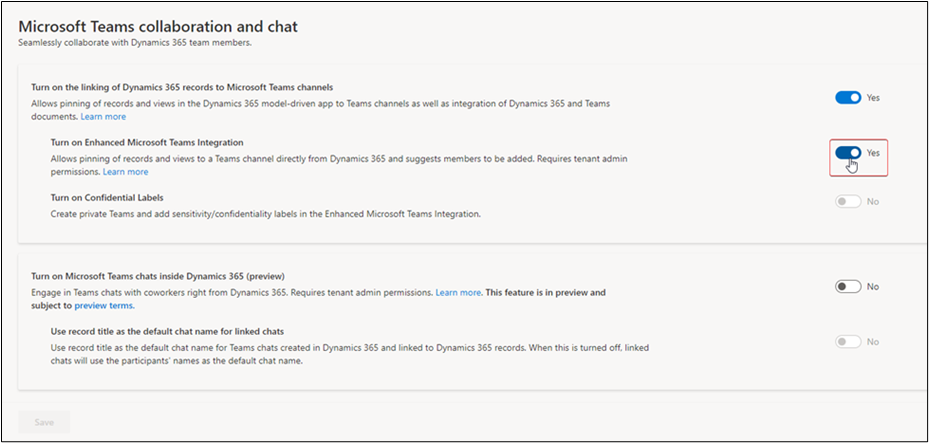](../media/enhanced-integration.png#lightbox)

1.  Another pop-up window will open to grant permissions. Select the user you're signed in as currently.

	> [!div class="mx-imgBorder"]
	> [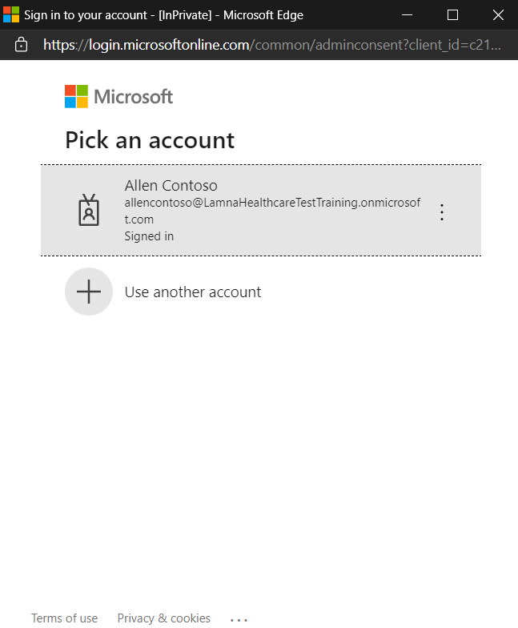](../media/permissions.png#lightbox)

1. Select **Accept** for requested permissions. It may take several minutes to configure. Ensure you don't have pop ups blocked that may interfere with the communication. If so, turn off blockers for this website, cancel and try connecting again.

	> [!div class="mx-imgBorder"]
	> [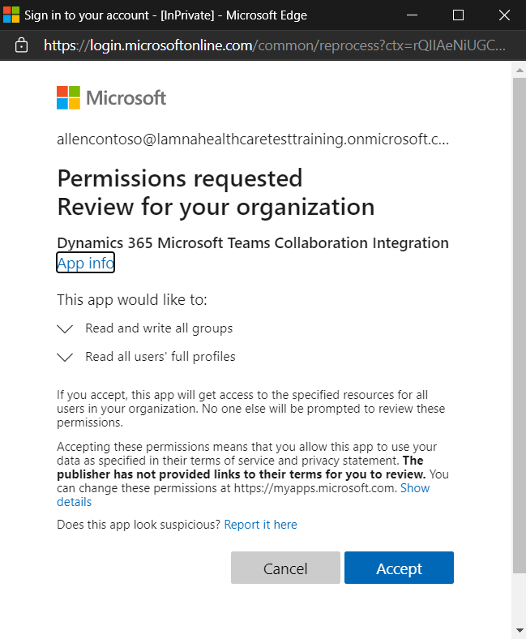](../media/accept.png#lightbox)

1. Once the dialog disappears, select the **Save** button at the bottom left.

	> [!div class="mx-imgBorder"]
	> [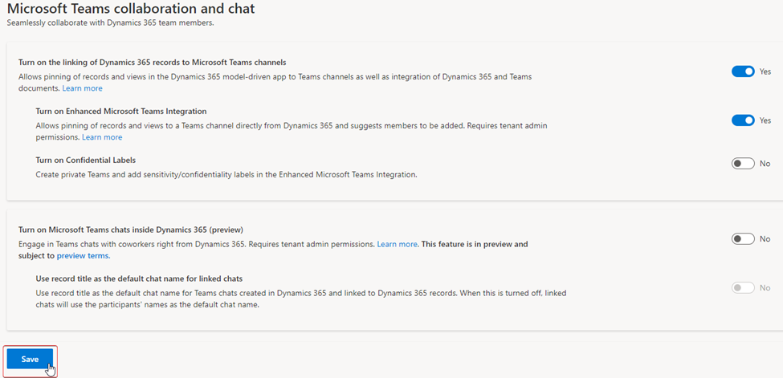](../media/save-button.png#lightbox)

1. You'll now see that both Microsoft Teams Integration settings are set to Yes. Select **OK**.

	> [!div class="mx-imgBorder"]
	> [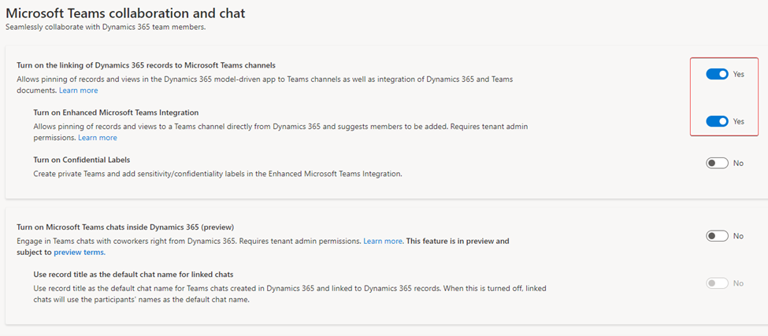](../media/integration-set.png#lightbox)

Congratulations, you have enabled Microsoft Teams integration for Dynamics 365.

## Task 2: Embed Loan Tracker app in Microsoft Teams

In this task, you'll customize the Microsoft Teams experience for a practitioner by embedding the Loan Tracker app to the Teams channel in your environment.

We'll be utilizing the Microsoft Teams web experience for this task.

1.  While logged in to your Microsoft 365 tenant, open a new tab and go to [Microsoft Teams](https://teams.microsoft.com/?azure-portal=true).

1.  Select **Next** through the prompts, and then select **Let's Go**.

	> [!div class="mx-imgBorder"]
	> 

1.  Select Teams on the left navigation bar and then select **Create Team**.

	> [!div class="mx-imgBorder"]
	> [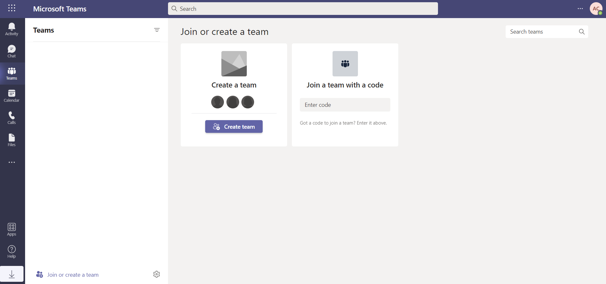](../media/create-team.png#lightbox)

1.  Select **From scratch**.

	> [!div class="mx-imgBorder"]
	> 

1.  Select Public.

	> [!div class="mx-imgBorder"]
	> [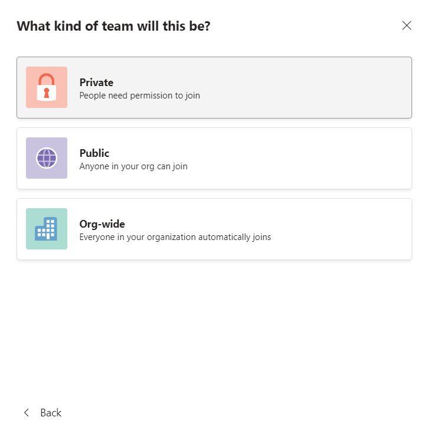](../media/public.png#lightbox)

1.  Call the Team "**Woodgrove Bank**" and select Create.

	> [!div class="mx-imgBorder"]
	> [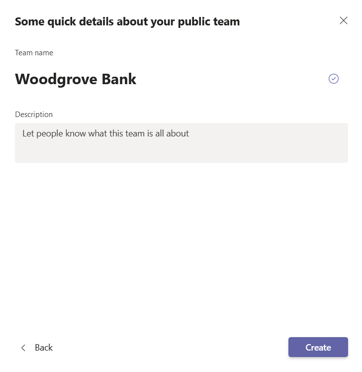](../media/bank-name.png#lightbox)

1.  Once the Team is created and the **General channel** selected, select the **+** button to add a tab.

	> [!div class="mx-imgBorder"]
	> 

1.  Search for "Power Apps" and select **Power Apps**.

	> [!div class="mx-imgBorder"]
	> [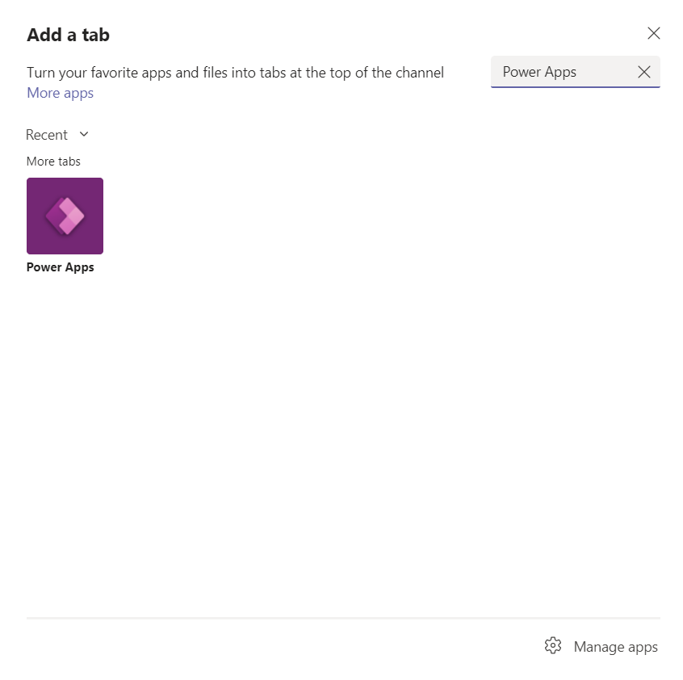](../media/power-apps.png#lightbox)

1.  Select **Add**.

	> [!div class="mx-imgBorder"]
	> [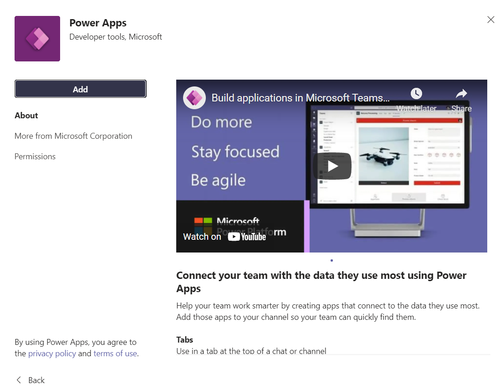](../media/add.png#lightbox)

1. Select **Model-driven apps** from the dropdown menu, then search for and select **Loan Tracker** and select **Save**.

	> [!div class="mx-imgBorder"]
	> [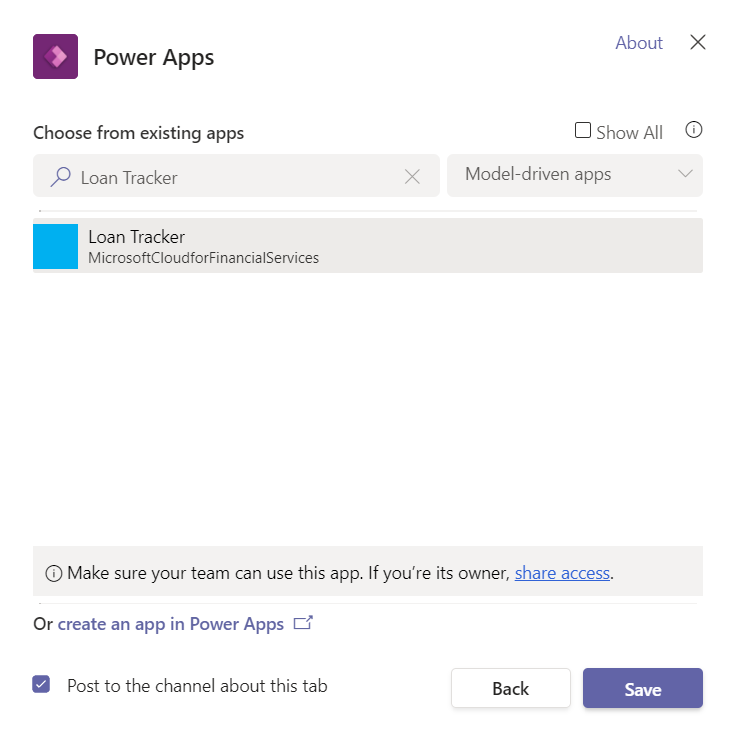](../media/loan-tracker.png#lightbox)

1. You'll now see the Loan Tracker app embedded in Microsoft Teams.

	> [!div class="mx-imgBorder"]
	> 

Congratulations, You've embedded the Loan Tracker app in Microsoft Teams.
