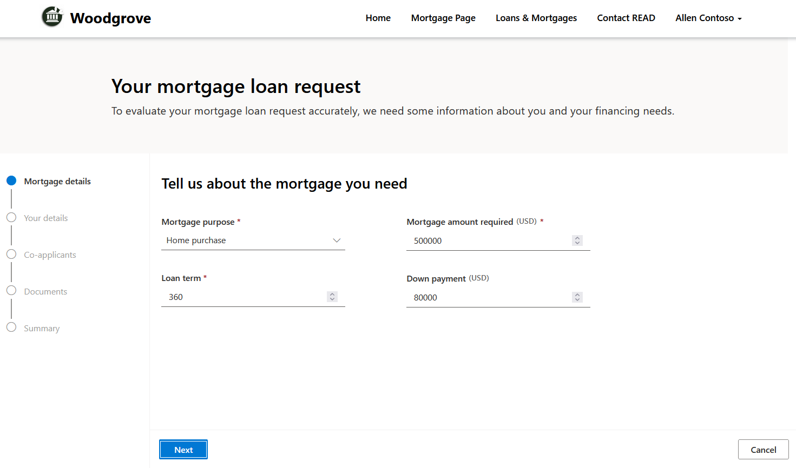
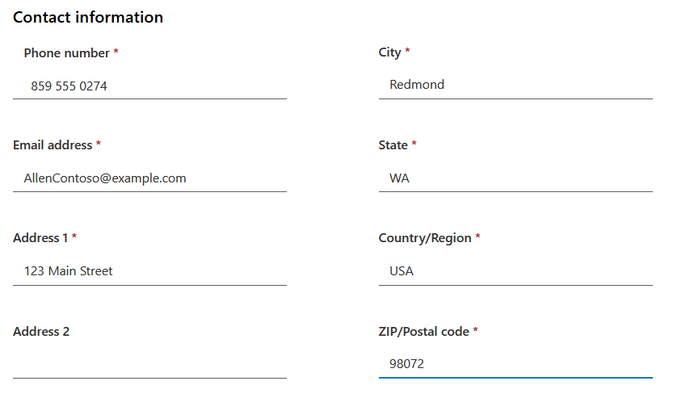
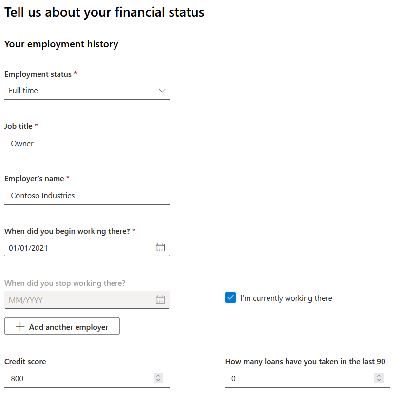
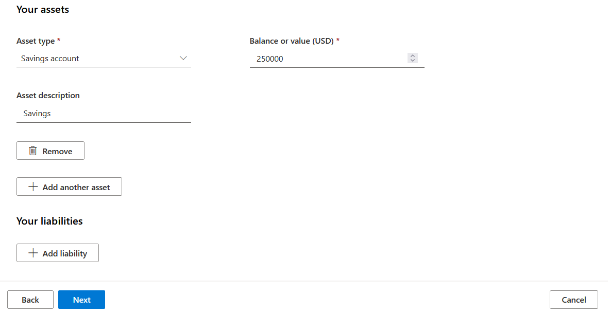
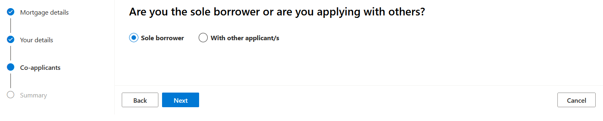
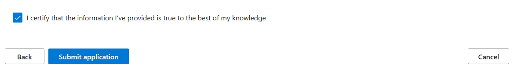
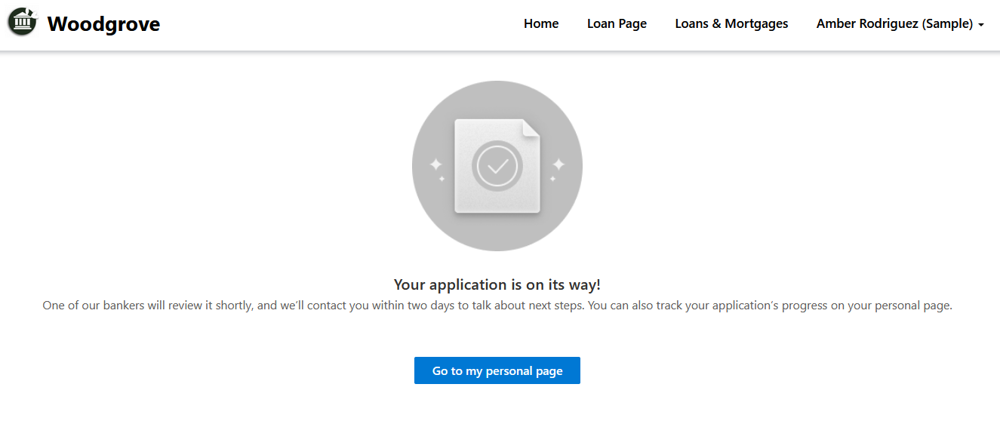
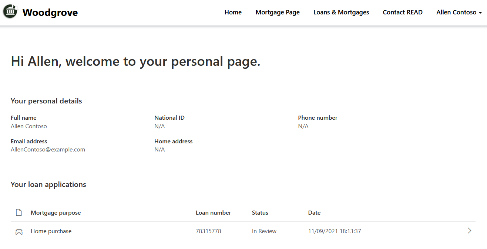
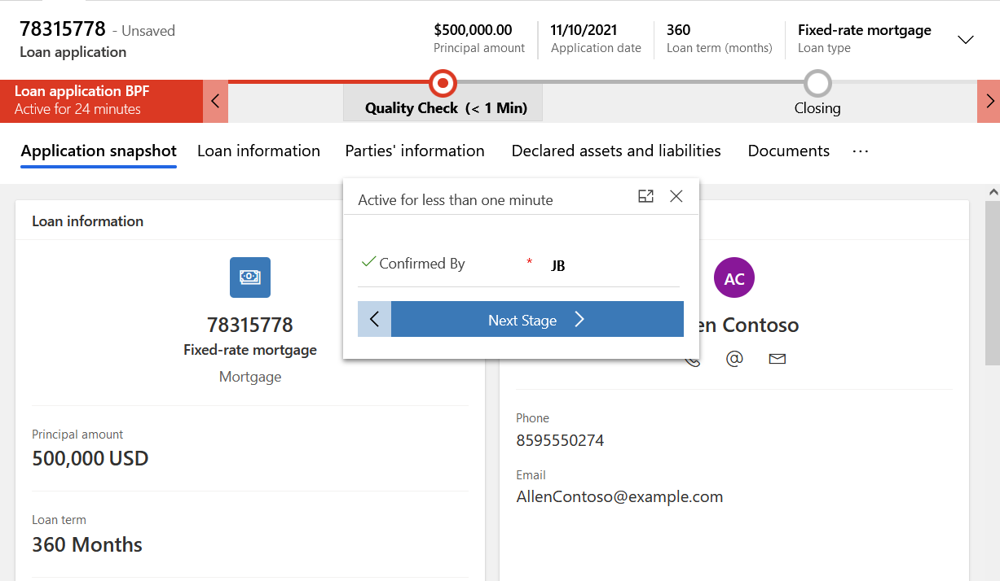
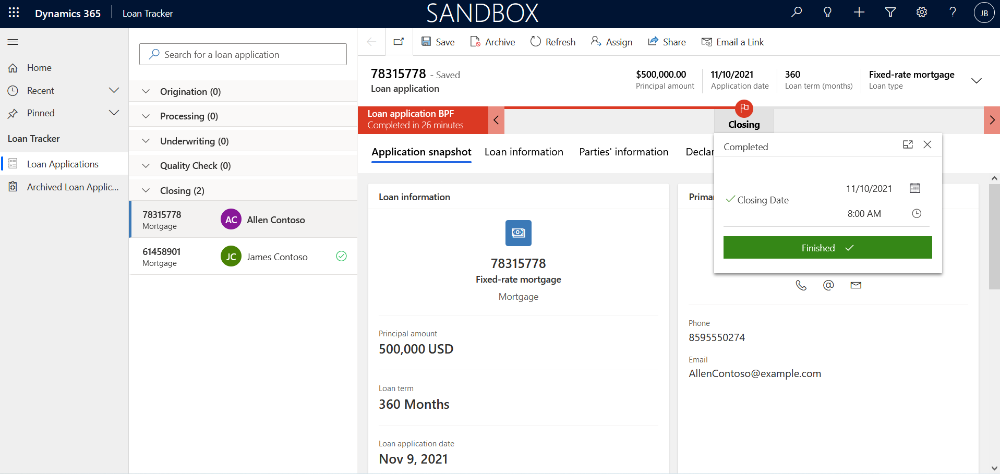

In this exercise, you will learn how to do the following:

- Log into the Retail Banking portal as a customer and submit a loan request

- Log into Loan Tracker in Microsoft Teams as a Loan Representative and approve the loan

## Task 1: Log into the Retail Banking portal as a customer and submit a loan request

1.  Using an In-Private or Incognito window, navigate to [Power Apps](https://make.powerapps.com/?azure-portal=true).

1.  Select the correct environment from the upper right **Environment** drop-down.

	> [!div class="mx-imgBorder"]
	> 

1.  Select **Apps** on the left navigation bar.

	> [!div class="mx-imgBorder"]
	> 

1.  Open the Woodgrove Banking Portal and sign in as Allen Contoso.

	> [!div class="mx-imgBorder"]
	> 

	> [!div class="mx-imgBorder"]
	> 

1.  Expand Allen Contoso's information and select **Onboarding Wizard** to initiate a mortgage loan request.

	> [!div class="mx-imgBorder"]
	> 

1.  Under Mortgage Details, fill out the following information and select **Next**:

	- **Mortgage Purpose**: Home purchase
	
	- **Loan Term**: 360
	
	- **Mortgage amount required (USD):** 500,000
	
	- **Down payments (USD):** 80,000

	> [!div class="mx-imgBorder"]
	> 

7.  Under Your details, fill out the following information and select **Next**:

	- **Title**: Mr.

	- **First Name**: Allen

	- **Last Name**: Contoso

	- **Date of Birth**: 10/01/1980

	- **National Number**: 555-55-5555

	> [!div class="mx-imgBorder"]
	> 

	- **Phone number**: (859) 555-0274

	- **Street address 1**: 123 Main Street

	- **Email Address**: AllenContoso\@example.com

	- **City**: Redmond

	- **State**: WA

	- **Country/Region**: USA

	- **Zip/Postal Code**: 98072

	> [!div class="mx-imgBorder"]
	> 

	- **Employment's status**: Full time

	- **Job Title**: Owner

	- **Employer's name**: Contoso Industries

	- **When did you begin working there?**: 01/01/2021

	- **I'm currently working there**: Yes

	- **Credit score:** 800

	- **How many loans have you taken in the last 90 days:** 0

	> [!div class="mx-imgBorder"]
	> 

	- **Asset type:** Savings account

	- **Balance or value (USD):** 250000

	- **Asset description:** Savings

	> [!div class="mx-imgBorder"]
	> 

1.  Select **Sole borrower** and then select **Next**.

	> [!div class="mx-imgBorder"]
	> 

1.  Scroll down to the bottom of the page, **check** the certification check box, and select **Submit application**.

	> [!div class="mx-imgBorder"]
	> 

1. Select **Go to my personal page** to see the loan application status.

	> [!div class="mx-imgBorder"]
	> 

	> [!div class="mx-imgBorder"]
	> 

## Task 2: Log into Loan Tracker in Microsoft Teams as a Loan Representative and approve the loan

1.  While logged in to your Microsoft 365 tenant, open a new tab and go to [Microsoft Teams.](https://teams.microsoft.com/?azure-portal=true).

1.  Navigate to the Teams channel you created, go to Loan Tracker and search for the Allen Contoso mortgage loan application that you created.

	> [!div class="mx-imgBorder"]
	> 

1.  Click through the steps and fill in the fields in the Loan Application BPF to advance the Loan application to a new stage.

	> [!div class="mx-imgBorder"]
	> 

1.  **Input** your initials in the **Confirmed By** textbox in the new Quality Check stage. Select **Next Stage**.

	> [!div class="mx-imgBorder"]
	> 

1.  Close the loan.

	> [!div class="mx-imgBorder"]
	> 

**Congratulations!** You have successfully created a new loan application using the Retail Banking Sample Portal and verified the loan application using Loan Tracker in Microsoft Cloud for Financial Services.