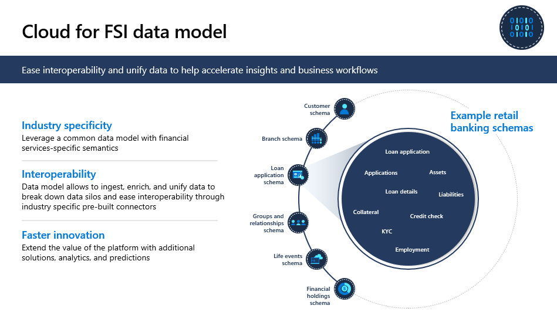

Microsoft's industry data models ease interoperability and unify data to help accelerate insights and business workflows. A dedicated banking data model captures new dimensions, such as financial information, groups and relationships, and life moments.

> [!div class="mx-imgBorder"]
> 

The Industry data model for Microsoft Cloud for Financial Services offers three main benefits:

- **Industry specificity**: Use a common data model with financial services-specific semantics

- **Interoperability**: The data model ingests, enriches, and unifies data to break down data silos and ease interoperability through industry specific pre-built connectors

- **Faster innovation**: Extend the value of the platform with more solutions, analytics, and predictions.

On the above illustration, the concentric circles represent retail banking elements that are part of the Cloud for financial services industry data model, such as

- Customer schema
- Branch schema
- Loan application schema

Within each of these schemas are defined entities. For example, within loan application schema, there are loan details, assets, liabilities, credit check, and more. In this way, our data model is tailored to financial services industry needs.
