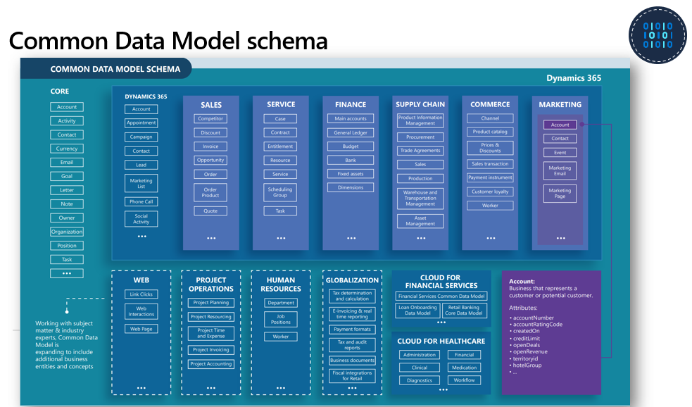

Common Data Model is fundamental to Microsoft's data platform strategy. It includes a set of standardized, extensible data schemas that Microsoft and its partners have published. This collection of predefined schemas includes entities, attributes, semantic metadata, and relationships. The schemas represent commonly used concepts and activities, such as accounts, contacts, banks, and financial holdings, to simplify the creation, aggregation, and analysis of financial data.

> [!div class="mx-imgBorder"]
> 

A shared schema layer helps accelerate application development, analytics, and data integrations for operational and analytical scenarios. 
