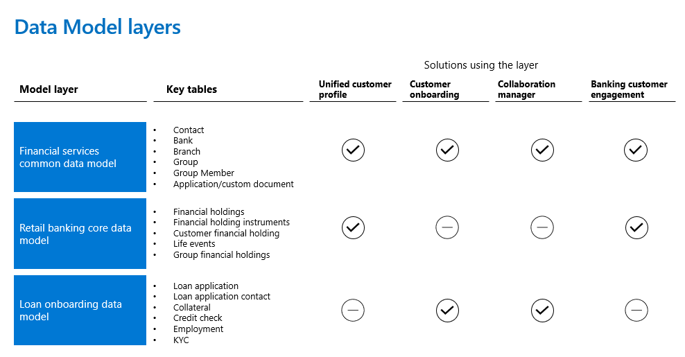

The Cloud for Financial Services data model has three interconnected layers. The layers are Financial services Common Data Model, Retail Banking Core Data Model, and the Loan Onboarding Data Model. Each data model layer is then used in the solutions and capabilities that are included in Microsoft Cloud for Financial Services.

> [!div class="mx-imgBorder"]
> 

- [Financial Services Common Data Model](/common-data-model/schema/core/industrycommon/financialservices/financialservicescommondatamodel/overview/?azure-portal=true) layer cuts across all applications as is represented in the above illustration.

- [Retail Banking Core Data Model](/common-data-model/schema/core/industrycommon/financialservices/retailbankingcoredatamodel/overview/?azure-portal=true) is used by Unified Customer Profile and Banking Customer engagement applications.

- [Loan Onboarding Data Model](/common-data-model/schema/core/industrycommon/financialservices/loanonboardingdatamodel/overview/?azure-portal=true) is used by Customer Onboarding and Collaboration manager applications.

This information is critical during design and implementation for identifying the solution dependency on the data model layers.
