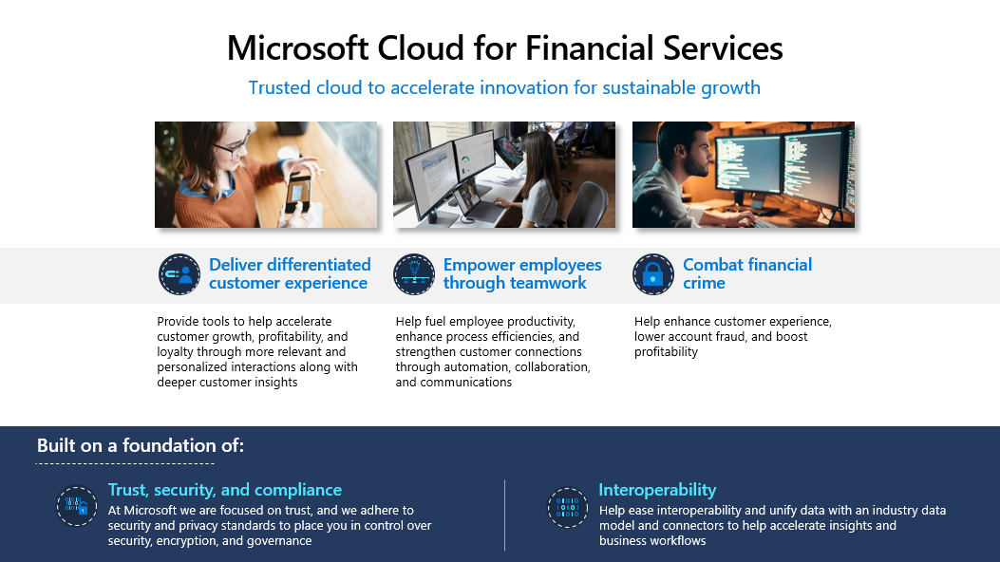
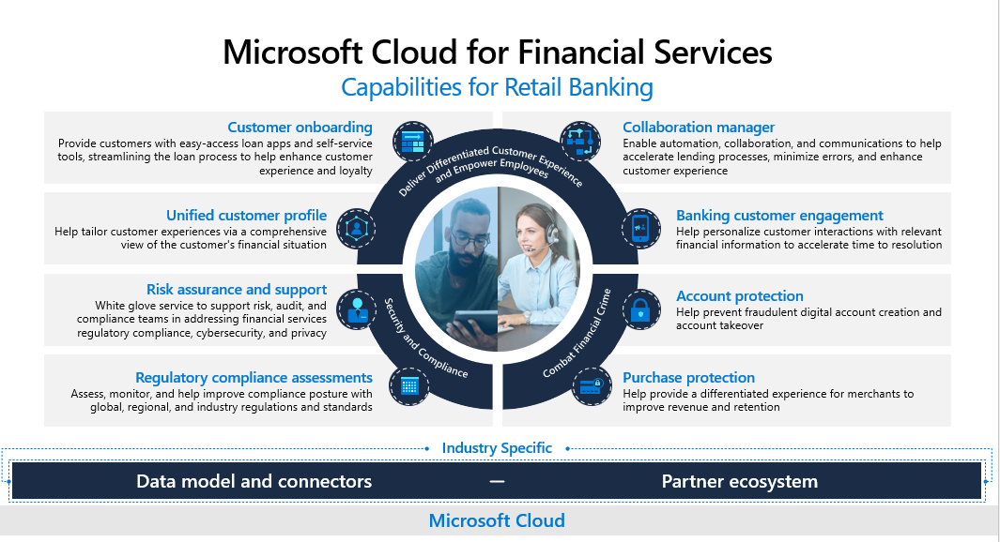

The COVID-19 pandemic was a catalyst for change and shifting business priorities in the financial services sector. Top of mind today is the way that the pandemic has shifted the industry.

> [!div class="mx-imgBorder"]
> 

Today, the disruption from Covid and multiple macro-economic trends is driving Financial industry players to support with the following:

-   **Customer engagement**: Customers are using digital engagement channels more than ever. This rise in adoption of digital during the pandemic has driven financial services organizations to expedite their digital transformation agendas. In a recent Celent global research, 75% of bank respondents have seen budgets grow for digital banking enhancements for self-service and assisted channels. Digital-forward financial services institutions are leading the way when it comes to investing in digital experiences for high-value offerings such as lending.

-   **Employee experience**: The pandemic swings have spurred the need to be flexible to adapt to changing work patterns. While financial services institutions have embraced digital tools for communications and collaboration, we hear there is more needed to help employees, especially those in the front office-serving customers, become successful in their roles.

-   **Value creation:** Global interest rates hovering near zero pressures profitability with inflation as a concern. Banks, insurers, and other financial services organizations are looking for opportunities to unlock value creation for long-term benefits and to lead with differentiation.

-   **Fraud protection**: In 2020, there were 393,207 reports of credit card fraud in the US. Account and purchase fraud not only affect consumers but also adversely impact the credibility and reputation of financial institutions. With fraud on the rise, many are looking for new approaches to fraud protection.

-   **Security and compliance:** The industry is experiencing a level of regulatory scrutiny that is unprecedented in its intensity. Financial institutions that best manage their regulatory and compliance data will be on a path to stronger risk management and improved operational efficiency. 

> As a result, banks are looking for a new approach to pave the way for the future. With these priorities in mind, banks are prioritizing cloud services to drive digital transformation because of the ability to speed up deployment, lower complexity, and manage upfront investment.

## Priority Financial Services scenarios

In response to industry's focus on Cloud Services, Microsoft has prioritized developing services specific to the industry. Microsoft Cloud for Financial Services, built on a foundation of privacy, security, and regulatory compliance across Microsoft and the partner ecosystem.

> [!div class="mx-imgBorder"]
> 

As with all Microsoft's offerings, here we're focused on trust, and we adhere to security and privacy standards to enable the controls needed over security, encryption, and governance.

Built on this essential foundation, the Cloud for Financial Services helps manage data to deliver three main scenarios, namely **delivering** **differentiated experiences, empower employees, and combatting financial crime**. These priority scenarios are highlighted by Microsoft Cloud for Financial Services in the following ways:

-   **Delivering differentiated customer experiences:** We provide tools to help accelerate customer growth, profitability, and loyalty through more relevant and personalized interactions along with deeper customer insights.

-   **Empowering employees through teamwork:** We help fuel employee productivity, enhance process efficiencies, and strengthen customer connections through automation, collaboration, and communications.

-   **Combatting financial crime:** With this, we help enhance customer experience, lower account fraud, and boost profitability

## Featured Financial Services capabilities

There are eight capabilities enabled through the three prioritized scenarios as depicted below:

> [!div class="mx-imgBorder"]
> 

The eight capabilities are described below:

-   **Delivering differentiated customer experiences and employee empowerment**

    1.  **Unified Customer Profile**: With this capability, employees have a comprehensive view of the customer, which helps them tailor customer experiences.

    1.  **Customer Onboarding:** provides customers with easy-access loan apps and self-service tools, streamlining the loan process to help enhance customer experience and loyalty.

    1.  **Collaboration manager:** enables automation, collaboration, and communications to help accelerate lending processes, minimize errors, and enhance customer experience.

    1.  **Banking customer engagement:** enables personalized customer interactions with relevant financial information to accelerate time to resolution.

-   **Combatting financial crime**

    1.  **Account Protection:** helps prevent fraudulent digital account creation and account takeover.

    1.  **Purchase Protection:** helps provide a differentiated experience for merchants to improve revenue and retention.

-   **Security and compliance**

    1.  **Regulatory Compliance assessments**: this capability enables to assess, monitor, and help improve compliance posture with global, regional, and industry regulations and standards.

    1.  **Risk assurance and support:** a white glove service to support risk, audit, and compliance teams in addressing financial services regulatory compliance, cybersecurity, and privacy.

All of these capabilities are built on a few key foundational elements that are tailored to the financial service industry. The first is **data model and connectors**. This is what enables the connection between Microsoft Cloud for Financial Services capabilities and the financial institution's data and ensures interoperability of solutions with financial institution's solutions and partner solutions. Secondly, Microsoft's extensive **ecosystem of partners** extends the cloud's capabilities even further, ensuring fit for need solutions. All of these are built on the trusted, secure, and compliant **Microsoft Cloud**.
