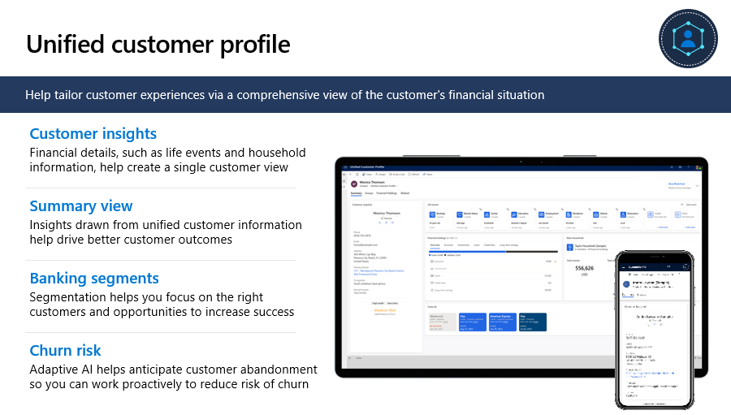
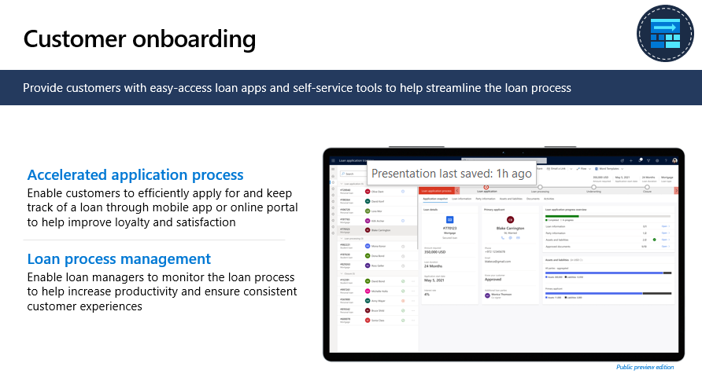
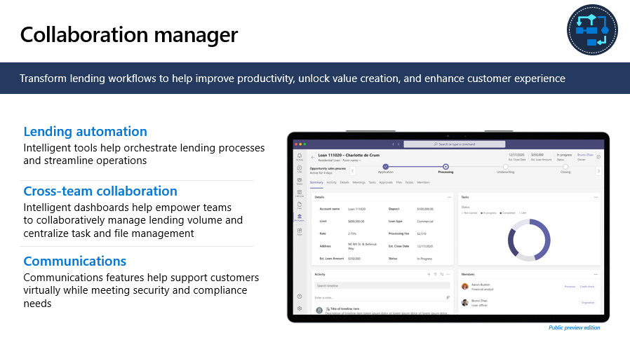
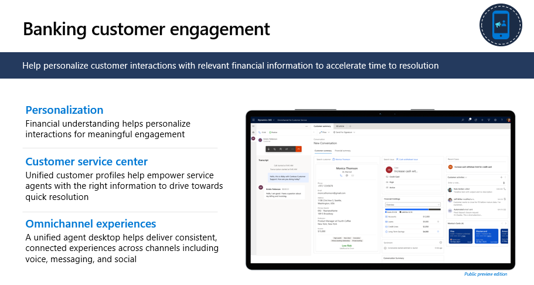

There are three major capabilities that fall under Delivering differentiated customer experiences and empowering employees: unified customer profile, customer onboarding and collaboration manager, and banking customer engagement.

## Unified customer profile

This capability helps tailor customer experiences with a comprehensive view of the customer's financial situation and preferences.

> [!div class="mx-imgBorder"]
> 

With a unified customer profile, banks can take advantage of cross-sell/up-sell opportunities, helping to increase customer lifetime value and loyalty.

The core functional capabilities include:

-   **Customer Insights:** Financial details such as life events and household information come together to help create a single customer view. This is accomplished with the help of Customer Insights, Microsoft's customer data platform, which helps connect tools across your bank using a wide range of connectors. It has the functionality to mix, match, and merge to help unify customer information across these tools. It also allows to add AI models for data enrichment.

-   **Summary view:** This capability helps capture a single, unified yet intuitive view of the customer's financial situation to quickly know customers and personalize their experiences.

-   **Banking segments:** By segmenting customers into groups that share similar values, financial standing etc., this capability helps the banks focus on the right customers and opportunities to increase success.

-   **Churn risk:** Adaptive AI helps the banks comprehend the customer's likelihood to churn to inform decisions, empowering agents to take preemptive actions and reduce risk of churn.

## Customer onboarding

Customer onboarding capabilities provide customers with easy-access loan apps and self-service tools to help streamline the loan process and enhance customer experience and loyalty while increasing organizational and employee productivity.

> [!div class="mx-imgBorder"]
> 

The following are the Customer onboarding capabilities:

-   **Accelerated application process:** Helps Improve loyalty and satisfaction by enabling customers to efficiently apply for and keep track of a loan through mobile app or online portal

-   **Loan process management:** Helps increase productivity and ensure consistent customer experiences by enabling loan managers to monitor the loan process

## Collaboration manager

Collaboration manager is designed to help banks seamlessly bring collaboration into their lending workflows, improving process orchestration from front office to back office, and facilitating omnichannel communications with customers. Collaboration manager helps improve organization and employee productivity, unlock value creation, and enhance customer experience.

> [!div class="mx-imgBorder"]
> 

Collaboration Manager has the following capabilities:

-   **Lending automation:** Intelligent tools help orchestrate lending processes and streamline automation. They aggregate data from existing systems using pre-built connectors and you can customize using low- and pro-code tools

-   **Cross team collaboration:** Intelligent dashboards help empower teams to collaboratively manage lending volume and centralize task and file management to enhance productivity

-   **Communications:** Communications features help support customers virtually while meeting security and compliance needs

## Banking customer engagement

With our banking customer engagement capabilities, we help Banks personalize customer interactions. Employees are empowered with deep customer understanding to engage with customers on their preferred channel in a meaningful way, while intelligently managing their journeys across channels, to reduce churn and time to resolution.

> [!div class="mx-imgBorder"]
> 

Here are a few key features that enable banks to seamlessly manage the full customer interaction journey:

-   **Personalization:** Help personalize interactions with financial understanding for meaningful engagement

-   **Customer service center:** Help empower service agents with the right information to drive towards quick resolution

-   **Omnichannel experiences:** Help reduce churn by facilitating a personalized and continuous experience across channels (including voice, chat, SMS, Facebook Messenger, WhatsApp, WeChat, Twitter DM, and Line)

