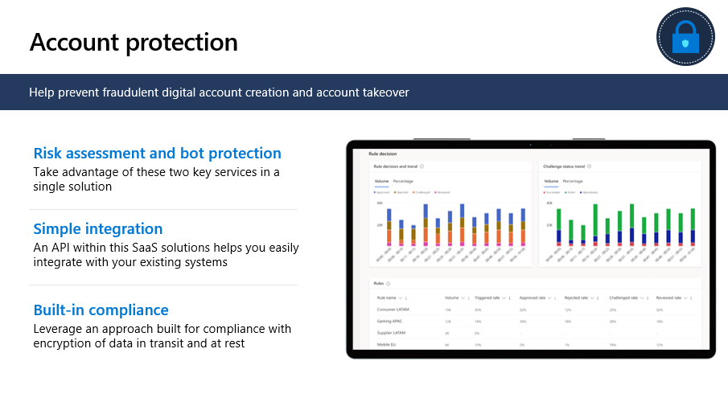
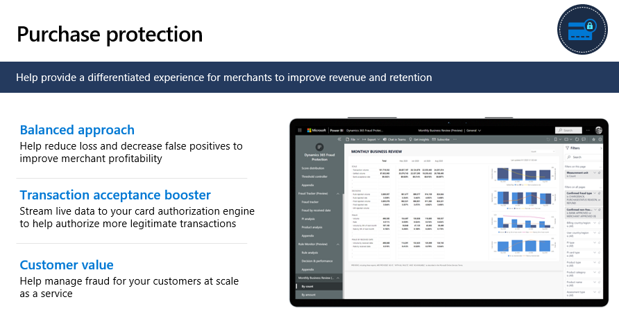

Two major capabilities that fall under the **combatting financial crime** priority scenario are:

- Account protection at the digital identity and account level 

- Purchase protection for merchant transactions

## Account protection

The Account protection capability provides protection at the digital identity account layer, helping to identify and prevent fraud at digital account creation. Essentially, it prevents bad actors from creating digital accounts and at digital account sign-in.

> [!div class="mx-imgBorder"]
> 

-   This solution rolls together risk assessment and bot protection so that everything is in one place rather than point solutions.

-   Account protection is simple to integrate with existing systems, helping to reduce time and effort.

-   Account protection is built for compliance. Data is encrypted in transit and at rest and de-identified on its way into the network.

## Purchase protection

Purchase protection capabilities provide a differentiated experience for merchants to improve revenue and retention.

> [!div class="mx-imgBorder"]
> 

-   A hallmark of purchase protection is a balanced approach. The focus is on helping to reduce loss and on decreasing false positives.

-   Purchase protection offers a **Transaction acceptance booster**, which helps you authorize more legitimate transactions by streaming real-time risk data to the merchant's card authorization engine.

-   Purchase protection increases value for customers. This capability offers effective fraud protection as a service to the merchant's customers at scale, helping to increase profitability and customer satisfaction.
