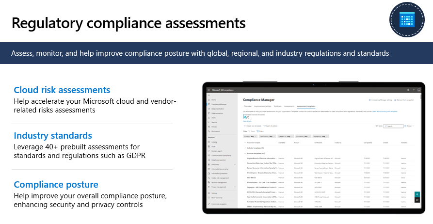
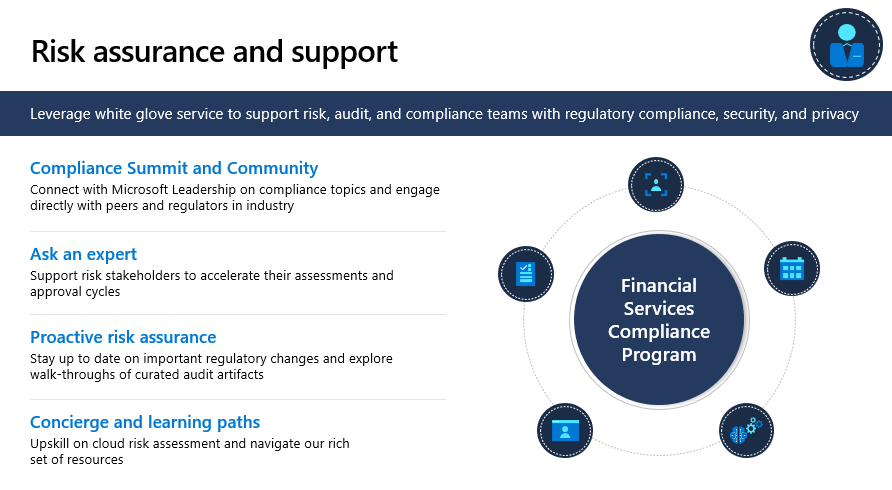

There are two core capabilities that fall under Security and Compliance. Those are Regulatory compliance assessments to assess, monitor, and improve a financial institution's compliance posture and the other, a white glove service Risk assurance and support program that is tailored for customers.

## Regulatory compliance assessments

Regulatory compliance assessments enable customers to assess, monitor, and help improve compliance posture with global, regional, and industry regulations and standards.

> [!div class="mx-imgBorder"]
> 

This capability provides the following:

-   Speed up cloud risk assessments: Help accelerate your Microsoft cloud and vendor-related risks assessments

-   Align with industry standards: Use 40+ pre-built assessments for standards and regulations

-   Optimize for better compliance: Help improve your overall compliance posture, enhancing security and privacy controls

## Risk assurance and support

Microsoft has a track record of nearly 10 years of deep engagements with worldwide regulators and customers addressing regulatory compliance topics that are of strategic importance to the industry.

The Risk assurance and support compliance program provide customers with a white glove service delivered through a dedicated team of industry, engineering, and legal and corporate affairs subject matter experts that broadly support your risks, audit, and compliance teams in addressing financial services regulatory compliance, cybersecurity, and privacy topics. The program both offers strategic support on how to best address regulatory challenges and helps to address any related topics in the greatest level of detail.

> [!div class="mx-imgBorder"]
> 

The program features:

-   **Compliance Summit and Community:** Engage and learn from peers in the industry and discuss directly with regulators trending issues around the use of cloud. We built a deep and trusted relationship with financial services regulators and have been organizing compliance summits with Microsoft leadership, regulators, and customers for nine years. Through summits, webinars, and other events you have an exclusive opportunity to engage directly with your peers in the industry and with regulators from over 50 countries worldwide.

-   **Ask an expert:** Support risk stakeholders including cybersecurity, legal, compliance, operational risk, and audit to accelerate their assessment and approval cycles around the use of Microsoft cloud services. Engage directly with Microsoft subject matter experts and get the best possible answers to compliance questions in great detail. Quickly identify the right documentation resource with their help. And submit risk assessments questionnaires to a team of Microsoft experts as needed.

-   **Proactive risk assurance:** Stay updated on regulatory changes and important changes to our Online Services. This includes walk-throughs of curated audit artifacts and sharing outcomes from audits.

-   **Concierge and learning paths:** Upskill on cloud risk assessment and navigate our rich set of documentation resources and compliance tools.
