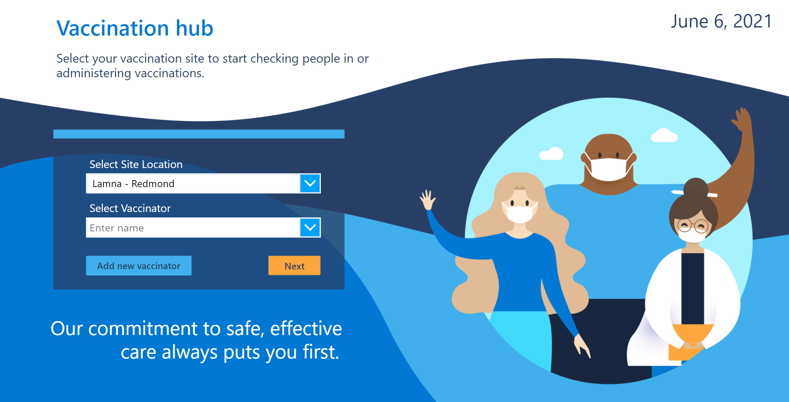
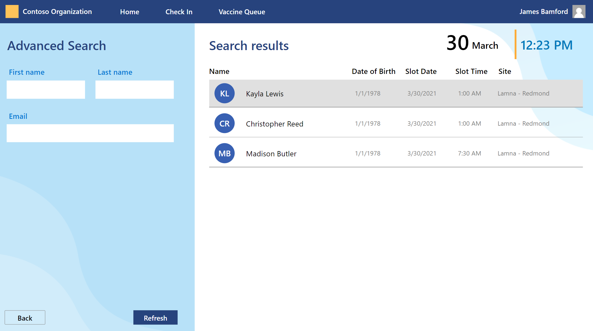
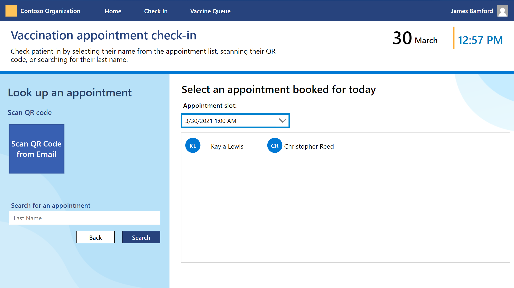
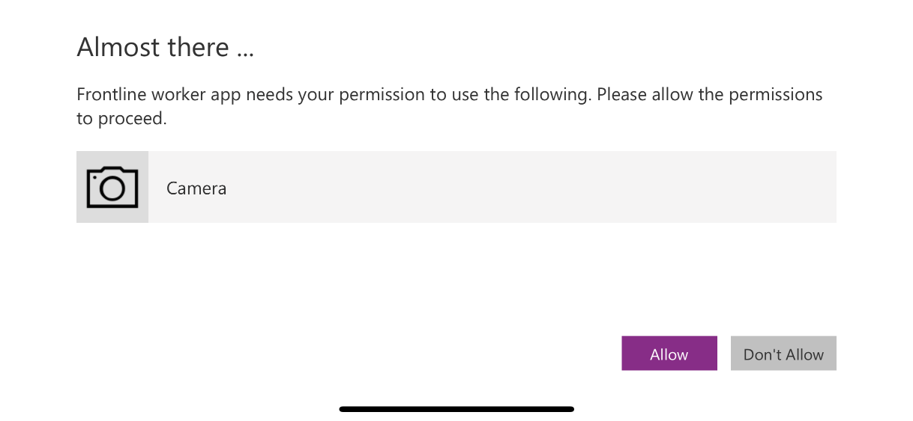
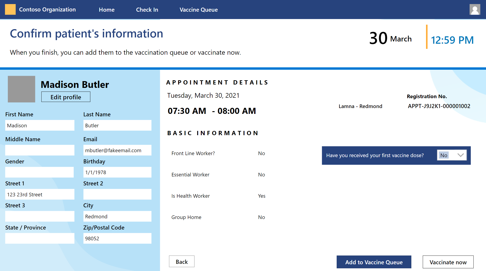
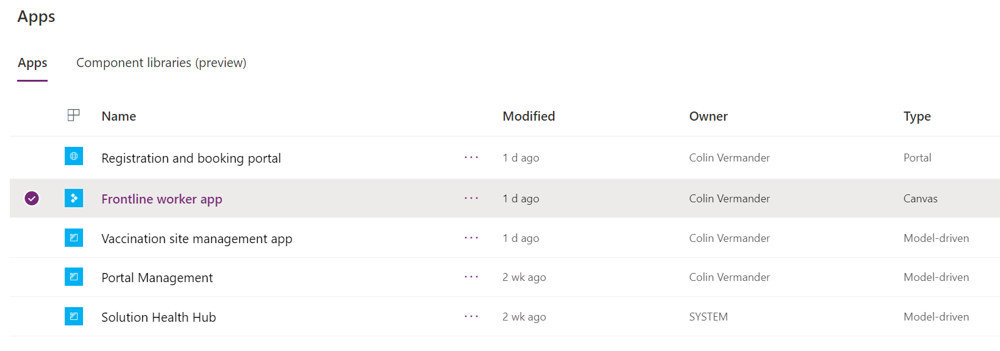
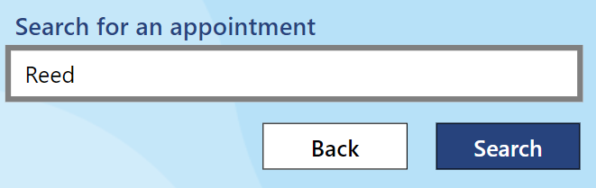
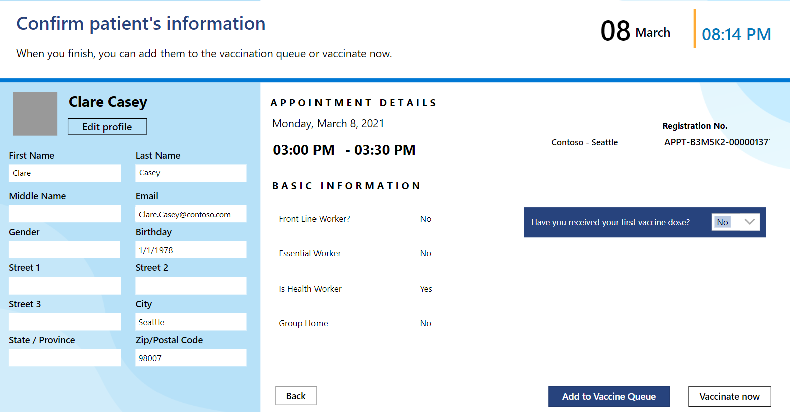

The Microsoft Vaccination Management Frontline worker app is a Power Apps canvas application designed for those who need to be on their feet. Microsoft Power Apps canvas applications are business applications that are built by dragging and dropping elements onto a canvas, just as you would design a slide in PowerPoint. You can then create Excel-like expressions for specifying logic and working with data. When ready, the app can be shared so that users can run it in a browser, a mobile device, or embedded in places like Microsoft Teams.

The Frontline worker app address several scenarios for vaccine site workers such as:

- Check in residents by scanning a QR code

- Check in residents by manually looking them up

- Administer and record vaccinations

In this exercise, you'll use two methods for checking in a resident: one by scanning a QR code, the other by manually looking them up in the Frontline worker app.

> [!Note]
> To complete this exercise, you must download the [Power Apps mobile app](https://powerapps.microsoft.com/downloads/?azure-portal=true) from either the Apple App Store or the Google Play Store.

- For **Apple** devices with iOS, such as an iPhone or iPad, use [**App store**](https://aka.ms/powerappsios/?azure-portal=true).

- For **Android** devices, use [**Google Play**](https://aka.ms/powerappsandroid/?azure-portal=true).

> [!div class="mx-imgBorder"]
> 

> [!div class="mx-imgBorder"]
> 

## Task 1: Check in a resident with a QR code

In this task, you'll check in one of the residents that you registered and booked in the previous set of exercises. You'll use a QR code to check in the resident with the Frontline worker app on your mobile device.

1. On your **mobile device**, open the **Power Apps** app that you downloaded from either the Apple App Store or the Google Play Store.

1. Sign in using the credentials supplied in the training for your user.

1. Find and open the **Frontline worker app.**

1. On your PC or Mac, open the email confirmation that you received after registering and booking **Madison Butler** in the previous set of exercises and scroll down to the **QR code.**

1. In the Frontline worker App, look up an appointment by selecting the **Scan QR code from Email** button.

    > [!div class="mx-imgBorder"]
    > 

    > [!Note]
    > You'll need to grant the Frontline worker app permission to use the camera on your mobile device to complete this task.

    > [!div class="mx-imgBorder"]
    > 

1. At this point, you can add the resident to the Vaccine Queue or have them go directly to a vaccination booth. In this instance, we'll add the resident to the Vaccine Queue.

    > [!div class="mx-imgBorder"]
    > 

1. Stop here. You'll record the vaccination details for this resident in the next exercise.

## Task 2: Check in a Resident by manually looking them up

In this task, you'll check in another one of the residents that you registered and booked in the previous set of exercises. To accomplish this task, you'll look up the resident with the Frontline worker app in your internet browser.

1. Navigate to [Power Apps](https://make.powerapps.com/?azure-portal=true). (We recommend using an Incognito or InPrivate session.)

1. Sign in using the credentials supplied in the training for your user.

1. Select the correct environment from the upper right **Environment** drop-down.

    > [!div class="mx-imgBorder"]
    > 

1. Select **Apps** on the left navigation bar.

1. Find the Frontline worker app and select the app name.

    > [!div class="mx-imgBorder"]
    > 

1. Select your **Vaccinator** and select **Next**.

    > [!div class="mx-imgBorder"]
    > 

1. Search for the **Christopher Reed** appointment that you created in the previous set of exercises by typing in **the last name** into the "Search for appointment" text box. Select **Search**

    > [!div class="mx-imgBorder"]
    > 

1. At this point, you can add the resident to the Vaccine Queue or have them go directly to a vaccination booth. In this instance, we'll add the resident to the **Vaccine Queue.**

    > [!div class="mx-imgBorder"]
    > 

1. Stop here. You'll record the vaccination details for this resident in the next exercise.
