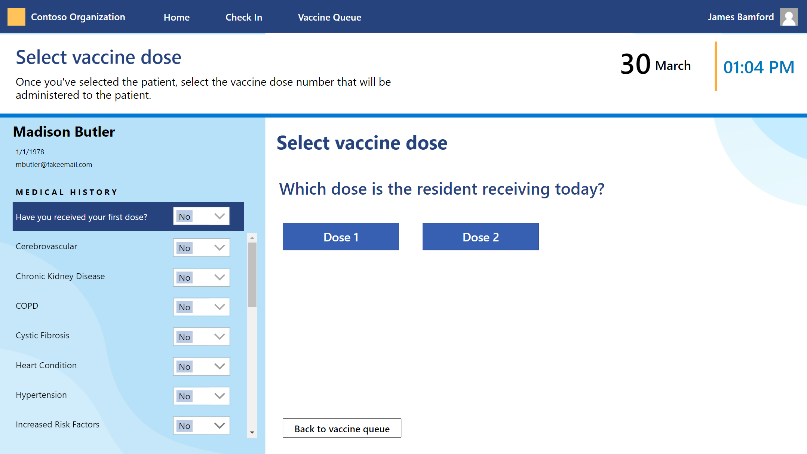
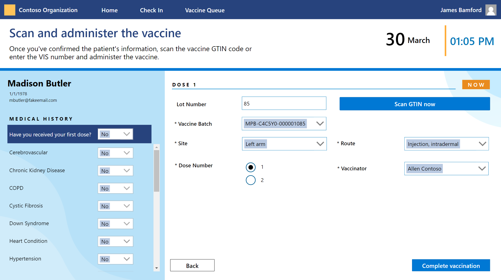
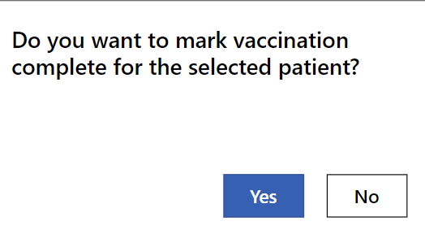
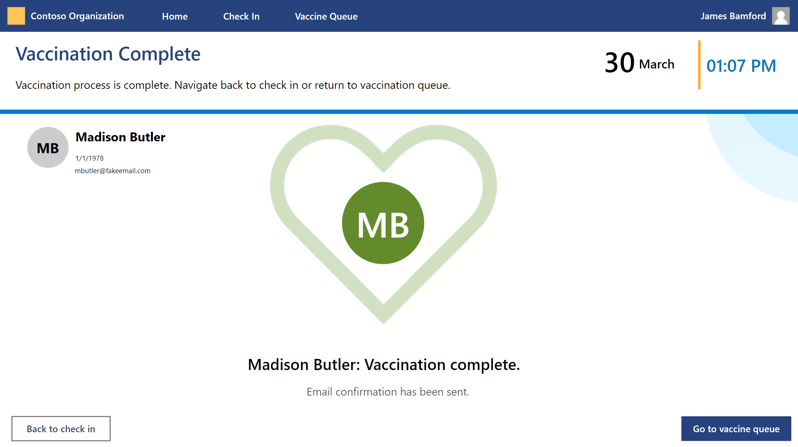
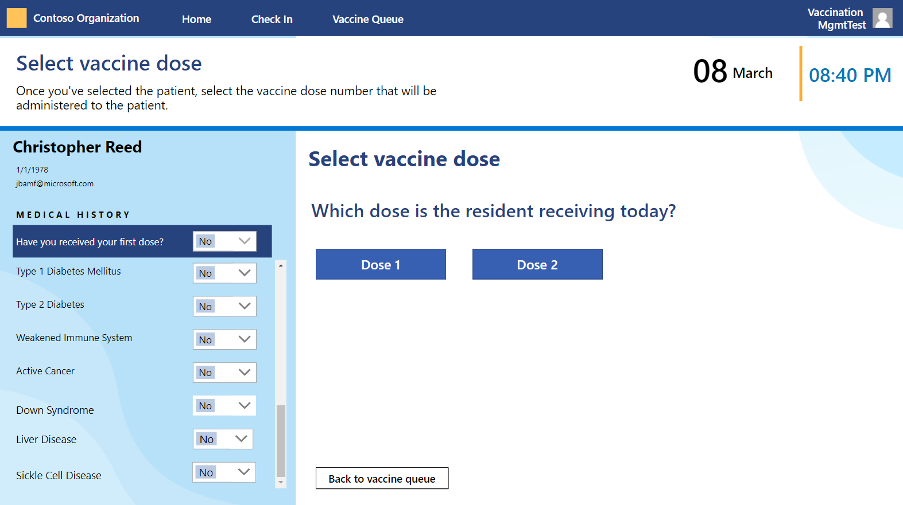
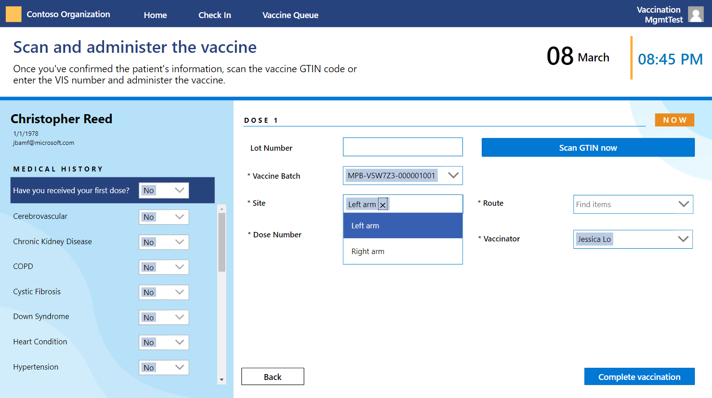

In this exercise, you'll record the vaccination details for the two residents that you checked in in the previous exercise using the Frontline worker app on your mobile device and in your internet browser.

## Task 1: Record vaccination details in the Frontline worker app on your mobile device

In this task, you'll record the vaccination details for the appointment you scheduled in the previous set of exercises and schedule the resident for their second dose.

1. On your mobile device, open the first appointment in the Frontline worker app that you found using the QR code.

1. Select **Dose 1**.

    > [!div class="mx-imgBorder"]
    > 

1. Select either **Left Arm** or **Right Arm** as the Site for the shot. Select **Injection, intradermal** as the Route. Complete the vaccination and then select **Yes**.

    > [!div class="mx-imgBorder"]
    > 

    > [!div class="mx-imgBorder"]
    > 

1. View the completion screen and notice that an email confirmation has been sent to the resident.

    > [!div class="mx-imgBorder"]
    > 

**Congratulations!** You completed a vaccination using the Frontline worker app on a mobile device.

## Task 2: Record vaccination details in the Frontline worker app in your internet browser

In this task, you'll record the vaccination details for Mr. Smith and schedule him for his second dose.

1. In your internet browser, open the other appointment in the Frontline worker app.

1. Select **Dose 1**.

    > [!div class="mx-imgBorder"]
    > 

1. Select either **Left Arm** or **Right Arm** as the site for the shot. Select **Injection, intradermal** as the Route. Complete the vaccination and then select **Yes**.

    > [!div class="mx-imgBorder"]
    > 

    > [!div class="mx-imgBorder"]
    > 

1. View the completion screen and notice that an email confirmation has been sent to the resident.

    > [!div class="mx-imgBorder"]
    > 

**Congratulations!** You completed a vaccination using the Frontline worker app using a web browser.
