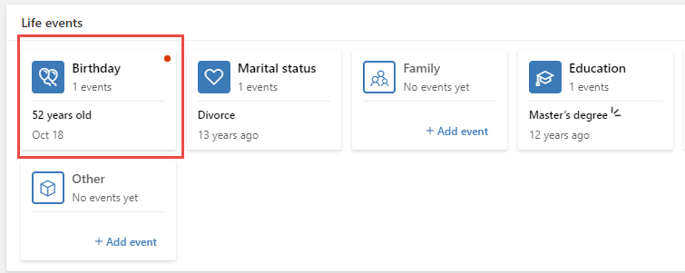
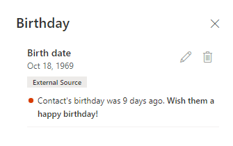
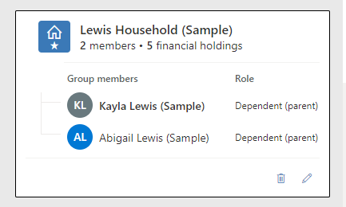
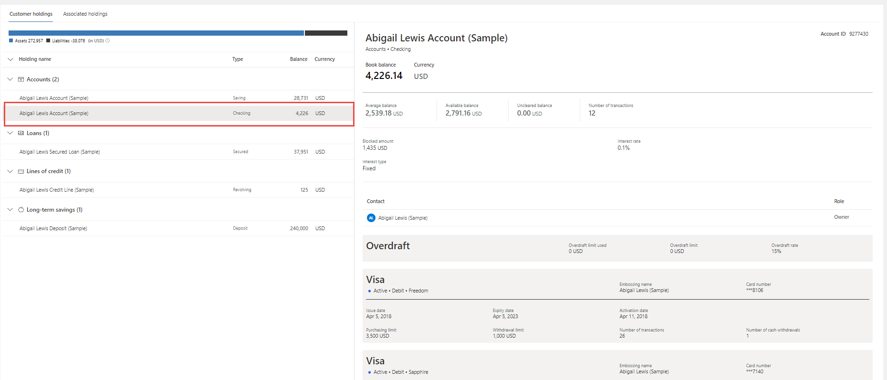

Knowing key information about your customers when you need it is key to offering a seamless experience for your customer across business lines and building a deeper relationship with them. With the Unified Customer Profile, you can view a 360-degree perspective of the customer in a clear and intuitive way. See the most relevant information across multiple business lines, consolidated into a unified dashboard that offers an accurate, consistent, and cohesive source of truth about the customer. Apply the information to provide personalized experiences, reveal important opportunities, prevent potential loss, or churn, and improve customer satisfaction. By tracking life events, you might know they just had a birthday or received a promotion and then offer them congratulations the next time you speak.

Key areas of unified customer profile include:

**Summary**: View an at-a-glance summary of the customer, their personal details, life moments, financial holdings, and credit and debit cards.

**Connections**: View the groups that the customer is a part of, understanding the overall financial strength for each group (such as householding). Create group records, associate customer records with groups, update general information and financial holdings relevant to the group. Easily capture relationships between contacts based on an expandable option set.

**Financial holdings**: View detailed information about all the financial holdings associated with the customer.

This video contains a demonstration of how users might use the Unified Customer Profile to better know their customer.

> [!VIDEO https://www.microsoft.com/videoplayer/embed/]

## Using the application

The Summary tab contains easy to consume pieces of information highlighting the details about your customer.

**Customer snapshot:** The snapshot of the customer shows personal information (for example, name, demographics, and branch information), financial information (financial measures, regular income), and the preferred channel of communication. The Customer snapshot area can be enriched with customer intelligence-driven information like segments and churn score.

**Life events:** The Life events area provides insight into the customer and their family's past and future life milestones. This area can help identify upcoming opportunities, devise personalized offers, and provide a consistent engagement experience. Each category in the Life events area, such as Marital Status, can include multiple life event entries. These items can also be edited as needed.

> [!div class="mx-imgBorder"]
> 

Users will see a notification on relevant events such as a recent birthday. This allows you to wish a happy birthday and continue to build upon the relationship.

> [!div class="mx-imgBorder"]
> 

**Financial holdings**: The financial holdings area on the summary tab provides an at-a-glance view of the customer's relationship with the bank, showing wallet share, assets and liabilities, and other aspects of the customer's holdings with the bank.

**Cards:** The Cards area shows the credit and debit cards held by the customer. It can be enriched with insights such as alerts on expiring cards and cards pending activation. Information on cards can also be viewed on the financial holdings tab, in the Credit Lines or Accounts section. There, you can view the credit cards associated with the specific credit line or debit cards associated with an account.

The Connections tab offers an at-a-glance view of the groups that the customer belongs to, such as a household. The Connections tab also provides a comprehensive view of all the groups the customer is a part of, including other households and other groups, and their relationships to other customers.

> [!div class="mx-imgBorder"]
> 

-   **All the groups the customer is a part of**: The customer's main household is selected by default. Other group members, and the customer's role in the group, are visible.

-   **Selected customer group:** The information shows address (which is derived from the group's primary member's address), total income, total assets, total liabilities (converted to the system's default currency), and the shared financial holdings of that group.

-   **Relationships:** Information on relationships between a customer and other contacts, which covers family and professional relationships. The system supports many different types of relationships including family (parent, child, siblings, extended family), professional (lawyer, accountant), and financial (power of attorney). The list of possible relationship types between two contacts is configurable by an administrator.

The Financial holdings tab expands upon what was seen in the summary view described above.

The overview tab in the financial holdings area provides high-level information on the customer's financial holdings. The default selection is an overview of the customer's assets and liabilities, including relevant alert indicators on the right of the area. Hover over an indicator to view the indicator message. The other tabs offer a summary view of other financial holdings, such as accounts, investments, loans, credit lines, and long-term savings.

When an item is selected on the left, you will then see details of that item on the right.

> [!div class="mx-imgBorder"]
> 

## Deployment considerations

Unified customer profile allows you to bring together the data from your core banking systems into a single place for an all-up view of your customer and their business with your organization. As a model-driven Power App, Unified Customer Profile can be further customized to meet your organization's specific requirements.

### Working with multiple currencies

Customers might have financial relationships with the bank (financial holdings and financial instruments) in the default currency of the organization and in other currencies.

Unified customer profile within Microsoft Cloud for Financial Services allows sophisticated treatment of multi-currency holdings. For each financial holding, a different currency may be passed from the bank's core systems. The total balance of a financial holding (if different than the default currency of the system) is shown both in the original currency of the holding and converted to the default currency of the system. The conversion is based on the financial holding's exchange rate terms and conditions. Currency presentation follows the ISO 4217 standard.

In the example above, the sample account is in Euros, whereas the default currency of the system is US dollars. For the total balance, the converted amount is shown in the default currency.

Where assets or liabilities are summed up (in the Summary view of financial holdings, Groups financial holdings, and in total customer assets and liabilities), the sum is calculated based on the value of each holding in the default currency of the organization.

> [!NOTE]
> Both the original and converted financial holding values are passed from the bank's core systems, rather than being converted within Unified Customer Profile.

