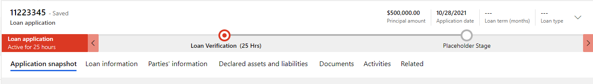
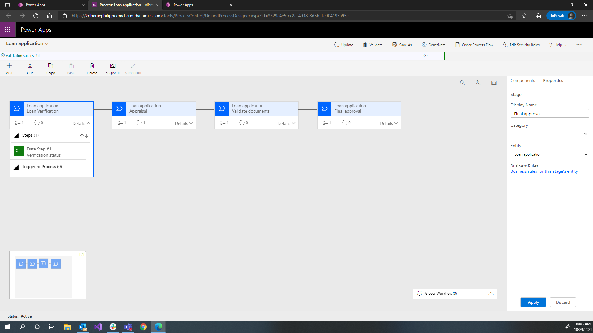
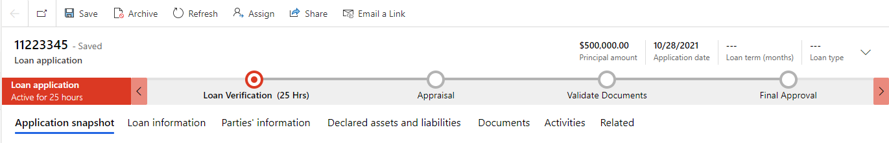
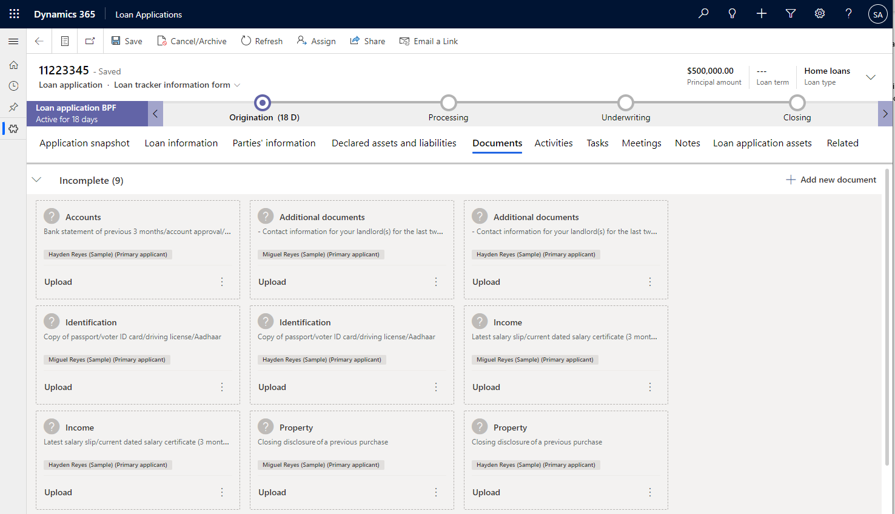
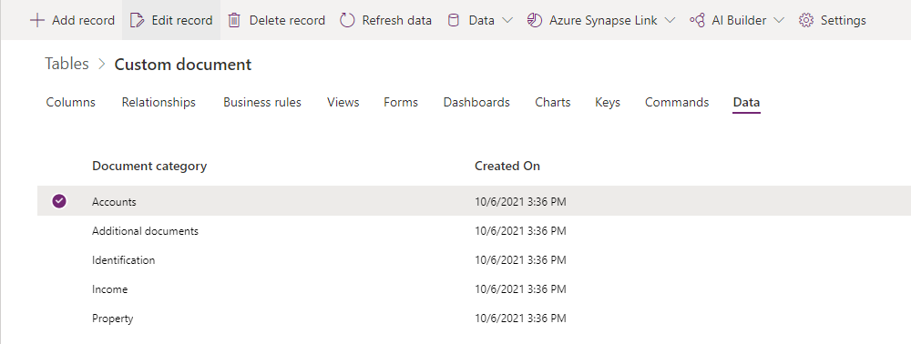
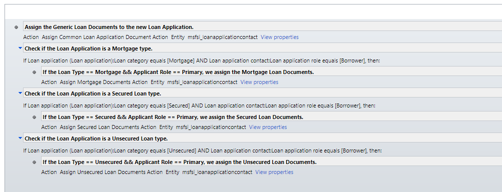
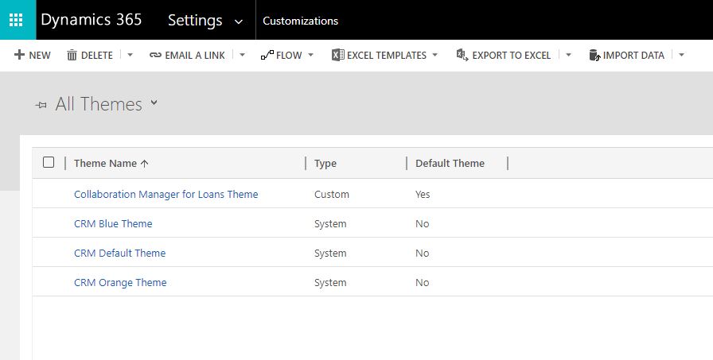

Customer onboarding from the time they apply for a loan to tracking the loan progress can be a key differentiator between financial organizations. By streamlining the customer onboarding experience and offering self-service tools through mobile apps and portals and enabling relationship managers to monitor the loan process customers can efficiently apply for and keep track of a loan. The automated pipeline helps review and validate application information and keep the loan application on track for a successful close. Relationship managers can monitor the loan process and ensure consistent, reliable customer experiences.

As part of the Retail Banking solutions, Dynamics 365 provides a loan tracker. Loan tracker helps the relationship manager to manage, verify, and track the loan application.

The loan tracker application contains the relevant information for the loan application, including information about the loan amount, the loan duration, interest rate, and personal and financial details.

Key capabilities of loan tracker include:

**Application Queue:** Allows the relationship manager to see at a glance where loan applications are in their pipeline. They can easily select applications and manage work as a team with others in the process.

**Business process flow:** Track where an individual loan is in your overall loan process and management of collecting information needed to process the loan application. Allows for tailoring to simple to complex loan processes.

**Application Snapshot:** A snapshot for the loan manager that presents a summary of the loan application including "to do" issues that are related to missing information. The snapshot contains key loan information highlights, primary applicant information and a progress tracker to visualize the current status of the application.

**Personal and financial information:** Relevant information, which related to the applicant, which includes personal details, first name, last name, address, email and more. Financial details including the loan details and the financial details such as assets and liabilities, collaterals, employment status and more.

**Documents management:** An ability to view and manage approved or rejected documents with an ability to require the relevant documents per type of loan.

**Activities:** An option to view and trace all activities related to the application including emails, appointments, phone calls and more.

**Related:** A dynamic default tab, which contains quick access to internal entities within the loan tracking application.

In this video, you will see how the users of the app will work with the Loan Application and its associated details.

> [!VIDEO https://www.microsoft.com/videoplayer/embed/]

Organizations may choose to deploy a self-service portal. The loan onboarding sample portal is also part of Microsoft Cloud for Financial Services. It allows customers or potential customers to go through the loan application process.

The sample portal allows the applicant to pick the relevant type of loan and continue through a workflow that collects the relevant information for the application:

-   Information about the loan

-   The applicant's personal and financial information, including assets and liabilities

-   An option to add parties to the application and the relevant information for any other parties

The sample portal allows you to upload documents according to the type of loan as defined in advance by the bank. The sample portal contains a page that allows the applicant to view the status of the application, including any alerts for missing details or documents. The page also lets the applicant upload any missing document.

To learn more about deploying and customizing a self-service portal visit this [Microsoft Learn Learning Path.](/learn/paths/work-power-apps-portals/?azure-portal=true)

## Deployment considerations

As you configure the solution and prepare it for your users, you will need to set up a few things so they meet your specific business needs.

### Configure the business process flow

The system will deploy a business process flow that requires configuration. This allows you to customize the system to match your established loan process. You will add stages to help guide your users along a defined path and reduce errors and redundancies.

The business process flow is installed with a placeholder stage so you can configure it specifically for your business needs.

> [!div class="mx-imgBorder"]
> 

As a maker, you will configure the business process flow with the stages and steps of your business.

> [!div class="mx-imgBorder"]
> 

Users of the Loan Application app will then use the custom process defined by you during initial setup.

> [!div class="mx-imgBorder"]
> 

### Define required documents for loan applications

During the loan application process, the applicants will be asked to provide verification for specific details. You may need to view and save reference copies of documents such as proof of job and pay, current assets or liabilities statements, marriage papers, and more. You may require documents from all applicants and cosigners. You can create the document requests with types and the targeted applicant.

> [!div class="mx-imgBorder"]
> 

To create specific documents for your business, or edit those that are created for you, navigate to the data records in Microsoft Dataverse and make the necessary additions and edits.

> [!div class="mx-imgBorder"]
> 

### Configure workflow for documents

The system will create a workflow for handling of documents. When you create your own required documents, you will need to edit the workflow to process the new documents according to your organization's specific policies and needs.

> [!div class="mx-imgBorder"]
> 

### Adding branding or theming

All model-driven Power Apps allow makers to apply themes to certain elements in the user interface. This allows your end users to quickly identify your own brand colors, logos, and more. To apply a theme, navigate to Advanced Settings to define and apply the theme. To learn more about theming, visit [Microsoft docs](/powerapps/maker/model-driven-apps/create-themes-organization-branding/?azure-portal=true).

> [!div class="mx-imgBorder"]
> 
