The Healthcare solution is composed of apps (Patient Service Center, Patient Access, Care Management, and Home Health) that all work from the Common Data Service. The Healthcare solution uses a Common Data Model that is built on the HL7 FHIR standard. The data can be integrated with existing medical record systems using the Azure FHIR integration.

### Patient Service Center

The Patient Service Center is the Dynamics 365 Omnichannel for Customer Service app that is configured to enable healthcare administrators and healthcare call center agents to engage effectively with patients.

[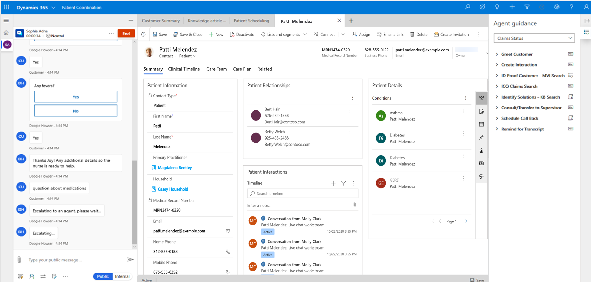])../media/1-service-center.png#lightbox)

The Patient Service Center will provide the following tools to assist healthcare agents with their interactions with patients:

-   Access to patient information

-   Ability to engage with patients using chat, SMS, video conferencing, and IVR

-   Provide agents with context, scripts, and workstreams for patient engagement

-   Access to relevant knowledge articles based on key phrases

-   Provide agent with summary of chatbot conversations and sentiment of the patient

-   Allow agents to schedule appointments for patients with available resources aligned to patient needs.

The information about the interactions will be stored in the Common Data Service and tracked against patient records. This information can be shared with existing medical records systems using the FHIR integration capabilities of the Healthcare solution.

Patients themselves will not have visibility to the Patient Service Center but will be able to interact with the healthcare administrators via other channels such as the Patient Access portal, telephone, or SMS messaging.

### Patient Access

Patient Access is a Power Apps Portal application to provide the following self-service capabilities to patients:

-   Search for healthcare practitioners

-   Schedule new appointments, review existing appointment details

-   View appointments made in other medical record systems in the Common Data Service via the FHIR integration

-   Review clinical data

-   Initiate a conversation with the Microsoft Health bot for medical information or to assist with booking appointments

-   Chat directly with live healthcare agents

-   Leave and view secure messages with healthcare practitioners.

Healthcare agents will interact and view patient information using the Patient Service Center.

[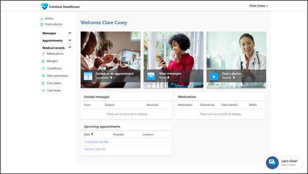])../media/2-service-center.png#lightbox)

The patient is required to have a patient record (contact) in the Healthcare solution and then be given access to the Patient Access portal (using a secure authentication mechanism). The patient will be able to update and manage their profile (contact information) in the portal.

### Find a doctor

The patient can search through a directory of available healthcare practitioners that lists the pertinent information such as location and contact information.

[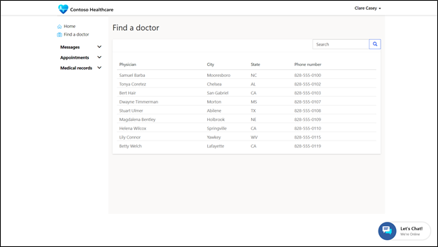])../media/3-find-doctor.png#lightbox)

### Messages

The messages area provides a place where a patient can send and receive secure messages from healthcare practitioners.

[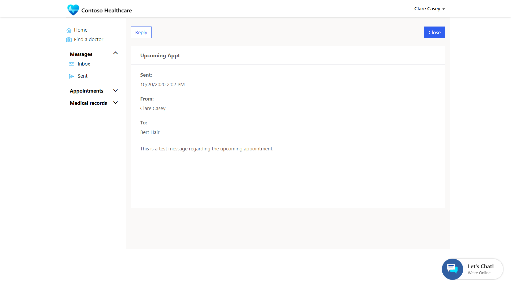])../media/4-find-appointment.png#lightbox)

### Appointments

A patient can view their upcoming and past appointments and schedule new appointments or modifications such as rescheduling or canceling an appointment. Appointments made in other systems may appear based on the FHIR integration.

[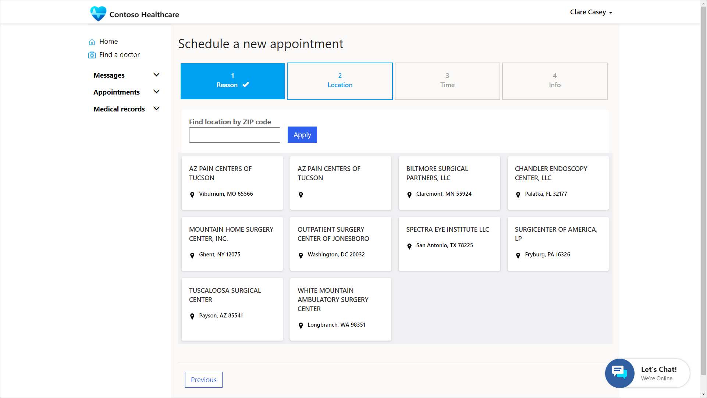])../media/5-schedule-appointment.png#lightbox)

### Medical records

The medical records area allows for patients to view medications, allergies, conditions, visit summaries, care plans, and care teams.

[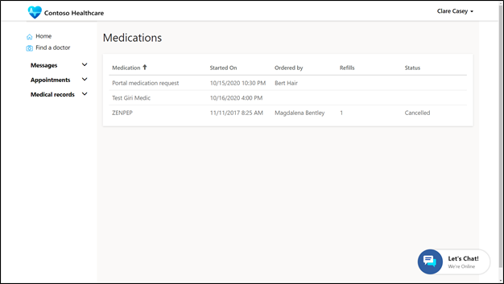])../media/6-medications.png#lightbox)

### Chat

The embedded chat capabilities allow a patient to initiate a chat. This session could begin with a bot but be transferred to a live healthcare agent to provide information or to schedule an appointment.

[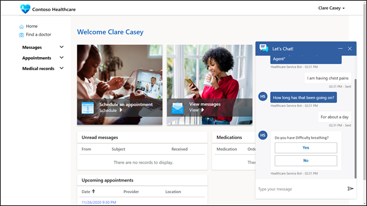])../media/7-chat.png#lightbox)

## Care Management

The Care Management feature of the Healthcare solution provides Healthcare practitioners with detailed information about patients and the ability to create and manage the care plans. The solution also allows for the coordination and management of care team members or related medical organizations.

[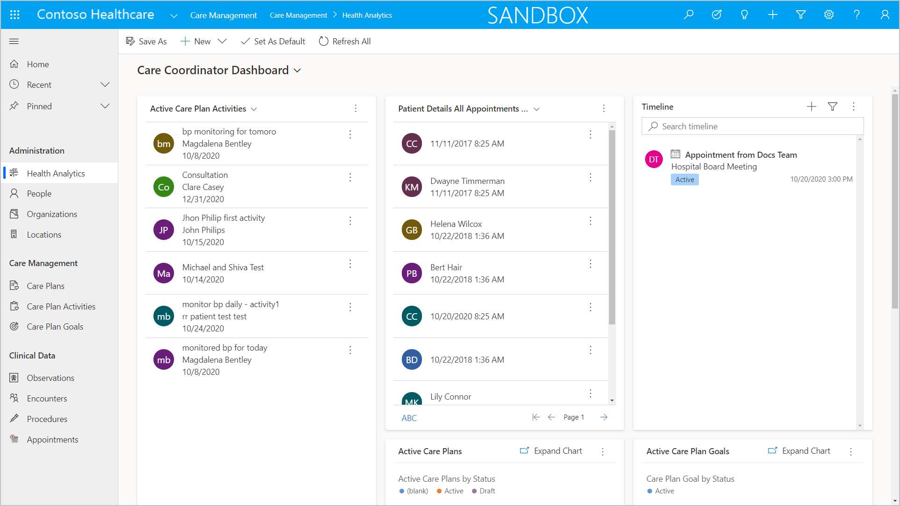])../media/8-care-management.png#lightbox)

The three key areas of the Care Management app are Administration, Care Plans, and Clinical Data.

### Administration

The Care Coordinator dashboard provides a view of active care plan activities, open appointments, and a consolidated timeline view. From the dashboard, care team members can focus on specific patient needs to make appropriate adjustments and plan their schedule.

Care team members can use the patient form to see a centralized view of all the patient information such as the assigned care team, care plans, appointments, and the patient's healthcare activity timeline. The structure of the patient data is based on the industry standard HL7 FHIR. Using the integration with the Azure FHIR service, practitioners can have extended visibility to patient data from other EMR systems.

[])../media/9-admin.png#lightbox)

The care management feature also allows administrators to view information about the practitioners, including the various care team participation as well as patient interactions and appointments. The app will also contain information about related medical organizations (for example, clinics, hospitals, health centers) and locations.

### Care plans

To manage a patient's medical condition, a practitioner can create individualized care plan for the patient. Key information such as the plan name, status, start, and end dates can be entered as well as assigning care plan teams and setting care plan goals.

Care plan activities can be created and tracked against the particular care plan to provide the details of the care plan for the patient.

[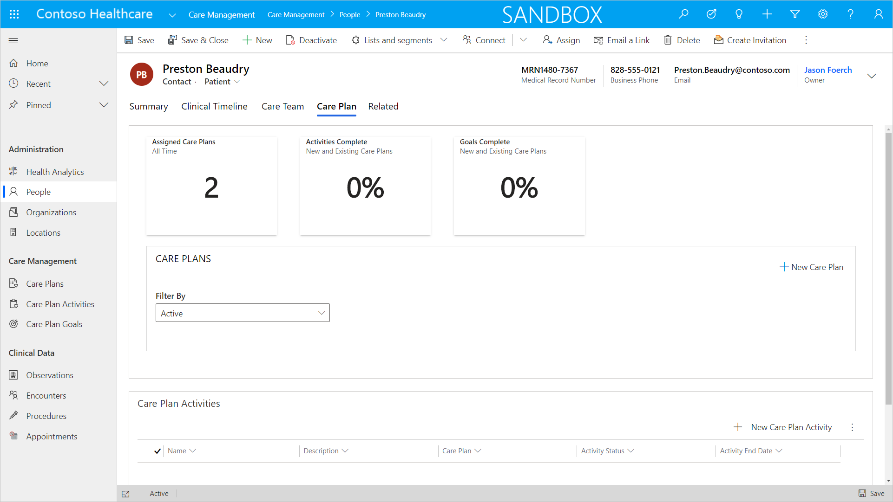])../media/10-care-plan.png#lightbox)

### Clinical data

The Clinical data section allows for medical practitioners to track observations, encounters, procedures, and appointments for patients. These entities map to the [HL7 FHIR standard](http://www.hl7.org/fhir/).

[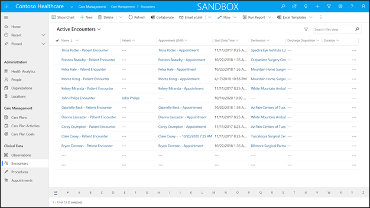])../media/11-clinical-data.png#lightbox)

## Home Health

The Home Health app provides administrators the ability to capture and monitor patient data as well as scheduling healthcare practitioner in-home patient visits.

### Analytics

The patient analytics dashboard provides practitioners with key information and vital statistics of a patient. Some of the key metrics tracked are heart rate, body temperature, and body weight. The care team will capture these data points during an in-home visit with the patient.

[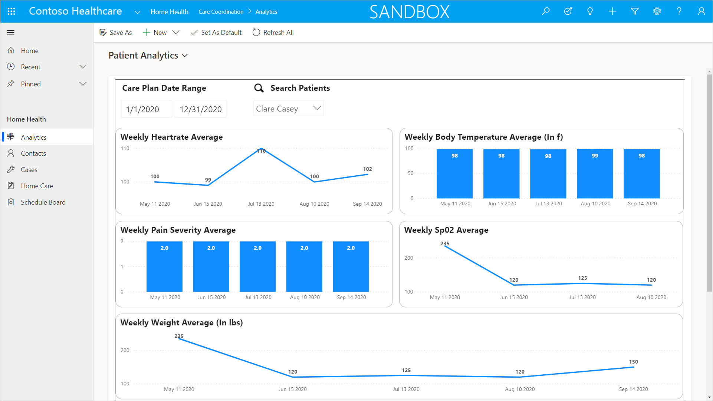])../media/12-analytics.png#lightbox)

The provider analytics dashboard provides administrators with an overview of care team member activity. Key metrics tracked are patients seen, care plans created and average wait time as well as other details.

[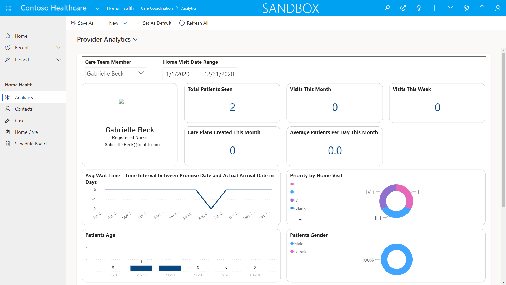])../media/13-provider-analytics.png#lightbox)

### Contacts

The contacts section contains information about home health patients as well as active home health care practitioners.

Home health care practitioners and administrators can use the patient form and see a centralized view of all the patient information such as the assigned care team, care plans, appointments, and the patient's healthcare activity timeline. The structure of the patient data is based on the industry standard HL7 FHIR. Using the integration with the Azure FHIR service, practitioners can have extended visibility to patient data from other EMR systems.

[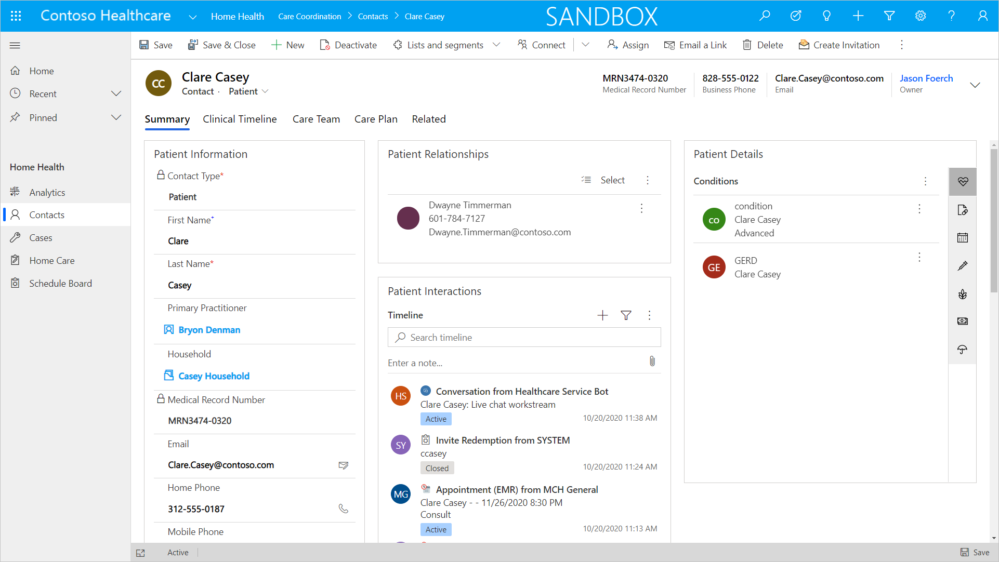])../media/14-contacts.png#lightbox)

The practitioner view provides profile information about practitioner as well as a timeline view of patient interactions.

### Cases

The cases view will show a list of cases related to patients that have been assigned to a home healthcare practitioner. Along with basic case information such as the patient and case type, the form will also surface the patient details such as medications, conditions, allergies and more. There are also tabs to show the patient clinical timeline, the assigned care team as well as any established care plans.

[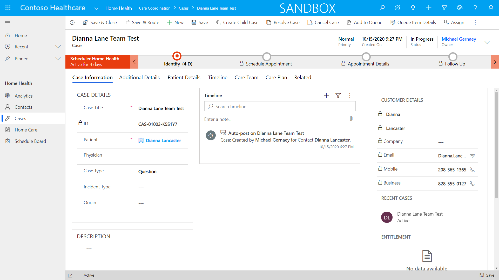])../media/15-cases.png#lightbox)

### Home care

Home care will show a list of active home health work orders for patients. These will be assigned to a home healthcare practitioner and will display information about the patient as well as the scheduled time for the visit.

[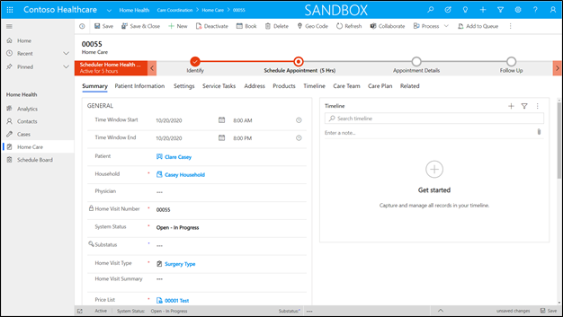])../media/16-home-care.png#lightbox)

### Schedule board

A healthcare agent will use the schedule board to create home care appointments for patients. The agent will use the Universal Resource Scheduling features to manage the schedules of care team members and optimize the home care visits using route optimization capabilities.

[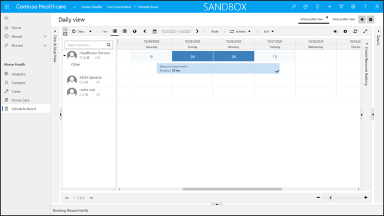])../media/17-schedule-board.png#lightbox)
