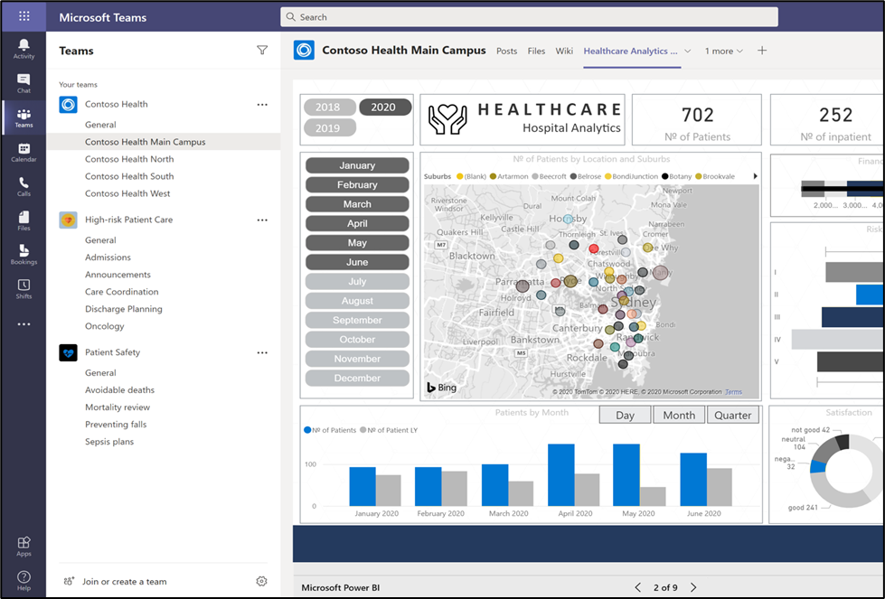
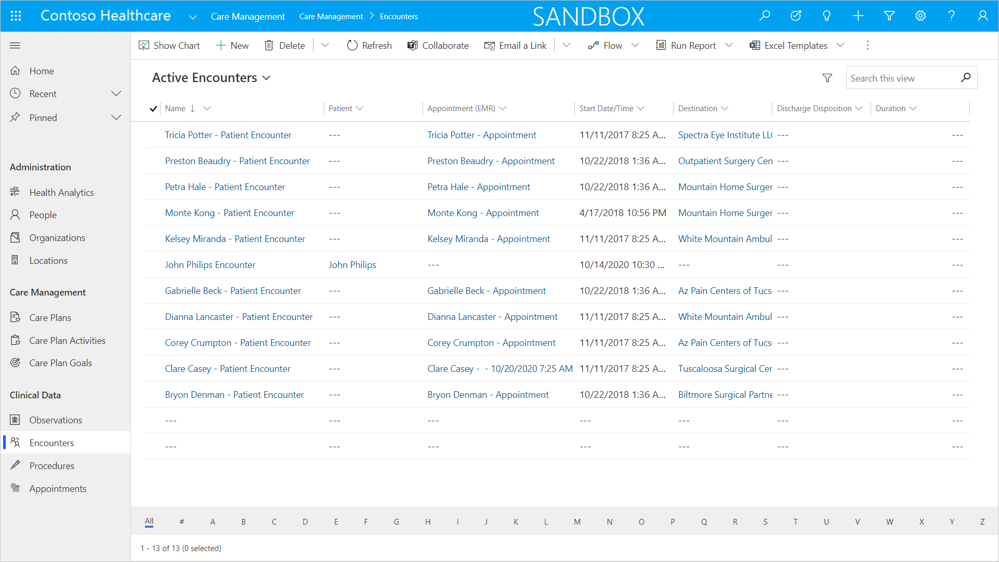
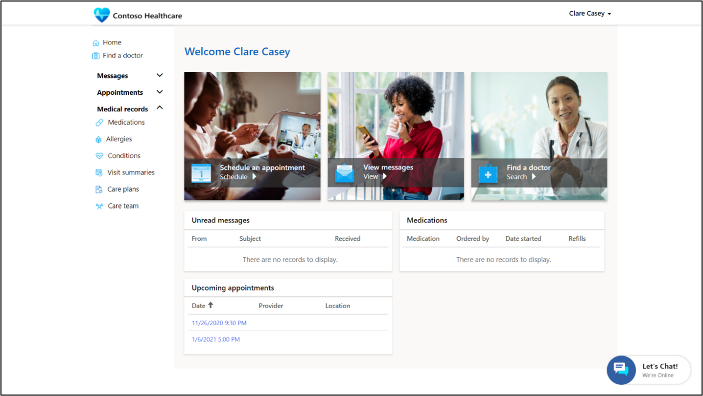
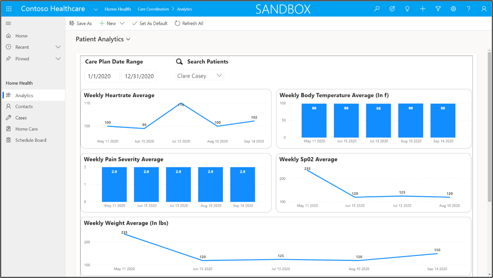
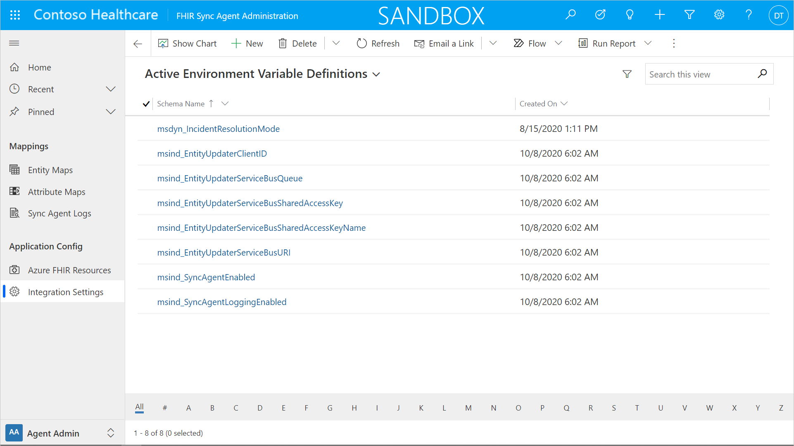

The healthcare solution is built using a variety of existing Microsoft technologies and tools that have an established success record in multiple industries and businesses. Understanding what these technologies are and how they work are beneficial to anyone implementing the Healthcare solution.

One of the benefits of Microsoft technology is that it works together to provide a comprehensive and integrated solution.

## Microsoft 365

Microsoft 365 is a secure cloud-based productivity platform. Microsoft 365 provides several different applications and services that enhance personal productivity and efficiency. Many of these applications and services are utilized by healthcare provider organizations and individuals.

### Security and compliance

Microsoft 365 Defender protects organization's information technology assets from external and internal threats. This is especially important for healthcare organizations where both data protection and operations are critical. An administrator will be able to define user access, policies, and permissions as well as monitor incidents and potential security issues.

### Communication

Microsoft 365 provides various channels for communication with all stakeholders of a healthcare organization including healthcare practitioners and patients. Emails, messages, and appointments are coordinated via Microsoft Exchange. Collaboration between stakeholders can occur within the context of Microsoft Teams.

### Data

The core of any organization is its information. Microsoft 365 facilitates this in various methods. Documents, files and unstructured data can be managed using SharePoint. Structured information can be managed using the Common Data Service, accessed via Power Apps or within Microsoft Teams.

## Microsoft Teams

Microsoft Teams is a collaboration and communication platform. For healthcare professionals, it will allow care teams to collaborate on specific patient cases or treatment initiatives and provide virtual care.

 

Healthcare professionals will be able to chat one-on-one or have threaded group conversations. Teams also provides the ability for holding meetings with video conferencing (virtual care).

Teams can also integrate various apps (including Power Apps) along with automation using Power Automate. There are various healthcare templates with predefined settings, channels, and apps that can be used as new teams are set up. Messages in Teams can be targeted to the right Health care professional based on role, skill, location, and availability.

The shift capabilities of Microsoft Teams will allow administrators to effectively schedule the healthcare team's working hours.

## Power Apps and Dynamics 365

Power Apps are business applications that can be designed and configured rapidly. Model-driven Power Apps are built based on a data model and presents a common user interface and navigation for users to review, add, and edit data.

Many of the Dynamics 365 applications are model-driven Power Apps. Model-driven apps can be easily personalized for a specific industry or requirement.

Many features of the healthcare solution are presented as model-driven apps created specifically for the healthcare solution or modified Dynamics 365 apps for healthcare scenarios.

The Patient Service Center is the Dynamics 365 Omnichannel for Customer Service app that is configured to enable healthcare administrators and healthcare call center agents to engage effectively with patients.

The Care Management app is Dynamics 365 Customer Service that has been customized for healthcare practitioners to provide detailed information about patients and the ability to create and manage the care plans. The solution also allows for the coordination and management of care team members or related medical organizations.

The Home Health app uses the Dynamics 365 Field Service app to provides administrators the ability to capture and monitor patient data as well as scheduling healthcare practitioner in-home patient visits.

Power Apps portals is a web platform to allow external stakeholders with secure access to information stored in the Common Data Service. Patient Access is a Power Apps Portal application to provide self-service capabilities to patients such as messaging, managing appointments and searching for new healthcare practitioners.

Canvas Power Apps allows for specific user interface requirements and are typically powerful for specific task-based activities. Canvas apps can run on the desktop, tablets, or mobile phones.

Other Power Apps can be developed to meet unique requirements or needs of a healthcare organization. These apps can interact with information from the Common Data Service and can be surfaced to healthcare practitioners using model-driven apps for more holistic view of information and management. Patients can access information from Power Apps Portals applications. Canvas Power Apps can be configured for healthcare professionals to assist with specific tasks, information retrieval, and gathering.

## Power Automate

Power Automate is a workflow and automation tool that allows users to automate repeatable tasks, to easily update and integrate data in a variety of systems. Various workstreams can be greatly enhanced using Power Automate in the healthcare solution. For example, Power Automate flows can automatically send patients pre-visit surveys a day ahead of their appointment.

## Power BI

Power BI can read data from various sources and present users with information presented in formats such as reports and dashboards to allow for informed and rapid decisions.

The healthcare solution uses Power BI in the Patient Service Center and Care Management applications to show clinical data and care plans. Dashboards in the Home Health app show administrators a high-level view of patient analytics as well as an overview of Healthcare provider information.

## Azure

Microsoft Azure is a cloud platform that offers the ability to build powerful software applications, data storage, and services without the need for expensive servers or networking equipment.

The healthcare solution provides the FHIR Sync Agent which an Azure-based API for integration to FHIR (Fast Healthcare Interoperability Resource) systems. Patient data can be synchronized between the healthcare solution and made visible in the various Power Apps and dashboards. The healthcare solutions are built on the Common Data Model for healthcare that is designed based on the HL7 FHIR specification.

The Microsoft Health Bot is built on the Azure Bot Service and configured to utilize AI and data from a variety of healthcare sources. The health bot can be surfaced on the Patient Access portal where patients can interact with the bot to get information before being transferred to a healthcare agent.

