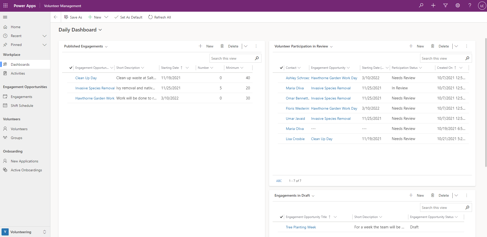
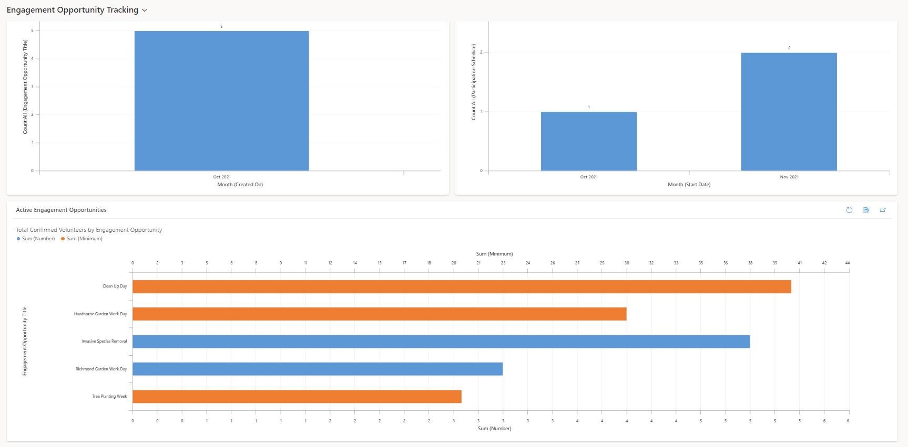

Volunteer Management includes two dashboards to provide an overview and insight into your activities and processes.

## Daily Dashboard

Volunteer managers can use the daily dashboard to review their published engagements, engagements in draft, and volunteer applications in review. Sort or filter the lists on this dashboard to view engagements or applications by starting date, to focus on what is coming up next, and view progress of your published engagements for a quick snapshot of which have enough volunteers, and which might need some extra attention to attract more volunteers.

> [!div class="mx-imgBorder"]
> 

## Engagement Opportunity Tracking Dashboard

Volunteer managers can use the Engagement Opportunity Tracking Dashboard to gain insight into the number of engagements and participations by month, and to compare the number of volunteers across all engagement opportunities.

> [!div class="mx-imgBorder"]
> 
