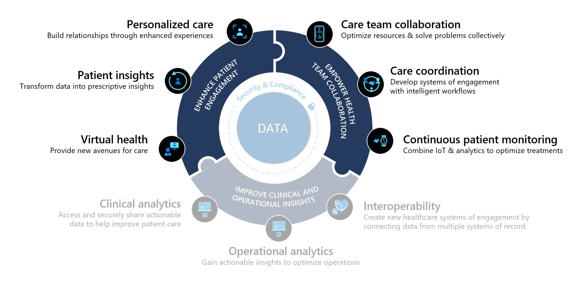
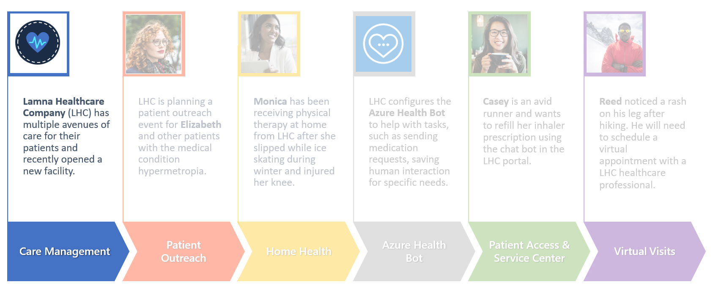

The **Care Management** application allows healthcare systems to provide coordinated care to each patient by quickly communicating the right information, at the right time, to the right people. Users can easily create, personalize, and enable new care plans for patients, manage care teams, and view patients' clinical timelines and care insights right within the application.

Key capabilities for Care Management include:

-   **Care team:** View and collaborate with care teams to provide the best care for the patient.

-   **Care plan:** Create and assign care plans and automate adherence to improve care coordination for your patients.

-   **Clinical timeline:** Concise, sequential, and interactive view of patient's clinical occurrences.

-   **Virtual clinic:** Provide your care team members the ability to perform virtual appointments with patients.

## Industry prioritized scenarios

Care Management focuses on both **Enhance patient engagement** and **Empower health team collaboration** priority scenarios. It creates a system that allows for enhanced care team collaboration and coordination, virtual care options, and a 360 view of patient healthcare data with more patient insights.

> [!div class="mx-imgBorder"]
> 

## Healthcare story

This lab will focus on the story of Lamna Healthcare Company, who is opening a new location in Redmond, WA.

> [!div class="mx-imgBorder"]
> 

Now that Lamna Healthcare Company's new location is ready to open, we need to ensure it's in the system and that the employees understand the healthcare data model basics and how the tables and relationships are surfaced in the Care Management application.