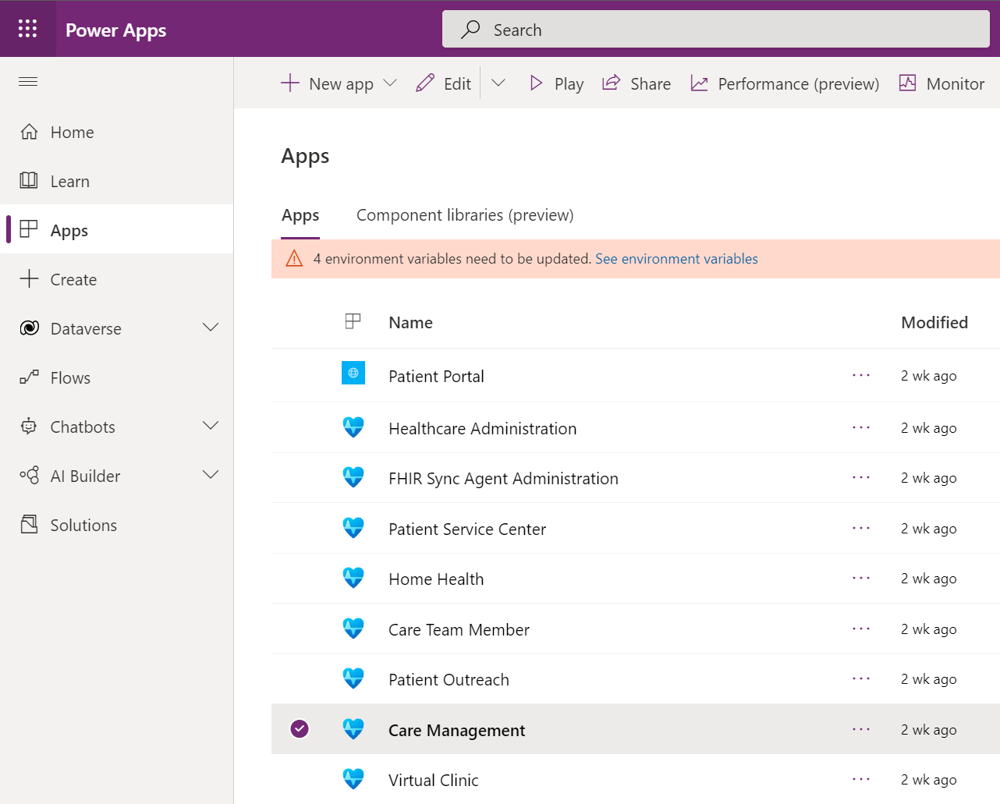
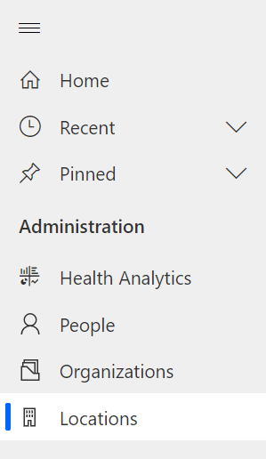
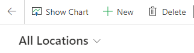
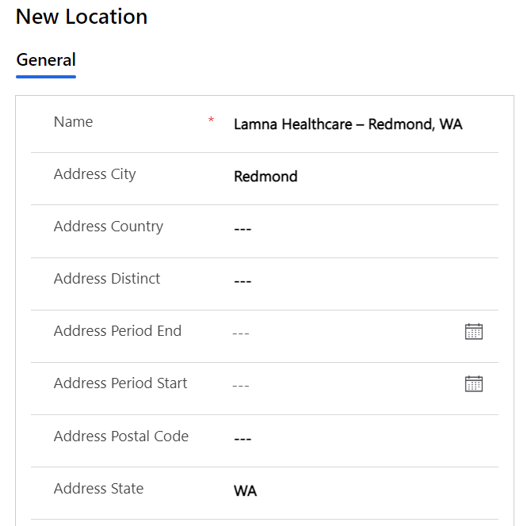
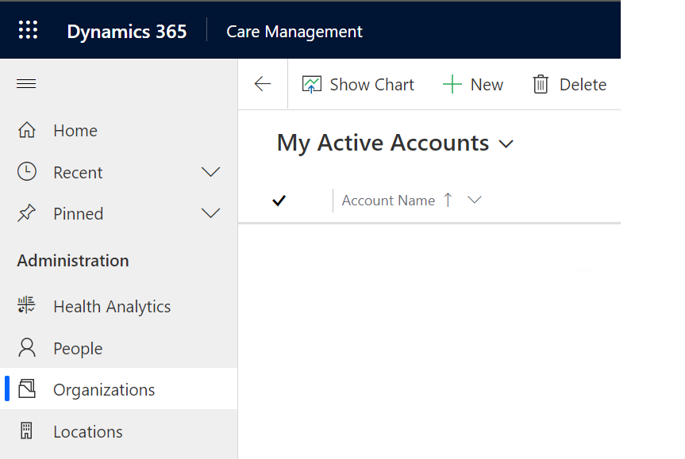
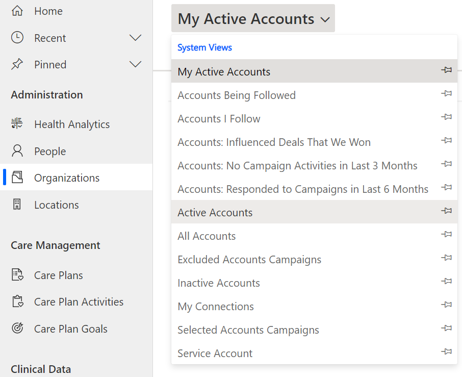
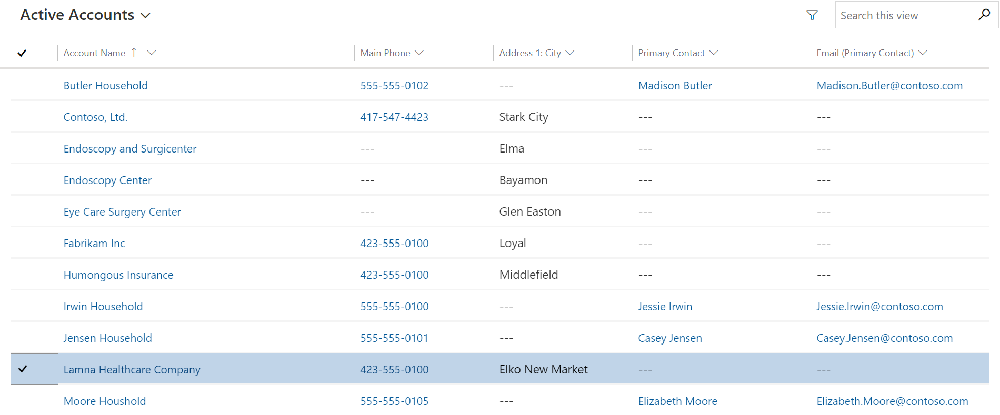
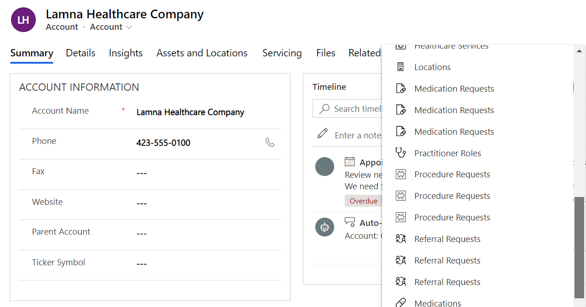
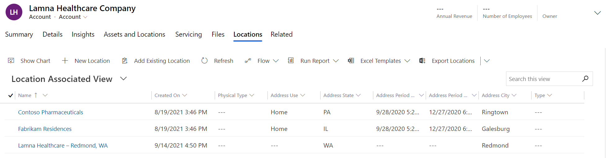

In this exercise, you'll be creating a new Location record for the **Lamna Healthcare Company** Organization. They've opened a new branch in **Redmond, WA** and we need to ensure this location is in the system.

1.  In Power Apps, select **Apps** in the left sitemap. Select and open **Care Management**.

	> [!div class="mx-imgBorder"]
	> 

1.  In the Care Management sitemap on the left, select **Locations**.

	> [!div class="mx-imgBorder"]
	> 

1.  In the All Locations view, select **+New**.

	> [!div class="mx-imgBorder"]
	> 

1.  Fill in the following information for the new location:

	- **Name:** Lamna Healthcare - Redmond, WA

	- **Address City:** Redmond

	- **Address State:** WA

	- **Managing Organization:** Lamna Healthcare Company

	> [!div class="mx-imgBorder"]
	> 

	> [!div class="mx-imgBorder"]
	> 

1.  Select **Save & Close**. Now let's see the new location in the Managing Organization record.

1.  In the sitemap on the left, select **Organizations**.

	> [!div class="mx-imgBorder"]
	> 

1.  Change the grid view in the drop-down from "My Active Accounts" to "**Active Accounts**".

	> [!div class="mx-imgBorder"]
	> 

1.  Once in the **Active Accounts** view, select the **Lamna Healthcare Company** Organization.

	> [!div class="mx-imgBorder"]
	> 

1.  On the Lamna Healthcare Company record, select the **Related** tab and scroll down to select **Locations**.

	> [!div class="mx-imgBorder"]
	> 

1. You'll see the newly created **Lamna Healthcare - Redmond, WA** location associated to the record.

	> [!div class="mx-imgBorder"]
	> 

**Congratulations!** You created a new location in Redmond, WA for Lamna Healthcare Company using the Care Management application.

