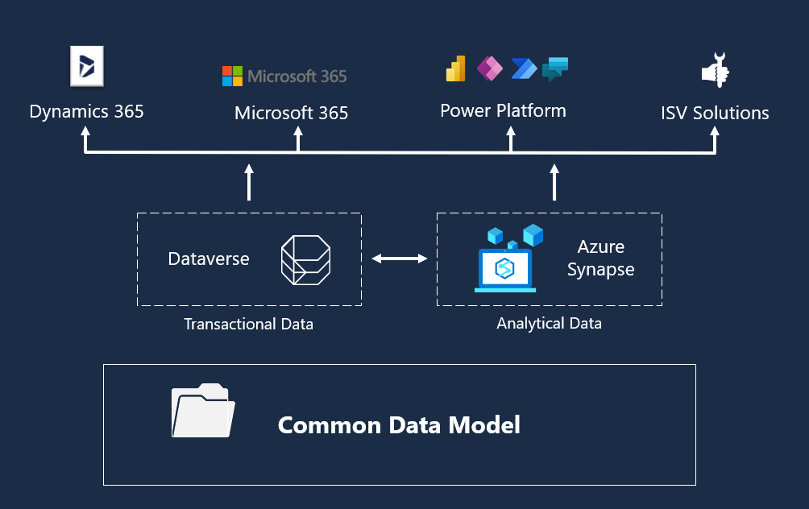
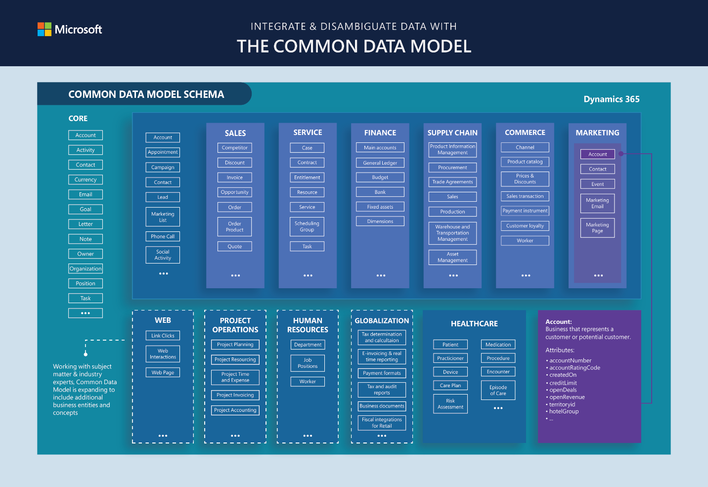

To fully understand the Microsoft Cloud for Healthcare data model, it's important to first understand the Microsoft Common Data Model (CDM). If you've ever had to bring together data from multiple systems and applications, you know it can be an expensive and time-consuming task. Without the ability to share and understand the same data easily, each application, or data integration project would require a custom implementation.

The Common Data Model simplifies this process by providing a shared data language for business and analytical applications to use. It's a common machine understandable way to describe data with semantic consistency across business, transactional, analytical, and industry domains. This\
drives interoperability across apps and services from the Microsoft ecosystem and allows customers to create insights from their data.

> [!div class="mx-imgBorder"]
> 

The Common Data Model isn't a service itself. It's a semantically rich set of table and column definitions that can be instantiated as a service.

- For business or transactional data, CDM is instantiated through Dataverse (formerly known as Common Data Service). Customers, ISVs, and SIs can use and extend the entity and attribute definitions as needed to access and write business data present in Dataverse. This includes Finance, Operations, Customer Service, and other data being created by Dynamics 365.

- For analytical data, CDM is instantiated through Azure Synapse. Customers, ISVs, and SIs can use Azure Synapse to manage and extend CDM definitions, and to create new entity definitions as needed.

## Common Data Model schema

Microsoft Common Data Model includes a set of standardized, extensible data schemas that Microsoft and its partners have published. This collection of predefined schemas includes entities, attributes, semantic metadata, and relationships. The schemas represent commonly used concepts and activities, such as Patient and Care Plan, to simplify the creation, aggregation, and analysis of data. Here we see some elements of the standard tables with the Healthcare Data Model highlighted in the overall Microsoft Common data Model schema.

   > 

Learn more about the Microsoft [Common Data Model](/common-data-model/?azure-portal=true
) at Microsoft Docs.
