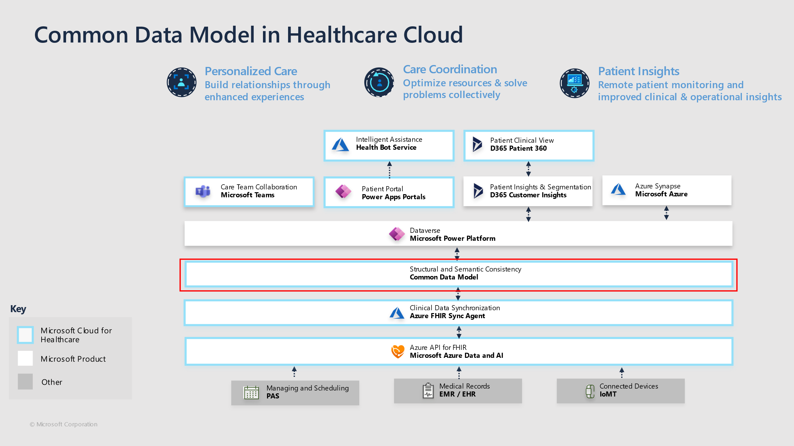
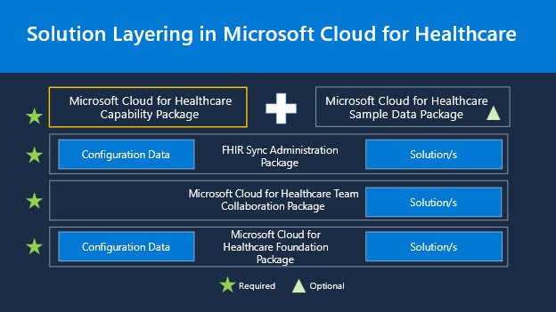
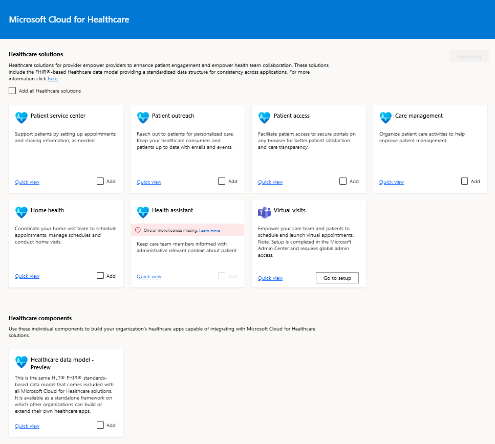

The healthcare data model defines a common language for healthcare business entities and can be further extended. It is based on the Fast Healthcare Interoperability Resources (FHIR) standards framework. It consists of 20+ FHIR/HL7 resources that form the core data constructs, which drive the Microsoft Cloud for Healthcare. The healthcare data model uses some out-of-the-box tables from the following Dynamics 365 applications:

- Dynamics 365 Customer Service

- Dynamics 365 Field Services

- Dynamics 365 Marketing

The entity reference for the Dynamics 365 solutions in Microsoft Cloud for Healthcare is available in the following Common Data Model documentation: [Overview of Microsoft Cloud for Healthcare entities](/common-data-model/schema/core/industrycommon/healthcare/healthcare-overview/?azure-portal=true).

## Common Data Model in healthcare cloud

Now let's see how it positions itself in the overall healthcare cloud. The core data constructs that comprise the data model for the Microsoft Cloud for Healthcare reside in the layer in between Dataverse and the Azure FHIR Sync Agent. It sits right on top of Microsoft Azure, which is also an ingestion layer for multiple Electronic Medical Records (EMRs) or connected devices.

> [!div class="mx-imgBorder"]
> 

The Common Data Model is instantiated through Dataverse, making this data available to the Power Platform. All the healthcare experiences for better care and insights then light up through applications and services above this layer. For example, Power Apps portals and Azure Health Bot enable care coordination and Customer Insights.

## Healthcare capabilities and the healthcare data model

Each Microsoft Cloud for Healthcare capability is associated with a subset of the healthcare data model, depending on the accompanying scenarios. Each layer shown below produces the components of the Healthcare data model on the target tenant.

> [!div class="mx-imgBorder"]
> 

Each of the MCH capabilities follows the same structure and layering. The base is the Microsoft Cloud for Healthcare Foundation Package, which has a set of solutions and configuration data. The second package layer is the Microsoft Cloud for Healthcare Team collaboration package, and the third is the Microsoft Cloud for Healthcare FHIR Sync Administration package.

On top of these three layers, we have the final package, which is based on your selected capabilities. For example, if you choose to install Care Management, the Microsoft Cloud for Healthcare capability package would be for Care Management. Similarly, if you choose Patient Outreach, the MCH capability package would be for Patient Outreach, etc.

## Healthcare data model (preview)

The Microsoft healthcare data model is available for preview on the Microsoft Cloud Solution Center at solutions.microsoft.com. The solution does not have any dependencies. It contains the entities, relationships, resources, and other processes to manage your healthcare data, including clinical communication, appointments, encounters, care teams, procedures, medications, and more.

You can learn more about the entities included in the healthcare data model [here](/common-data-model/schema/core/industrycommon/healthcare/healthcare-overview/?azure-portal=true
) on Microsoft Docs.

> [!div class="mx-imgBorder"]
> 

## Deprecation of the Dynamics 365 Healthcare Accelerator

The Microsoft healthcare data model originated as part of the Dynamics 365 Healthcare Accelerator, which was deprecated on November 13, 2020, and is no longer available. The healthcare data model has since been updated and is available through the Microsoft Cloud for Healthcare. If you need to migrate from the Dynamics 365 Healthcare Accelerator to the Microsoft Cloud for Healthcare, reference this [article](/dynamics365/industry/healthcare/accelerator-deprecation/?azure-portal=true
) on Microsoft Docs.
