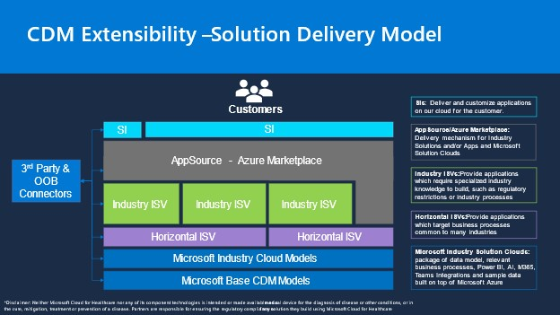

Microsoft Cloud for Healthcare comes prebuilt with many functionalities out of the box, but there's an extension mechanism for when customization is required.

Microsoft Industry Solution Clouds package the data model along with the relevant business processes, Power BI, AI, Microsoft 365, Microsoft Teams integrations, and sample data built on top of Microsoft Azure. Hence there is the flexibility to extend these components at each layer. If you intend to extend the Microsoft Cloud for Healthcare solution, there are multiple solution delivery mechanisms for Independent Software Vendors (ISV).

If you're a Horizontal ISV, you provide applications, which target business processes common to many industries and can build upon one or more industry clouds data models.

If you are an Industry ISV or customer that cater to a specific industry like healthcare, you can build right on top of the data model and extend vertical or micro-vertical scenarios, such as building a highly advanced Patient engagement workflow in healthcare. You can also use the IP or connectors from another ISV and build solutions that extend their IP.

If you intend to publish your solutions and reach out to your customers, we have the delivery mechanism for Industry solutions in AppSource and Azure Marketplace. If you are an SI, then you have the possibility of bringing in the IP from multiple ISVs to extend and implement for your customers.

In summary, there are multiple solution delivery models that are available to Microsoft ISVs and SIs to bring value to customers.

> [!div class="mx-imgBorder"]
> 
