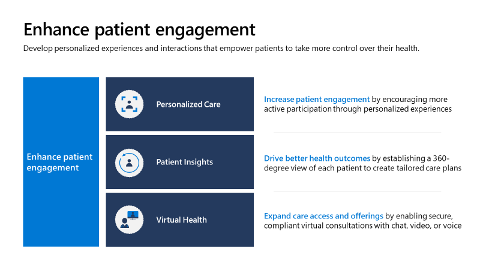
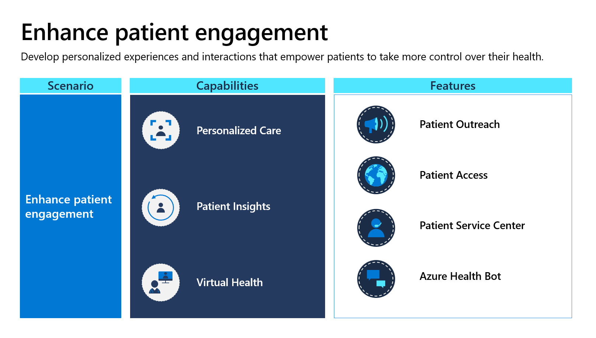
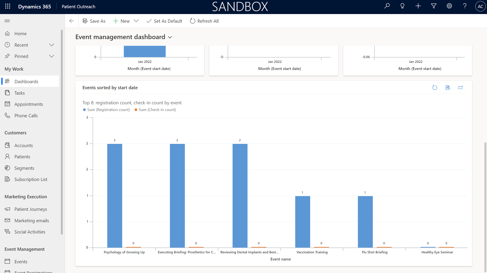
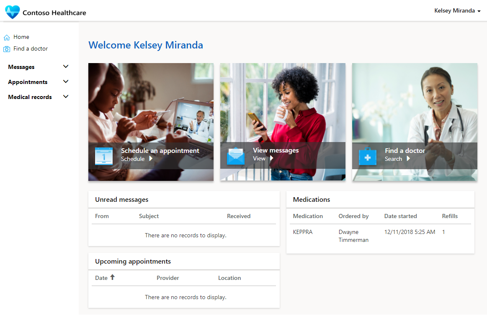
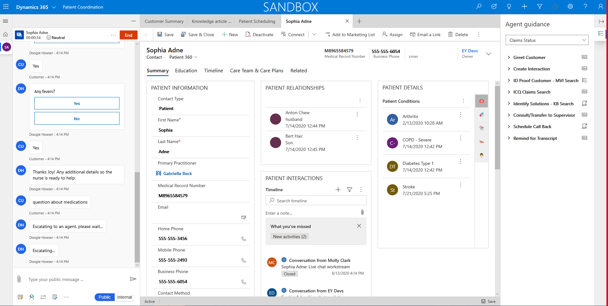
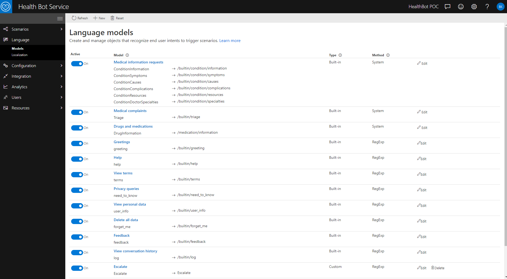

Microsoft Cloud for Healthcare enables enriched data to flow through every point of care to continuously improve patients' experiences and health outcomes. It focuses on enhancing the patient engagement experience through the following three capabilities:

- **Personalized care** - Increase patient engagement by encouraging more active participation through personalized experiences.

- **Patient insights** - Drive better health outcomes by establishing a 360-degree view of each patient to create tailored care plans.

- **Virtual health** - Expand care access and offerings by enabling more secure, compliant virtual consultations with chat, video, and voice.

> [!div class="mx-imgBorder"]
> 

Microsoft Cloud for Healthcare gives you the tools to help increase patient satisfaction and build stronger relationships through enhanced, personalized experiences. Whether on the go or with a provider, patients can be engaged in their healthcare to ensure that they can schedule appointments or get questions answered when they need. By increasing access to self-service tools and by personalizing outreach, your providers can ensure that every patient receives care that's tailored to their unique needs.

## Featured healthcare applications

The following Microsoft Cloud for Healthcare applications focus primarily on enhancing patient engagement:

-   **Patient Outreach** - Streamline and tailor patient outreach by using prebuilt, Healthcare Effectiveness Data and Information Set (HEDIS) based patient segments and healthcare-specific event templates in Microsoft Dynamics 365 Marketing.

-   **Patient Access** - Give patients access to services like scheduling, messaging, health bots, and more through an intuitive patient portal that's built on Microsoft Power Apps portal.

-   **Patient Service Center** - Maximize contact center effectiveness with insights into patient sentiment by agent and over time through the Microsoft Dynamics 365 Customer Service Insights dashboard.

-   **Azure Health Bot** - Provide a self-service engagement channel by building chatbots from templates in Microsoft Azure Healthcare Bot to support COVID-19 risk assessment, scheduling, and so on.

> [!div class="mx-imgBorder"]
> 

By using the **Patient Access**, **Patient Service Center**, and **Azure Health Bot** features, you can have patients use the portal to seamlessly transition from health bots to agents with full chat and care history, script templates, and more on the Omnichannel for Customer Service dashboard.

### Patient Outreach

With the **Patient Outreach** feature, you can engage patients and their family members in patient care decisions. This feature also helps you provide a personalized healthcare experience to help patients stay engaged and current on their treatment. **Patient Outreach** is a patient campaign management application that helps you organize and automate marketing and outreach to patients. Healthcare providers can communicate with their communities and patients in a targeted, more efficient way. Providers can use email, text, regular mail, or a combination, to provide healthcare information to specific groups of patients and community members.

**Patient Outreach** enhances Dynamics 365 Marketing with healthcare-specific capabilities as part of Microsoft Cloud for Healthcare.

> [!div class="mx-imgBorder"]
> 

Various features that are included in **Patient Outreach** are:

-   **Patient experiences** - Provide patients with personalized healthcare experiences and keep them engaged with current treatments by using various communication methods.

-   **Patient insights** - Gather insights about patients by using event management. Reach patients with specific conditions in a more targeted manner by using patient segments and journeys.

-   **Patient segmentation** - Create static and dynamic segments to group specific patients and community members.

-   **Patient journey automation** - Create a model that helps you guide the members of a selected marketing segment by using automated messaging, activity generation, interactive decision points, and more.

-   **Patient campaign management** - Create healthcare-specific email campaigns that use prebuilt patient segments.

-   **Event management** - Create and manage events with provider/payor event management templates for event administration and registration.

### Patient Access

With the **Patient Access** feature, you can provide patients with access to their health data, knowledge articles, and in-person and virtual appointment scheduling. This feature helps you give patients the ability to chat with a health bot, communicate with a caregiver, and view their clinical data, all within the portal that is provided by **Patient Access**.

**Patient Access** customizes a Microsoft Power Apps portal with healthcare-specific capabilities as part of Microsoft Cloud for Healthcare.

> [!div class="mx-imgBorder"]
> 

Various features that are included in **Patient Access** are:

-   **Patient portal** - Use a customized healthcare template to engage patients with a self-service portal to access medical records and professionals when needed.

-   **Medical record access** - Patients can gain access to their healthcare data, including appointments, medications, allergies, conditions, visit summaries, care plans, care teams, emergency contacts, and coverages.

-   **Patient self-scheduling** - Patients can schedule in-person and virtual appointments according to practitioner availability, including instant virtual appointments.

-   **More secure patient messaging** - Patients can send and receive messages from their practitioner or chat with a live agent through the Azure Health Bot.

-   **Patient triage with Azure Health Bot** - The healthcare team can use the Azure Health Bot to perform sophisticated tasks such as triaging, checking symptoms, or answering questions about medical conditions and symptoms.

-   **Physicians directory** - Patients can view a list of active practitioners to find one nearby.

### Patient Service Center

With the **Patient Service Center** feature, you can engage with your patients in the way that they want by using chat. Additionally, you can monitor automatic conversations through the Azure Health Bot Service. Service agents can help your patients with information and setting up appointments.

**Patient Service Center** builds on Dynamics 365 Customer Service and its Digital Messaging Add-in to add healthcare-specific capabilities to Microsoft Cloud for Healthcare.

> [!div class="mx-imgBorder"]
> 

Various features that are included in **Patient Service Center** are:

-   **Conduct and monitor patient conversations** - An ongoing conversations dashboard that provides information on conversations that are handled by agents and integrated bots. Agents can assist patients and schedule appointments during conversations.

-   **Patient 360** - Agent can access patient healthcare information for a complete view of the patient during their conversation.

-   **Agent scripts** - Use provider-specific agent scripts to address patient issues.

-   **Knowledge Articles** - Create and search for knowledge articles with the ability to add them as a tab in the app.

-   **Smart Assist** - AI suggestions are displayed through an intelligent assistant that provides real-time recommendations, helping agents take action during interactions with patients.

-   **Monitor sentiment analysis and effectiveness** - Conversation intelligence provides insights to agents about conversation sentiment and insights to service center managers on agent performance.

-   **Follow-up surveys** - Send follow-up surveys on patient satisfaction, reminders of appointments, and more.

### Azure Health Bot

Azure Health Bot Service is a cloud platform that empowers developers in healthcare organizations to build and deploy their own compliant, AI-powered patient insights and health bots, improving processes and reducing costs.

> [!div class="mx-imgBorder"]
> 

Various features that are included in Azure Health Bot Service are:

-   **Built-in medical database** - Enable meaningful conversations with patients by using common language and medical terms. Health Bot Service contains a built-in medical database, including triage protocols. Extend to include your own scenarios and integrate with other IT systems and data sources.

-   **Custom scenarios and templates** - Health Bot Service contains built-in scenarios and extra scenarios that might be created through the Scenario Editor to extend the baseline scenarios or you can create a new scenario.

-   **Language model extensibility** - Language models interpret end-user utterances and trigger the relevant scenario logic in response. Extend the base models or create your own to provide structured responses to the end user.

-   **Authored cards** - Create visual components that provide a richer experience for presenting data. Several types of cards are available, each with different functionality and targeted to different use cases.

-   **Escalate to Patient Service Center** - When necessary, for more complex patient questions, Azure Health Bot Service can hand off the conversation to a care coordinator in Patient Service Center.
