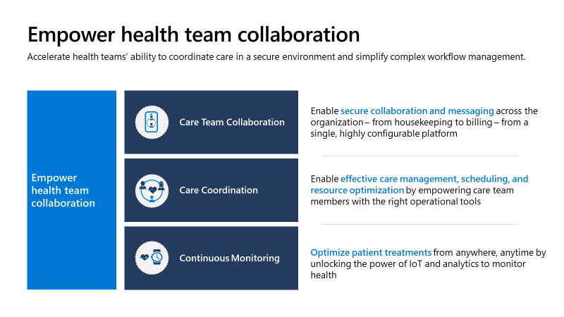
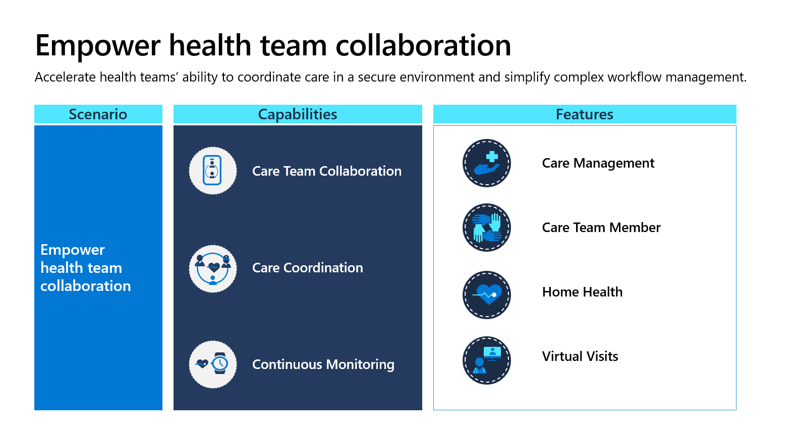
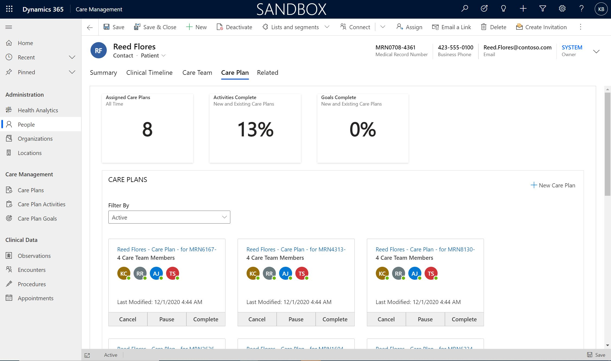
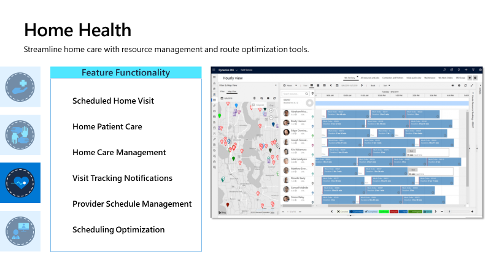
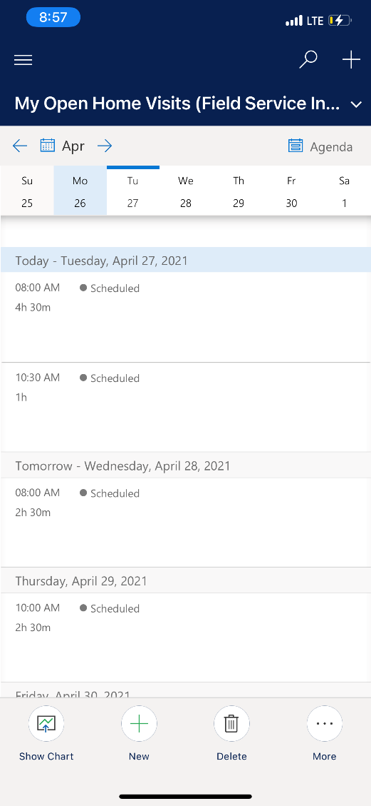
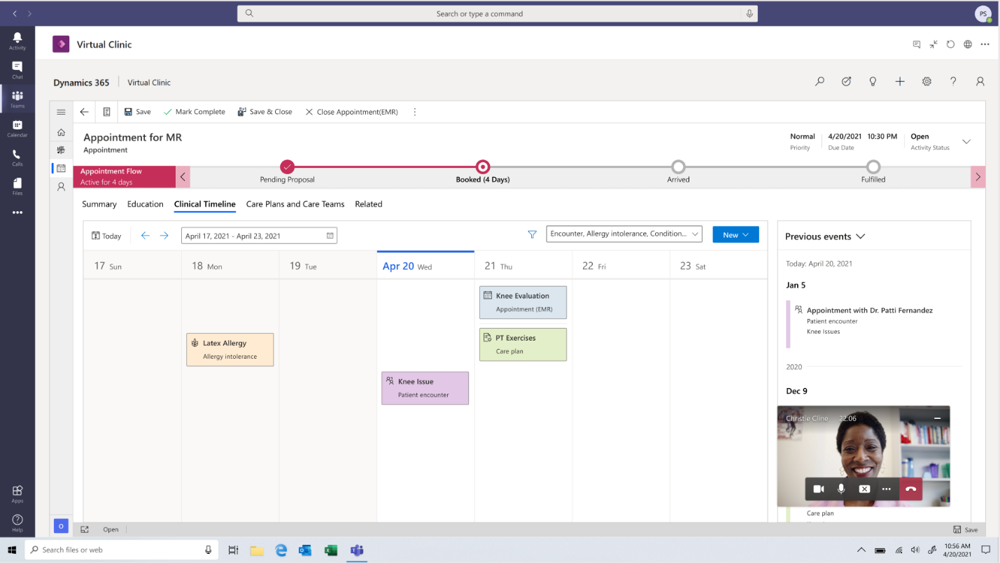

Microsoft Cloud for Healthcare makes enterprise-wide health team collaboration a reality. It invests in key capabilities around more secure collaboration, care coordination, and continuous patient monitoring. Additionally, Cloud for Healthcare focuses on empowering collaboration between the health team and their patients with the following three capabilities:

-   **Care team collaboration** - Enable secure collaboration and messaging across the organization, from housekeeping to billing, from a single, highly configurable platform.

-   **Care coordination** - Enable effective care management, scheduling, and resource optimization by empowering care team members with the correct operational tools.

-   **Continuous patient monitoring** - Optimize patient treatments from anywhere, anytime by unlocking the power of the Internet of Things (IoT) and analytics to monitor health.

> [!div class="mx-imgBorder"]
> 

Microsoft Cloud for Healthcare helps you increase communication and collaborate more efficiently and in real time. It helps you address issues from single-patient monitoring through pandemic-level crises that necessitate a broader reach and level of interaction. You can manage complex workflows from a single application to effectively manage cases and minimize costs, especially for patients with chronic illnesses or long-term care plans. With Microsoft Cloud for Healthcare, you can also monitor patients remotely.

## Featured healthcare applications

Microsoft Cloud for Healthcare provides the following applications that focus primarily on empowering health team collaboration:

-   **Care Management** - Manage care teams, care plans, and goals. View organization and patient data, including a visual clinical timeline.

-   **Home Health** - Streamline home care with resource management and route optimization tools.

-   **Care Team Member** - Access through the Microsoft Dynamics 365 Field Service mobile app to support home care visits and update the specifics of a visit on a mobile device.

-   **Virtual Visits** - Enable a fully virtual experience by connecting patients and providers through Microsoft Teams to support remote scheduling, consultations, and more.

> [!div class="mx-imgBorder"]
> 

### Care Management

With the **Care Management** application, you can concisely communicate the right information, at the right time, to the right people to provide coordinated care for the patient. Additionally, you can create, personalize, and enable new care plans for patients and manage care team members.

**Care Management** creates a model-driven app within Microsoft Power Platform to provide healthcare-specific capabilities as part of Microsoft Cloud for Healthcare.

> [!div class="mx-imgBorder"]
> 

Various features that are included in **Care Management** are:

-   **Holistic patient information** - The care coordinator gets a 360-degree view of the patient with all care plan, care team, and clinical data in one place.

-   **Care plan management** - Create and assign care plans and automate adherence to improve care coordination for your patients.

-   **Care team management and support** - View and collaborate with care teams to provide the best care for the patient.

-   **Patient clinical timeline** - Get a concise, sequential, and interactive view of the patient's clinical occurrences.

-   **Health Analytics** - Dashboard that shows various views to help you coordinate and manage care plans.

### Home Health

With the **Home Health** application, you can manage home visit schedules, notify patients, and give providers access to medical information, even while on the go. Additionally, provider personnel can schedule appointments for the patient based on various factors. Providers can view patient information directly in context, and a guided business process flow ensures that each measure is taken before and after the patient has booked the appointment.

**Home Health** extends Dynamics 365 Field Service with healthcare-specific capabilities as part of Microsoft Cloud for Healthcare.

> [!div class="mx-imgBorder"]
> 

Various features that are included in Home Health are:

-   **Home Patient Care** - Provides a structure for companies to coordinate home care for patients who are homebound.

-   **Scheduled Home Visit** - Enable care coordinators to schedule home visit appointments while viewing patient information directly in context.

-   **Analytics dashboard** - Provides a statistical analysis of measurable data for a patient or a care team member.

-   **Patient notifications** - Notify patients of arrival times and send follow-up patient satisfaction survey.

-   **Care coordinator notifications** - Send updates to care coordinators to notify them of new assigned bookings or a reminder to enter important home visit information.

-   **Provider schedule management and optimization** - View schedules of care team members and optimize visiting routes.

The Home Health solution within Microsoft Cloud for Healthcare encompasses two apps: **Home Health** and **Care Team Member**. The **Home Health** app is specific to the person who is scheduling the visits. This app offers the ability to create home health cases and schedule home visit appointments for the patient. The **Care Team Member** app is specific to the person who will be traveling and entering the patient's home to perform the necessary services. This app lets the care team member track individual tasks, view appointment details, and view the full patient summary.

### Care Team Member

The **Care Team Member** application helps you provide care team members with the ability to use a mobile device to view and update specifics of a home care visit. To access the **Care Team Member** application directly, go to the [Field Service mobile app](/dynamics365/field-service/mobile-power-app-overview/?azure-portal=true), where you can allow users to access and update scheduled home visits.

> [!div class="mx-imgBorder"]
> 

Various features that are included in the Care Team Member app are:

-   **Home Visits Calendar** - The Home Visits section of the mobile app allows users to directly access scheduled home visits and associated details, such as start time and estimated duration of the home visit.

-   **Home Visit Summary** - View a full summary of the visit. If the user has adequate permissions, they can update the estimated date and time of the visit.

-   **Home Visit Tasks** - View the tasks that must be performed during the home visit. The user can also update these tasks as they're completed.

-   **Patient Details** - View the full detail of a patient's record, including clinical data, care plans, clinical timeline, and care team viewer.

-   **Patient Signature** - Used by the caregiver to capture the signature of the patient on completion of the home visit.

### Virtual visits

In the current COVID-19 pandemic, many patients might prefer to visit their medical providers virtually rather than in person. Video conferencing provides a way for clinicians to provide high-quality, personalized, and affordable consultations. By using the complete meetings platform in Microsoft Teams, providers can schedule, manage, and conduct virtual visits with patients.

> [!div class="mx-imgBorder"]
> 

Various features that are included in Virtual Visits are:

-   **Scheduled and instant appointments** - View scheduled and instant virtual appointments and join the visit through their dedicated dashboards.

-   **Virtual Clinic dashboard** - Allows users to directly access scheduled or instant visits.

-   **Video calls through Microsoft Teams** - Microsoft Teams enables patients, providers, and care managers to interact.

-   **Multiple client options** - Join through multiple client options to provide flexibility by using a locally installed version or the web version.

-   **Embedded app experience** - Allow the user to directly converse with the patient while also being within the dashboard, the appointment, or the patient record.

-   **Holistic patient view** - Access a holistic patient view and the embedded Care Management tools during the virtual visit.
