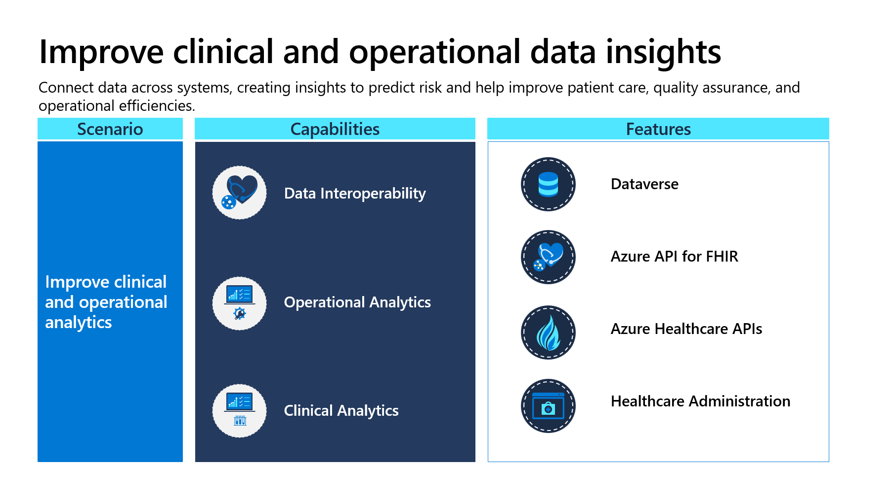
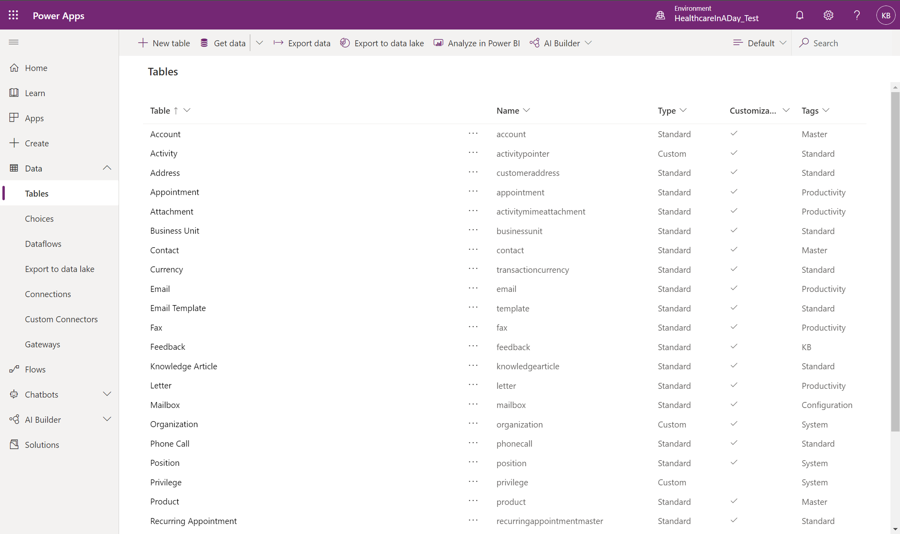
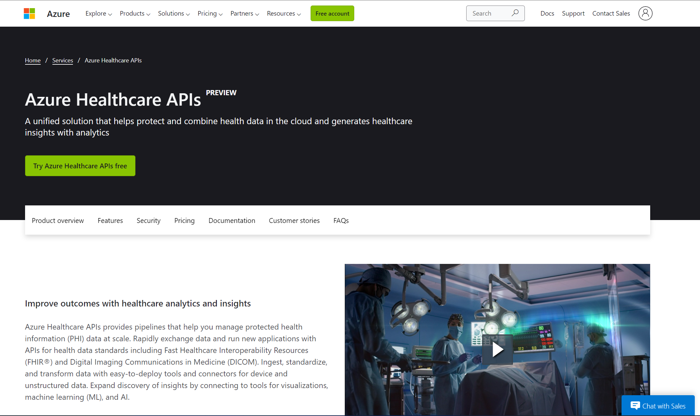
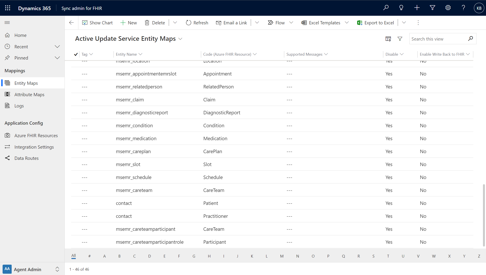
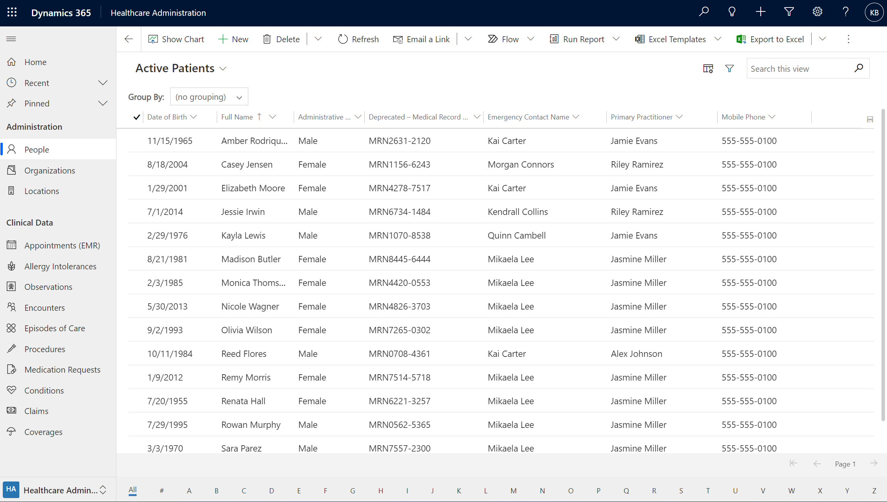

Microsoft Cloud for Healthcare provides a single hub to connect data from across systems, creating insights to help you predict risk and improve patient care, quality assurance, and operational efficiencies.

-   **Data interoperability** - Simplify data governance and compliance by unifying data on a single, more secure data platform.

-   **Operational analytics** - Improve operational efficiency by synchronizing management efforts across clinicians and administrators.

-   **Clinical analytics** - Transform health outcomes by using data-driven insights to improve clinical decision making and care experiences.

> [!div class="mx-imgBorder"]
> 

With Microsoft Cloud for Healthcare, you can create new healthcare systems of engagement by connecting data from multiple datasets. As a result, you will gain actionable insights that will help you optimize operations and lead to better health outcomes and more satisfying patient experiences. For more information, see [Improve clinical and operational insights](/industry/healthcare/improve-clinical-operational-insights/?azure-portal=true).

## Featured healthcare applications and services

Microsoft Cloud for Healthcare provides the following applications that focus primarily on improving operational and clinical insights:

**Microsoft Dataverse** - Provides a more secure way for you to store and manage data that's used by business applications.

**Microsoft Azure Healthcare APIs (preview)** - A set of managed API services and frameworks that's dedicated to the healthcare industry. This feature helps you enable workflows to improve healthcare and offer scalable and more secure healthcare solutions.

**Sync admin for FHIR** - Support data flows between Dataverse and Fast Healthcare Interoperability Resources (FHIR) compliant EHR systems. This feature helps simplify data admin duties for data mapping and allows users to view transaction logs.

**Healthcare Administration** - Manage all clinical and operational data in one place.

> [!div class="mx-imgBorder"]
> 

### Dataverse

Dataverse provides a more secure way for you to store and manage data that's used by business applications. Data within Dataverse is stored within a set of tables. A table is a set of rows and columns. Each column in the table is designed to store a certain type of data (for example, name or address). Dataverse includes a base set of standard tables that covers typical scenarios. However, you can also create custom tables that are specific to your organization and then populate them with data by using Power Query. Then, app makers can use Power Apps to build rich applications that use this data.

> [!div class="mx-imgBorder"]
> 

For more information, see [Microsoft Dataverse documentation](/powerapps/maker/data-platform/?azure-portal=true).

Various features that are included in Dataverse are:

-   **Security** - Rich security model to protect the data integrity and privacy of users while promoting efficient data access and collaboration. Combine business units, role-based security, row-based security, and column-based security to define the overall access to information.

-   **Store and manage data** - Standard and custom tables provide a secure and cloud-based storage option for your data and metadata.

-   **Quickly access and build apps against your data** - Data from your Dynamics 365 applications is also stored within Dataverse, allowing you to quickly build apps that use your Dynamics 365 data and extend your apps with Power Apps.

-   **Reusable business logic** - Define calculated columns, business rules, workflows, and business process flows to ensure data quality and drive business processes.

-   **Built-in validations** - Create business rules to validate data across multiple columns and tables. Provide warning and error messages, regardless of the app that is used to create the data.

-   **Integration with other systems** - Connect to the devices, apps, systems, services, and popular software as a service (SaaS) offerings that contain the data for your business. Dataverse has a deep integration with Microsoft cloud services such as Azure, Dynamics 365, and Microsoft 365, plus access to many connectors in Power Automate and Azure Logic Apps.

### Azure Healthcare APIs (preview)

Azure Healthcare APIs is a set of managed API services based on open standards and frameworks, including Fast Healthcare Interoperability Resources (FHIR) and Digital Imaging Communications in Medicine (DICOM), that enable workflows to improve healthcare and offer scalable and more secure healthcare solutions. It accomplishes this task through insights by bringing protected health information (PHI) datasets together and connecting them, end-to-end, with tools for machine learning, analytics, and AI.

Using a set of managed API services and frameworks that are dedicated to the healthcare industry is beneficial and important. The reason is because you can fragment health data that is collected from patients and healthcare consumers from across multiple systems, device types, and data formats. 

> [!div class="mx-imgBorder"]
> 

Azure Healthcare APIs is the evolved version of Azure API for FHIR and offers more technology and services. Existing customers can continue using the product without disruption to the service.

For more information, see [Azure Healthcare APIs documentation](/azure/healthcare-apis/?azure-portal=true) and [Azure Healthcare APIs](https://azure.microsoft.com/services/healthcare-apis/?azure-portal=true).

Various features that are included in Azure Healthcare APIs are:

-   **Rapidly exchange data** - Allows for the exchange of data through consistent, RESTful, FHIR APIs based on the Health Level 7 (HL7) FHIR specification. Connect with any system that uses FHIR APIs for read, write, search, and other functions.

-   **Control data access at scale** - Provide increased security and reduce administrative workload by determining access based on role definitions for your environment.

-   **Audit logs and tracking** - Quickly track where your data is going with built-in audit logs. Track access, creation, modification, and reads within each data store.

-   **Linked services** - Support multiple health data standards for exchanging structured data. A single collection of Azure Healthcare APIs enables you to deploy multiple instances of different service types (FHIR Service, DICOM Service, and IoT Connector) that seamlessly work with one another.

-   **Enrich disparate datasets** - Use tools to quickly combine disparate health datasets and standardize data in the cloud.

-   **Gain insights from real-time PHI data** - Use connectors to Microsoft Azure Synapse Analytics, Microsoft Azure Machine Learning, and Microsoft Power BI to generate insights from real-world data.

-   **End-to-end data pipeline** - Build a scalable, end-to-end data pipeline that helps secure your protected health information (PHI) data workflows.

### Sync admin for FHIR

**Sync admin for FHIR** is a model-driven app that helps the Azure FHIR sync agent give healthcare admins control over data that flows between Azure-based FHIR systems and [Microsoft Dataverse](/powerapps/maker/common-data-service/data-platform-intro/?azure-portal=true). It has ready-made, customizable entity and attribute maps and the tools to manage them. It allows protected patient data to be available directly in your Microsoft Cloud for Healthcare solution powered by Dynamics 365, while remaining in its original system when at rest.

> [!div class="mx-imgBorder"]
> 

For more information, see [Overview of Sync admin for FHIR](/dynamics365/industry/healthcare/configure-sync-clinical-data/?azure-portal=true).

Various features that are included in **Sync admin for FHIR** are:

-   **Set up Azure FHIR Resources** - Because you can't see inside of FHIR entities directly to view all the resources, the FHIR Sync Agent defines all resources in an entity. The FHIR resources are primarily used in entity maps.

-   **Create/manage entity and attribute maps** - Extensible and configurable framework to create your own entity and attribute maps or use ready-made maps for FHIR data that is used by Microsoft Cloud for Healthcare solutions. By using a familiar interface, admins can enable, disable, archive, and modify these maps to fit current EHR systems.

-   **Analyze FHIR sync data** - Allow map administrators to view and interact with user data that flows into the system, which helps them understand and troubleshoot the data.

-   **Dataverse logs** - Analyze the transactions that are occurring inside Dataverse and learn how the data is flowing, including why something is or isn't sent to Microsoft Azure Service Bus.

-   **Manage integration settings** - Access the Dataverse environment variables that define and control the integration of Azure FHIR and Dataverse.

### Healthcare Administration

**Healthcare Administration** is a model-driven app that healthcare organizations can use to manage clinical and operational data.

> [!div class="mx-imgBorder"]
> 

Various features that are included in **Healthcare Administration** are:

-   **Holistic view of clinical data** - Find all clinical data in one place, including claims and coverages.

-   **Manage operational information** - Manage operational information, including people, organization accounts, and locations.

-   **Manage patient information** - Manage patient or practitioner information.

-   **Manage settings** - Manage settings for the Patient Access portal location and organizer email for instant virtual appointments.
