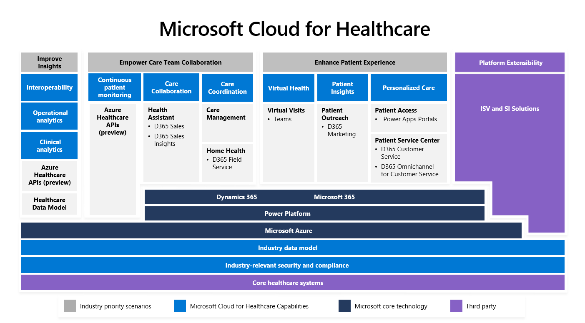

Microsoft Cloud for Healthcare is built on a foundation of security and trust, and it uses a combination of Microsoft products to address the industry-prioritized scenarios that are focused on the payor and provider space for healthcare. The following illustration shows the conceptual architecture of Microsoft Cloud for Healthcare, including the available applications and services that align to each capability, the associated required Microsoft technologies, and the external extensions that are driven by independent software vendors (ISVs) and system integrators.

> [!div class="mx-imgBorder"]
> 

## Core components

The core architectural components of Microsoft Cloud for Healthcare are:

-   **Core healthcare systems** - Represent your existing health data sources and systems, including EHR, medical imaging, external data, IoMT, billing and finance, and CRM data.

-   **Security and compliance** - Ingest and enrich any volume, variety, or velocity of healthcare data while gaining cloud computing capabilities and services from the world's most secure and compliant cloud.

-   **Industry data model** - Includes comprehensive data tables and relationships, which help make it easier for healthcare organizations to quickly set up and deploy solutions by using a common collection of entities.

-   **Microsoft platform layers** - The core healthcare capabilities are built on top of the industry-leading cloud technologies from Microsoft, including Azure, Microsoft Power Platform, Dynamics 365, and Microsoft 365. Use your data to power applications and business processes.

-   **Enhance patient experience** - Cloud for Healthcare delivers this core healthcare capability by using the following components:

    -   **Personalized care** - Use Patient Access by using a Power Apps portal. Allow care coordinators to chat with patients through the Patient Service Center by using Omnichannel for Customer Service.

    -   **Patient Outreach** - Target outreach to healthcare patients by using Dynamics 365 Marketing.

    -   **Virtual Health** - Integrate Microsoft Teams and a Dynamics 365 model-driven application that has been created specifically for virtual care providers.

-   **Empower care team collaboration** - Cloud for Healthcare delivers this core healthcare capability by using the following components:

    -   **Care collaboration** - Use Patient insights with Dynamics 365 Sales and the Sales Insights Add-in for Microsoft Dynamics 365 Sales.

    -   **Care coordination** - Provide Home Health capabilities by using the Dynamics 365 Field Service application and Dynamics 365 Field Service mobile app. Care Management is a Dynamics 365 model-driven application, which has no prerequisite Dynamics 365 applications.

    -   **Continuous patient monitoring** - Use Azure Healthcare APIs to unify data from diverse streams, such as clinical, imaging, device, and unstructured data, by using FHIR and DICOM services and Microsoft Azure IoT Connector for FHIR.

-   **Improve clinical and operational insights** - This capability focuses on using Azure Healthcare APIs (preview) and the healthcare data model for data interoperability, operational analytics, and clinical analytics.

-   **Platform extensibility** - This capability is delivered by ISVs and system integrators by extending the industry data model and integrating their solutions with Microsoft Cloud for Healthcare. Microsoft partners can build on and extend core cloud capabilities with healthcare-specific apps and platforms for payors, providers, biopharma, and MedTech organizations.

Microsoft Cloud for Healthcare provides unique capabilities that are designed to meet the healthcare industry's most pressing needs. With an end-to-end, highly configurable platform, you can take advantage of healthcare-specific capabilities, such as bots, portals for patients and care teams, templates, apps, AI models and intelligence, custom Power BI dashboards, preconfigured workflows, and more. The solution is also intended to help healthcare organizations meet industry-specific rules and regulations.

With its partners, Microsoft is reimagining healthcare with innovative tools and services on a highly configurable, end-to-end cloud platform that's specifically designed for the healthcare space. As a result, healthcare organizations can deliver better care, experiences, and insights to improve global health outcomes.

By bringing these components together with Microsoft Cloud for Healthcare, health organizations can enhance patient engagement, empower health team collaboration, and improve clinical and operational insights, all while protecting health information.
