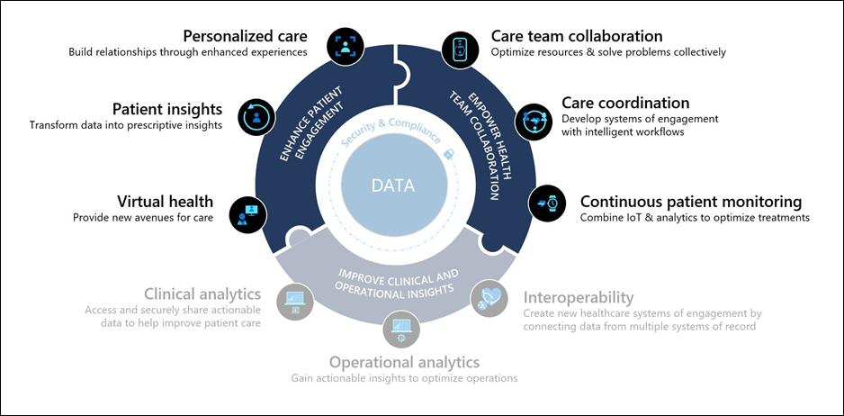
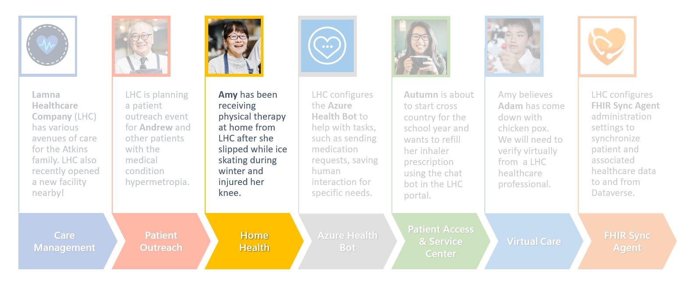

Microsoft Cloud for Healthcare's **Home Health** application allows provider personnel to schedule appointments for the patient based on various factors. It allows for the communication of the right information, at the right time, to the right people, to provide safe, and effective care to your patients. Manage home visit schedules, notify patients, and give access to medical information to the provider on the go.

Key capabilities of Home Health include:

-   **Schedule home visit:** Enable care coordinators to schedule home visit appointments, while viewing patient information directly in context.

-   **Provider scheduling:** View schedules of care team members and optimize visiting routes.

-   **Patient engagement:** Notify patients about upcoming appointments, follow up with patients after a visit, and automatically check with patients between visits.

-   **Home visit coordination:** Coordinate care and support distinct processes and tasks for the home visit.

## Industry prioritized scenarios

Home Health focuses on both **Empowering health team collaboration** and **Enhance patient engagement** priority scenarios by creating a system that allows for improved care team coordination with optimized resources and enhanced patient engagement with personalized experiences and home visits.

> [!div class="mx-imgBorder"]
> 

## Atkins family healthcare story

This lab will focus on the healthcare story of Amy Atkins.

> [!div class="mx-imgBorder"]
> 

Amy sprained her knee while ice skating last winter and was prescribed at-home physical therapy by her practitioner to rehabilitate the injury. To facilitate this home care scenario, Lamna Healthcare Company has deployed Microsoft Cloud for Healthcare's Home Health capabilities.

In this lab, you will play the role of a Lamna Healthcare Company Home Health dispatcher to configure the Home Health application.
