In this exercise, you will learn how to create a **Bookable Resource** to be used for scheduling a Home Health Work Order. A bookable resource in the Microsoft Cloud for Healthcare is anything that needs to be scheduled. This most commonly includes people, equipment, and physical spaces (facilities). Bookable Resources must be created before scheduling a Home Health Work Order.

Each resource can have different attributes that distinguish it from others, including but not limited to the following:

-   Characteristics (for example: Accounting)

-   Categories (for example: Manager)

-   Territories (for example: Washington State)

-   Organizational Unit (for example: Seattle Service Delivery)

-   Location (for example: Location Agnostic)

-   Resource Type (for example: User)

1.  Navigate to [https://make.powerapps.com](https://make.powerapps.com/?azure-portal=true).

1.  Open the **Field Service** app**.**

	> [!div class="mx-imgBorder"]
	> [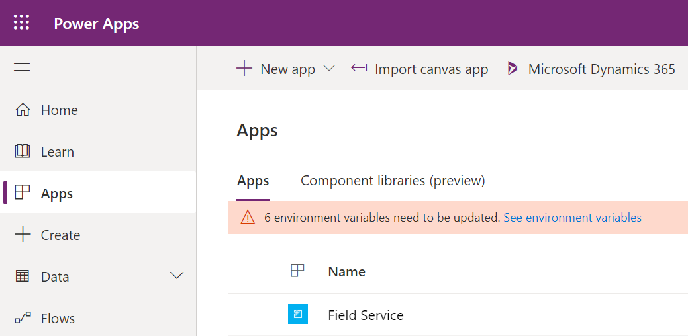](../media/field-service.png#lightbox)

1.  In the bottom left of the navigation pane, change the area from **Service** to **Resources.**

	> [!div class="mx-imgBorder"]
	> [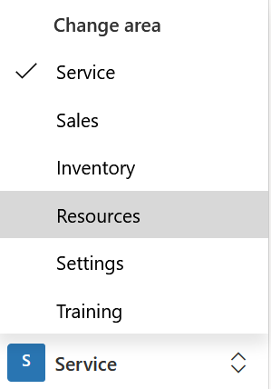](../media/resources.png#lightbox)

1.  This will take you to the Bookable Resources entity. Click **New** on the command bar to create a new **Bookable Resource**.

	> [!div class="mx-imgBorder"]
	> [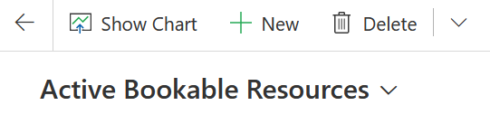](../media/new-bookable-resource.png#lightbox)

1.  Select **Resource Type**. A Resource type is a classification that describes who or what the resource is and how the resource relates to your organization. In this case, select **User**, who is a person and a member of your organization and needs access to the Field Service Mobile app.

	> [!div class="mx-imgBorder"]
	> [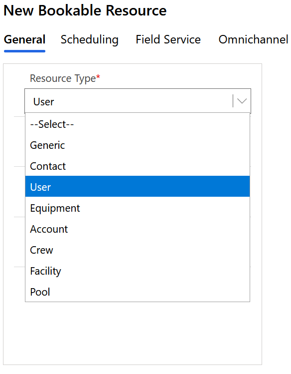](../media/user.png#lightbox)

1.  Pick a **User** and select their **Time Zone.**

	> [!div class="mx-imgBorder"]
	> 

1.  Click **Scheduling** to decide where the resource starts and ends his or her working day for scheduling and routing purposes. There are three options available when selecting the **Start/End location** for the Bookable Resource:

	-   **Location agnostic** - select this option if the location of this resource is not required for the business need and does not need to be considered during the scheduling process. If the work location of a requirement is set to **on site**, location agnostic resources will not return in results.
	
	-   **Resource Address** - select this option if the resource starts and ends his or her day at a unique location. The exact location is derived from the latitude and longitude values on the related user, account, or contact records depending on the resource type. 
	
	-   **Organizational Unit** - select this option if the resource starts and ends the day at an organizational unit, typically representing a company location.

	In this case, choose **Location Agnostic.**

	> [!div class="mx-imgBorder"]
	> [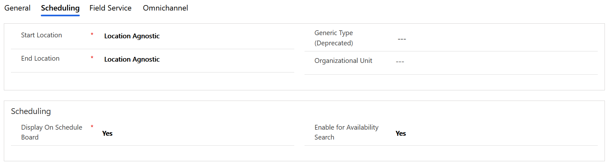](../media/location-agnostic.png#lightbox)

1.  Click the **Field Service** tab to optionally configure any other aspects of the Bookable Resource. **Save** the record.

1.  After **saving** the bookable resource, it's time to set the **working hours** of the resource. Working hours are considered by the following:

	-   The schedule board by displaying working and nonworking hours as different colors.
	
	-   The schedule assistant by only displaying resources that are working in the result.
	
	-   Resource Scheduling Optimization, which automatically books requirements to resources that are working.

	Click Show **Working Hours** on the command bar:

	> [!div class="mx-imgBorder"]
	> [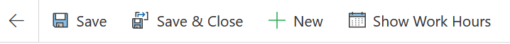](../media/show-work-hours.png#lightbox)

1. Click **+New** > **Working Hours.**

	> [!div class="mx-imgBorder"]
	> [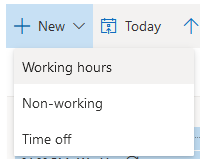](../media/working-hours.png#lightbox)

1. Choose **date** you want the working schedule to begin on, the beginning and end **time** of working hours (such as 8am to 5pm), along with a **repeat** option such as "every day" and then click off Sunday and Saturday. Click **Save**.

	> [!div class="mx-imgBorder"]
	> [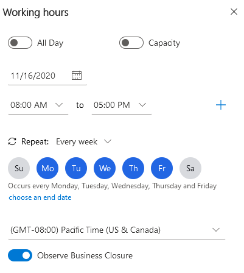](../media/work-hour-details.png#lightbox)

1. Go back to General and create a **Resource Characteristic** by selecting **+New Bookable Resource Characteristic**.

	> [!div class="mx-imgBorder"]
	> [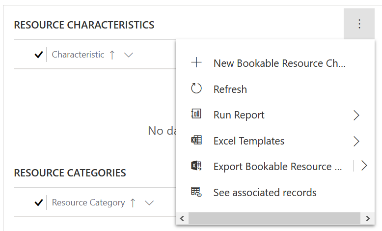](../media/new-bookable-resource-characteristic.png#lightbox)

1. In the Characteristic field, click the magnifying glass and select **+New Characteristic.**

	> [!div class="mx-imgBorder"]
	> [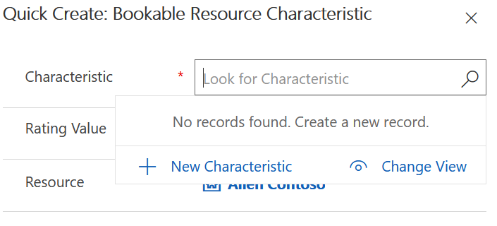](../media/new-characteristic.png#lightbox)

1. When prompted to leave this page, click **OK.**

	> [!div class="mx-imgBorder"]
	> [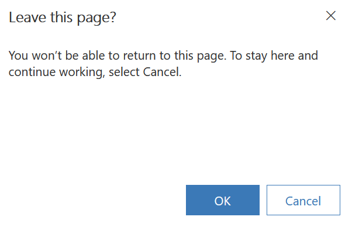](../media/ok-button.png#lightbox)

1. Type "**Spanish fluency**" for the **Name** and click **Save & Close.**

	> [!div class="mx-imgBorder"]
	> [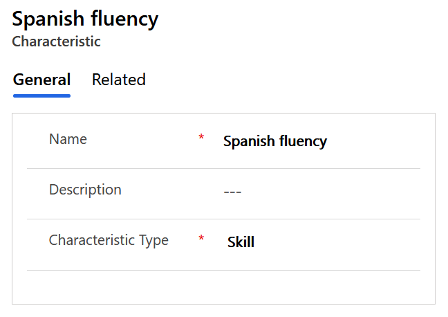](../media/spanish-fluency.png#lightbox)

1. Back on the Bookable Resource record on the General tab, click **+New Bookable Resource Characteristic**.

	> [!div class="mx-imgBorder"]
	> 

1. In the Characteristic field, click the magnifying glass, search for and select the "**Spanish fluency**" **Resource Characteristic** that you created. Click **Save & Close**.

	> [!div class="mx-imgBorder"]
	> [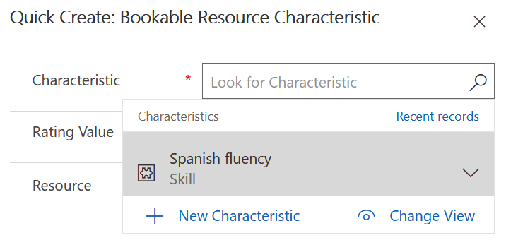](../media/search-characteristic.png#lightbox)

> [!NOTE]
> Characteristics represent a resource's skills and certifications. This could be concrete, like a CPR certification; more general, like accounting or web development experience; or as simple as security clearance for a specific building or fluency in the Spanish language.

1. In order to have more data in the system, create **two** more **Bookable Resources** following the same process. For each of them, select **Contact** as the **Resource Type** and choose any **Contact** in the system. Choose **Location Agnostic** as before and click **Save**. Configure the **Work Hours** the same as the previous Bookable Resource and click **Save & Close**.

**Congratulations**! You have created a Bookable Resource. In the next task, we will use this bookable resource to help configure the Schedule Board.

