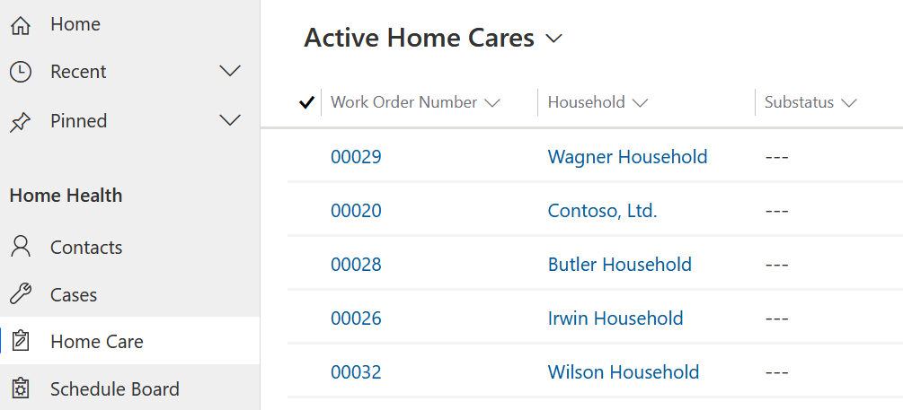

In this exercise, you will configure the schedule board for the **Bookable Resource** that you created in the previous task. The schedule board provides an overview of resource availability and bookings you can make. Before you use the schedule board, it is important to set up the views and filters to your preference. To use the schedule board booking functionality, geocoding, and location services, you need to turn on maps.

Here is an example of a configured **Schedule Board**:

> [!div class="mx-imgBorder"]
> 

1.  Navigate to [https://make.powerapps.com](https://make.powerapps.com/).

1.  Open the **Resource Scheduling** app.

	> [!div class="mx-imgBorder"]
	> 

1.  Change the area in the bottom-left navigation drop-down from Resource Scheduling to **Settings.**

	> [!div class="mx-imgBorder"]
	> 

1.  Click **Administration.**

	> [!div class="mx-imgBorder"]
	> 

1.  Click **Scheduling Parameters.**

	> [!div class="mx-imgBorder"]
	> 

1.  Change "**Connect to Maps**" to **Yes**. Then click **OK** to accept the terms.

	> [!div class="mx-imgBorder"]
	> 

	> [!div class="mx-imgBorder"]
	> 

1.  Click **Save & Close.**

1.  Open the **Home Health** app.

	> [!div class="mx-imgBorder"]
	> 

1.  Click **Home Care** and open any **Home Care Work Order.**

	> [!div class="mx-imgBorder"]
	> 

1. Click **Related** and then click **Characteristics.**

	> [!div class="mx-imgBorder"]
	> 

1. Click **+ New Requirement Characteristic.**

	> [!div class="mx-imgBorder"]
	> 

12. Choose "**Spanish fluency**" for the **Characteristic** and a desired Work Order for the **Resource Requirement**. Click **Save & Close.**

	> [!div class="mx-imgBorder"]
	> 

	> [!IMPORTANT]
	> Make sure the **Work Order** number populated in the **Resource Requirement** field matches the Work Order number on the **Field Service** tab.

1. Click **Schedule Board.**

	> [!div class="mx-imgBorder"]
	> 

1. Click the **+** button in the upper right corner to create a new **Schedule Board tab.**

	> [!div class="mx-imgBorder"]
	> 

1. Name the new Schedule Board tab "**My Schedule Board Tab**". Leave all defaults and click **Add**.

	> [!div class="mx-imgBorder"]
	> 

1. Click on the Scheduler Settings **gear**

	> [!div class="mx-imgBorder"]
	> 

1. Change the Hours view to be closer to typical working hours, such as 6am to 6pm.

	> [!div class="mx-imgBorder"]
	> 

1. Find the work order that you added the **Spanish fluency** characteristic to and click on the grid to highlight it. Click **Find Availability** to open the Schedule Assistant filter.

	> [!div class="mx-imgBorder"]
	> 

1. Notice that the other two Bookable Resources that you created that do NOT have the "Spanish fluency" characteristic are dropped from the search. Click the **Book** button on the Bookable Resource's schedule to schedule the work order.

	> [!div class="mx-imgBorder"]
	> 

1. The work order is now scheduled and has disappeared from the bottom grid. Click **Exit Search** to close the pane.

	> [!div class="mx-imgBorder"]
	> 

**Congratulations**! You gave configured a Schedule Board tab and scheduled a Home Health visit using the bookable resource that you created in the previous task in this exercise.

