In this exercise, you will configure the schedule board for the bookable resource that you created in the previous task. The schedule board provides an overview of resource and booking availability. Before you use the schedule board, you need to set up the views and filters to your preference. To use the schedule board booking functionality, geocoding, and location services, you need to turn on the **Maps** feature.

The following screenshot shows an example of a configured schedule board.

> [!div class="mx-imgBorder"]
> [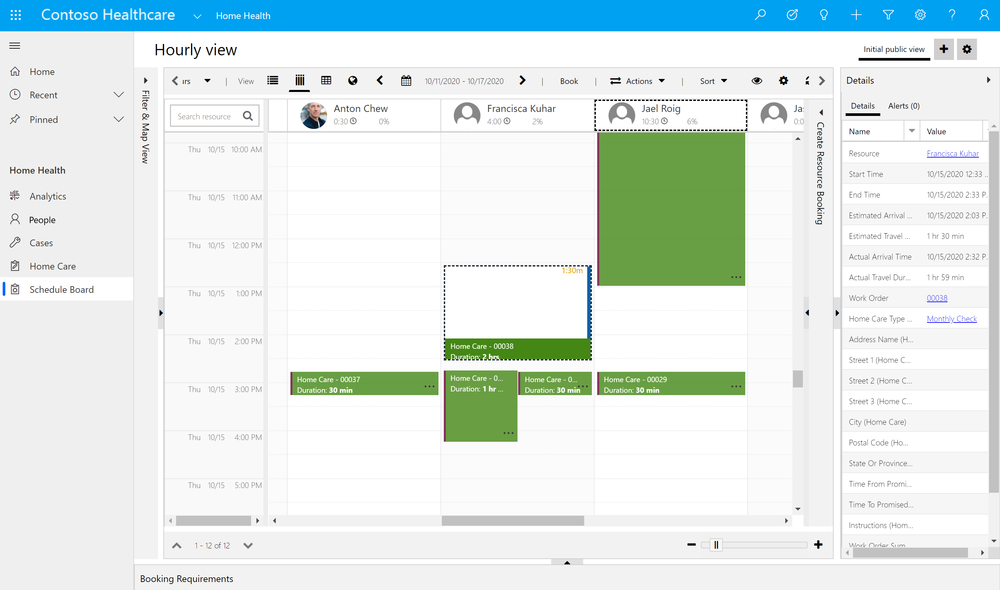](../media/schedule-board.png#lightbox)

1.  Go to [https://make.powerapps.com](https://make.powerapps.com/).

1.  Go to Apps and open the Resource Scheduling app.

	> [!div class="mx-imgBorder"]
	> [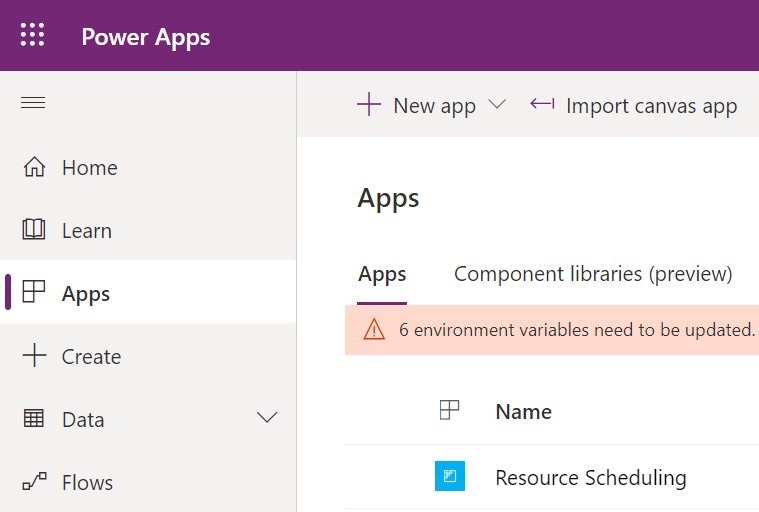](../media/resource-scheduling.png#lightbox)

1.  Change the area in the lower-left dropdown from **Resource Scheduling** to **Settings**.

	> [!div class="mx-imgBorder"]
	> [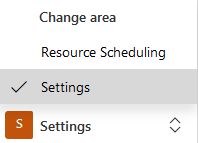](../media/settings.png#lightbox)

1.  Select **Administration**.

	> [!div class="mx-imgBorder"]
	> [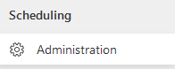](../media/administration.png#lightbox)

1.  Select **Scheduling Parameters**.

	> [!div class="mx-imgBorder"]
	> [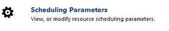](../media/scheduling-parameters.png#lightbox)

1.  Change the **Connect to Maps** option to **Yes**, and then select **OK** to accept the terms.

	> [!div class="mx-imgBorder"]
	> 

	> [!div class="mx-imgBorder"]
	> [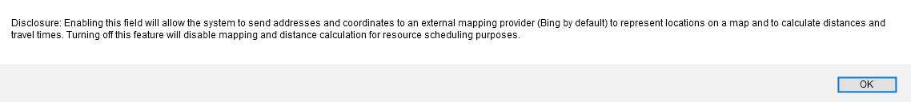](../media/terms.png#lightbox)

1.  Select **Save & Close**.

1.  Open the **Home Health** app.

	> [!div class="mx-imgBorder"]
	> 

1.  Now we will associate the Thomson Household home care work order with the Spanish fluency characteristic, so they match Monica with someone who is fluent in Spanish.  We have already applied this characteristic to her practitioner. We also want to set the estimated duration for the home visit.

	Select **Home Care** on the left sitemap and open the Home Care Work Order record number 00034 associated with the **Thomson Household**.

	> [!div class="mx-imgBorder"]
	> [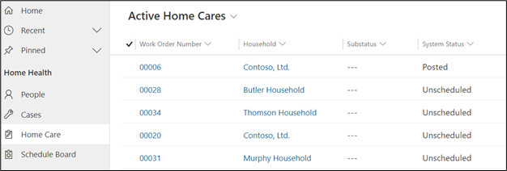](../media/home-care-record.png#lightbox)

1. On the Summary tab, scroll down to the Primary Incident section and set the **Primary Incident Estimated Duration** to 1 hour (this will ensure that the work order takes up time on the Resource’s calendar).

	> [!div class="mx-imgBorder"]
	> 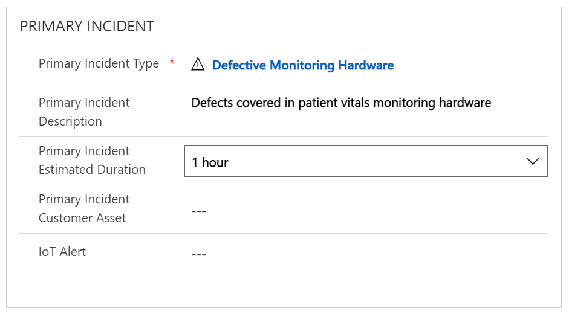

1. Select **Related** and then select **Characteristics**.

	> [!div class="mx-imgBorder"]
	> 

1. Select **+ New Requirement Characteristic**.

	> [!div class="mx-imgBorder"]
	> [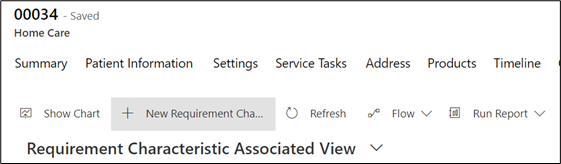](../media/new-requirement-characteristic-button.png#lightbox)

1. Select **Spanish fluency** for the **Characteristic** and work order 00034 for the **Resource Requirement**.

	> [!div class="mx-imgBorder"]
	> [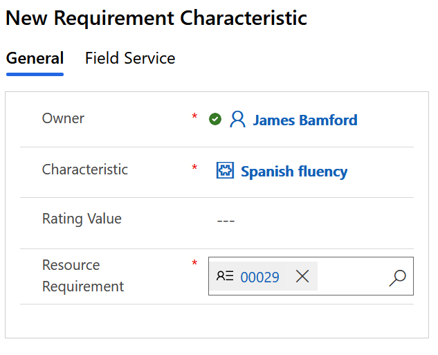](../media/spanish-fluency-characteristic.png#lightbox)

	> [!IMPORTANT]
	> Make sure that the **Work Order Number** that is populated in the **Resource Requirement** field matches the **Work Order Number** on the **Field Service** tab.

	> [!div class="mx-imgBorder"]
	> 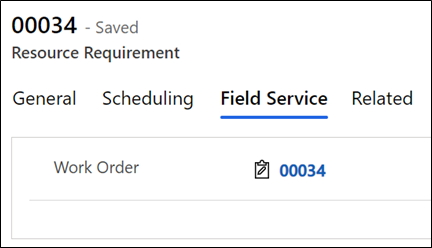
	
1. Select Save and Close.  You will now see the new characteristic requirement in the subgrid.

	> [!div class="mx-imgBorder"]
	> 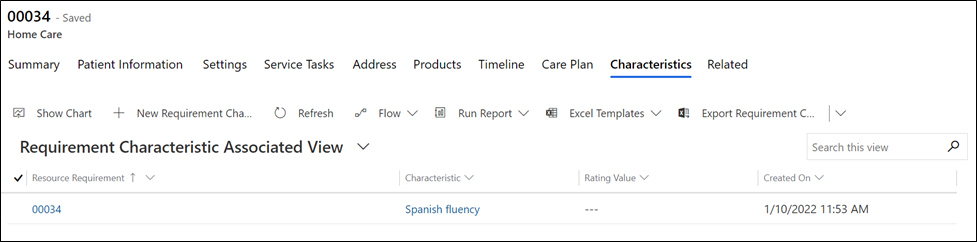

1. Select **Schedule Board**.

	> [!div class="mx-imgBorder"]
	> [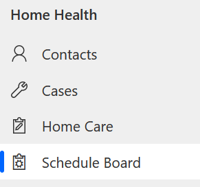](../media/schedule-board-menu.png#lightbox)

1. Select the plus (**+**) button in the upper-right corner to create a new schedule board tab.

	> [!div class="mx-imgBorder"]
	> [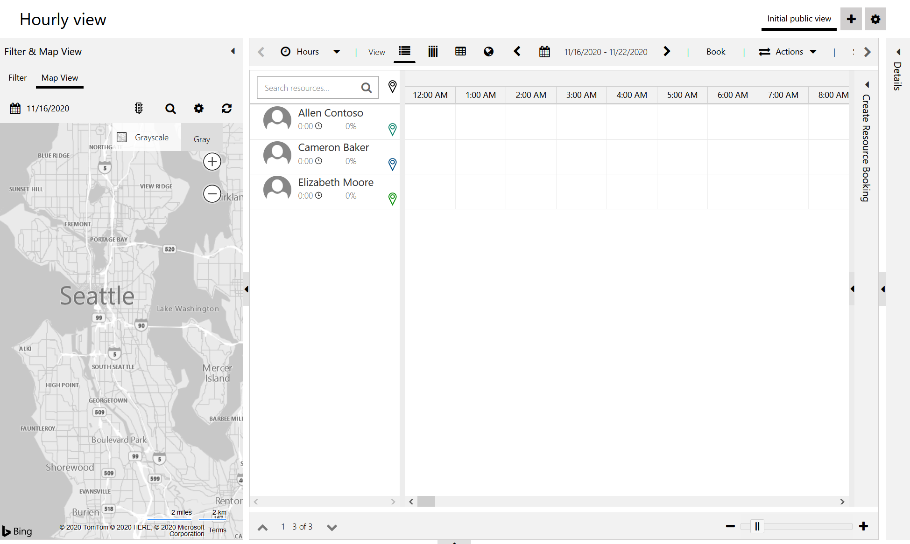](../media/plus-button.png#lightbox)

1. Name the new schedule board tab **My Schedule Board Tab**. Leave all defaults and then select **Add**.

	> [!div class="mx-imgBorder"]
	> [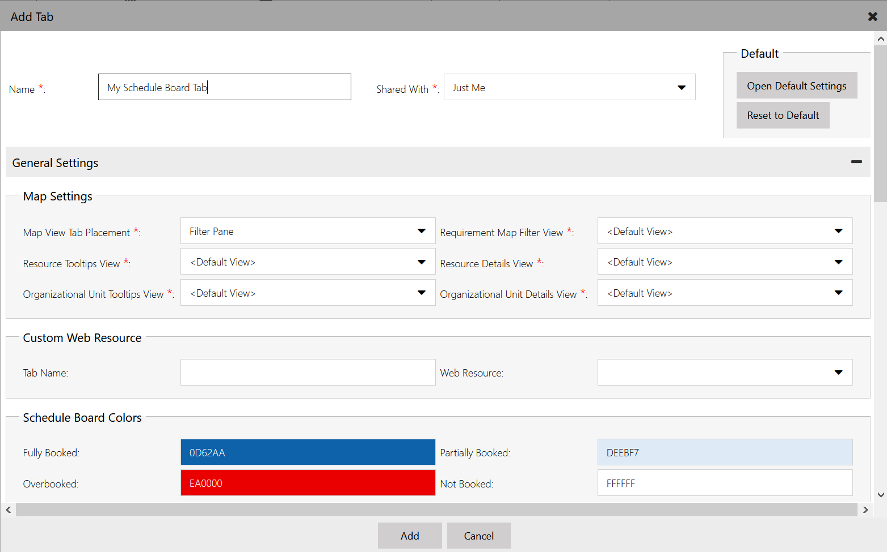](../media/my-schedule-board-tab.png#lightbox)

1. Select the scheduler settings **gear** icon.

	> [!div class="mx-imgBorder"]
	> [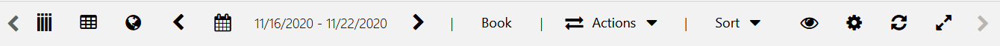](../media/gear.png#lightbox)

1. Change the hours view to be closer to typical working hours, such as 6:00 AM to 6:00 PM.

	> [!div class="mx-imgBorder"]
	> [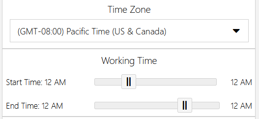](../media/time-zone.png#lightbox)

1.	Open the Unscheduled Work Orders by selecting the small arrow at the bottom of the screen.

	> [!div class="mx-imgBorder"]
	> [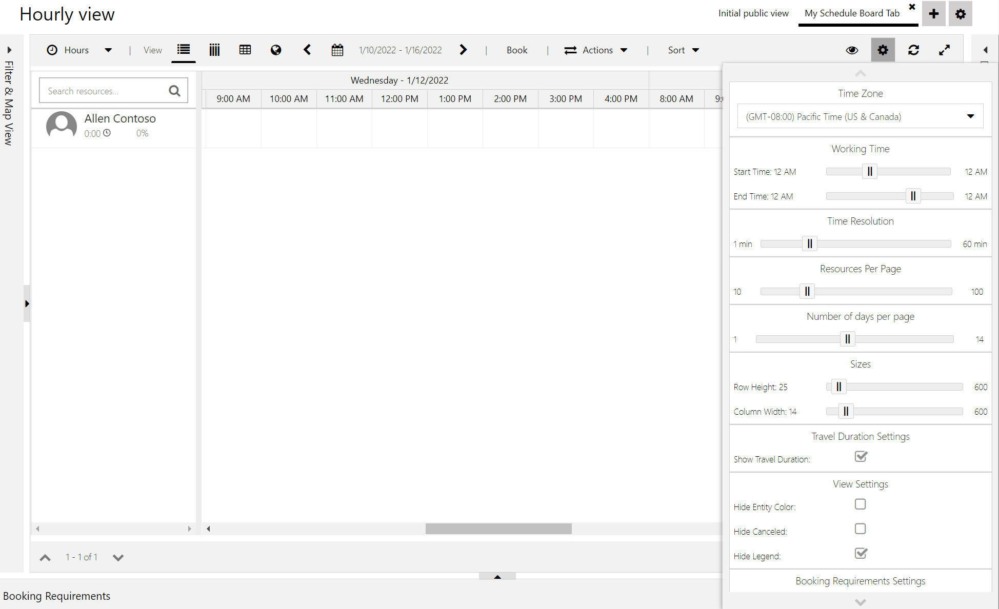](../media/arrow.png#lightbox)

1. Select the **Unscheduled Work Orders** tab. Find work order 00034 where you added the **Spanish fluency** characteristic and select the grid to highlight it. Select **Find Availability** to open the Schedule Assistant filter.

	> [!div class="mx-imgBorder"]
	> [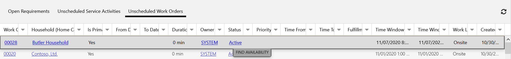](../media/find-availability.png#lightbox)

1. Notice that the two other bookable resources that you created, which don't have the **Spanish fluency** characteristic set, are dropped from the search. Select the **Book** button on the bookable resource's schedule to schedule the work order.

	> [!div class="mx-imgBorder"]
	> [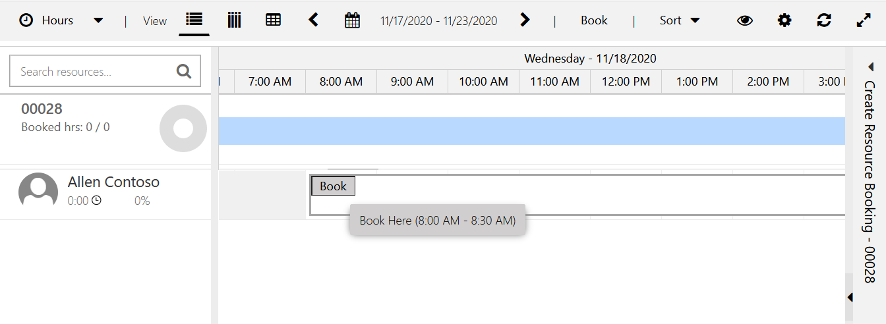](../media/book.png#lightbox)

1. The work order is now scheduled and will no longer show in the Unscheduled Work Order grid. The Resource Optimizing tool will schedule it for the next available time. Select **Exit Search** to close the pane.

	> [!div class="mx-imgBorder"]
	> [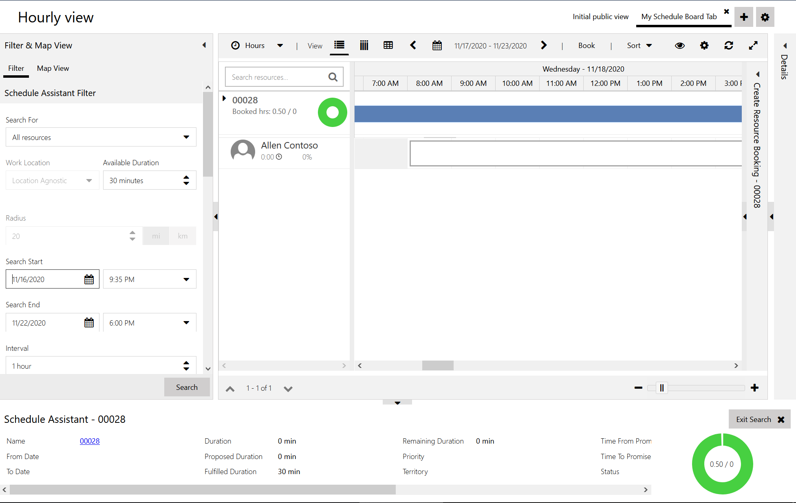](../media/exit-search.png#lightbox)

Congratulations, you have configured a schedule board tab and scheduled a Home Health visit by using the bookable resource that you created in the previous task in this exercise. For more information on schedule boards, see [Use and configure the schedule board (Dynamics 365 Field Service)](/dynamics365/field-service/configure-schedule-board/?azure-portal=true).

