In this exercise, we are going to walk you through the Field Service Mobile App and demonstrate how to use Care Management components from the perspective of a Nurse or a Physical Therapist out in the field working with a patient. We will walk through the installation process, how to set up Home Health users and security profiles, and how to use the app to complete work orders.

[The Field Service (Dynamics 365) mobile app](/dynamics365/field-service/mobile-power-app-overview/?azure-portal=true) is designed and optimized for mobile health workers to view Dynamics 365 Home Health work orders and patient information. This mobile app is built on Microsoft Power Platform and is customizable to your business needs with the same admin console as all Dynamics 365 business apps.

It is available natively for Apple iOS and Google Android phones and tablets, the Field Service (Dynamics 365) mobile app offers technicians many capabilities they need to perform onsite customer service, such as the following:

-   A calendar view of assigned jobs

-   Support for picture, video, and asset barcode scanning

-   Customer signature capture

-   Offline capabilities so mobile health workers can continue viewing and recording work in areas without internet

Here is a calendar view of scheduled work orders:

> [!div class="mx-imgBorder"]
> 

## Task 1: Assign security roles to Field Service mobile users

In this task, we will assign the **Field Service - Resource** role to Home Health workers.

1.  Navigate to [https://make.powerapps.com](https://make.powerapps.com/?azure-portal=true).

1.  Go to **Apps** to select the **Field Service Mobile app** and then click the **gear icon** in the upper right-hand corner and go to **Advanced Settings**.

	> [!div class="mx-imgBorder"]
	> [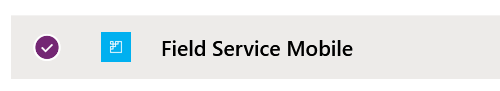](../media/field-service-mobile.png#lightbox)

	> [!div class="mx-imgBorder"]
	> 

1.  Click **Settings** and then click **Security**.

	> [!div class="mx-imgBorder"]
	> [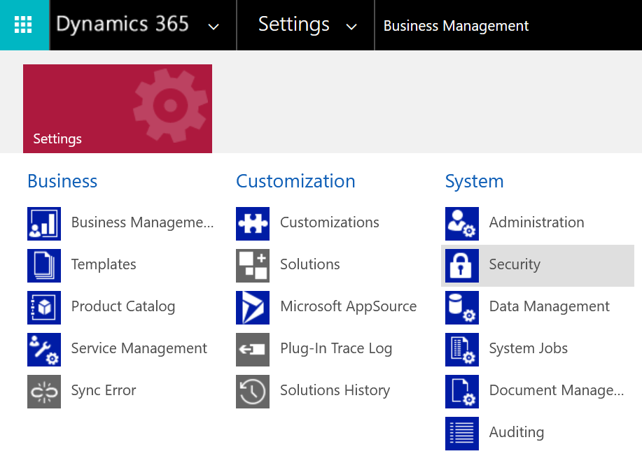](../media/system-security.png#lightbox)

1.  Click **Users**.

	> [!div class="mx-imgBorder"]
	> [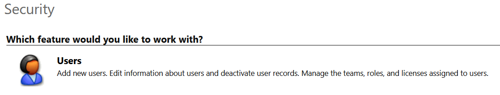](../media/users-feature.png#lightbox)

1.  Change the view to show "**Enabled Users**".

	> [!div class="mx-imgBorder"]
	> [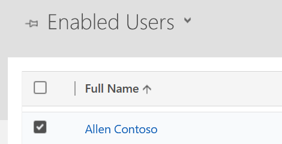](../media/enabled-users.png#lightbox)

1.  Find and select the user whom you would like to assign the "Field Service Mobile - Resource" role and select **Manage Roles**.

	> [!div class="mx-imgBorder"]
	> 

1.  Scroll down to select the "Field Service - Resource" security role and click OK.

	> [!div class="mx-imgBorder"]
	> [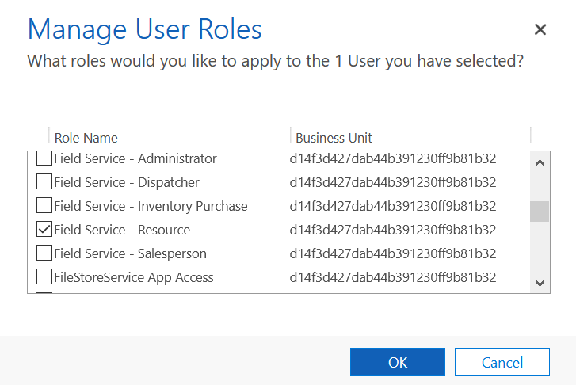](../media/manage-user-roles.png#lightbox)

**Congratulations!** You have assigned the Field Service - Resource role to a Field Service Mobile Home Health user in the Microsoft Cloud for Healthcare.

## Task 2: Download the Field Service mobile app and sign in

In this task, we will walk through how to download the Field Service Mobile app to an iOS or Android device and sign in.

1.  Go to the app store on your iOS or Android device and search for **Dynamics 365 Field Service.**

1.  Download the app called **Field Service (Dynamics 365)**, as seen in the following screenshot. It's the mobile app built on the Power Platform.

	> [!div class="mx-imgBorder"]
	> 

1.  **Launch** the app and **sign in** with the Microsoft Cloud for Healthcare username and password for the user that you assigned the "Field Service - Resource" security role to in the previous task.

	> [!div class="mx-imgBorder"]
	> 

**Congratulations!** You have downloaded and signed into the Field Service Mobile as a Home Health user in the Microsoft Cloud for Healthcare

## Task 3: Use the Field Service mobile app to manage Home Health work orders

In this task, we will assign a Home Health Work Order to our Home Health Bookable Resource. We will then view and make updates to it in the Field Service mobile app, and view those changes in the Microsoft Cloud for Healthcare Home Health app.

1.  **Navigate** to [https://make.powerapps.com](https://make.powerapps.com/?azure-portal=true).

1.  **Open** the **Home Health** app

	> [!div class="mx-imgBorder"]
	> [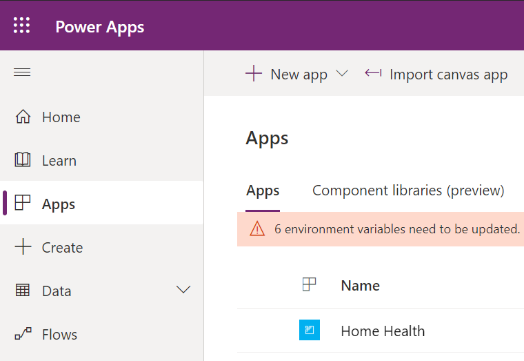](../media/home-health-app-selected.png#lightbox)

1.  **Navigate** to **Home Care** and **open** the unscheduled **Home Care Work Order 00020** for the Contoso, Ltd. Household. (opening any unscheduled Home Care Work Order is fine):

	> [!div class="mx-imgBorder"]
	> 

	> [!div class="mx-imgBorder"]
	> [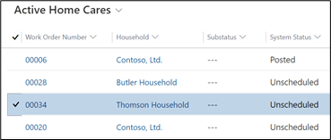](../media/active-home-cares.png#lightbox)

1.  Scroll down to the **Primary Incident** section and set the **Primary Incident Estimated Duration** to **1 hour** (this will ensure that the work order takes up time on the Resource's calendar once scheduled).

	> [!div class="mx-imgBorder"]
	> [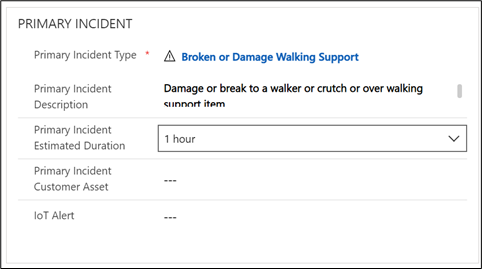](../media/duration.png#lightbox)

1.  Click **Save & Close**.

	> [!div class="mx-imgBorder"]
	> [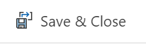](../media/save-close-button.png#lightbox)

1.  Navigate to the **Schedule Board** and click **Unscheduled Work Orders.**

	> [!div class="mx-imgBorder"]
	> [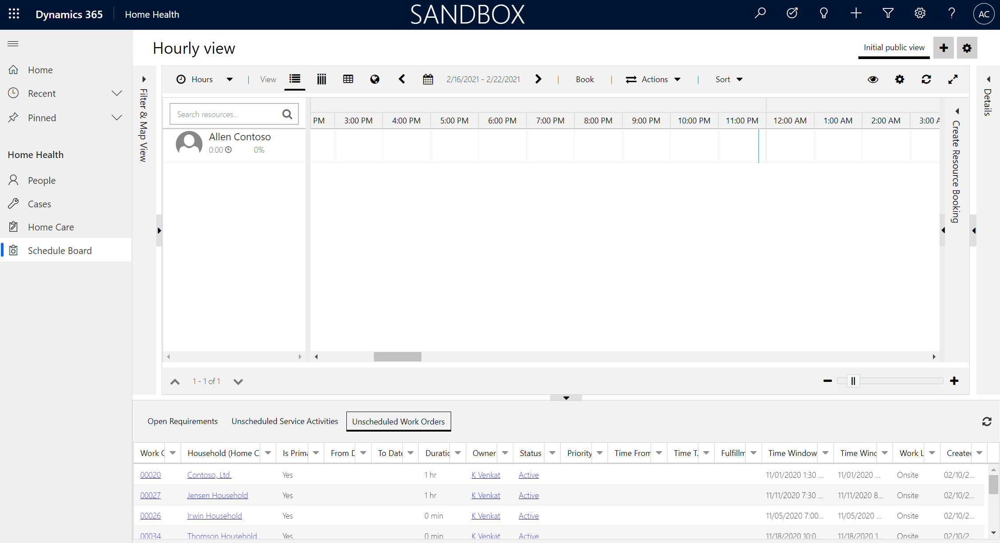](../media/unscheduled.png#lightbox)

1.  **Drag** the **Home Health Work Order** onto the **Schedule Board** to assign it to your **Bookable Resource**.

	> [!div class="mx-imgBorder"]
	> 

1.  On your **mobile device**, log into the **Field Service Mobile App** as your Bookable Resource user. If you encounter a message that says, "Contact your administrator for access to your organization's mobile apps", select the menu icon in the top left and toggle **Show non-production apps** to *Yes* (as the list shows production apps by default).

	> [!div class="mx-imgBorder"]
	> 

1.  In the list of environments, **find** the Microsoft Cloud for Healthcare **environment** that you have been working in. From there, you will find the Home Health Work Order in the calendar view in an "In Progress" state.

	> [!div class="mx-imgBorder"]
	> [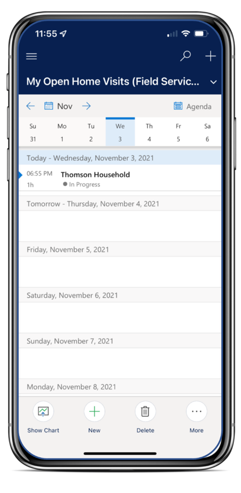](../media/in-progress.png#lightbox)

1. **Click** to open the **Work Order**. Notice the Booking Status says In Progress.

	> [!div class="mx-imgBorder"]
	> [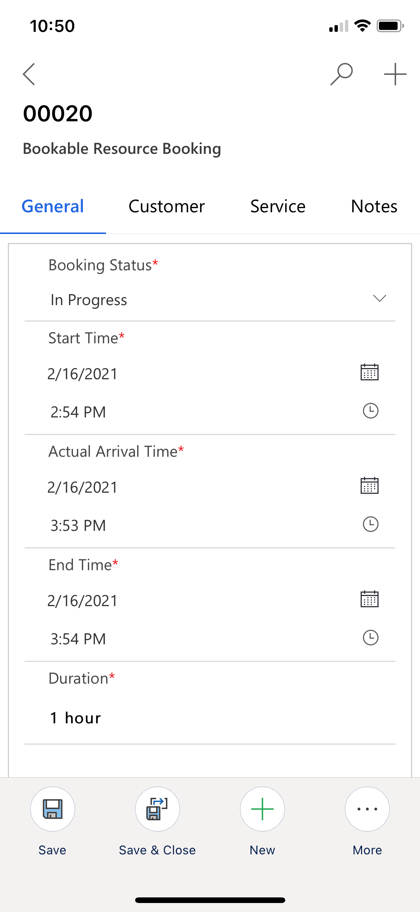](../media/booking-status.png#lightbox)

1. Update the **Booking Status** from "In Progress" to "**Completed**" to close the Work Order and click **Save**.

	> [!div class="mx-imgBorder"]
	> 

	> [!div class="mx-imgBorder"]
	> 

1. **Navigate** back to the **Home Health app**, click **Home Care** on the site map, and find for your Work Order. You will see that the **System Status** has been updated to "Open - Completed".

	> [!div class="mx-imgBorder"]
	> 

	> [!div class="mx-imgBorder"]
	> [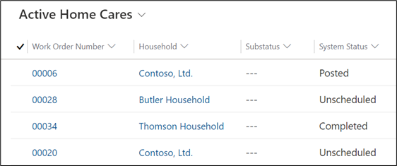](../media/open-completed.png#lightbox)

**Congratulations!** You have assigned a Home Health Work Order to a Home Health Bookable Resource, made updates to the work order in the Field Service mobile app, and then viewed those changes in the Microsoft Cloud for Healthcare Home Health app.

