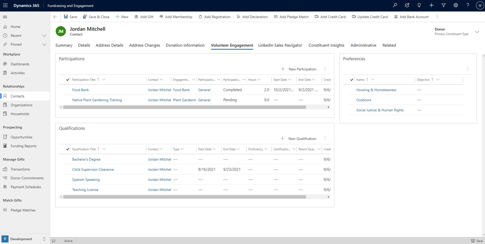

If you're using Fundraising and Engagement, your data is integrated. You can see volunteering information as part of the constituent record, alongside your fundraising activities. The screenshot below shows the contact record in Fundraising and Engagement for the volunteer Jordan Mitchell. From here the volunteer engagement information, such as participation in engagements, qualifications, and preferences is visible.

> [!div class="mx-imgBorder"]
> 