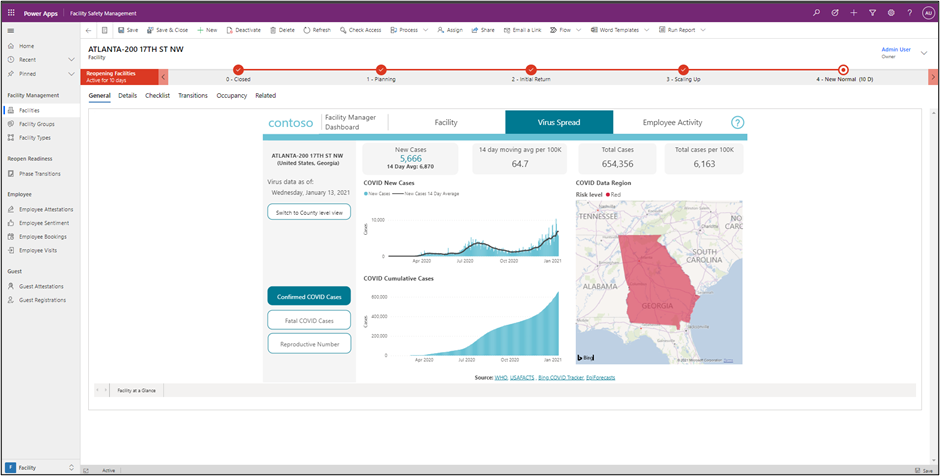
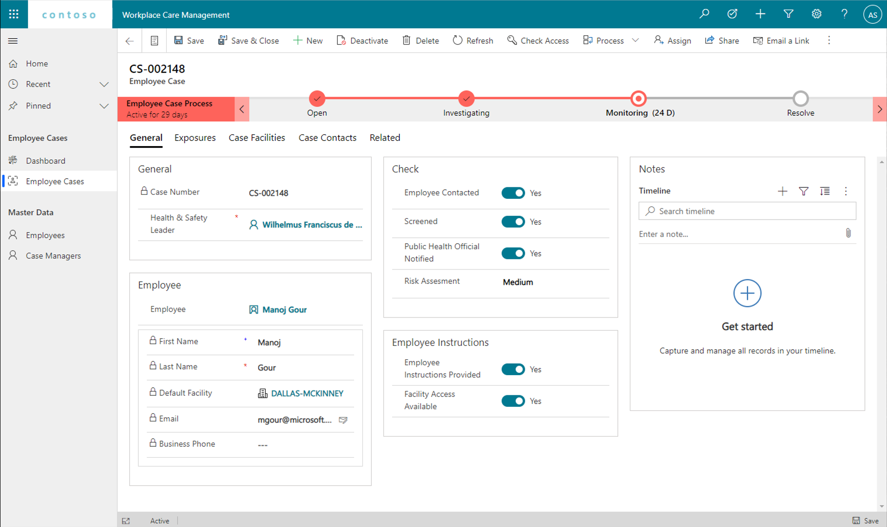
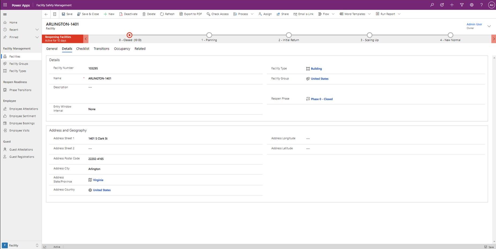
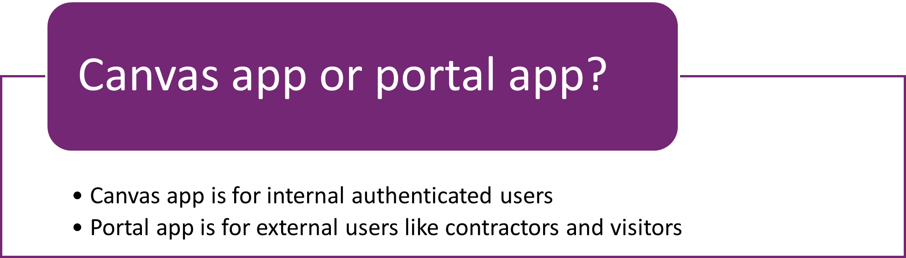
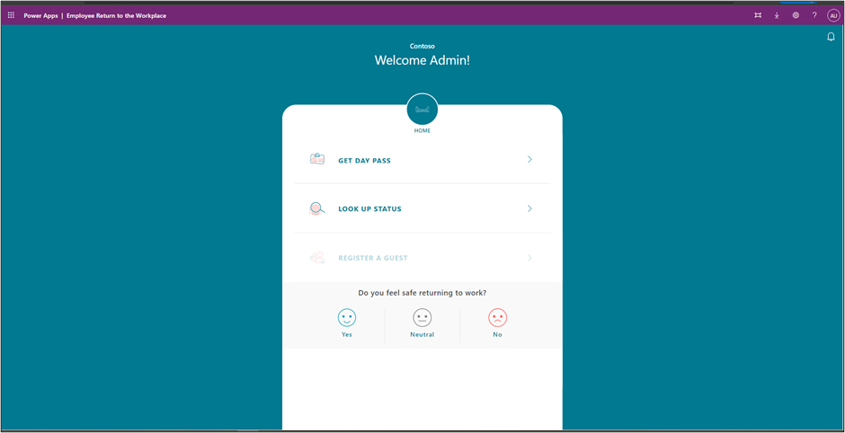
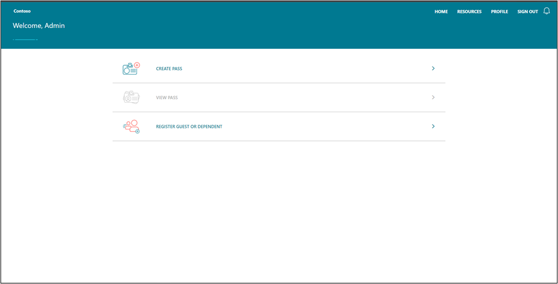

Microsoft's **Return to the Workplace** solution offers the tools needed to help transition workforces back into the facility. It gives facility managers or anyone responsible for the operational control of an organization's buildings and other facilities, to maintain a safe, clean, and productive environment for the occupants.

The Return to the Workplace solution provides many different features to plan, coordinate, and manage the safe return to the workplace. The solution contains modules for location readiness, location management, employee health and safety management, and workplace care management.

## Return to the Workplace features and benefits

The solution is composed of several different apps targeting employees, visitors, and facility managers. Facility managers can track reopening phases, guest access, and more, all configurable based on any given facility location and their current localized rules for returning to work. Additionally, Return to Workplace has dashboards to help determine the readiness of your organization. Return to the Workplace is a global application and is localized in 11 languages.

The **Location Readiness dashboard** helps determine the readiness of the facilities and efficiently manage their safe reopening. Facility managers and task force leaders can use the Location Readiness dashboard to quickly make informed decisions using critical factors like COVID-19 infection rates and availability of supplies. This dashboard can be accessed from the Facility Safety Management app, or Power BI.

> [!div class="mx-imgBorder"]
> 

The **Workplace Care Management** model-driven app gives health and safety leaders the tools they need to actively manage COVID-19 cases, identify hot spots for safety improvement, and import data from external systems to support case management and manual contact tracing. The **Workplace Care Management dashboard** allows you to monitor the workplace care management from the Workplace Care Management app.

> [!div class="mx-imgBorder"]
> 

The **Facility Safety Management** model-driven app gives facility managers the tools they need to manage the reopening and readiness of the facilities. This helps organizations ensure that they can provide a safe working environment for employees to return to the workplace.

> [!div class="mx-imgBorder"]
> 

> [!div class="mx-imgBorder"]
> 

The **Employee Return to the Workplace** *canvas app* offers your workforce the self-service tool that they need to feel confident about returning to the workplace and remain productive while onsite. They can use the *canvas app* to check in remotely and self-screen prior to entering a building.

> [!div class="mx-imgBorder"]
> 

The **Return to the Workplace** *portal app* allows third-parties to follow a similar self-service process as the employee, by allowing them to check in on invitation and self-screen before getting a pass. Users of the portal can add new guests or dependents, ensuring the solution is decentralized and scalable. Like all *portal apps*, it has a companion model-driven app for internal authenticated users to manage site content and user experience.

> [!div class="mx-imgBorder"]
> 