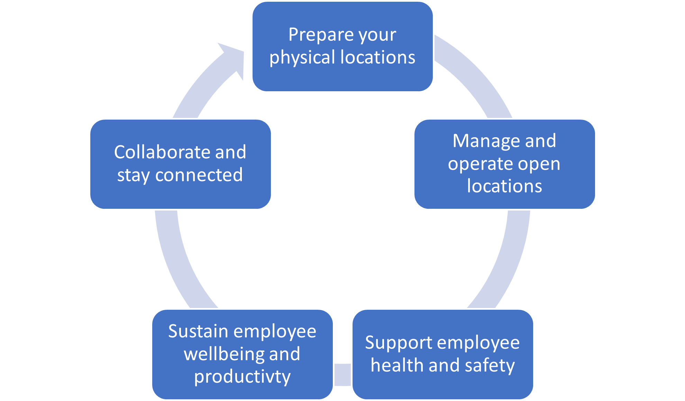

In addition to the Return to the Workplace solution, Microsoft offers several resources to help you when it's time to prepare for the return to work. The [Return to Work: A Guide to Building Resilience](https://clouddamcdnprodep.azureedge.net/gdc/gdcrKoiqK/original/?azure-portal=true) article offers many checklists, tips, and tools to help in your planning. The guide points out several stages of the process and offers guidance and resources for each stage.

> [!div class="mx-imgBorder"]
> 

## Prepare your physical locations

As conditions allow for you to plan the return to work, preparing the physical location can vary greatly depending on the conditions in various global and regional areas. The following questions and activities can get you started and help identify gaps in the planning. Some activities are as simple as creating a dashboard to monitor data, while other actions suggest additional actions on that data such as ensuring that you have appropriate personal protective equipment available as needed.

|     Questions to consider                                                               |     Recommended activities                                                                                                                                       |
|-----------------------------------------------------------------------------------------|------------------------------------------------------------------------------------------------------------------------------------------------------------------|
|     Does   leadership have visibility into governance guidelines and infection data?    |     Set up   dashboards to view data in real time to make faster, more proactive   decisions.                                                                    |
|     Do you have adequate supplies and resources for your   employees?                   |     Assess and adjust your levels of personal protection equipment,   sanitation supplies, and other critical resources by tracking virus spread   and cases.    |
|     Can you   monitor locations to adjust your reopening phases?                        |     Monitor   daily changes in infection rates, employee sentiment, supplies, and capacity   in a single, consolidated dashboard.                                |
|     Are you adjusting your reopening approach based on   locations?                     |     Determine if you need to take a phased reopening approach by   evaluating each facility by geography and location.                                           |
|     How are   you monitoring your progress in returning to work?                        |     Use a   readiness checklist to track your preparations and progress and   monitor what stage you’re at.                                               |

Preparation is key to setting up you and your organization for success. Having the right tools (both physical and technical) in place, will ensure that you can document and prepare to implement the plan in a way that is visible to all parties who need to be kept informed, regardless of their geographic location. Using Microsoft cloud solutions ensures that you can lead a safe return to the workplace, no matter where you and your team are physically located. Stay up to date with your tasks by using a single, synchronized list across Microsoft Outlook and mobile, regardless of your allocation with Microsoft To Do. For more information, see the [help and learning resource](https://support.microsoft.com/todo/?azure-portal=true) documentation.

## Manage and operate open locations

As your locations reopen for business, your concerns will shift to other tasks such as disinfecting areas, controlling entry, and supporting hybrid teams of remote and onsite workers. The following questions can help guide you toward solutions for your particular needs in opening your business. After you have identified those needs, you will begin to explore what the Microsoft Internet of Things (IoT) solutions might offer to help your team.

|     Questions to consider                                                                |     Recommended activities                                                                                                                                                  |
|------------------------------------------------------------------------------------------|-----------------------------------------------------------------------------------------------------------------------------------------------------------------------------|
|     How will   you monitor safety supplies and services?                                 |     Crowdsource   data from your frontline staff to adjust supply levels quickly and   accurately.                                                                          |
|     How will you monitor location occupancy?                                             |     Track real-time staff availability, including security and   maintenance teams, to view and adjust occupancy levels as needed.                                          |
|     How will   your employees know which facilities are available?                       |     Offer   up-to-date facility information to employees so that they can make more confident   decisions on returning.                                                              |
|     How will you ensure that facilities are cleaned and   disinfected regularly?              |     Help ensure that your spaces and assets remain sanitary by using IoT solutions.                                                          |
|     How will   you monitor air quality and reduce touchpoints?                           |     Create   safer work environments with touchless devices, IoT monitoring, and   automation solutions.                                                                     |
|     How will you help employees work and meet with remote   and in-person colleagues?    |     Stay connected with anyone inside or outside your organization   by using Microsoft Teams devices. Coordinate meetings and capacity with Teams   rooms and Surface Hub.    |

Using IoT tools, such as sensors and barcode scanners, helps ensure that you can capture data in real time and turn it into actionable insights. For more information, see [Introduction to Azure IoT](/learn/paths/introduction-to-azure-iot/?azure-portal=true).

## Support employee health and safety

A computer or individuals alone can't keep your employees safe in their return to the workplace. It is the responsibility of your employees to do the right thing. As an employer, you can provide them with the right tools to make this transition as easy as possible. Timely and informative interactions will help to ensure safety and improve employee sentiment. Microsoft Dynamics 365 Marketing serves as an excellent tool for automated, personalized communications across email, SMS, social media, and beyond.

|     Questions to consider                                           |     Recommended activities                                                                                                                                         |
|---------------------------------------------------------------------|--------------------------------------------------------------------------------------------------------------------------------------------------------------------|
|     How can   you ensure that employees are healthy when they return?    |     Before employees enter physical locations, offer them the ability to self-screen and self-attest by using self-service bots.                                   |
|     What steps should you take if an employee isn’t   healthy?      |     Provide employees contact information for your company’s health   and safety teams.                                                                            |
|     How are   you reducing the risk of exposure for employees?      |     Create a   safer workplace environment by using insights around worker proximity,   movement, and adherence to social distancing and mask-wearing guidance.    |

For more information, see [Work with core features in Dynamics 365 Marketing](/learn/paths/work-core-features-marketing/?azure-portal=true).

Sustain employee wellbeing and productivity
-------------------------------------------

Combining data and information creates knowledge, so while your employees work across their suites of applications to do their daily work, tools like Microsoft Viva Insights gives individuals, managers, and leaders personalized and actionable insights that help everyone in an organization thrive. This tool brings the power of Microsoft Workplace Analytics and Microsoft MyAnalytics together for the ultimate insight into sustaining employee wellbeing and productivity.

|     Questions to consider                                                    |     Recommended activities                                                                                                                                                                               |
|------------------------------------------------------------------------------|----------------------------------------------------------------------------------------------------------------------------------------------------------------------------------------------------------|
|     Do you   have insight into employee productivity levels?                 |     Gain   visibility into how work is happening and how employees spend their   time by using Workplace Analytics.                                                                         |
|     Are you able to monitor your employees’ mental and   physical health?    |     Gather employee sentiments on an ongoing basis to gauge their   overall health through user-friendly apps, such as those that are part of a   Microsoft Power Platform solution.                       |
|     Are you   regularly checking in with your employees?                     |     Stay   connected with people across the organization by enabling digital townhalls   and other workplace experiences in Microsoft Teams.                                                          |
|     How can employees submit feedback that you can use?                      |     Build custom apps by using Microsoft Power Apps that every team   member can use to offer employee and workplace status updates. Then,   consolidate those signals and scores into a readiness model.    |

For more information, see [Use the Microsoft Viva Insights app](/insights/teams-app-use-insights/?azure-portal=true).

## Collaborate and stay connected

During a phased return to the workplace, it's important to ensure that employees are supported to do their work and be productive, regardless of their physical location. Microsoft Teams is an ever-expanding hub for communication, learning, personal productivity insights, mindfulness, task management, and so much more. Encouraging use of these tools will help employees help themselves.

|     Questions to consider                                                                    |     Recommended activities                                                                                                                                                                                                    |
|----------------------------------------------------------------------------------------------|-------------------------------------------------------------------------------------------------------------------------------------------------------------------------------------------------------------------------------|
|     How can   employees connect and collaborate effectively across locations and devices?    |     Help people   across teams and departments meet, chat, call, and collaborate   together, whether they’re remote or on site, by using shared workspaces or   broadcasting meetings online by using Microsoft Teams live events.    |
|     How can employees have more natural meeting   experiences?                               |     Connect remote and onsite employees while reducing video meeting   fatigue by using the **Together Mode** feature in Microsoft Teams.                                                                                            |
|     How   private and secure are your video conferencing and online meetings?                |     Manage who   participates in your meetings and who has access to meeting information by using   the built-in security and privacy capabilities in Microsoft Teams.                                                           |

For more information, see [Enforce security, privacy, and compliance in Microsoft Teams](/learn/paths/m365-teams-security/?azure-portal=true).
