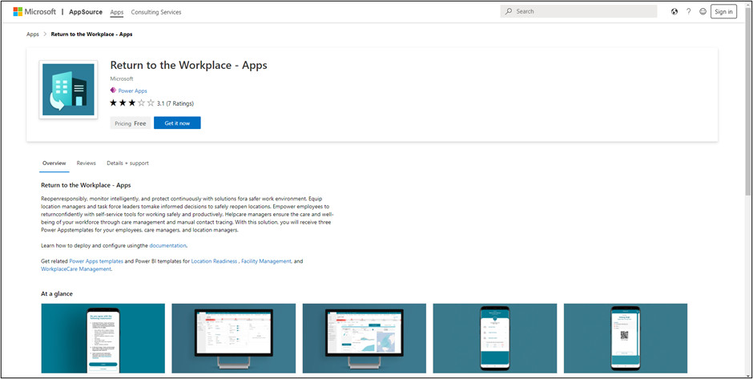

The Return to Workplace apps require their own environment for deployment. The Return to Workplace solution can be obtained and deployed from [Microsoft AppSource](https://appsource.microsoft.com/product/dynamics-365/msemr.pprtwsoln).

> [!div class="mx-imgBorder"]
> 

For the more experienced Dynamics 365 or Microsoft Power Platform consultant, the steps should be simple to follow. From a high level, you should complete the following tasks:

1.  Create a Dataverse environment that is unique for this purpose.

1.  Obtain and install the solution from AppSource.

1.  Configure and publish Power BI dashboards.

1.  Schedule a report refresh.

1.  Embed the Power BI report in the model-driven app.

1.  Publish a theme (optional).

1.  Share the canvas app with users.

1.  Set the security roles.

1.  Enable the flow.

1. Deploy the portal.

For more information, see [Deploy the Return to the Workplace solution](https://docs.microsoft.com/dynamics365/industry/return-to-workplace/deploy/?azure-portal=true).

Deployments in the US Government cloud have a few variations to the previous steps. For more information, see [Appendix: Deploy the app and publish Power BI dashboard (US Government customers only)](https://docs.microsoft.com/dynamics365/industry/return-to-workplace/deploy?azure-portal=true#appendix-deploy-the-app-and-publish-power-bi-dashboard-us-government-customers-only).

Additionally, the expected extensions and platform capabilities are still available to you as a maker in the environment. Extend the configuration as needed, but be mindful of the impact to the solutions that you have deployed. Ideas on functionality that you could extend include:

-   Customizing the information in the notifications.

-   Adding more details or widgets to the dashboards.

-   Adding more notifications.

-   Customizing views.

-   Modifying cosmetic details in Power Automate flows such as the **from** address on certain notices that are sent by the system.

-   Automating more of the process, such as the employee cases and the actions from record changes as triggers.

Ensure that you are following best practices, including using solutions and following proper ALM practices when building on the Return to Workplace solution.
