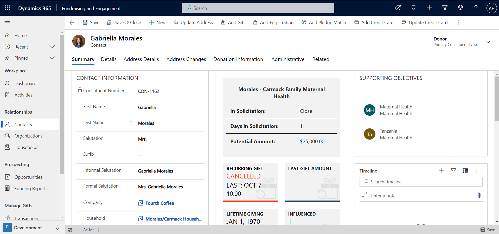
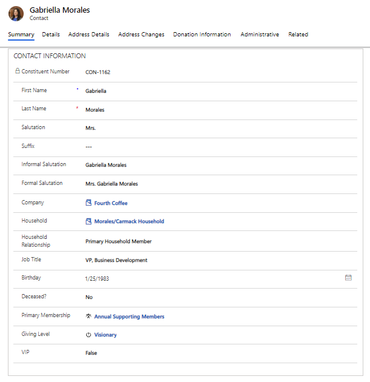
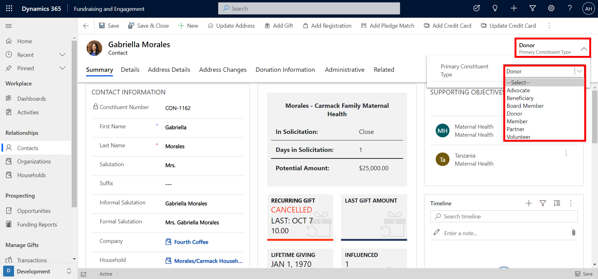
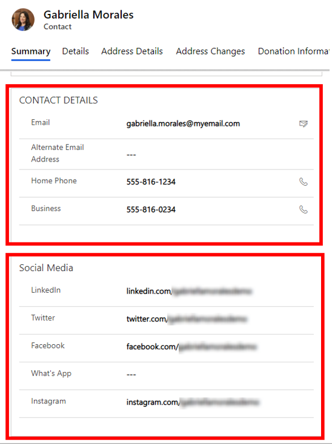
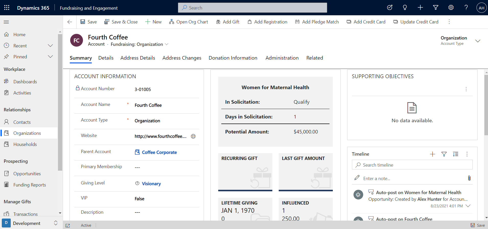
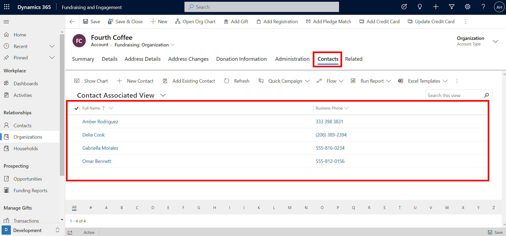

Fundraising and Engagement allows both contacts and organizations to be donors.

-   **Contact:** Represents a person, either as an individual or a representative of an organization.

-   **Organization:** A company or account that you engage with, in the context of corporate sponsorships or workplace giving, for example.

This unit will provide an overview of the contact and organization records.

## Contacts

The following screenshot shows an example of a contact record for a donor named Gabriella Morales. You can view contact information, contact details such as phone numbers and email address, social media profile links, summary of donations, supporting objectives, and a timeline of activities.

> [!div class="mx-imgBorder"]
> 

You can store the following contact information for an individual:

> [!div class="mx-imgBorder"]
> 

The constituent number will be automatically generated when a new contact is added and saved. This is a unique identifier for that constituent. Formal and informal salutations can be used in correspondence with the constituent, such as receipts and emails. Salutations can also be used to personalize marketing communications if you use Fundraising and Engagement with Dynamics 365 Marketing.

A contact can have a relationship with both an organization (for example, they work for a company, which is donating through a workplace giving program), and a household (to link a person to other members of their household, such as their spouse or partner, showing all the activities and donations for that household together). These are important aspects of getting a 360-degree view of the donor. We'll cover these relationships in more detail later in this module.

For a contact, you can also indicate the **primary constituent type**. This allows you to segment your donors, categorize, and interact with them based on their relationship with your organization. From the drop-down menu indicated on the screenshot below, you can select from the following options to give the best fit, including Board Member, Donor, or Volunteer.

> [!div class="mx-imgBorder"]
> 

The screenshot below shows the type of contact details and social media information that can be recorded.

> [!div class="mx-imgBorder"]
> 

## Organizations

Organizations in Fundraising and Engagement represent a company or an account that you work with. They may be actual or potential corporate funders, or organizations you work with in other ways, such as suppliers, service providers, or governing bodies.

> [!div class="mx-imgBorder"]
> 

On an organization record, you can view account information, contact details, summary of donations, supporting objectives, and a timeline of activities.

Contacts and organizations can be related to one another, and individual contacts can be associated with an organization. For example, Fourth Coffee is an organization in Fundraising and Engagement. Gabriella Morales would be included as a contact. An organization will likely have multiple contacts, but you can specify a **primary contact**. The details of the primary contact can be accessed via the organization record. The details represent the key person at the organization that you primarily deal with. From the Contacts tab within the organization record, you can see a list of all the individuals at the company.

> [!div class="mx-imgBorder"]
> 

There may be occasions where an organization is considered a parent account to another account. This situation can occur when an organization is a subsidiary of a parent company, or where an organization has branches in multiple locations, for example. This hierarchy can be tracked. The parent account can be associated to an organization from the Account Information section of the record.
