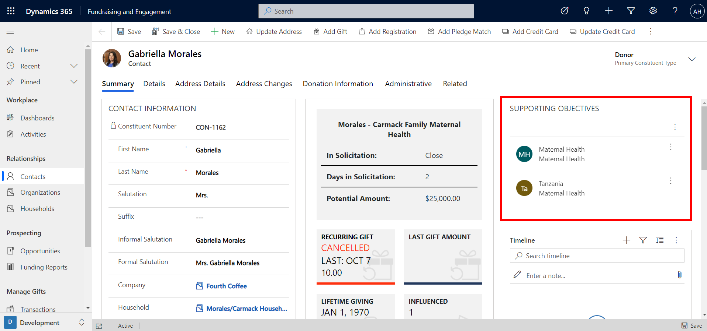
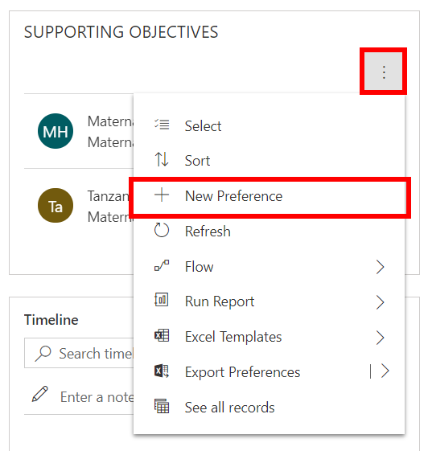
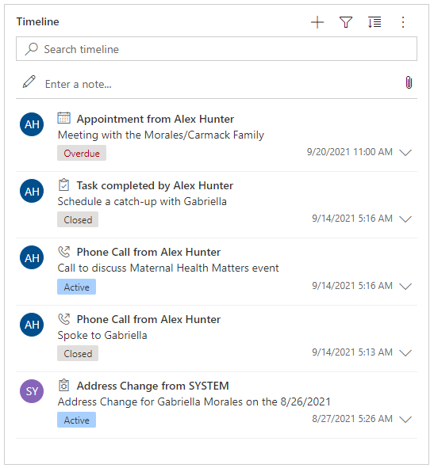
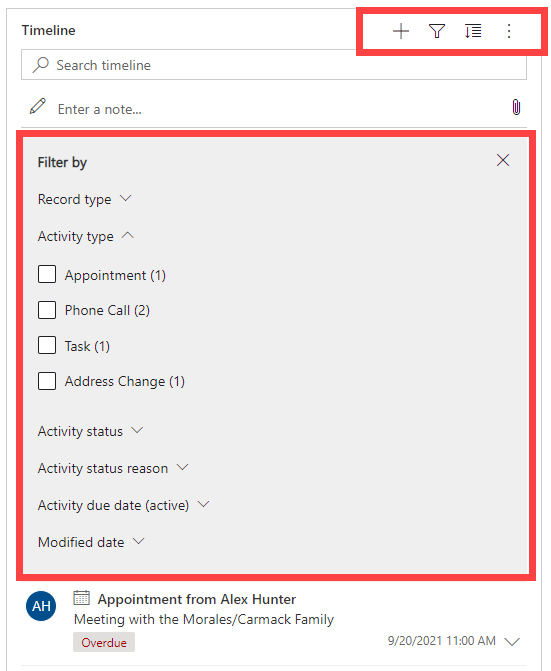
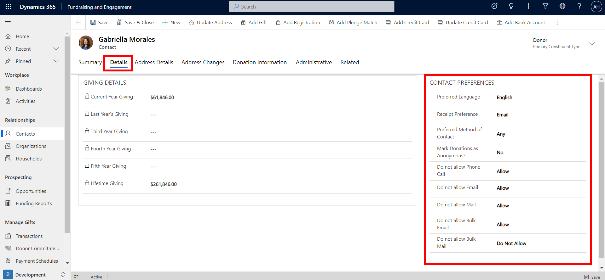

Tracking the activities between constituents and your organization and making them easily visible helps you understand the full picture of their interaction with your organization. Managing communication preferences and interests enables you to provide your constituents with a personalized and enhanced experience with your organization at every touchpoint. Fundraising and Engagement makes this easier via the supporting objectives, timeline, and contact preferences sections on contact and organization records.

## Supporting Objectives

The **Supporting Objectives** section contains the donation preferences that are most likely to motivate the constituent to continue supporting your organization, projects, or campaigns. These are interest areas related to the work that your organization does. By tracking supporting objectives, you can see areas that the individual or organization is aligned with and use that to target or tailor your asks. It also contributes to the full profile of the individual or organization that you refer to while interacting with them. The screenshot below shows where you can find and link supporting objectives to a contact record.

> [!div class="mx-imgBorder"]
> 

You can add a new preference by clicking + New preference. Similarly, supporting objectives can be added and tracked on organization records.

> [!div class="mx-imgBorder"]
> 

## Timeline and activities

The timeline section on a contact or organization record displays a history of activities and interactions with that constituent. The timeline is made up of three types of records:

-   **Activities**: Includes a timeline of appointments, emails, phone calls, tasks, address changes, and Customer Voice alerts. For example, if a user had a phone call with the constituent, the details and discussion points can be recorded as a phone call activity.

-   **Notes**: Notes can be used to capture information about conversations, feedback, important points, or any other ongoing information that would be useful to store. You can also add attachments to notes.

-   **Posts**: Auto Posts are system-generated and notify you of activity that has occurred.

> [!div class="mx-imgBorder"]
> 

You can search, filter, change the sort order, and add a new activity or note to the timeline via the indicated buttons. The timeline has native integration with Exchange, so if you work with emails in Outlook, they can be automatically tracked. Each entry on the timeline displays a timestamp for when it occurred.

> [!div class="mx-imgBorder"]
> 

## Contact preferences 

In the **Details** tab of a contact, you can view giving summary and contact preferences. In the Contact Preferences section, you can specify the preferred methods of communication for that constituent.

> [!div class="mx-imgBorder"]
> 

Contact Preferences allow you to record the information such as the constituent's preferred language, method of receipting (usually email or print), and preferred method of contact. You can indicate if the constituent would like their donations and designations to be anonymous. Furthermore, this is where you can record consent for all methods of communication for that constituent. For example, if the constituent does not accept email, you will not be able to send that constituent an email from Fundraising and Engagement. 

Similar to contact records, contact preferences can also be tracked on organization records.
