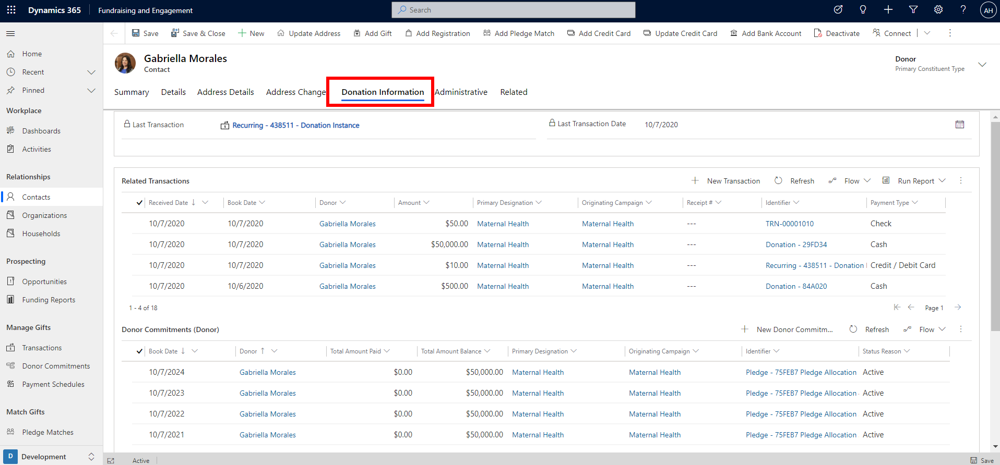
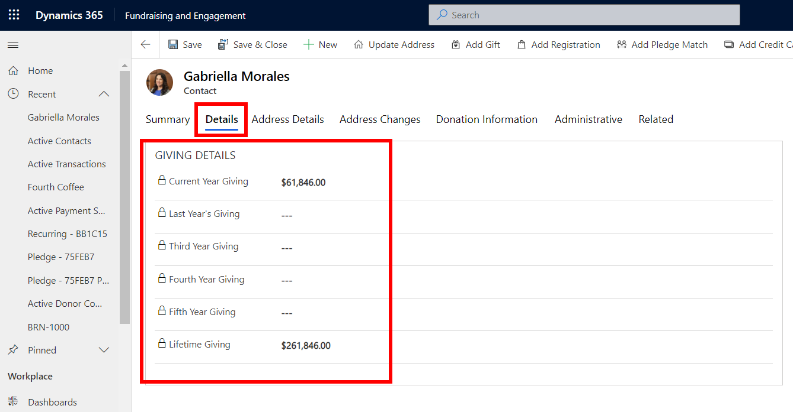
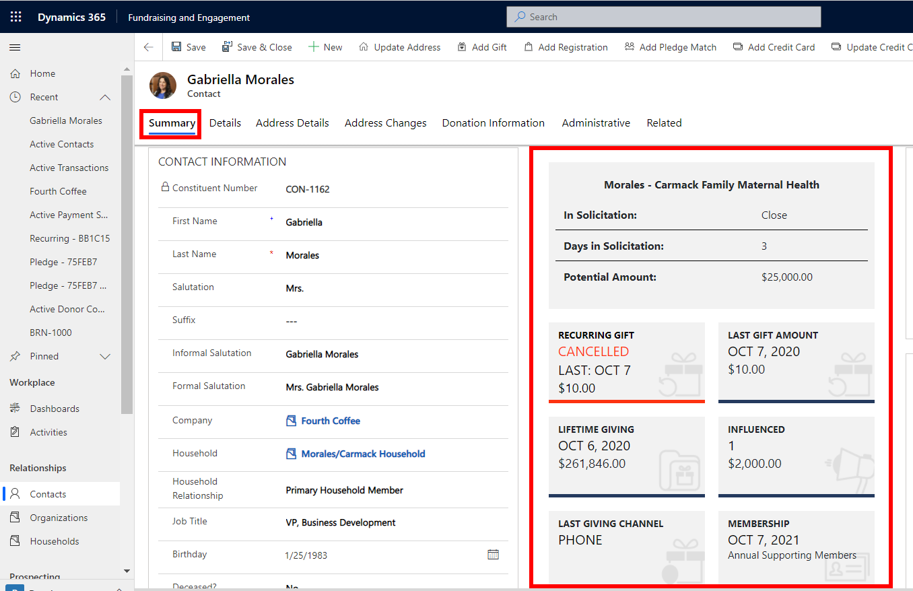

All types of donations from a constituent, whether individual giving, regular giving, pledge, or major donations, can be viewed on the contact or organization record. The Donation Information tab, Details tab, and the Snapshot panel provide the user with this information.

## Donation information tab

The screenshot below shows an example of the donation information for the contact, Gabriella Morales. It is accessed by clicking on the Donation Information tab on the contact's record. Here, you can see the giving history - a list of all the transactions, donor commitments, and payment schedules related to the constituent. At the top, the last transaction (most recent donation) from the constituent is displayed. Related Transactions displays all the transactions/donations completed by the constituent, and Donor Commitments (Donor) contains the pledges made. Payment schedules can also be viewed, showing all recurring donations and pledge schedules for the constituent.

> [!div class="mx-imgBorder"]
> 

The same details are also available on organization records.

## Giving details

You can view a summary of giving by a constituent on their contact or organization record, by navigating to the **Details** tab. The Giving Details section contains read-only columns that show transaction totals for the past five years, and the total lifetime giving value.

> [!div class="mx-imgBorder"]
> 

## Snapshot panel

The snapshot panel on the Summary tab of contact and organization profiles highlights key information regarding the constituent's donations and engagement with your organization.

> [!div class="mx-imgBorder"]
> 

The screenshot displays the snapshot on a contact record, and you will also see snapshots on organization and household profiles. Tiles in the snapshot are updated dynamically.

The most recent opportunity associated with the constituent is displayed in the top tile. It indicates the pipeline stage of the solicitation, number of days it has been in the current stage, and the associated ask amount.

**Recurring gift** displays information regarding the most recent recurring payment schedule associated with the constituent. It is interactive and you can click on it to cancel or change the recurring payment schedule.

**Lifetime giving** displays the total of all completed transactions, balance owing on donor commitments, and completed event registration packages directly received from the constituent in the last five years (not including soft credits).

From the **influenced** tile, you can view the sum of all soft credits associated with the constituent. You can also view the date, amount, and channel used for the last completed transaction.

The snapshot for a contact shows the following information regarding the individual's household. We will take a closer look at this later in the module.

> [!div class="mx-imgBorder"]
> 
