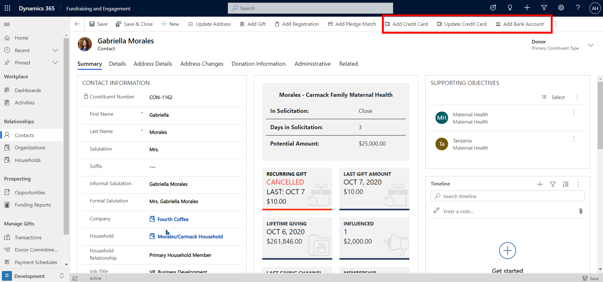
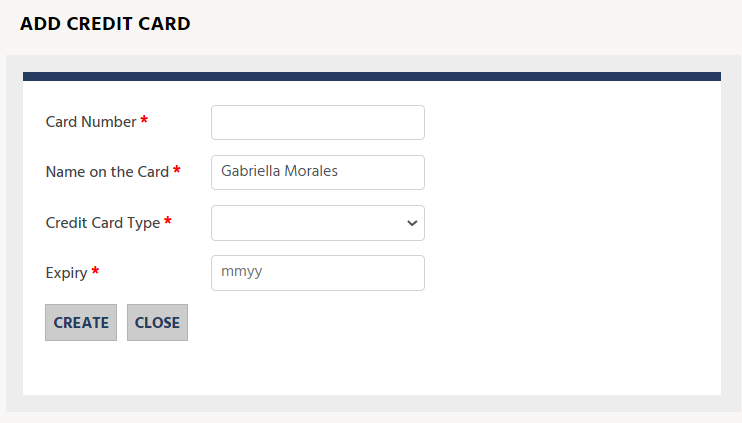
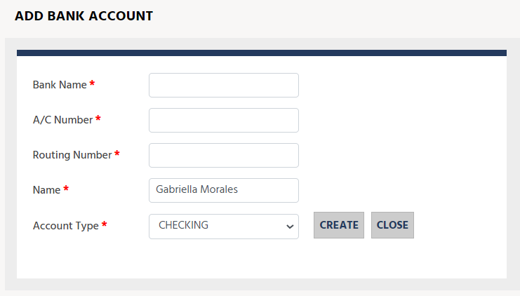
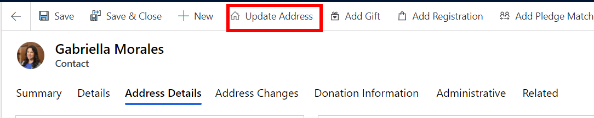
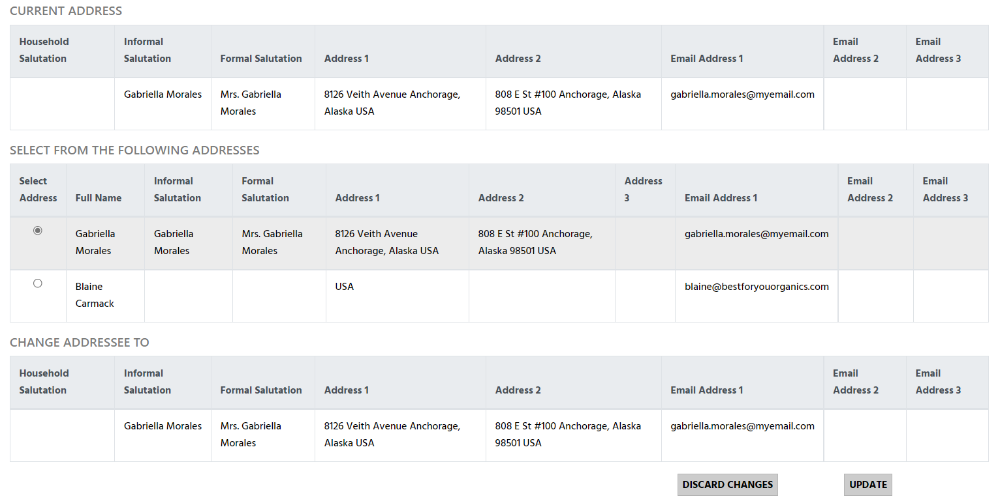

Fundraising and Engagement lets you manage payment methods and address changes. These details can be added to and updated for both contact and organization records.

## Payment methods

From the toolbar at the top of a contact and organization record, you can add or update the constituent's payment methods. The screenshot below displays the toolbar on a contact.

> [!div class="mx-imgBorder"]
> 

**Add and Update Credit Card** buttons will open a pop-out form where you can either add or update the credit card details for the contact or organization. The stored credit card will be used while creating credit/debit gift transactions and will be referenced in the payment method column of the transaction. To maintain privacy, credit card details are tokenized; full credit card details are not stored in Fundraising and Engagement.

> [!div class="mx-imgBorder"]
> 

**Add /Update Bank Account** option allows you to update an existing bank account record\* associated to a contact or organization.

> [!NOTE]
> This option is currently only available in the US.

> [!div class="mx-imgBorder"]
> 

## Address changes

In the Address Details section of a contact or organization record, you can find and update the address for the constituent. Up to three addresses can be stored against the record: primary address, secondary address, and alternate address.

> [!div class="mx-imgBorder"]
> 

From the toolbar of the record, you can click on Update Address. This opens a pop-up window where you can see related addresses, such as those of other household members, to easily make address changes.

> [!div class="mx-imgBorder"]
> 

> [!div class="mx-imgBorder"]
> 

When the columns for address line 1 and ZIP/postal code change, an address change record is created. It captures both the previous and updated address information. Address changes can be accessed via the Address Changes tab on the contact or organization record.

> [!div class="mx-imgBorder"]
> 
