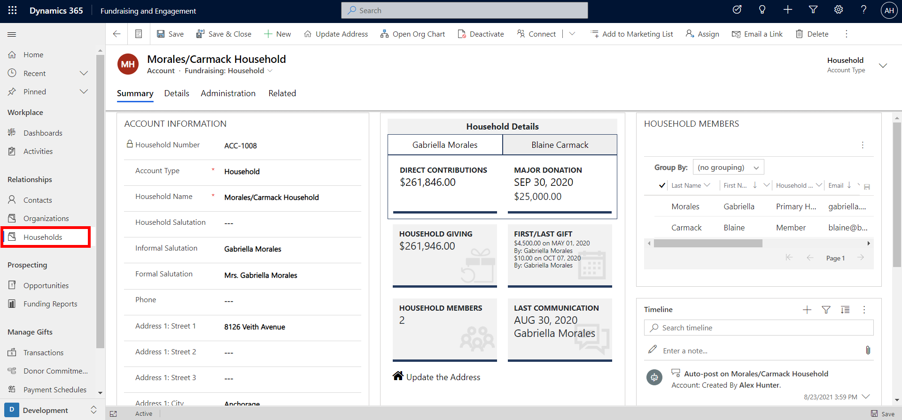
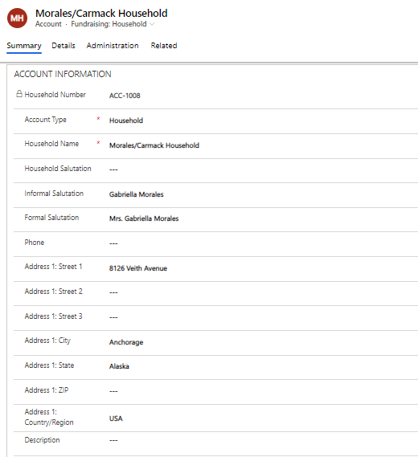
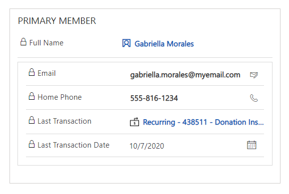
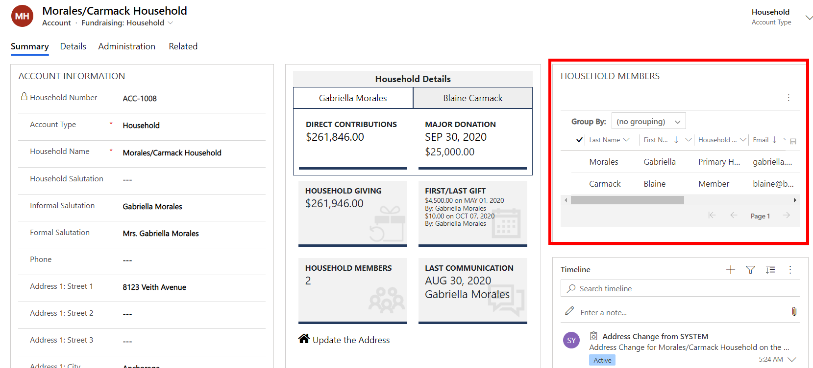
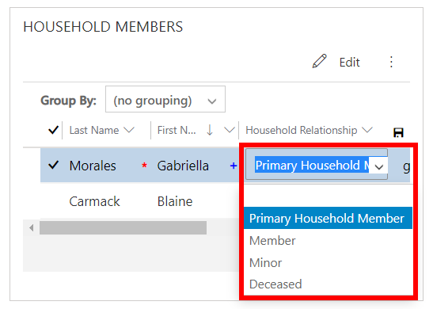
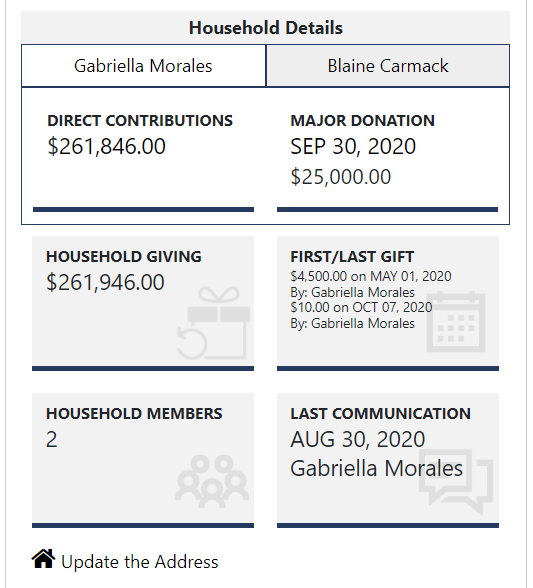

A household is a special type of account record in Fundraising and Engagement that allows you to group together people who are members of the same household. From a household record you can see a summary of household members' gifts, interactions, and opportunities. This grouping allows you to understand the role of each individual in the household and their activities and donations as a group.

Households cannot transact and make donations. Unlike contact and organization records, households do not contain any payment method details. They are simply a way to group contacts together. All gifts are made at the individual level by members of the household.

The screenshot below shows the household record for the fictional Morales/Carmack family.

> [!div class="mx-imgBorder"]
> 

You can add informal and formal salutation details to be used in household communications.

> [!div class="mx-imgBorder"]
> 

**Primary Member** section of a household record displays key details of the individual allocated as the household's primary member. These are read-only columns displayed from the individual's contact record, and include their full name, email, home phone, and details of their last transaction.

> [!div class="mx-imgBorder"]
> 

## Members and roles in a household

Each contact grouped in a household can have an allocated role. From the Household Members section of the household record, you can view a list of all the members.

> [!div class="mx-imgBorder"]
> 

You can set and change an individual's role within the household by clicking on the Household Relationship dropdown shown below. **Primary Household Member** is the individual who is the main contact for the household whereas **Members** are other individuals. **Minor** should be used for household members that are 17 years old or younger. **Deceased** individuals are those who were included in the household while alive but have now passed away. Deceased members cannot serve as a primary member.

> [!div class="mx-imgBorder"]
> 

Clicking on a household member from the list will navigate you to their contact profile.

## Roll up view of donations for a household

A summary of donations related to a household can be viewed from the Household Details Snapshot on a household and contact record. The tiles in the household details snapshot provide a roll-up view of household giving, the cumulative giving of all household members.

The screenshot below shows the household details snapshot.

> [!div class="mx-imgBorder"]
> 

Household member tabs at the top of the snapshot allow you to switch between up to five members of the household to view their individual giving.

The household giving tile displays the cumulative lifetime giving of all household members. You can also view the date of the most recent activity, such as phone call, email, letter, etc. associated with any household member from the last communication tile.

> [!NOTE]
> The household details snapshot can also be viewed on the contact record for a household member.
