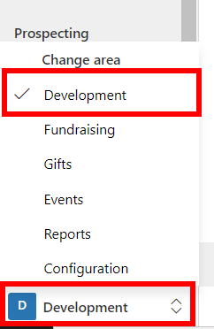
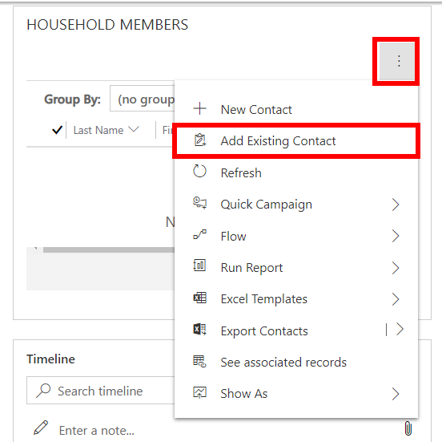
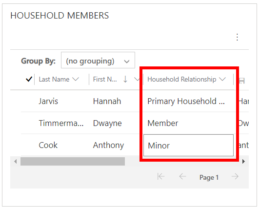

This exercise will take you through the steps of creating a household. You'll create a household, add members, and set their household relationship. You can then see how member details are rolled up on the household record. The last part of the exercise will show you how to remove members from a household.

At the end of this exercise, you'll be able to accomplish the following:

- Create a new household
- Add members to a household
- Remove members from a household

> [!IMPORTANT]
> Before you begin, to achieve the maximum effect for this lab and the other labs, it is recommended that you have deployed Fundraising and Engagement with the sample data. For more information, see the [Deployment Guide](.https://aka.ms/DeployMicrosoftCloudForNonprofit/?azure-portal=true).

## Creating a household and adding members

1.  In Fundraising and Engagement, select the **Development** area from the bottom left of the screen.

	> [!div class="mx-imgBorder"]
	> 

1.  Select **Households** from the left navigation menu.

1.  Select **+New** to create a new household.

1.  Enter the following details into the Account Information form and select save:

    -   **Household Name:** Jarvis Family

    -   **Account Type:** Household

    -   **Formal Salutation:** Ms Jarvis and Mr Timmerman

1.  From the Household Members section of the Jarvis Family record, select the more options button and **Add Existing Contact**.

	> [!div class="mx-imgBorder"]
	> 

1.  Search and select the following three contacts then select **Add**.

	-   Hannah Jarvis
	
	-   Dwayne Timmerman
	
	-   Anthony Cook

1.  Enter the following details to the members from the Household Relationship dropdown in the Household Members section, then select the **Save** icon.

	-   **Hannah Jarvis:** Primary Household Member
	
	-   **Dwayne Timmerman:** Member
	
	-   **Anthony Cook:** Minor

	> [!div class="mx-imgBorder"]
	> 

1.  **Save** the household record.

1.  You'll notice that Hannah's details have populated the Primary Member section on the record.

1. In a few minutes, refresh the page and you'll see the household details snapshot has rolled up donation information from the household members.

## Removing household members

In some instances, you may need to remove members from a household (such as if there is a divorce). The steps below will show you how to remove members from a household.

1.  Navigate to Dwayne Timmerman's contact record. You can do this by search or clicking on his name from the Household Members section on the Jarvis Family record.

1.  Make the following changes to the columns in the Contact Information section for Dwayne:

    -   **Household Relationship:** --Select---

    -   **Household:** Select the X next to the blue household record hyperlink

1.  Select **Save**.

1.  Navigate back to the Jarvis Family record.

1.  You'll notice that Dwayne has been removed from the list of family members and his donation details are no longer included in the household details snapshot roll-up.
